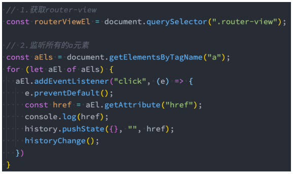
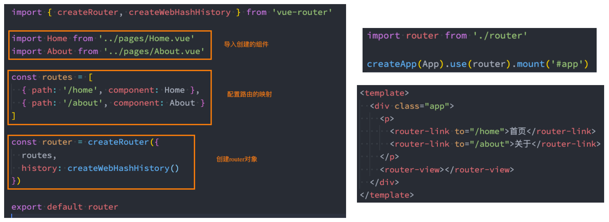
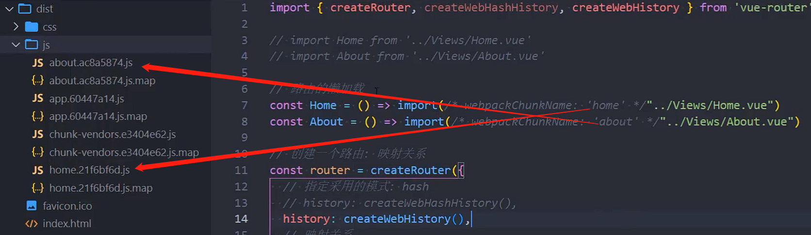
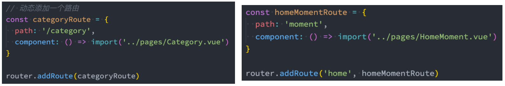
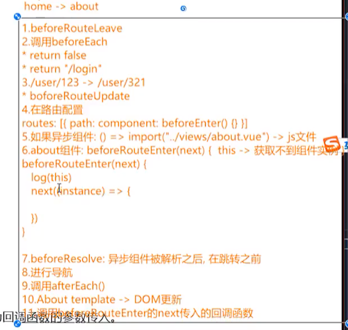

## **认识前端路由**

**路由其实是网络工程中的一个术语：**

在架构一个网络时，非常重要的两个设备就是路由器和交换机。

当然，目前在我们生活中路由器也是越来越被大家所熟知，因为我们生活中都会用到路由器：

事实上，路由器主要维护的是一个映射表；

映射表会决定数据的流向；


路由的概念在软件工程中出现，最早是在后端路由中实现的，原因是 web 的发展主要经历了这样一些阶段：

后端路由阶段；

前后端分离阶段；

单页面富应用（SPA）；

## **后端路由阶段**

早期的网站开发整个 HTML 页面是由**服务器来渲染**的.

服务器直接生产渲染好对应的 HTML 页面, 返回给客户端进行展示.

但是, 一个网站, **这么多页面服务器如何处理呢?**

一个页面有自己对应的网址, 也就是 URL；

URL 会发送到服务器, 服务器会通过正则对该 URL 进行匹配, 并且最后交给一个 Controller 进行处理；

Controller 进行各种处理, 最终生成 HTML 或者数据, 返回给前端.

上面的这种操作, 就是**后端路由**：

当我们页面中需要请求不同的**路径**内容时, 交给服务器来进行处理, 服务器渲染好整个页面, 并且将页面返回给客户端.

这种情况下渲染好的页面, 不需要单独加载任何的 js 和 css, 可以直接交给浏览器展示, 这样也有利于 SEO 的优化.

**后端路由的缺点:**

一种情况是整个页面的模块由后端人员来编写和维护的；

另一种情况是前端开发人员如果要开发页面, 需要通过 PHP 和 Java 等语言来编写页面代码；

而且通常情况下 HTML 代码和数据以及对应的逻辑会混在一起, 编写和维护都是非常糟糕的事情；


## **前后端分离阶段**

**前端渲染的理解：**

每次请求涉及到的静态资源都会从**静态资源服务器获取**，这些资源**包括 HTML+CSS+JS**，然后在前端对这些请求回来的资源进行渲染；

需要注意的是，客户端的每一次请求，都会从静态资源服务器请求文件；

同时可以看到，和之前的后端路由不同，这时后端只是负责提供 API 了；

**前后端分离阶段：**

随着 Ajax 的出现, 有了前后端分离的开发模式；

后端只提供 API 来返回数据，前端通过 Ajax 获取数据，并且可以通过 JavaScript 将数据渲染到页面中；

这样做最大的优点就是前后端责任的清晰，后端专注于数据上，前端专注于交互和可视化上；

并且当移动端(iOS/Android)出现后，后端不需要进行任何处理，依然使用之前的一套 API 即可；

目前比较少的网站采用这种模式开发；


**单页面富应用阶段:**

其实 SPA 最主要的特点就是在前后端分离的基础上加了一层前端路由.

也就是前端来维护一套路由规则.

前端路由的核心是什么呢？改变 URL，但是页面不进行整体的刷新。


## **URL 的 hash**

**前端路由是如何做到 URL 和内容进行映射呢？监听 URL 的改变。**

**URL 的 hash**

URL 的 hash 也就是锚点(#), 本质上是改变 window.location 的 href 属性；

我们可以通过直接赋值 location.hash 来改变 href, 但是页面不发生刷新；


hash 的优势就是兼容性更好，在老版 IE 中都可以运行，但是缺陷是有一个#，显得不像一个真实的路径。

## **HTML5 的 History**

**history 接口是 HTML5 新增的, 它有六种模式改变 URL 而不刷新页面：**

replaceState：替换原来的路径；

pushState：使用新的路径；

popState：路径的回退；

go：向前或向后改变路径；

forward：向前改变路径；

back：向后改变路径；




## **认识 vue-router**

**目前前端流行的三大框架, 都有自己的路由实现**

Angular 的 ngRouter

React 的 ReactRouter

Vue 的 vue-router

**Vue Router 是** **Vue.js** **的官方路由：**

它与 Vue.js 核心深度集成，让用 Vue.js 构建单页应用（SPA）变得非常容易；

目前 Vue 路由最新的版本是 4.x 版本，我们上课会基于最新的版本讲解；

**vue-router 是基于路由和组件的**

路由用于设定访问路径, 将路径和组件映射起来；

在 vue-router 的单页面应用中, 页面的路径的改变就是组件的切换；

**安装 Vue Router：**

```json
npm install vue-router
```

## **路由的使用步骤**

**使用 vue-router 的步骤:**

第一步：创建路由需要映射的组件（打算显示的页面）；

第二步：通过 createRouter 创建路由对象，并且传入 routes 和 history 模式；

配置路由映射: 组件和路径映射关系的 routes 数组；

创建基于 hash 或者 history 的模式；

第三步：使用 app 注册路由对象（use 方法）；

第四步：路由使用: 通过`<router-link>`和`<router-view>`；

## **路由的基本使用流程**



## **路由的默认路径**

**我们这里还有一个不太好的实现:**

默认情况下, 进入网站的首页, 我们希望`<router-view>`渲染首页的内容；

但是我们的实现中, 默认没有显示首页组件, 必须让用户点击才可以；

**如何可以让路径默认跳到到首页, 并且`<router-view>`渲染首页组件呢?**


**我们在 routes 中又配置了一个映射：**

path 配置的是根路径: /

redirect 是重定向, 也就是我们将根路径重定向到/home 的路径下, 这样就可以得到我们想要的结果了.

## **history 模式**

**另外一种选择的模式是 history 模式：**


history 模式浏览器打开地址没有#，而 hash 模式有#

## **router-link**

**router-link 事实上有很多属性可以配置：**

**to 属性：**

是一个字符串，或者是一个对象

```javascript
<router-link to="/home">首页</router-link>
<router-link :to="{ path: '/home' }">首页</router-link>
```

**replace 属性：**

设置 replace 属性的话，当点击时，会调用 router.replace()，而不是 router.push()；

```javascript
<router-link to="/home" replace>
  首页
</router-link> // 加了replace就不会有跳转的历史记录
```

**active-class 属性：**

设置激活 a 元素后应用的 class，默认是 router-link-active

```javascript
<router-link to="/about" replace active-class="active">
  关于
</router-link> // 对名字router-link-active不满意可以自定义
```

**exact-active-class 属性：**

链接精准激活时，应用于渲染的 `<a>` 的 class，默认是 router-link-exact-active；

讲路由嵌套时再说

## **路由懒加载**

**当打包构建应用时，JavaScript 包会变得非常大，影响页面加载：**

如果我们能把不同路由对应的组件分割成不同的代码块，然后当路由被访问的时候才加载对应组件，这样就会更加高效；

也可以提高首屏的渲染效率；

**其实这里还是我们前面讲到过的 webpack 的分包知识，而 Vue Router 默认就支持动态来导入组件：**

这是因为 component 可以传入一个组件，也可以接收一个函数，该函数 需要放回一个 Promise；

而 import 函数就是返回一个 Promise；


router/index.js

```javascript
import {
  createRouter,
  createWebHashHistory,
  createWebHistory,
} from "vue-router";

// 路由的懒加载
const Home = () => import("../Views/Home.vue");
const About = () => import("../Views/About.vue");

const router = createRouter({
  // 指定采用的模式: hash
  history: createWebHashHistory(),
  // history: createWebHistory(),
  // 映射关系
  routes: [
    {
      path: "/",
      redirect: "/home",
    },
    {
      path: "/home",
      component: Home,
    },
    {
      path: "/about",
      component: About,
    },
  ],
});

export default router;
```

也可以写在下面

```javascript
routes: [
    ...
    {
      name: "about",
      path: "/about",
      component: () => import("../Views/About.vue")
    },
    ...
]
```

## **打包效果分析**

我们看一下打包后的效果：

```javascript
npm run build
```

我们会发现分包是没有一个很明确的名称的，其实 webpack 从 3.x 开始支持对分包进行命名（chunk name）：


打包出来并不知道哪个是 home，哪个是 about

这个时候可以使用魔法注释

```javascript
// 路由的懒加载
const Home = () => import(/* webpackChunkName: 'home' */ "../Views/Home.vue");
const About = () =>
  import(/* webpackChunkName: 'about' */ "../Views/About.vue");
```

再次打包



## **路由的其他属性**

name 属性：路由记录独一无二的名称；不用重复

meta 属性：自定义的数据


## **动态路由基本匹配**

**很多时候我们需要将给定匹配模式的路由映射到同一个组件：**

例如，我们可能有一个 User 组件，它应该对所有用户进行渲染，但是用户的 ID 是不同的；

在 Vue Router 中，我们可以在路径中使用一个动态字段来实现，我们称之为 路径参数；

```javascript
{
      path: "/user/:id",
      component: () => import("../Views/User.vue")
}
```

**在 router-link 中进行如下跳转：**

```javascript
<router-link to="/user/123">用户123</router-link>
```

## **获取动态路由的值**

**那么在 User 中如何获取到对应的值呢？**

在 template 中，直接通过 $route.params 获取值；

在 created 中，通过 this.$route.params 获取值；

在 setup 中，我们要使用 vue-router 库给我们提供的一个 hook useRoute；

该 Hook 会返回一个 Route 对象，对象中保存着当前路由相关的值；

App.vue

```javascript
...
<router-link to="/user/123">用户123</router-link>
<router-link to="/user/321">用户321</router-link>
...
```

User.vue

当前路由跳转都是在 User 组件中，即用户 123 和用户 321 互跳是在同一个组件中，此时如果想拿到参数需要使用 onBeforeRouteUpdate，

但是第一次的参数获取还是要使用 useRoute，开发中很少会遇到在同一个组件中跳转

```javascript
<template>
  <div class="user">
    <!-- 在模板中获取到id -->
    <h2>User: {{ $route.params.id }}</h2>
  </div>
</template>

<script setup>
  import { useRoute, onBeforeRouteUpdate } from 'vue-router'

  const route = useRoute()
  console.log(route.params.id)

  // 获取route跳转id
  onBeforeRouteUpdate((to, from) => {
    console.log("from:", from.params.id)
    console.log("to:", to.params.id)
  })

</script>

<style scoped>
</style>
```

## **NotFound**

对于哪些没有匹配到的路由，我们通常会匹配到固定的某个页面

比如 NotFound 的错误页面中，这个时候我们可编写一个动态路由用于匹配所有的页面；

router/index.js

```javascript
const routes = [
  ...// 一定要放在最后
  {
    // abc/cba/nba
    path: "/:pathMatch(.*)",
    component: () => import("../Views/NotFound.vue"),
  },
];
```

我们可以通过 $route.params.pathMatch 获取到传入的参数：

Views/NotFound.vue

```javascript
<template>
  <div class="not-found">
    <h2>NotFound: 您当前的路径{{ $route.params.pathMatch }}不正确, 请输入正确的路径!</h2>
  </div>
</template>

<script setup>
</script>

<style scoped>

  .not-found {
    color: red;
  }

</style>
```

比如：当匹配的路由是 abc/cba/nba 时，那么就会显示：

您当前的路径 abc/cba/nba 不正确, 请输入正确的路径!

## **匹配规则加\***

**这里还有另外一种写法：**

注意：我在/:pathMatch(._)后面又加了一个 _；

```javascript
const routes = [
  ...// 一定要放在最后
  {
    // abc/cba/nba
    path: "/:pathMatch(.*)*", // 这里多了一个*
    component: () => import("../Views/NotFound.vue"),
  },
];
```

它们的区别在于解析的时候，是否解析 /：

这个时候页面会显示：

您当前的路径["abc", "cba", "nba"]不正确, 请输入正确的路径!

## **路由的嵌套**

**什么是路由的嵌套呢？**

目前我们匹配的 Home、About、User 等都属于第一层路由，我们在它们之间可以来回进行切换；

**但是呢，我们 Home 页面本身，也可能会在多个组件之间来回切换：**

比如 Home 中包括 HomeRecommend、HomeRanking，它们可以在 Home 内部来回切换；

这个时候我们就需要使用嵌套路由，在 Home 中也使用 router-view 来占位之后需要渲染的组件；

## **路由的嵌套配置**

router/index.js

```javascript
{
      name: "home",
      path: "/home",
      component: () => import("../Views/Home.vue"),
      meta: {
        name: "why",
        age: 18
      },
      children: [
        {
          path: "/home",
          redirect: "/home/recommend"
        },
        {
          path: "recommend", // /home/recommend
          component: () => import("../Views/HomeRecommend.vue")
        },
        {
          path: "ranking", // /home/ranking
          component: () => import("../Views/HomeRanking.vue")
        }
      ]
}
```

Home.vue

```javascript
<template>
  <div class="home">
    <h2>Home</h2>

    <div class="home-nav">
      // 只有这种精准匹配，才会默认加上router-link-exact-active这个class
      <router-link to="/home/recommend">推荐</router-link>
      <router-link to="/home/ranking">排行</router-link>
    </div>

    <!-- 占位组件 -->
    <router-view></router-view>
  </div>
</template>

<script setup>
</script>

<style scoped>
</style>
```

## 编程式路由跳转的使用

有时候我们希望通过代码来完成页面的跳转，比如点击的是一个按钮：

App.vue

```javascript
<template>
  <div class="app">
    <h2>App Content</h2>
    <div class="nav">
      <!-- 其他元素跳转 -->
      <span @click="homeSpanClick">首页</span>
      <button @click="aboutBtnClick">关于</button>
    </div>
    <router-view></router-view>
  </div>
</template>

<script setup>
  import { useRouter } from 'vue-router'
  // 如果是在setup中编写的代码，那么我们可以通过 useRouter 来获取
  const router = useRouter()

  // 监听元素的点击
  function homeSpanClick() {
    // 跳转到首页
    // router.push("/home")
    router.push({
      // name: "home" // 使用name跳转没有重定向，最好使用path
      path: "/home"
    })
  }
  function aboutBtnClick() {
    // 跳转到关于
    router.push({
      path: "/about",
      // 可以通过query的方式来传递参数
      query: {
        name: "why",
        age: 18
      }
    })
  }

</script>

<style>

  .router-link-active {
    color: red;
    font-size: 20px;
  }

  .active {
    color: red;
    font-size: 20px;
  }

</style>
```

如果是 vue2 的 Options API，那么就使用 this.$router.push

跳转到 About.vue 中如何拿到传递过去的参数

```javascript
<template>
  <div class="about">
    <h2>About: {{ $route.query }}</h2>
  </div>
</template>

<script setup>
</script>

<style scoped>
</style>
```

## **替换当前的位置**

使用 push 的特点是压入一个新的页面，那么在用户点击返回时，上一个页面还可以回退，但是如果我们希望当前页面是一个替换

操作，那么可以使用 replace：


## **页面的前进后退**

**router 的 go 方法：**


**router 也有 back：**

通过调用 history.back() 回溯历史。相当于 router.go(-1)；

**router 也有 forward：**

通过调用 history.forward() 在历史中前进。相当于 router.go(1)；

About.vue

```javascript
<template>
  <div class="about">
    <h2>About: {{ $route.query }}</h2>
    <button @click="backBtnClick">返回</button>
  </div>
</template>

<script setup>
  import { useRouter } from 'vue-router'

  const router = useRouter()

  function backBtnClick() {
    // router.back()
    // router.forward()

    // go(delta)
    // go(1) -> forward()
    // go(-1) -> back()
    router.go(-1)
  }

</script>

<style scoped>
</style>
```

## **动态添加路由**

**某些情况下我们可能需要动态的来添加路由：**

比如根据用户不同的权限，注册不同的路由；

这个时候我们可以使用一个方法 addRoute；

**如果我们是为 route 添加一个 children 路由，那么可以传入对应的 name：**



## **动态管理路由的其他方法（了解）**

**删除路由有以下三种方式：**

方式一：添加一个 name 相同的路由；

会覆盖掉旧的相同 name 的路由

方式二：通过 removeRoute 方法，传入路由的名称；

方式三：通过 addRoute 方法的返回值回调；


**路由的其他方法补充：**

router.hasRoute()：检查路由是否存在。

router.getRoutes()：获取一个包含所有路由记录的数组。

router/index.js

```javascript

...

const router = createRouter({
   history: createWebHashHistory(),
   routes: [
       {
          name: "home", // 这里必须指定name，才能动态添加一个children路由
          path: "/home",
          component: () => import("../Views/Home.vue"),
          meta: {
            name: "why",
            age: 18
          },
          children: [
            {
              path: "/home",
              redirect: "/home/recommend"
            },
            {
              path: "recommend", // /home/recommend
              component: () => import("../Views/HomeRecommend.vue")
            },
            {
              path: "ranking", // /home/ranking
              component: () => import("../Views/HomeRanking.vue")
            }
          ]
        },
   ]
})

// 1.动态管理路由
let isAdmin = true
if (isAdmin) {
  // 一级路由
  router.addRoute({
    path: "/admin",
    component: () => import("../Views/Admin.vue")
  })

  // 添加vip页面
  router.addRoute("home", {
    path: "vip",
    component: () => import("../Views/HomeVip.vue")
  })
}

// 获取router中所有的映射路由对象
console.log(router.getRoutes())
```

## **路由导航守卫**

**vue-router 提供的导航守卫主要用来通过跳转或取消的方式守卫导航。**

**全局的前置守卫 beforeEach 是在导航触发时会被回调的：**

**它有两个参数：**

to：即将进入的路由 Route 对象；

from：即将离开的路由 Route 对象；

**它有返回值：**

false：取消当前导航；

不返回或者 undefined：进行默认导航；

返回一个路由地址：

​ 可以是一个 string 类型的路径；

​ 可以是一个对象，对象中包含 path、query、params 等信息；

**可选的第三个参数：next（不推荐使用）**

在 Vue2 中我们是通过 next 函数来决定如何进行跳转的；

但是在 Vue3 中我们是通过返回值来控制的，不再推荐使用 next 函数，这是因为开发中很容易调用多次 next；

## **登录守卫功能**

App.vue

```javascript
<router-link to="/order">订单</router-link>
```

router/index.js

```javascript
...
// 2.路由导航守卫
// 进行任何的路由跳转之前, 传入的beforeEach中的函数都会被回调
// 需求: 进入到订单(order)页面时, 判断用户是否登录(isLogin -> localStorage保存token)
// 情况一: 用户没有登录, 那么跳转到登录页面, 进行登录的操作
// 情况二: 用户已经登录, 那么直接进入到订单页面
router.beforeEach((to, from) => {
  // 1.进入到任何别的页面时, 都跳转到login页面
  // if (to.path !== "/login") {
  //   return "/login"
  // }

  // 2.点击订单或浏览器地址输入/order，进入到订单页面时, 判断用户是否登录
    // 2.1 点击登录就会从服务端拿到token，会进行默认导航
    // 2.2 点击退出登录就会清除token，就会进入到登录页
  const token = localStorage.getItem("token")
  if (to.path === "/order" && !token) {
    return "/login"
  }
})
...
```

Views/Login.vue

```javascript
<template>
  <div class="login">
    <h2>登录页面</h2>
    <button @click="loginClick">登录</button>
  </div>
</template>

<script setup>

  import { useRouter } from 'vue-router'

  const router = useRouter()

  function loginClick() {
    // 向服务器发送请求, 服务器会返回token
    localStorage.setItem("token", "coderwhy")

    // 跳转到order页面
    router.push("/order")
  }

</script>

<style scoped>
</style>
```

Views/Home.vue

```javascript
<template>
  <div class="home">
    <h2>Home</h2>

    <div class="home-nav">
      <router-link to="/home/recommend">推荐</router-link>
      <router-link to="/home/ranking">排行</router-link>
    </div>

    <button @click="logoutClick">退出登录</button>

    <!-- 占位组件 -->
    <router-view></router-view>
  </div>
</template>

<script setup>
  // 在首页中点击退回登录，清除token
  function logoutClick() {
    localStorage.removeItem("token")
  }

</script>

<style scoped>
</style>
```

## **其他导航守卫**

**Vue 还提供了很多的其他守卫函数，目的都是在某一个时刻给予我们回调，让我们可以更好的控制程序的流程或者功能：**

https://next.router.vuejs.org/zh/guide/advanced/navigation-guards.html

我们一起来看一下**完整的导航解析流程**：

导航被触发。

在失活的组件里调用 beforeRouteLeave 守卫。

调用全局的 beforeEach 守卫。

在重用的组件里调用 beforeRouteUpdate 守卫(2.2+)。

在路由配置里调用 beforeEnter。

解析异步路由组件。

在被激活的组件里调用 beforeRouteEnter。

调用全局的 beforeResolve 守卫(2.5+)。

导航被确认。

调用全局的 afterEach 钩子。

触发 DOM 更新。

调用 beforeRouteEnter 守卫中传给 next 的回调函数，创建好的组件实例会作为回调函数的参数传入。



第 11 步会调用第 6 步中的 next 函数，instance 就是代表 this。
