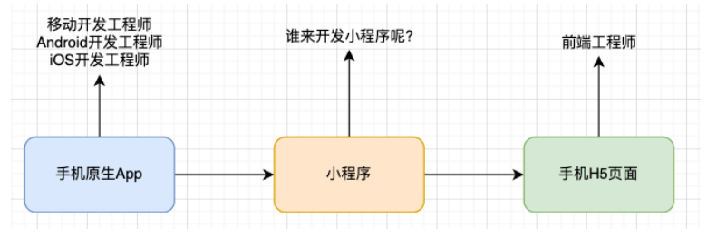
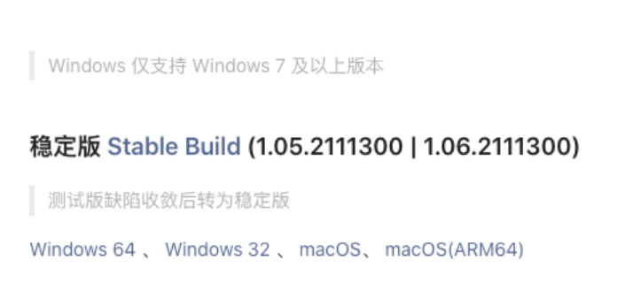
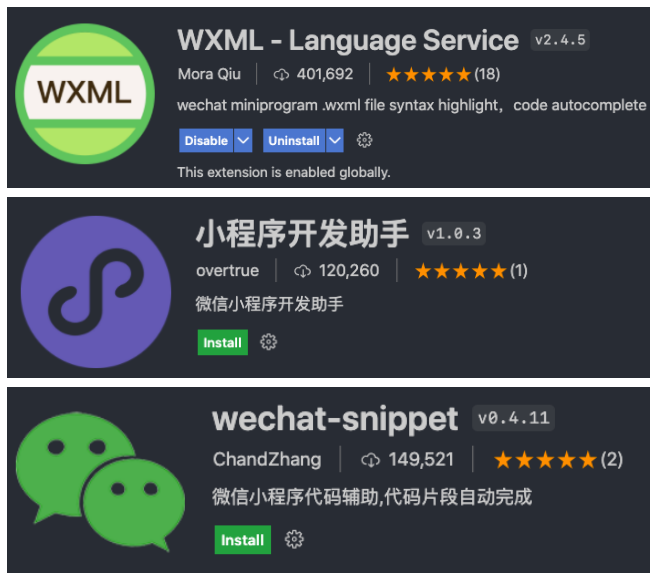
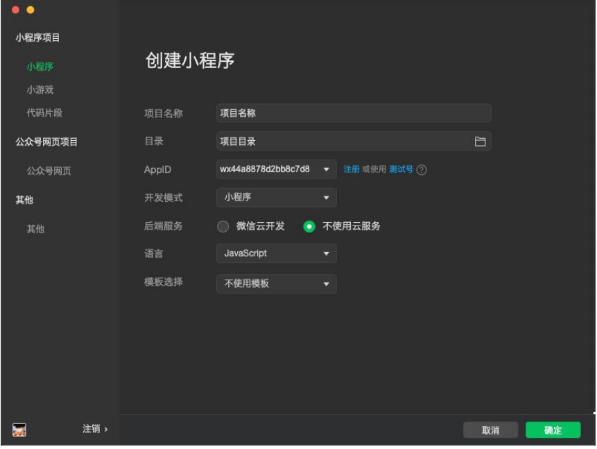
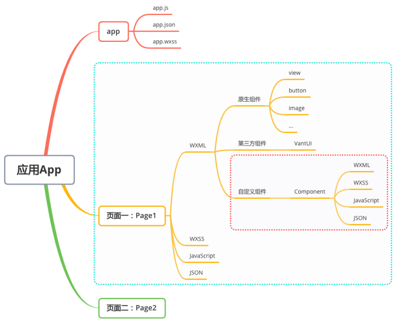
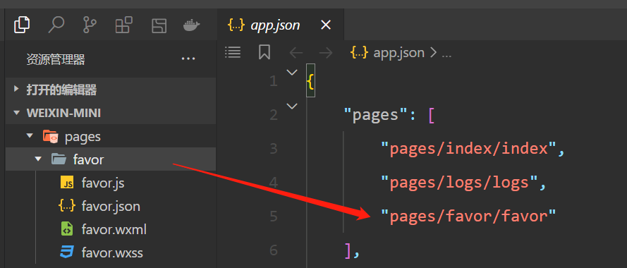
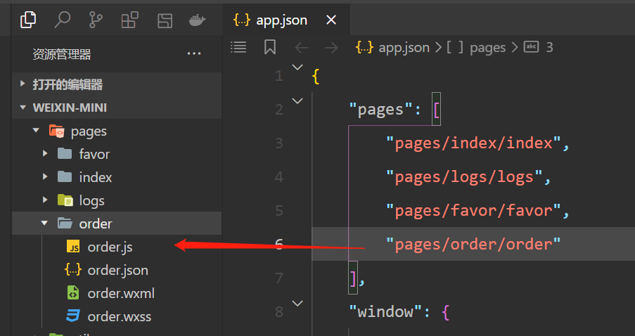
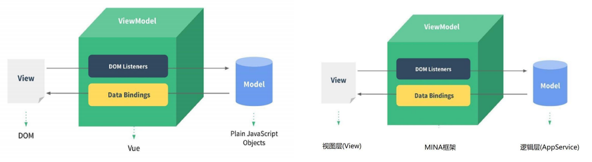

## **什么是小程序？**

**小程序是什么呢？**

小程序（Mini Program）是一种不需要下载安装即可使用的应用，它实现了“触手可及”的梦想，使用起来方便快捷，用完

即走。

事实上，目前小程序在我们生活中已经随处可见（特别是这次疫情的推动，不管是什么岗位、什么年龄阶段的人，都哪都需

要打开健康码）；

所以对于小程序的基本认识和特点，我们就不再赘述了。

最初我们提到小程序时，往往指的是 **微信小程序**：

- 但是目前小程序技术本身已经被各个平台所实现和支持；
- 待会儿我也会聊到它的技术特点以及为什么这些平台想要支持小程序技术。

**那么目前常见的小程序有哪些呢？**

微信小程序、支付宝小程序、淘宝小程序、抖音小程序、头条小程序、QQ 小程序、美团小程序等等；

## **各个平台小程序的时间线**

**各个平台小程序大概的发布时间线：**

**2017 年 1 月** 微信小程序上线，依附于微信 App；

**2018 年 7 月** 百度小程序上线，依附于百度 App；

**2018 年 9 月** 支付宝小程序上线，依附于支付宝 App；

**2018 年 10 月** 抖音小程序上线，依附于抖音 App；

**2018 年 11 月** 头条小程序上线，依附于头条 App；

**2019 年 5 月** QQ 小程序上线，依附于 QQApp；

**2019 年 10 月** 美团小程序上线，依附于美团 App；

## **各个平台为什么都需要支持小程序呢？**

**第一：你有，我也得有。**

大厂竞争格局中一个重要的一环。

**第二：小程序作为介于 H5 页面和 App 之间的一项技术**，它有自身很大的优势；

体验比传统 H5 页面要好很多；

相当于传统的 App，使用起来更加方便，不需要在应用商店中下载安装，甚至注册登录等麻烦的操作；

**第三：小程序可以间接的动态为 App 添加新功能。**

传统的 App 更新需要先打包，上架到应用商店之后需要通过审核（App Store）；

但是小程序可以在 App 不更新的情况下，动态为自己的应用添加新的功能需求；

那么目前在这么多小程序的竞争格局中，**哪一个是使用最广泛的呢**？

显示是微信小程序，目前支付宝、抖音小程序也或多或少有人在使用；

其实我们透过小程序看本质，他们本身还是应用和平台之间的竞争，有最大流量入口的平台，对应的小程序也是用户更多一些；

目前在公司开发小程序主要开发的还是微信小程序，其他平台的小程序往往是平台本身的一些公司或者顺手开发的；

**所以重点学习的一定是微信小程序开发。**

## **小程序由谁来开发？**

首先，我们确定一下**小程序的定位**是怎么样的呢？

介于原生 App 和手机 H5 页面之间的一个产品定位。

那么，由此我们也会产生一个疑惑：**小程序是由谁来开发呢**？

难道搞出一个《小程序开发工程师》？

由谁开发事实上是由它的技术特点所决定的，比如微信小程序 WXML、WXSS、JavaScript；

它更接近于我们前端的开发技术栈，所以小程序都是由我们前端来开发的；

也就是说呢，你想要成为一个前端工程师或者找一份前端的工作，**小程序是你必须学会的**。



## **开发小程序的技术选型**

**原生小程序开发：**

微信小程序：https://developers.weixin.qq.com/miniprogram/dev/framework/

主要技术包括：WXML、WXSS、JavaScript；

支付宝小程序：https://opendocs.alipay.com/mini/developer

主要技术包括：AXML、ACSS、JavaScript；

**选择框架开发小程序：**

mpvue：

- mpvue 是一个使用 Vue 开发小程序的前端框架，也是 支持 微信小程序、百度智能小程序，头条小程序 和 支付宝小程序；
- 该框架在 2018 年之后就不再维护和更新了，所以目前已经被放弃；

wepy：

- WePY (发音: /'wepi/)是由腾讯开源的，一款让小程序支持组件化开发的框架，通过预编译的手段让开发者可以选择自己

  喜欢的开发风格去开发小程序。

- 该框架目前维护的也较少，在前两年还有挺多的项目在使用，不推荐使用；

## **uni-app 和 taro**

**uni-app：**

由 DCloud 团队开发和维护；

uni-app 是一个使用 Vue 开发所有前端应用的框架，开发者编写一套代码，可发布到 iOS、Android、Web（响应式）、以及各种小程序（微信/支付宝/百度/头条/飞书/QQ/快手/钉钉/淘宝）、快应用等多个平台。

uni-app 目前是很多公司的技术选型，特别是希望适配移动端 App 的公司；

**taro：**

由京东团队开发和维护；

taro 是一个开放式 跨端 跨框架 解决方案，支持使用 React/Vue/Nerv 等框架来开发 微信 / 京东 / 百度 / 支付宝 / 字节跳动 / QQ / 飞书 小程序 / H5 / RN 等应用；

taro 因为本身支持 React、Vue 的选择，给了我们更加灵活的选择空间；

特别是在 Taro3.x 之后，支持 Vue3、React Hook 写法等；

taro['tɑ:roʊ]，泰罗·奥特曼，宇宙警备队总教官，实力最强的奥特曼；

**uni-app 和 taro 开发原生 App：**

无论是适配原生小程序还是原生 App，都有较多的适配问题，所以你还是需要多了解原生的一些开发知识；

产品使用体验整体相较于原生 App 差很多；

也有其他的技术选项来开发原生 App：ReactNative、Flutter；

## **需要掌握的预备知识**

**小程序的核心技术主要是三个：**

页面布局：WXML，类似 HTML；

页面样式：WXSS，几乎就是 CSS(某些不支持，某些进行了增强，但是基本是一致的) ；

页面脚本：JavaScript+WXS(WeixinScript) ；

如果你之前已经掌握了**Vue 或者 React 等框架开发**，那么学习小程序是更简单的；

因为里面的核心思想都是一致的（比如组件化开发、数据响应式、mustache 语法、事件绑定等等）

## **注册账号 – 申请 AppID**

**注册账号：申请 AppID**

接入流程：https://mp.weixin.qq.com/cgi-bin/wx

## **下载小程序开发工具**

**小程序的开发工具：**

微信开发者工具：官方提供的开发工具，必须下载、安装；

VSCode：很多人比较习惯使用 VSCode 来编写代码；

**微信开发者工具下载地址：**

下载稳定版

https://developers.weixin.qq.com/miniprogram/dev/devtools/download.html



## **使用 VSCode 开发**

**推荐一些插件：**



## **创建小程序项目**

AppID 在微信公众平台，扫描登录之后的开发管理=>开发设置



## **小程序项目结构**



创建页面的两种方式：

方式一：先在 pages 目录下鼠标右键新建文件夹，比如叫 favor，然后在 favor 文件夹，鼠标右键新建 Page，建完之后就会在 app.json 中看到新创建的页面，pages 属性会多出 pages/favor/favor，而且 favor 文件夹下有 4 个文件



方式二：在 app.json 的 pages 属性中，新增加一个页面，我们在 pages 属性新增一个 pages/order/order，保存代码左侧会自动新增一个页面



注意：app.json 文件不支持注释

## **阅读官方文档**

先看指南，有事没事的时候翻一翻即可。

https://developers.weixin.qq.com/miniprogram/dev/framework/

## **小程序开发体验**

**小程序开发初体验**

1.数据绑定

2.列表渲染

3.事件监听

pages/favor/favor.wxml

```html
<!--pages/favor/favor.wxml-->
<!-- 1.显示普通的文本 -->
<text class="title">我是普通的文本</text>

<!-- 2.动态绑定message属性 -->
<view class="message">{{ message }}</view>

<!-- 3.动态展示列表数据 -->
<view class="movies">
  <!-- for循环: block -->
  <block wx:for="{{movies}}" wx:key="*this">
    <view> {{ item }}-{{ index }} </view>
  </block>
</view>

<!-- 4.事件绑定: 计数器案例 -->
<view class="counter">
  <view class="count">当前计数: {{ counter }}</view>
  <button size="mini" type="primary" bindtap="increment">+1</button>
  <button size="mini" type="warn" bindtap="decrement">-1</button>
</view>
```

pages/favor/favor.js

```javascript
// pages/favor/favor.js
// 实例化: 页面实例
Page({
  data: {
    // 1.案例一: 数据绑定 mustache语法
    message: "Hello World",

    // 2.案例二: 列表数据
    movies: ["少年派", "大话西游", "星际穿越", "独行月球"],

    // 3.案例三: 计数器
    counter: 0,
  },

  // 监听的事件方法
  increment() {
    console.log("+1");
    // 修改data中的数据, 但是你的修改并不会引起页面的刷新(自动检测你的新数据重新渲染页面, 在小程序中不会, 在react中也不会)
    // this.data.counter += 1
    // console.log(this.data.counter);

    // 修改data, 并且希望页面重新渲染, 这里必须使用this.setData()
    this.setData({
      counter: this.data.counter + 1,
    });
  },
  decrement() {
    console.log("-1");
    this.setData({
      counter: this.data.counter - 1,
    });
  },
});
```

## **小程序的 MVVM 架构**

**Vue 的 MVVM 和小程序 MVVM 对比**



**MVVM 为什么好用呢?**

DOM Listeners: ViewModel 层可以将 DOM 的监听绑定到 Model 层

Data Bindings: ViewModel 层可以将数据的变量, 响应式的反应到 View 层

**MVVM 架构将我们从命令式编程转移到声明式编程**
