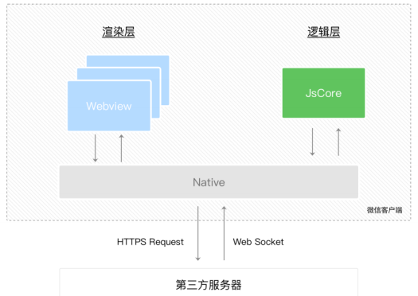
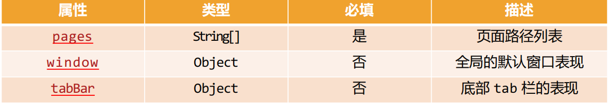
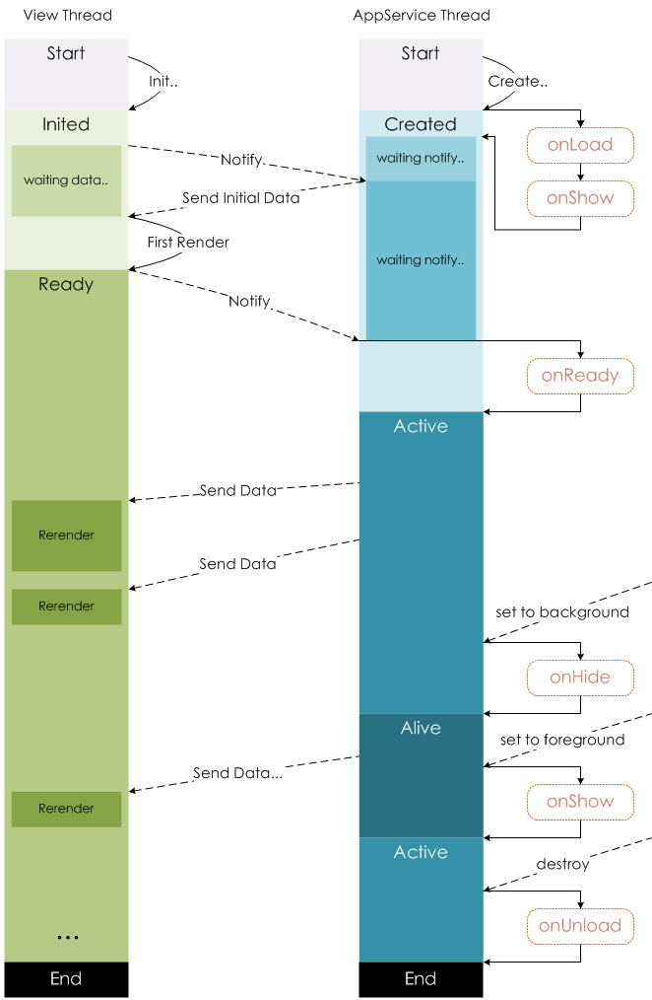

## **小程序的架构模型**

**谁是小程序的宿主环境呢？微信客户端**

宿主环境为了执行小程序的各种文件：wxml 文件、wxss 文件、js 文件

**当小程序基于 WebView 环境下时，WebView 的 JS 逻辑、DOM 树创建、CSS 解析、样式计算、Layout、Paint (Composite)都发生**

**在同一线程，在** **WebView** **上执行过多的** **JS** **逻辑可能阻塞渲染，导致界面卡顿。**

**以此为前提，小程序同时考虑了性能与安全，采用了目前称为「双线程模型」的架构。**

**双线程模型：**

WXML 模块和 WXSS 样式运行于 渲染层，渲染层使用 WebView 线程渲染（一个程序有多个页面，会使用多个 WebView 的线程）。

JS 脚本（app.js/home.js 等）运行于 逻辑层，逻辑层使用 JsCore 运行 JS 脚本。

这两个线程都会经由微信客户端（Native）进行中转交互。



## **小程序的配置文件**

**小程序的很多开发需求被规定在了配置文件中。**

**为什么这样做呢?**

这样做可以更有利于我们的开发效率；

并且可以保证开发出来的小程序的某些风格是比较一致的；

比如导航栏 – 顶部 TabBar，以及页面路由等等。

**常见的配置文件有哪些呢?**

project.config.json：项目配置文件, 比如项目名称、appid 等；

我们一般不会去改动这个文件，如果需要改的话，在详情=>本地设置进行修改，修改完会自动同步到这个文件中

https://developers.weixin.qq.com/miniprogram/dev/devtools/projectconfig.html

sitemap.json：小程序搜索相关的；

https://developers.weixin.qq.com/miniprogram/dev/framework/sitemap.html

app.json：全局配置；

page.json：页面配置；

## **全局 app 配置文件**

**全局配置比较多, 我们这里将几个比较重要的. 完整的查看官方文档.**

https://developers.weixin.qq.com/miniprogram/dev/reference/configuration/app.html



**pages: 页面路径列表**

用于指定小程序由哪些页面组成，每一项都对应一个页面的 路径（含文件名） 信息。

小程序中所有的页面都是必须在 pages 中进行注册的。

**window: 全局的默认窗口展示**

用户指定窗口如何展示, 其中还包含了很多其他的属性

其中 backgroundTextStyle 是下拉 loading 的样式，仅支持 dark / light，但是默认是不开启下拉刷新的，如果想要开启下来刷新，需要来到页面，比如 favor 页面的 favor.json 文件开启下拉刷新

pages/favor/favor.json

```json
{
  "usingComponents": {},
  "enablePullDownRefresh": true // 开启下拉刷新
}
```

**tabBar: 顶部 tab 栏的展示**

具体属性稍后我们进行演示

## **配置案例实现**

app.json

```json
{
  "pages": [
    "pages/index/index",
    "pages/favor/favor",
    "pages/order/order",
    "pages/profile/profile",
    "pages/01test/index"
  ],
  "window": {
    "backgroundTextStyle": "dark",
    "navigationBarBackgroundColor": "#ff8189",
    "navigationBarTitleText": "弘源旅途",
    "navigationBarTextStyle": "white"
  },
  "tabBar": {
    "selectedColor": "#ff8189",
    "list": [
      {
        "text": "首页",
        "pagePath": "pages/index/index",
        "iconPath": "assets/tabbar/home.png",
        "selectedIconPath": "assets/tabbar/home_active.png"
      },
      {
        "text": "收藏",
        "pagePath": "pages/favor/favor",
        "iconPath": "assets/tabbar/category.png",
        "selectedIconPath": "assets/tabbar/category_active.png"
      },
      {
        "text": "订单",
        "pagePath": "pages/order/order",
        "iconPath": "assets/tabbar/cart.png",
        "selectedIconPath": "assets/tabbar/cart_active.png"
      },
      {
        "text": "我的",
        "pagePath": "pages/profile/profile",
        "iconPath": "assets/tabbar/profile.png",
        "selectedIconPath": "assets/tabbar/profile_active.png"
      }
    ]
  },
  "style": "v2",
  "sitemapLocation": "sitemap.json"
}
```

## **页面 page 配置文件**

**每一个小程序页面也可以使用 .json 文件来对本页面的窗口表现进行配置。**

页面中配置项在当前页面会覆盖 app.json 的 window 中相同的配置项。

https://developers.weixin.qq.com/miniprogram/dev/reference/configuration/page.html

pages/profile/profile.json

```json
{
  "usingComponents": {}, // 使用组件要在这里注册
  "navigationBarTitleText": "个人信息",
  "navigationBarBackgroundColor": "#f00",
  "enablePullDownRefresh": true, // 开启下拉刷新
  "onReachBottomDistance": 100 // 距离底部100就加载更多数据，默认是0
}
```

pages/profile/profile.js

```javascript
// pages/profile/profile.js
Page({
  data: {
    avatarURL: "",
    listCount: 30,
  },

  // 监听下拉刷新
  onPullDownRefresh() {
    console.log("用户进行下拉刷新~");

    // 模拟网络请求: 定时器
    setTimeout(() => {
      this.setData({ listCount: 30 });

      // API: 停止下拉刷新
      wx.stopPullDownRefresh({
        success: (res) => {
          console.log("成功停止了下拉刷新", res);
        },
        fail: (err) => {
          console.log("失败停止了下拉刷新", err);
        },
      });
    }, 1000);
  },

  // 监听页面滚动到底部
  onReachBottom() {
    console.log("onReachBottom");
    this.setData({
      listCount: this.data.listCount + 30,
    });
  },
});
```

## **注册小程序 – App 函数**

**每个小程序都需要在 app.js 中调用 App 函数注册小程序实例**

在注册时, 可以绑定对应的生命周期函数；

在生命周期函数中, 执行对应的代码；

https://developers.weixin.qq.com/miniprogram/dev/reference/api/App.html

**我们来思考：注册 App 时，我们一般会做什么呢？**

1.判断小程序的进入场景

2.监听生命周期函数，在生命周期中执行对应的业务逻辑，比如在某个生命周期函数中进行登录操作或者请求网络数据；

3.因为 App()实例只有一个，并且是全局共享的（单例对象），所以我们可以将一些共享数据放在这里；

## **作用一：判断打开场景**

**小程序的打开场景较多：**

常见的打开场景：群聊会话中打开、小程序列表中打开、微信扫一扫打开、另一个小程序打开

https://developers.weixin.qq.com/miniprogram/dev/reference/scene-list.html

**如何确定场景?**

在 onLaunch 和 onShow 生命周期回调函数中，会有 options 参数，其中有 scene 值；

app.js

onLaunch 只会执行一次，而 onShow 会执行多次

```javascript
App({
  onShow(options) {
    // 作用一: 判断小程序的进入场景
    console.log("onShow:", options);
  },
});
```

## **作用二：定义全局 App 的数据**

**作用二：可以在 Object 中定义全局 App 的数据**

**定义的数据可以在其他任何页面中访问：**

app.js

```javascript
App({
  // 作用二: 共享数据
  // 数据不是响应式, 这里共享的数据通常是一些固定的数据
  globalData: {
    token: "",
    userInfo: {},
  },
});
```

pages/order/order.js

```javascript
// pages/order/order.js
Page({
  data: {
    userInfo: {},
  },

  onLoad() {
    // 获取共享的数据: App实例中数据
    // 1.获取app实例对象
    const app = getApp();

    // 2.从app实例对象获取数据
    const token = app.globalData.token;
    const userInfo = app.globalData.userInfo;
    console.log(token, userInfo);

    // 3.拿到token目的发送网络请求

    // 4.将数据展示到界面上面
    // this.data.userInfo = userInfo
    this.setData({ userInfo });
    console.log(this.data.userInfo);
  },
});
```

pages/order/order.wxml

```html
<!--pages/order/order.wxml-->
<text>pages/order/order.wxml</text>
<view class="user">
  <view class="name">name: {{ userInfo.nickname }}</view>
  <view class="level">level: {{ userInfo.level }}</view>
</view>
```

## **作用三 – 生命周期函数**

**作用三：在生命周期函数中，完成应用程序启动后的初始化操作**

比如登录操作（这个后续会详细讲解）；

比如读取本地数据（类似于 token，然后保存在全局方便使用）

比如请求整个应用程序需要的数据；

app.js

```javascript
App({
  globalData: {
    token: "",
    userInfo: {},
  },
  onLaunch(options) {
    // 0.从本地获取token/userInfo
    const token = wx.getStorageSync("token");
    const userInfo = wx.getStorageSync("userInfo");

    // 1.进行登录操作(判断逻辑)
    if (!token || !userInfo) {
      // 将登录成功的数据, 保存到storage
      console.log("登录操作");
      wx.setStorageSync("token", "kobetoken");
      wx.setStorageSync("userInfo", { nickname: "kobe", level: 100 });
    }

    // 2.将获取到数据保存到globalData中
    this.globalData.token = token;
    this.globalData.userInfo = userInfo;

    // 3.发送网络请求, 优先请求一些必要的数据
    // wx.request({ url: 'url'})
  },
});
```

## **注册页面 – Page 函数**

**小程序中的每个页面, 都有一个对应的 js 文件, 其中调用 Page 函数注册页面示例**

在注册时, 可以绑定初始化数据、生命周期回调、事件处理函数等。

https://developers.weixin.qq.com/miniprogram/dev/reference/api/Page.html

**我们来思考：注册一个 Page 页面时，我们一般需要做什么呢？**

1.在生命周期函数中发送网络请求，从服务器获取数据；

2.初始化一些数据，以方便被 wxml 引用展示；

3.监听 wxml 中的事件，绑定对应的事件函数；

4.其他一些监听（比如页面滚动、上拉刷新、下拉加载更多等）；

```html
<!--pages/01_初体验/index.wxml-->
<view class="banner">
  <swiper circular autoplay indicator-dots="{{true}}">
    <block wx:for="{{banners}}" wx:key="acm">
      <swiper-item>
        <!-- image组件默认宽度和高度: 320x240 -->
        <image mode="widthFix" src="{{item.image}}"></image>
      </swiper-item>
    </block>
  </swiper>
</view>

<view class="counter">
  <view>当前计数: {{ counter }}</view>
</view>

<view class="buttons">
  <button bindtap="onBtn1Click">按钮1</button>

  <block wx:for="{{btns}}" wx:key="*this">
    <button
      class="btn"
      style="background: {{item}};"
      bindtap="onBtnClick"
      data-color="{{item}}"
    >
      {{ item }}
    </button>
  </block>
</view>

<view class="list">
  <block wx:for="{{30}}" wx:key="*this">
    <view>列表数据:{{ item }}</view>
  </block>
</view>
```

```javascript
// pages/01_初体验/index.js
Page({
  data: {
    banners: [],
    recommends: [],

    // 2.作用二: 定义本地固定的数据
    counter: 100,

    btns: ["red", "blue", "green", "orange"],
  },
  // 1.作用一: 发送网络请求, 请求数据
  onLoad() {
    console.log("onLoad");

    // 发送网络请求
    wx.request({
      url: "http://123.207.32.32:8000/home/multidata",
      success: (res) => {
        const data = res.data.data;
        const banners = data.banner.list;
        const recommends = data.recommend.list;
        this.setData({ banners, recommends });
      },
    });
  },

  // 3.绑定wxml中产生事件后的回调函数
  onBtn1Click() {
    console.log("onBtn1Click");
  },
  onBtnClick(event) {
    console.log("btn click:", event.target.dataset.color);
  },

  // 4.绑定下拉刷新/达到底部/页面滚动
  onPullDownRefresh() {
    console.log("onPullDownRefresh");
  },
  onReachBottom() {
    console.log("onReachBottom");
  },
  onPageScroll(event) {
    // 页面滚动
    console.log("onPageScroll:", event);
  },

  // 生命周期函数:
  onShow() {
    console.log("onShow");
  },
  onReady() {
    console.log("onReady");
  },
  onHide() {
    console.log("onHide");
  },
  onUnload() {
    console.log("onUnload");
  },
});
```

## **Page 页面的生命周期**


