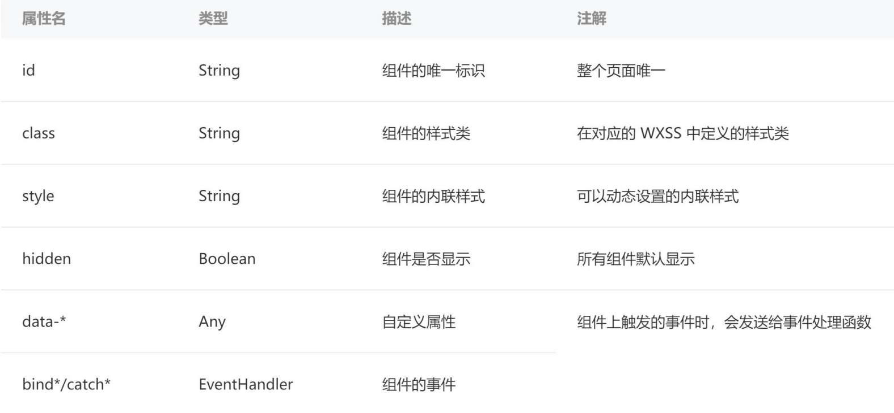

## **Text 组件解析**

**text 组件用于显示文本, 类似于 span 标签, 是行内元素**

user-select 属性决定文本内容是否可以让用户选中

space 有三个取值(了解)

decode 是否解码(了解)

decode 可以解析的有

```javascript
&nbsp; &lt; &gt; &amp; &apos; &ensp; &emsp;
```

```html
<!-- text组件 -->
<view>------------------ text组件 ------------------</view>
<text>Hello World</text>
<text user-select>{{ message }}</text>
<text user-select="{{true}}">{{ message }}</text>
<text decode>&gt;</text>
```

## **Button 组件解析**

**Button 组件用于创建按钮，默认块级元素**

```html
<view>------------------ button组件 ------------------</view>
<!-- 1.基本使用 -->
<button>按钮</button>

<button size="mini">size属性</button>

<button size="mini" type="primary">type属性</button>
<button size="mini" type="warn">type属性</button>
<button size="mini" class="btn">自定义属性</button>

<button size="mini" plain>plain属性</button>
<button size="mini" disabled>disabled属性</button>
<button size="mini" loading class="btn">loading属性</button>
<!-- hover-class手指按下去的交互效果 -->
<button size="mini" hover-class="active">hover效果</button>
<view></view>
```

```css
.btn {
  background-color: orange;
  color: #fff;
}

.active {
  background-color: skyblue;
}
```

## **open-type 属性**

open-type 用户获取一些特殊性的权限，可以绑定一些特殊的事件

```html
<!-- 2.open-type属性 -->
<!-- contact很少用，了解即可 -->
<button open-type="contact" size="mini" type="primary">打开会话</button>
<!-- 这种方式获取不到真实的用户信息 -->
<button
  open-type="getUserInfo"
  bindgetuserinfo="getUserInfo"
  size="mini"
  type="primary"
>
  用户信息
</button>
<!-- 获取用户真实的信息使用这种方式 -->
<button size="mini" type="primary" bindtap="getUserInfo">用户信息2</button>
<!-- 获取用户手机号，只有企业级的才能获取，个人无法获取 -->
<button
  size="mini"
  type="primary"
  open-type="getPhoneNumber"
  bindgetphonenumber="getPhoneNumber"
>
  手机号码
</button>
```

```javascript
Page({
  getUserInfo(event) {
    // 调用API, 获取用户的信息
    // 1.早期小程序的API, 基本都是不支持Promise风格
    // 2.后期小程序的API, 基本都开始支持Promise风格
    wx.getUserProfile({
      desc: "desc",
      // success: (res) => {
      //   console.log(res);
      // }
    }).then((res) => {
      console.log(res); // 获取用户信息
    });
  },
  // 这里可以拿到code然后发送给服务端获取到手机号
  getPhoneNumber(event) {
    console.log(event);
  },
});
```

## **View 组件解析**

**视图组件（块级元素，独占一行，通常用作容器组件）**

```html
<view>------------------ View组件 ------------------</view>
<view bindtap="onViewClick" hover-class="active">我是view组件</view>
<view>哈哈哈</view>
```

```javascript
onViewClick() {
    console.log("onViewClick");
},
```

## **Image 组件解析**

**Image 组件用于显示图片**

**其中 src 可以是本地图片，也可以是网络图片**

**Mode 属性使用也非常关键，详情查看官网：**

https://developers.weixin.qq.com/miniprogram/dev/component/image.html

**注意：image 组件默认宽度 320px、高度 240px**

```html
<view>------------------ Image组件 ------------------</view>
<!-- 根目录: /表示根目录 -->
<!-- 1.图片的基本使用 -->
<!-- image元素宽度和高度: 320x240 -->
<image src="/assets/zznh.png" />
<image src="https://pic3.zhimg.com/v2-9be23000490896a1bfc1df70df50ae32_b.jpg" />

<!-- 2.图片重要的属性: mode -->
<image src="/assets/zznh.png" mode="aspectFit" />
<!-- image基本都是设置widthFix -->
<image src="/assets/zznh.png" mode="widthFix" />
<image src="/assets/zznh.png" mode="heightFix" />
```

widthFix 指的是图片宽度保持 320px，高度根据这个宽度自适应。

## **Image 组件代码**

**这里补充一个 API：wx.chooseMedia（具体用法查看文档）**

```html
<!-- 3.选择本地图片: 将本地图片使用image展示出来 -->
<button bindtap="onChooseImage">选择图片</button>
<image class="img" src="{{chooseImageUrl}}" mode="widthFix" />
```

```javascript
Page({
  data: {
    chooseImageUrl: "",
  },
  onChooseImage() {
    wx.chooseMedia({
      mediaType: "image",
    }).then((res) => {
      const imagePath = res.tempFiles[0].tempFilePath;
      this.setData({ chooseImageUrl: imagePath });
    });
  },
});
```

## **scroll-view 组件解析**

scroll-view 可以实现局部滚动：

注意事项：

实现滚动效果必须添加 scroll-x 或者 scroll-y 属性（只需要添加即可，属性值相当于为 true 了）

垂直方向滚动必须设置 scroll-view 一个高度

```html
<!-- 上下滚动(y轴) -->
<scroll-view class="scroll-y" scroll-y>
  <block wx:for="{{viewColors}}" wx:key="*this">
    <view class="item" style="background: {{item}};">{{item}}</view>
  </block>
</scroll-view>

<!-- 左右滚动(x轴) 开启flex布局 -->
<scroll-view class="scroll-x" scroll-x enable-flex>
  <block wx:for="{{viewColors}}" wx:key="*this">
    <view class="item" style="background: {{item}};">{{item}}</view>
  </block>
</scroll-view>
```

```css
.scroll-y {
  background-color: orange;
  height: 150px;
}

.scroll-x {
  display: flex;
}

.item {
  width: 100px;
  height: 100px;
  color: #fff;
  flex-shrink: 0;
}
```

## **scroll-view 组件代码**

```html
<!-- 监听事件 -->
<scroll-view
  class="container scroll-x"
  scroll-x
  enable-flex
  bindscrolltoupper="onScrollToUpper"
  bindscrolltolower="onScrollToLower"
  bindscroll="onScroll"
>
  <block wx:for="{{viewColors}}" wx:key="*this">
    <view class="item" style="background: {{item}};">{{item}}</view>
  </block>
</scroll-view>
```

```javascript
Page({
  // 监听scroll-view滚动
  onScrollToUpper() {
    console.log("滚动到最顶部/左边");
  },
  onScrollToLower() {
    console.log("滚到到最底部/右边");
  },
  onScroll(event) {
    console.log("scrollview发生了滚动:", event); // 里面有个deltaX和deltaY可以知道向左还是向右滚动，向上还是向下滚动
  },
});
```

## **组件共同的属性**



## Input 组件

双向数据绑定

```html
<view>------------------ input组件 ------------------</view>
<input type="text" model:value="{{message}}" />
```

```javascript
Page({
  message: "",
});
```
