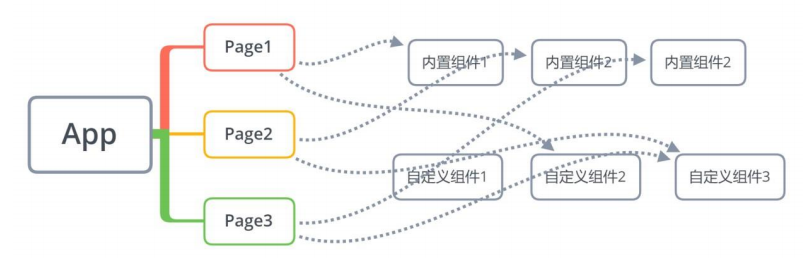
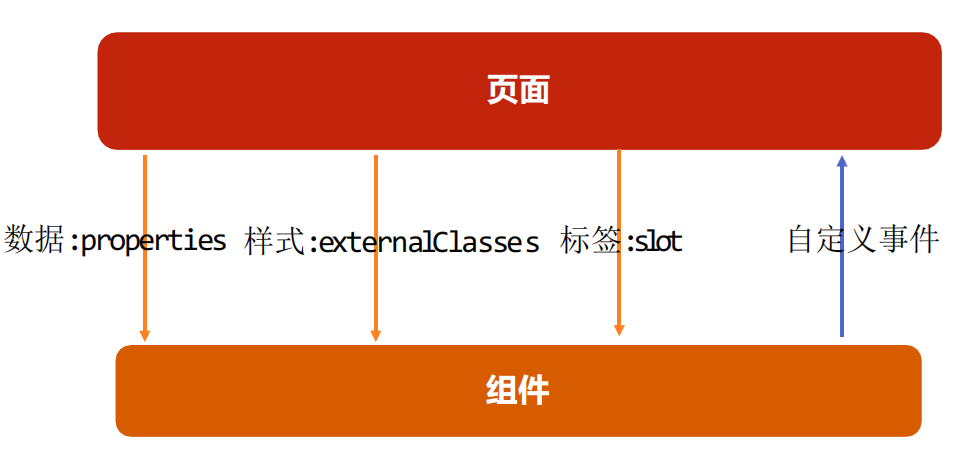
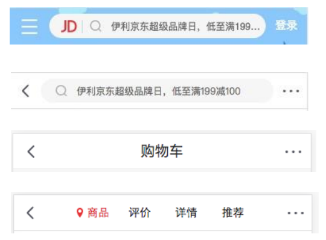
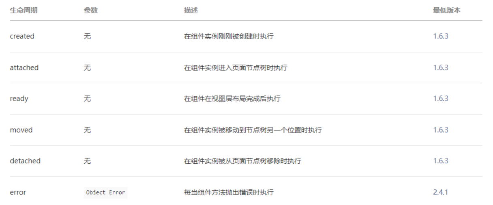
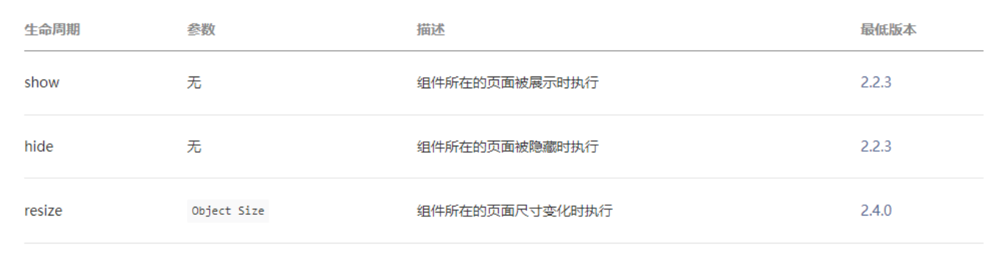
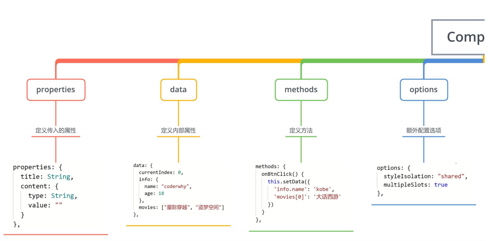
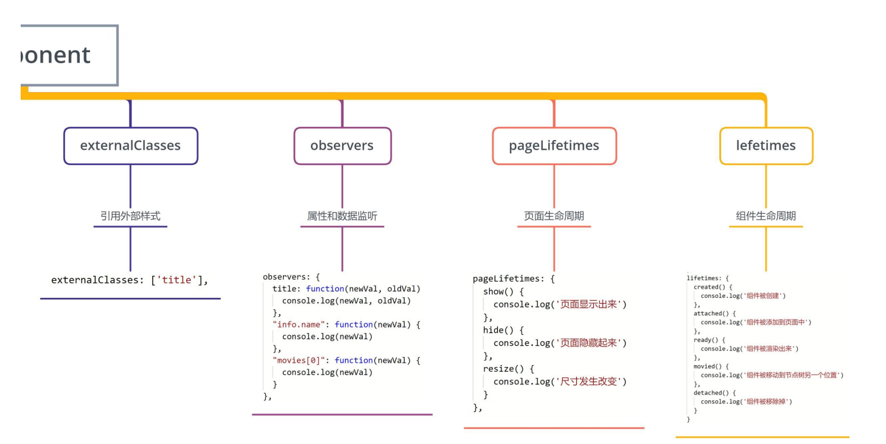

## **小程序组件化开发**

**小程序在刚刚推出时是不支持组件化的, 也是为人诟病的一个点：**

但是从 v1.6.3 开始, 小程序开始支持自定义组件开发, 也让我们更加方便的在程序中使用组件化.



**组件化思想的应用：**

有了组件化的思想，我们在之后的开发中就要充分的利用它。

尽可能的将页面拆分成一个个小的、可复用的组件。

这样让我们的代码更加方便组织和管理，并且扩展性也更强。

**所以，组件是目前小程序开发中，非常重要的一个篇章，要认真学习（不过学习 Vue 的过程中我们已经强调过很多次了）。**

## **创建一个组件**

**类似于页面，自定义组件由 json wxml wxss js 4 个文件组成。**

按照我的个人习惯, 我们会先在根目录下创建一个文件夹；

components, 里面存放我们之后自定义的公共组件；

常见一个自定义组件 my-cpn: 包含对应的四个文件；

**自定义组件的步骤：**

1.首先需要在 json 文件中进行自定义组件声明（将 component 字段设为 true 可这一组文件设为自定义组件）

2.在 wxml 中编写属于我们组件自己的模板

3.在 wxss 中编写属于我们组件自己的相关样式

4.在 js 文件中, 可以定义数据或组件内部的相关逻辑(后续我们再使用)

新建一个 components 文件夹，然后新建一个 section-info 目录，在这个目录，鼠标右键新建 Component 就会生成 4 个文件，

其中 section-info.json

```json
{
  "component": true, // 代表这个是组件
  "usingComponents": {} // 组件也可以使用其他的组件
}
```

和页面不一样的地方还有 section-info.js，使用 Component 方法

```javascript
Component({});
```

## **使用自定义组件和细节注意事项**

**一些需要注意的细节：**

自定义组件也是可以引用自定义组件的，引用方法类似于页面引用自定义组件的方式（使用 usingComponents 字段）。

自定义组件和页面所在项目根目录名 不能以“wx-”为前缀，否则会报错。

如果在 app.json 的 usingComponents 声明某个组件，那么所有页面和组件可以直接使用该组件。

在页面的 json 文件先注册才能使用

index.json

```json
{
  "usingComponents": {
    "section-info": "/components/section-info/section-info"
  }
}
```

index.wxml

```html
<section-info />
```

## **组件的样式细节**

**课题一：组件内的样式 对 外部样式 的影响**

结论一：组件内的 class 样式，只对组件 wxml 内的节点生效, 对于引用组件的 Page 页面不生效。

结论二：组件内不能使用 id 选择器、属性选择器、标签选择器

**课题二：外部样式 对 组件内样式 的影响**

结论一：外部使用 class 的样式，只对外部 wxml 的 class 生效，对组件内是不生效的

结论二：外部使用了 id 选择器、属性选择器不会对组件内产生影响

结论三：外部使用了标签选择器，会对组件内产生影响

**课题三：如何让 class 可以相互影响**

在 Component 对象中，可以传入一个 options 属性，其中 options 属性中有一个 styleIsolation（隔离）属性。

styleIsolation 有三个取值：

- isolated 表示启用样式隔离，在自定义组件内外，使用 class 指定的样式将不会相互影响（默认取值）；
- apply-shared 表示页面 wxss 样式将影响到自定义组件，但自定义组件 wxss 中指定的样式不会影响页面；
- shared 表示页面 wxss 样式将影响到自定义组件，自定义组件 wxss 中指定的样式也会影响页面和其他设置了

components/test-style/test-style.js

```javascript
Component({
  options: {
    styleIsolation: "shared",
  },
});
```

## **组件的通信**

**很多情况下，组件内展示的内容（数据、样式、标签），并不是在组件内写死的，而是可以由使用者来决定。**



## **向组件传递数据 - properties**

**给组件传递数据：**

大部分情况下，组件只负责布局和样式，内容是由使用组件的对象决定的；

所以，我们经常需要从外部传递数据给我们的组件，让我们的组件来进行展示；

**如何传递呢？**

使用 properties 属性；

**支持的类型：**

String、Number、Boolean

Object、Array、null（不限制类型）

**默认值：**

可以通过 value 设置默认值；

index.wxml

```html
<section-info title="我与地坛" content="要是有些事情我没说, 别以为是我忘记了" />
```

components/section-info/section-info.js

```javascript
Component({
  properties: {
    title: {
      type: String,
      value: "默认标题",
    },
    content: {
      type: String,
      value: "默认内容",
    },
  },
});
```

components/section-info/section-info.wxml

```html
<view class="section">
  <view class="title">{{ title }}</view>
  <view class="content">{{ content }}</view>
</view>
```

## **向组件传递样式 - externalClasses**

**给组件传递样式：**

有时候，我们不希望将样式在组件内固定不变，而是外部可以决定样式。

**这个时候，我们可以使用 externalClasses 属性：**

1.在 Component 对象中，定义 externalClasses 属性

2.在组件内的 wxml 中使用 externalClasses 属性中的 class

3.在页面中传入对应的 class，并且给这个 class 设置样式

在页面内使用组件，定义了 abc 和 cba 的样式，把这俩样式传递给组件

index.wxml

```html
<!-- 2.自定义组件 -->
<section-info
  info="abc"
  title="我与地坛"
  content="要是有些事情我没说, 别以为是我忘记了"
/>
<section-info
  info="cba"
  title="黄金时代"
  content="在我一生中最好的黄金时代, 我想吃, 我想爱"
/>
```

index.wxss

```css
.abc {
  background-color: #0f0;
}

.cba {
  background-color: #00f;
}
```

components/section-info/section-info.js

```javascript
Component({
  externalClasses: ["info"],
});
```

components/section-info/section-info.wxml

```html
<view class="section">
  <view class="title">{{ title }}</view>
  <view class="content info">{{ content }}</view>
</view>
```

## **组件向外传递事件 – 自定义事件**

**有时候是自定义组件内部发生了事件，需要告知使用者，这个时候可以使用自定义事件：**

components/section-info/section-info.wxml

```html
<!--components/section-info/section-info.wxml-->
<view class="section">
  <view class="title" bindtap="onTitleTap">{{ title }}</view>
  <view class="content info">{{ content }}</view>
</view>
```

components/section-info/section-info.js

```javascript
Component({
  methods: {
    onTitleTap() {
      console.log("title被点击了~");
      this.triggerEvent("titleclick", "aaa");
    },
  },
});
```

index.wxml

```html
<section-info
  info="abc"
  title="我与地坛"
  content="要是有些事情我没说, 别以为是我忘记了"
  bind:titleclick="onSectionTitleClick"
/>
```

index.js

```javascript
Page({
  onSectionTitleClick(event) {
    console.log("区域title发生了点击", event.detail);
  },
});
```

## **自定义组件练习**

index.wxml

```html
<!-- 4.tab-control的使用 -->
<tab-control titles="{{digitalTitles}}" bind:indexchange="onTabIndexChange" />
```

index.js

```javascript
// pages/07_learn_cpns/index.js
Page({
  data: {
    digitalTitles: ["电脑", "手机", "iPad"],
  },
  onTabIndexChange(event) {
    const index = event.detail;
    console.log("点击了", this.data.digitalTitles[index]);
  },
});
```

components/tab-control/tab-control.wxml

```html
<view class="tab-control">
  <block wx:for="{{ titles }}" wx:key="*this">
    <view
      class="item {{index === currentIndex ? 'active': ''}}"
      bindtap="onItemTap"
      data-index="{{index}}"
    >
      <text class="title">{{ item }}</text>
    </view>
  </block>
</view>
```

components/tab-control/tab-control.wxss

```css
.tab-control {
  display: flex;
  height: 40px;
  line-height: 40px;
  text-align: center;
}

.tab-control .item {
  flex: 1;
}

.tab-control .item.active {
  color: #ff8189;
}

.tab-control .item.active .title {
  border-bottom: 3px solid #ff8189;
  padding: 5px;
}
```

components/tab-control/tab-control.js

```javascript
Component({
  properties: {
    titles: {
      type: Array,
      value: [],
    },
  },

  data: {
    currentIndex: 0,
  },

  methods: {
    onItemTap(event) {
      const currentIndex = event.currentTarget.dataset.index;
      this.setData({ currentIndex });

      // 自定义事件
      this.triggerEvent("indexchange", currentIndex);
    },
  },
});
```

## **页面直接调用组件方法**

**可在父组件里调用 this.selectComponent ，获取子组件的实例对象。**

调用时需要传入一个匹配选择器 selector，如：this.selectComponent(".my-component")。

index.wxml

```html
<tab-control
  class="tab-control"
  titles="{{digitalTitles}}"
  bind:indexchange="onTabIndexChange"
/>
<button bindtap="onExecTCMethod">调用TC方法</button>
```

index.js

```javascript
Page({
  onExecTCMethod() {
    // 1.获取对应的组件实例对象
    const tabControl = this.selectComponent(".tab-control");

    // 2.调用组件实例的方法
    tabControl.test(2);
  },
});
```

components/tab-control/tab-control.js

```javascript
Component({
  data: {
    currentIndex: 0,
  },
  methods: {
    test(index) {
      console.log("tab control test function exec");
      this.setData({
        currentIndex: index,
      });
    },
  },
});
```

## **什么是插槽？**

**slot 翻译为插槽：**

在生活中很多地方都有插槽，电脑的 USB 插槽，插板当中的电源插槽。

插槽的目的是让我们原来的设备具备更多的扩展性。

比如电脑的 USB 我们可以插入 U 盘、硬盘、手机、音响、键盘、鼠标等等。

**组件的插槽：**

组件的插槽也是为了让我们封装的组件更加具有扩展性。

让使用者可以决定组件内部的一些内容到底展示什么。

**栗子：移动网站中的导航栏。**

移动开发中，几乎每个页面都有导航栏。

导航栏我们必然会封装成一个插件，比如 nav-bar 组件。

一旦有了这个组件，我们就可以在多个页面中复用了。

**但是，每个页面的导航是一样的吗？类似右图**



## **单个插槽的使用**

**除了内容和样式可能由外界决定之外，也可能外界想决定显示的方式**

比如我们有一个组件定义了头部和尾部，但是中间的内容可能是一段文字，也可能是一张图片，或者是一个进 度条。

在不确定外界想插入什么其他组件的前提下，我们可以在组件内预留插槽：

index.wxml

```html
<my-slot>
  <button>我是按钮</button>
</my-slot>
<my-slot>
  <image src="/assets/nhlt.jpg" mode="widthFix"></image>
</my-slot>

<my-slot></my-slot>
```

components/my-slot/my-slot.wxml

微信小程序插槽是不支持默认值的，那么如何解决呢？我们可以在 content 后面定义一个默认值，通过 CSS 样式来控制是否展示默认值，

默认 default 的样式是 display: none，当 content 没有内容时，它的兄弟选择器也就是 default，样式改成 display: block

```html
<view class="my-slot">
  <view class="header">Header</view>
  <view class="content">
    <!-- 小程序中插槽是不支持默认值的 -->
    <slot></slot>
  </view>
  <view class="default">哈哈哈哈</view>
  <view class="footer">Footer</view>
</view>
```

components/my-slot/my-slot.wxss

```css
.default {
  display: none;
}

.content:empty + .default {
  display: block;
}
```

## **多个插槽的使用**

**有时候为了让组件更加灵活, 我们需要定义多个插槽：**

index.wxml

```html
<!-- 2.多个插槽的使用 -->
<mul-slot>
  <button slot="left" size="mini">left</button>
  <view slot="center">哈哈哈</view>
  <button slot="right" size="mini">right</button>
</mul-slot>
```

components/mul-slot/mul-slot.wxml

```html
<!--components/mul-slot/mul-slot.wxml-->
<view class="mul-slot">
  <view class="left">
    <slot name="left"></slot>
  </view>
  <view class="center">
    <slot name="center"></slot>
  </view>
  <view class="right">
    <slot name="right"></slot>
  </view>
</view>
```

components/mul-slot/mul-slot.js

注意：这里需要开启使用多个插槽

```javascript
Component({
  options: {
    multipleSlots: true,
  },
});
```

## **behaviors**

**behaviors 是用于组件间代码共享的特性，类似于一些编程语言中的 “mixins”。**

每个 behavior 可以包含一组属性、数据、生命周期函数和方法；

组件引用它时，它的属性、数据和方法会被合并到组件中，生命周期函数也会在对应时机被调用；

每个组件可以引用多个 behavior ，behavior 也可以引用其它 behavior ；

components/c-behavior/c-behavior.wxml

```html
<view>
  <view class="counter">当前计数: {{counter}}</view>
  <button bindtap="increment">+1</button>
  <button bindtap="decrement">-1</button>
</view>
```

components/c-behavior/c-behavior.js

```javascript
import { counterBehavior } from "../../behaviors/counter";

Component({
  behaviors: [counterBehavior],
});
```

behaviors/counter.js

```javascript
export const counterBehavior = Behavior({
  data: {
    counter: 100,
  },
  methods: {
    increment() {
      this.setData({ counter: this.data.counter + 1 });
    },
    decrement() {
      this.setData({ counter: this.data.counter - 1 });
    },
  },
});
```

## **组件的生命周期**

**组件的生命周期，指的是组件自身的一些函数，这些函数在特殊的时间点或遇到一些特殊的框架事件时被自动触发。**

其中，最重要的生命周期是 created attached detached ，包含一个组件实例生命流程的最主要时间点。

**自小程序基础库版本 2.2.3 起，组件的的生命周期也可以在 lifetimes 字段内进行声明（这是推荐的方式，其优先级最高）。**



## **组件所在页面的生命周期**

**还有一些特殊的生命周期，它们并非与组件有很强的关联，但有时组件需要获知，以便组件内部处理。**

样的生命周期称为“组件所在页面的生命周期”，在 pageLifetimes 定义段中定义。

**其中可用的生命周期包括：**



components/c-lifetime/c-lifetime.js

```javascript
// components/c-lifetime/c-lifetime.js
Component({
  lifetimes: {
    created() {
      console.log("组件被创建created");
    },
    attached() {
      console.log("组件被添加到组件树中attached");
    },
    detached() {
      console.log("组件从组件树中被移除detached");
    },
  },
  pageLifetimes: {
    show() {
      console.log("page show");
    },
    hide() {
      console.log("page hide");
    },
  },
});
```

index.wxml

```html
<!-- 4.组件的生命周期 -->
<button bindtap="onChangeTap">切换</button>
<c-lifetime wx:if="{{isShowLiftTime}}" />
```

index.js

```javascript
Page({
  data: {
    isShowLiftTime: true,
  },
  onChangeTap() {
    this.setData({ isShowLiftTime: !this.data.isShowLiftTime });
  },
});
```

## **Component 构造器**




