## **网络请求 – API 参数**

**微信提供了专属的 API 接口,用于网络请求: wx.request(Object object)**

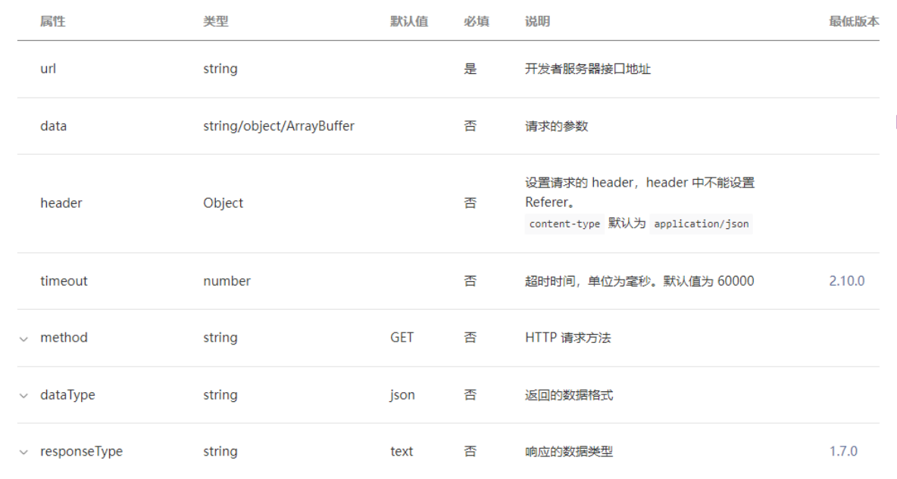

**比较关键的几个属性解析:**

- url: **必传,不然请求什么**
- data: 请求参数
- method: 请求的方式
- success: 成功时的回调
- fail: 失败时的回调

## **网络请求 – API 使用**

**直接使用 wx.request(Object object)发送请求**

index.js

```javascript
Page({
  onLoad() {
    // 1.网络请求基本使用
    wx.request({
      url: "http://codercba.com:1888/api/city/all",
      success: (res) => {
        const data = res.data.data;
        this.setData({ allCities: data });
      },
      fail: (err) => {
        console.log("err:", err);
      },
    });

    wx.request({
      url: "http://codercba.com:1888/api/home/houselist",
      data: {
        page: 1,
      },
      success: (res) => {
        const data = res.data.data;
        this.setData({ houselist: data });
      },
    });
  },
});
```

index.wxml

```html
<view class="house-list">
  <block wx:for="{{houselist}}" wx:key="abc">
    <view class="item">
      <image src="{{item.data.image.url}}"></image>
      <view class="title">{{item.data.houseName}}</view>
    </view>
  </block>
</view>
```

## **网络请求域名配置**

每个微信小程序需要事先设置通讯域名，小程序**只可以跟指定的域名进行网络通信**。

小程序登录后台 – 开发管理 – 开发设置 – 服务器域名；

**服务器域名请在 「小程序后台 - 开发 - 开发设置 - 服务器域名」 中进行配置，配置时需要注意：**

域名只支持 https (wx.request、wx.uploadFile、wx.downloadFile) 和 wss (wx.connectSocket) 协议；

域名不能使用 IP 地址（小程序的局域网 IP 除外）或 localhost；

可以配置端口，如 https://myserver.com:8080，但是配置后只能向 https://myserver.com:8080 发起请求。如果向

https://myserver.com、https://myserver.com:9091 等 URL 请求则会失败。

如果不配置端口。如 https://myserver.com，那么请求的 URL 中也不能包含端口，甚至是默认的 443 端口也不可以。如果

向 https://myserver.com:443 请求则会失败。

域名必须经过 ICP 备案；

出于安全考虑，api.weixin.qq.com 不能被配置为服务器域名，相关 API 也不能在小程序内调用。 开发者应将 AppSecret

保存到后台服务器中，通过服务器使用 getAccessToken 接口获取 access_token，并调用相关 API；

不支持配置父域名，使用子域名。

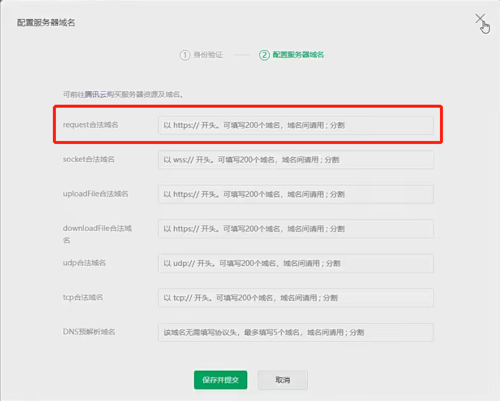

## **网络请求 – API 封装**

封装到函数中

service/index.js

```javascript
// 封装成函数
export function hyRequest(options) {
  return new Promise((resolve, reject) => {
    wx.request({
      ...options,
      success: (res) => {
        resolve(res.data);
      },
      fail: reject,
    });
  });
}
```

index.js

```javascript
// pages/09_learn_api/index.js
import { hyRequest } from "../../service/index";

Page({
  data: {
    allCities: {},
    houselist: [],
    currentPage: 1,
  },
  async onLoad() {
    // 2.使用封装的函数
    hyRequest({
      url: "http://codercba.com:1888/api/city/all",
    }).then((res) => {
      this.setData({ allCities: res.data });
    });

    hyRequest({
      url: "http://codercba.com:1888/api/home/houselist",
      data: {
        page: 1,
      },
    }).then((res) => {
      this.setData({ houselist: res.data });
    });

    // 3.await/async
    const cityRes = await hyRequest({
      url: "http://codercba.com:1888/api/city/all",
    });
    this.setData({ allCities: cityRes.data });

    const houseRes = await hyRequest({
      url: "http://codercba.com:1888/api/home/houselist",
      data: { page: 1 },
    });
    this.setData({ houselist: houseRes.data });

    // 4.将请求封装到一个单独函数中(推荐)
    this.getCityData();
    this.getHouselistData();
  },

  async getCityData() {
    const cityRes = await hyRequest({
      url: "http://codercba.com:1888/api/city/all",
    });
    this.setData({ allCities: cityRes.data });
  },
  async getHouselistData() {
    const houseRes = await hyRequest({
      url: "http://codercba.com:1888/api/home/houselist",
      data: { page: this.data.currentPage },
    });
    const finalHouseList = [...this.data.houselist, ...houseRes.data];
    this.setData({ houselist: finalHouseList });
    // 思考: 为什么这里不需要setData? 因为只需要拿到数据，视图并不需要更新
    this.data.currentPage++;
  },

  onReachBottom() {
    this.getHouselistData();
  },
});
```

封装到类中

service/index.js

```javascript
// 封装成类 -> 实例
class HYRequest {
  constructor(baseURL) {
    this.baseURL = baseURL;
  }
  request(options) {
    const { url } = options;
    return new Promise((resolve, reject) => {
      wx.request({
        ...options,
        url: this.baseURL + url,
        success: (res) => {
          resolve(res.data);
        },
        fail: (err) => {
          console.log("err:", err);
        },
      });
    });
  }
  get(options) {
    return this.request({ ...options, method: "get" });
  }
  post(options) {
    return this.request({ ...options, method: "post" });
  }
}

export const hyReqInstance = new HYRequest("http://codercba.com:1888/api");
```

index.js

```javascript
import { hyReqInstance } from "../../service/index";

Page({
  onLoad() {
    // 5.使用类的实例发送请求
    hyReqInstance
      .get({
        url: "/city/all",
      })
      .then((res) => {
        console.log(res);
      });
  },
});
```

## **展示弹窗效果**

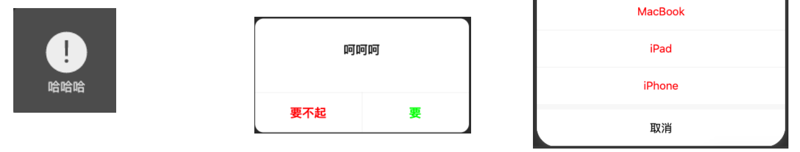

index.wxml

```html
<!-- 1.展示弹窗 -->
<view>
  <button size="mini" bindtap="onShowToast">showToast</button>
  <button size="mini" bindtap="onShowModal">showModal</button>
  <button size="mini" bindtap="onShowAction">showAction</button>
</view>
```

index.js

```javascript
Page({
  // 1.弹窗相关的API
  onShowToast() {
    wx.showToast({
      title: "购买失败!",
      icon: "error",
      duration: 5000,
      mask: true,
      success: (res) => {
        console.log("res:", res);
      },
      fail: (err) => {
        console.log("err:", err);
      },
    });

    // wx.showLoading({
    //   title: "加载中ing"
    // })
  },
  onShowModal() {
    wx.showModal({
      title: "确定购买吗?",
      content: "确定购买的话, 请确定您的微信有钱!",
      confirmColor: "#f00",
      cancelColor: "#0f0",
      success: (res) => {
        if (res.cancel) {
          console.log("用户点击取消");
        } else if (res.confirm) {
          console.log("用户点击了确定");
        }
      },
    });
  },
  onShowAction() {
    wx.showActionSheet({
      itemList: ["衣服", "裤子", "鞋子"],
      success: (res) => {
        console.log(res.tapIndex);
      },
      fail: (err) => {
        console.log("err:", err);
      },
    });
  },
});
```

## **分享功能**

**分享是小程序扩散的一种重要方式，小程序中有两种分享方式：**

方式一：点击右上角的菜单按钮，之后点击转发

方式二：点击某一个按钮，直接转发

**当我们转发给好友一个小程序时，通常小程序中会显示一些信息：**

如何决定这些信息的展示呢？通过 onShareAppMessage

监听用户点击页面内转发按钮（button 组件 open-type="share"）或右上角菜单“转发”按钮的行为，并自定义转发内容。

此事件处理函数需要 return 一个 Object，用于自定义转发内容；

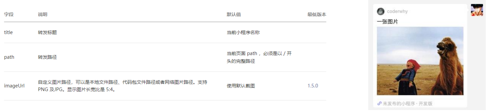

index.js

```javascript
Page({
  // 2.分享功能
  onShareAppMessage() {
    return {
      title: "一张图片",
      path: "/pages/favor/favor", // 点击分享的小程序会进入到这个页面
      imageUrl: "/assets/nhlt.jpg",
    };
  },
});
```

## **获取设备信息**

**在开发中，我们需要经常获取当前设备的信息，用于手机信息或者进行一些适配工作。**

小程序提供了相关个 API：**wx.getSystemInfo(Object object)**

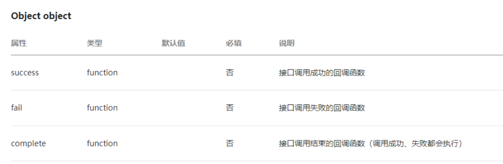

```javascript
// 1.获取手机的基本信息
wx.getSystemInfo({
  success: (res) => {
    console.log(res);
  },
});
```

## **获取位置信息**

**开发中我们需要经常获取用户的位置信息，以方便给用户提供相关的服务：**

我们可以通过 API 获取：**wx.getLocation(Object object)**

**对于用户的关键信息，需要获取用户的授权后才能获得：**

如果授权过，可以在清缓存=>清除模拟器缓存=>清除授权数据

https://developers.weixin.qq.com/miniprogram/dev/reference/configuration/app.html#permission

```javascript
// 2.获取当前的位置信息
wx.getLocation({
  success: (res) => {
    console.log("res:", res);
  },
});
```

需要在 app.json 中进行配置

app.json

```json
{
  "permission": {
    "scope.userLocation": {
      "desc": "需要获取您的位置信息"
    }
  }
}
```

## **Storage 存储**

**在开发中，某些常见我们需要将一部分数据存储在本地：比如 token、用户信息等。**

小程序提供了专门的 Storage 用于进行本地存储。

**同步存取数据的方法：**

- **wx.setStorageSync(string key, any data)**
- **wx.getStorageSync(string key)**
- **wx.removeStorageSync(string key)**
- **wx.clearStorageSync()**

**异步存储数据的方法：**

- **wx.setStorage(Object object)**
- **wx.getStorage(Object object)**
- **wx.removeStorage(Object object)**
- **wx.clearStorage(Object object)**

index.js

如果设置完想里面拿到数据就使用同步存储方法

```javascript
// 4.本地存储方式
  onLocalStorage() {
    // 1.存储一些键值对
    // wx.setStorageSync('name', "why")
    // wx.setStorageSync('age', 18)
    // wx.setStorageSync('friends', ["abc", "cba", "nba"])

    // 2.获取storage中内容
    // const name = wx.getStorageSync('name')
    // const age = wx.getStorageSync('age')
    // const friends = wx.getStorageSync('friends')
    // console.log(name, age, friends);

    // 3.删除storage中内容
    // wx.removeStorageSync('name')

    // 4.清空storage中内容
    // wx.clearStorageSync()

    // 异步操作
    wx.setStorage({
      key: "books",
      data: "哈哈哈",
      encrypt: true, // 加密
      success: (res) => {
        wx.getStorage({
          key: "books",
          encrypt: true,
          success: (res) => {
            console.log(res);
          }
        })
      }
    })

    console.log("-------");
  }
```

## **界面跳转的方式**

界面的跳转有两种方式：**通过 navigator 组件** 和 **通过 wx 的 API 跳转**

**这里我们先以 wx 的 API 作为讲解：**

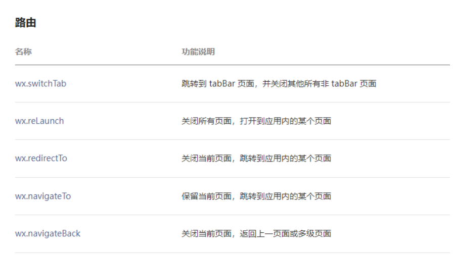

## **页面跳转 - navigateTo**

**wx.navigateTo(Object object)**

保留当前页面，跳转到应用内的某个页面；

但是不能跳到 tabbar 页面；

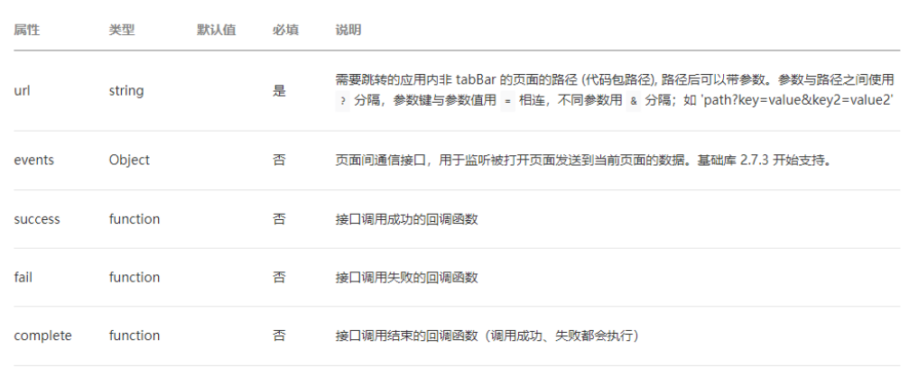

## **页面返回 - navigateBack**

**wx.navigateBack(Object object)**

关闭当前页面，返回上一页面或多级页面。

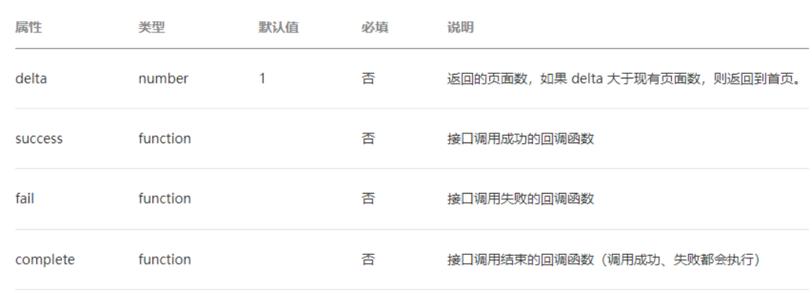

index.wxml

```html
<button bindtap="onNavTap">跳转</button>
```

index.js

```javascript
Page({
  data: {
    name: "kobe",
    age: 30,
  },
  onNavTap() {
    const name = this.data.name;
    const age = this.data.age;

    // 页面导航操作
    wx.navigateTo({
      // 跳转的过程, 传递一些参数过去
      url: `/pages2/detail/detail?name=${name}&age=${age}`,
    });
  },
});
```

pages2/detail/detail.js

```javascript
Page({
  data: {
    name: "",
    age: 0,
  },

  onLoad(options) {
    console.log(options);
    const name = options.name;
    const age = options.age;
    this.setData({ name, age });
  },
  onBackTap() {
    // 1.返回导航
    wx.navigateBack({
      delta: 1,
    });
  },
});
```

pages2/detail/detail.wxml

这个返回一般是页面内的某个地方点击可以返回，而不是左上角的返回按钮

```html
<view>name: {{name}}, age: {{age}}</view>
<button size="mini" type="primary" bindtap="onBackTap">返回</button>
```

## **页面跳转 - 数据传递（一）**

**如何在界面跳转过程中我们需要相互传递一些数据，应该如何完成呢？**

首页 -> 详情页：使用 URL 中的 query 字段

详情页 -> 首页：在详情页内部拿到首页的页面对象，直接修改数据

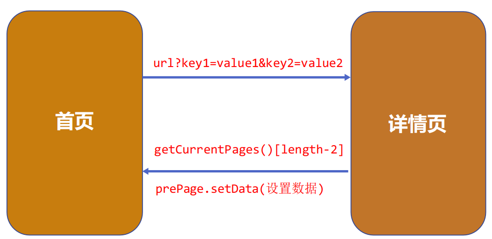

pages2/detail/detail.js

```javascript
Page({
  onBackTap() {
    // 2.方式一: 给上一级的页面传递数据
    // 2.1. 获取到上一个页面的实例
    const pages = getCurrentPages();
    const prePage = pages[pages.length - 2];

    // // 2.2.通过setData给上一个页面设置数据
    prePage.setData({ message: "呵呵呵" });
  },
});
```

上面是通过按钮返回，给上一个页面传递数据，pages2/detail/detail.js 上一个页面是 pages/11_learn_nav/index.js

pages/11_learn_nav/index.js

```javascript
Page({
  data: {
    message: "",
  },
});
```

当然，我们可以在 onUnload 生命周期给上一个页面传递数据

```javascript
Page({
  onUnload() {
    // 2.方式一: 给上一级的页面传递数据
    // 2.1. 获取到上一个页面的实例
    const pages = getCurrentPages();
    const prePage = pages[pages.length - 2];

    // // 2.2.通过setData给上一个页面设置数据
    prePage.setData({ message: "呵呵呵" });
  },
});
```

## **页面跳转 - 数据传递（二）**

**早期数据的传递方式只能通过上述的方式来进行，在小程序基础库 2.7.3 开始支持 events 参数，也可以用于数据的传递。**

pages2/detail/detail.js

```javascript
Page({
  onBackTap() {
    // 3.方式二: 回调events的函数
    // 3.1. 拿到eventChannel
    const eventChannel = this.getOpenerEventChannel();

    // 3.2. 通过eventChannel回调函数
    eventChannel.emit("backEvent", { name: "back", age: 111 });
    eventChannel.emit("coderwhy", { name: "why", age: 10 });
  },
});
```

pages/11_learn_nav/index.js

```javascript
Page({
  onNavTap() {
    const name = this.data.name;
    const age = this.data.age;

    // 页面导航操作
    wx.navigateTo({
      // 跳转的过程, 传递一些参数过去
      url: `/pages2/detail/detail?name=${name}&age=${age}`,
      events: {
        backEvent(data) {
          console.log("back:", data);
        },
        coderwhy(data) {
          console.log("why:", data);
        },
      },
    });
  },
});
```

## **界面跳转的方式**

**navigator 组件主要就是用于界面的跳转的，也可以跳转到其他小程序中：**

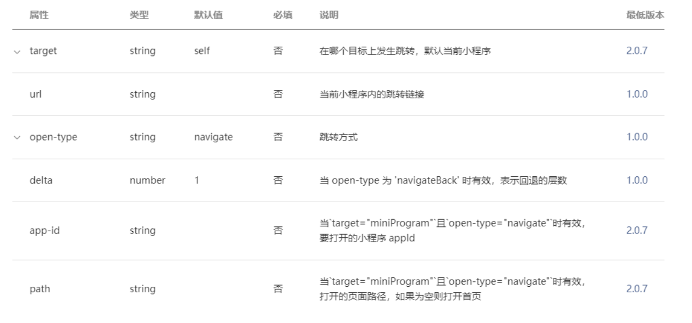

pages2/detail/detail.wxml

```html
<navigator open-type="navigateBack">返回</navigator>
```

## **小程序登录解析**

**为什么需要用户登录？**

增加用户的粘性和产品的停留时间；

**如何识别同一个小程序用户身份？**

认识小程序登录流程

openid 和 unionid

获取 code

换取 authToken

**用户身份多平台共享**

账号绑定

手机号绑定

## **小程序用户登录的流程**

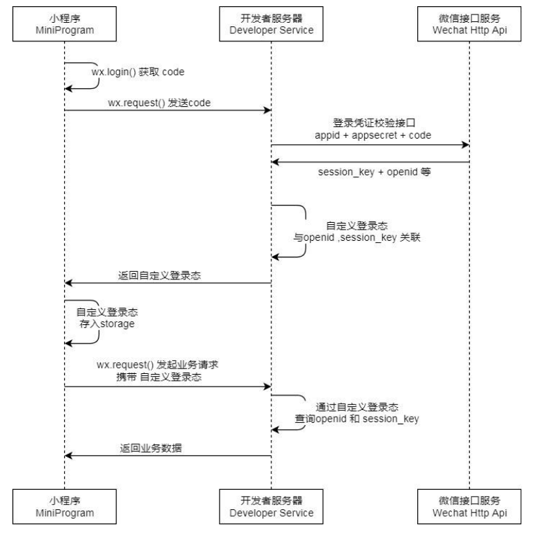

pages/12_learn_login/index.js

```javascript
import { getCode } from "../../service/login";
import { hyLoginReqInstance } from "../../service/index";

// pages/12_learn_login/index.js
Page({
  // onLoad登录的流程
  async onLoad() {
    // 1.获取token, 判断token是否有值
    const token = wx.getStorageSync("token") || "";

    // 2.判断token是否过期
    const res = await hyLoginReqInstance.post({
      url: "/auth",
      header: {
        token: token,
      },
    });
    // console.log(res);

    // 2.如果token有值
    if (token && res.message === "已登录") {
      console.log("请求其他的数据");
    } else {
      this.handleLogin();
    }
  },

  async handleLogin() {
    // 1.获取code
    const code = await getCode();

    // 2.使用code换取token
    const res = await hyLoginReqInstance.post({
      url: "/login",
      data: { code },
    });

    // 3.保存token
    wx.setStorageSync("token", res.token);
  },

  // handleLogin() {
  //   // 1.获取code
  //   wx.login({
  //     success: (res) => {
  //       const code = res.code

  //       // 2.将这个code发送自己的服务器(后端)
  //       wx.request({
  //         url: "http://123.207.32.32:3000/login",
  //         data: {
  //           code
  //         },
  //         method: "post",
  //         success: (res) => {
  //           const token = res.data.token
  //           wx.setStorageSync('token', token)
  //         }
  //       })
  //     }
  //   })
  // }
});
```

service/index.js

```javascript
// 封装成函数
export function hyRequest(options) {
  return new Promise((resolve, reject) => {
    wx.request({
      ...options,
      success: (res) => {
        resolve(res.data);
      },
      fail: reject,
    });
  });
}

// 封装成类 -> 实例
class HYRequest {
  constructor(baseURL) {
    this.baseURL = baseURL;
  }
  request(options) {
    const { url } = options;
    return new Promise((resolve, reject) => {
      wx.request({
        ...options,
        url: this.baseURL + url,
        success: (res) => {
          resolve(res.data);
        },
        fail: (err) => {
          console.log("err:", err);
        },
      });
    });
  }
  get(options) {
    return this.request({ ...options, method: "get" });
  }
  post(options) {
    return this.request({ ...options, method: "post" });
  }
}

export const hyReqInstance = new HYRequest("http://codercba.com:1888/api");
export const hyLoginReqInstance = new HYRequest("http://123.207.32.32:3000");
```

service/login.js

```javascript
export function getCode() {
  return new Promise((resolve, reject) => {
    wx.login({
      success: (res) => {
        resolve(res.code);
      },
    });
  });
}
```
