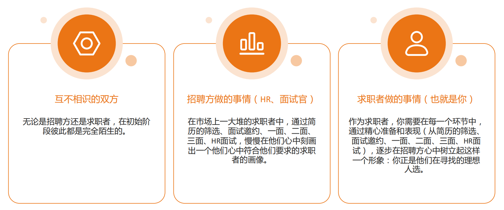
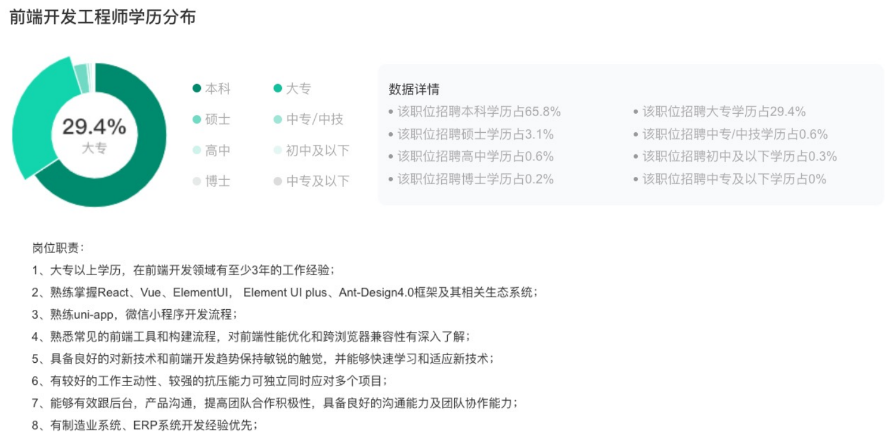
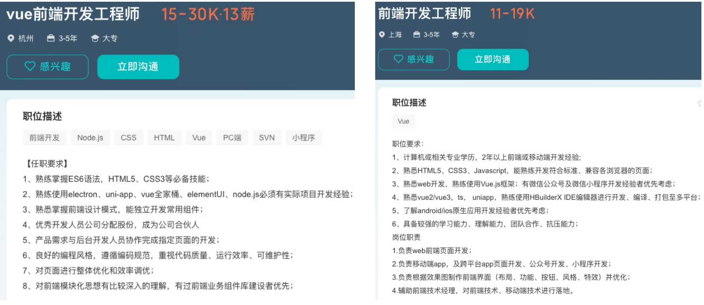
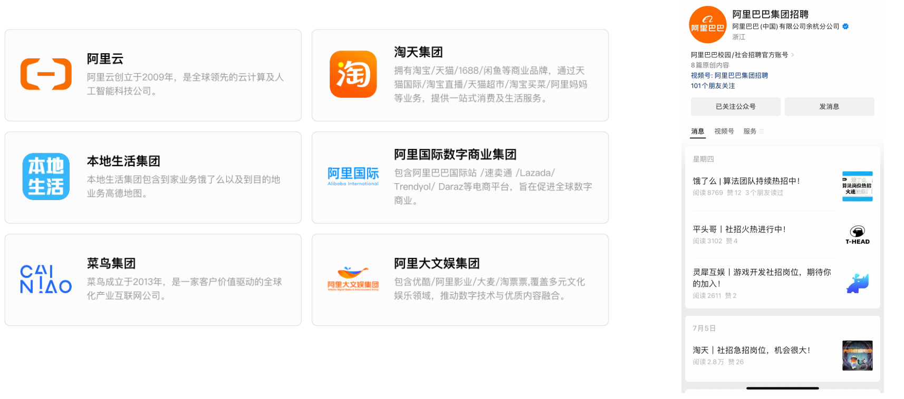
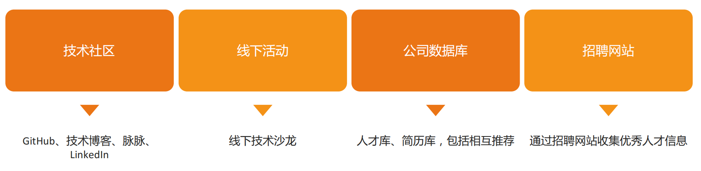
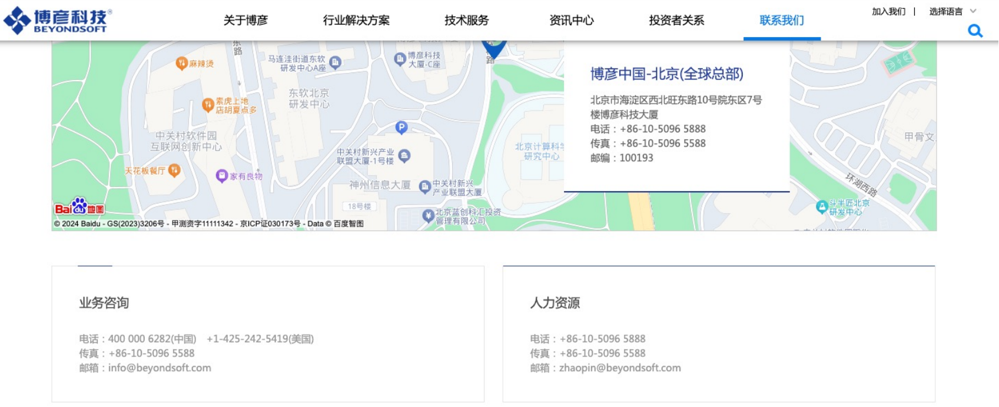
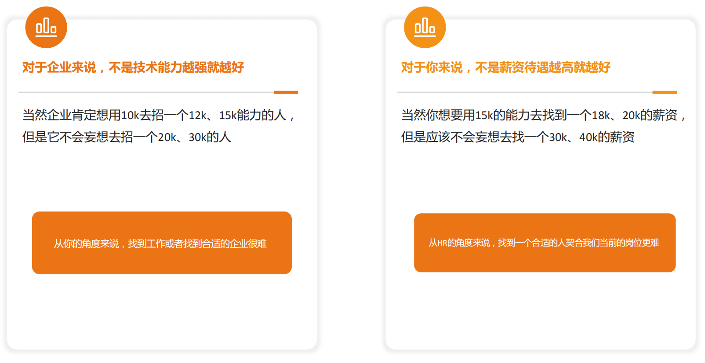

## **找工作的核心**

## **自我评估和定位**

## **比如学历、干扰项**

## **不同类型的简历**

先写一份通用的简历，包含所有的经历过的项目，但是这份简历不用来进行投递，只是用来作为简历库。

我们需要的是定制简历，根据不同的职位和公司进行调整，从简历库里面抽取一部分作为定制简历的内容。

## **在线招聘网站**

BOSS 直聘：https://www.zhipin.com/

拉勾网：https://www.lagou.com/

猎聘网：https://www.liepin.com/

脉脉：https://maimai.cn/ 下载 App

Linkedin(领英)：https://www.linkedin.com/ 适合外企，出国，或者远程

智联招聘：https://www.zhaopin.com/

前程无忧：https://www.51job.com/

看准网：https://www.kanzhun.com/

## **招聘信息 – 克服不熟悉技能**

岗位一： https://www.zhipin.com/job_detail/96cfc715729b40721n1739S9E1BT.html

岗位二：https://www.zhipin.com/job_detail/953057d6fdcbebde1X152N-8E1dY.html

比如 electron 自己不会可以花个 2 天的时间去掌握，只要在 7 天以内可以掌握的都可以花时间去学习。

比如了解 andriod/ios 原生应用开发经验者优先，这种就没有必要花时间去掌握，性价比不高，现在移动端的岗位越来越少。

## **公司官网（公众号）**

比如阿里巴巴：https://talent.alibaba.com/?lang=zh

## **内推岗位**

## **内推的优势**

## **专业猎头**

**适用于中高级职位和专业性较强的职位**

**猎头如何找到中高端人才**

## **猎头的优势**

## **主动出击**

**直接联系目标公司的相关部门，表达自己的兴趣并投递简历。**

https://www.beyondsoft.com/index.html

## **招聘的本质 – 彼此契合 彼此匹配**

