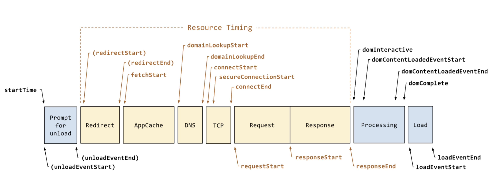
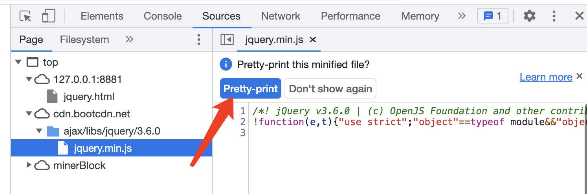

## 技术选型

第一，选择社区已经成熟的，用户已经足够多的 —— 经受了大量用户的验证，出了问题也好找人讨论

- Vue React TS 都具备这个条件，而 Angular 至少在国内没有
- Vue3 Svelte 等新发布的，等等再用

第二，选择你公司已经有技术沉淀的，甚至已经有了很多第三方的可用组件，节省开发成本

第三，要考虑团队成员的学习成本，不要只考虑自己 —— 什么，你想带领大家一起学习？省省吧，用不着你去拯救别人

第四，考虑它的价值，能否抵消它的成本。例如

- 你们做的是一个大型系统，用 TS 确实能减少很多 bug ，那就用 —— 你要考虑 TS 的学习成本，以及维护成本（规避各种 `any`）
- 你们做的是一个小型系统，用 TS 提升也不太大，那就别用

总之，不要为了技术而技术，也不要只考虑自己而是全局考虑。要达到这个境界，你就需要去学习各种框架和技术，而不是只会某一个框架。

## 项目负责人的职责

目标：保证项目按时、按质量的交付上线，以及上线之后的安全稳定运行。

### 把控需求

新项目开始、或者新功能模块开始时要参与需求评审，认真审阅需求的详细内容，给出评审意见，提出问题。自己已经同意的需求要能保证按时、按质量的完成。

评审需求需要你能深入理解项目的业务，不仅仅是自己负责的功能，还有上下游全局的串联。所以，一入职的新人无论技术能力多好，都无法立刻作为项目技术负责人，他还需要一段时间的业务积累和熟练。PS：除非他在其他公司已经是这个方面的业务专家。

需求评审之后，还可能有 UI 设计图的评审，也要参与，提出自己的意见和问题。保证评审通过的 UI 设计图都能保质保量的开发出来。

需求和 UI 设计图评审完之后，还要给出开发的排期。此时要全面考虑，不仅仅要考虑开发时间，还有内部测试、单元测试的时间，以及考虑一些延期的风险，多加几天的缓冲期。

最后，在项目进行过程中，老板或者 PM 有可能中途插入新需求。此时要积极沟通，重新评估，还要争取延长项目开发周期。需求增加了，肯定周期也要延长一些。

### 技术方案设计

> 需求指导设计，设计指导开发。

需求和 UI 设计图确定之后，要先进行技术方案设计，写设计文档，评审，通过之后再开发。技术方案设计应该包含核心数据结构的设计，核心流程的设计，核心功能模块的组织和实现。评审时看看这些有没有不合理、隐患、或者和别人开发重复了。

技术方案设计还要包括和其他对接方的，如和服务端、客户端的接口格式。也要叫他们一起参与评审，待他们同意之后再开发。

### 开发

作为技术负责人，不应该把自己的主要精力放在代码开发上，但也不能完全不写代码。
应该去写一些通用能力，核心功能，底层逻辑的代码。其他比较简单的业务代码，可以交给项目成员来完成。

### 监督代码质量

技术负责人，可能会带领好多人一起编写代码，但他要把控整个项目的代码质量。例如：

- 制定代码规范
- 定期组织代码审核
- CI 时使用自动化单元测试

### 跟踪进度

每天都组织 10 分钟站会，收集当前的进度、风险和问题。如有延期风险，要及时汇报。

不仅仅要关心前端开发的进度，还要关心上下游。例如上游的 UI 设计图延期，将会导致前端开发时间不够，进而导致测试时间不够，甚至整个项目延期。

### 稳定安全的运行

上线之后，要能实时把控项目运行状态，是否稳定、安全的运行。万一遇到问题，要第一时间报警。

所以，项目中要增加各种统计和监控功能，例如流量统计、性能统计、错误监控，还有及时报警的机制。

### 总结

- 把控需求
- 技术方案设计
- 开发
- 监督代码质量
- 跟踪进度
- 稳定安全的运行

## B 端 - C 端

- B 端，即 toB - to Business 面向商业、生产者
- C 端，即 toC - to Customer 面向消费者、终端用户

### **B 端**

B 端一般是对内的管理系统。
大厂会自研很多内部管理平台、运营平台，供自己人使用。还有一些公司是专门为企业提供内部管理系统的，如 OA CMS ERP 财务软件等。

管理系统一般用于专业的业务领域，所以功能都非常复杂。这就需要复杂的组件设计，拆分和抽离，要深入熟悉业务才能更好的制作技术方案。
所以，B 端系统一般都是业务驱动的，业务运营人员的话语权更重。

但它的流量不会太大，一般后台一个服务器、一个数据库即可满足。而且用户环境比较单一，网络情况好，不用考虑极致的性能优化、浏览器兼容性等。

### **C 端**

C 端一般是对外的落地页，就是我们日常消费的各种新闻、小视频页面。<br>
这代表着这个公司对外的核心业务，也是公司最核心的产品，一般都会自研、不会购买或者外包。

C 端系统一般都是民用级别的，不会有什么复杂专业的功能。<br>
但它的流量一般很大，后台可能需要很多服务器集群，需要各种 CDN 和缓存。而且，它的用户群体很不固定，手机、浏览器、网络等都不确定，需要全面的性能优化和统计、监控。<br>
所以，C 端一般是技术驱动的，技术人员话语权很重。

大型互联网公司内部的企业文化，技术人员话语权大，也是因为他们 C 端产品比较多，而且 C 端是核心产品。

### SaaS

SaaS - Software as a service 软件即服务，它集合了 B 端和 C 端。

例如常见的腾讯文档、在线画图软件、在线 PS 等。他们既有 B 端的复杂功能，又有 C 端面向终端用户的特点。SaaS 的研发成本是非常高的。

## 排查性能问题

**性能分析工具 - Chrome devtools**

Performance 可以检测到上述的性能指标，并且有网页快照截图。

**性能分析工具 - Lighthouse**

[Lighthouse](https://www.npmjs.com/package/lighthouse) 是非常优秀的第三方性能评测工具，支持移动端和 PC 端。
它支持 Chrome 插件和 npm 安装，国内情况推荐使用后者。

```sh
# 安装
npm i lighthouse -g

# 检测一个网页，检测完毕之后会打开一个报告网页
lighthouse https://imooc.com/ --view --preset=desktop # 或者 mobile
```

测试完成之后，lighthouse 给出测试报告

**识别问题**

网页慢，到底是加载慢，还是渲染慢？—— 分清楚很重要，因为前后端不同负责。

加载慢

- 优化服务端接口
- 使用 CDN
- 压缩文件
- 拆包，异步加载

渲染慢（可参考“首屏优化”）

- 根据业务功能，继续打点监控
- 如果是 SPA 异步加载资源，需要特别关注网络请求的时间

## 处理沟通冲突

注：文本小节

### 题目

项目中有没有发生过沟通的冲突（和其他角色）？如何解决的

### 分析

有项目有合作，有合作就有沟通，有沟通就有冲突，这很正常。哪怕你自己单独做一个项目，你也需要和你的老板、客户沟通。

面试官通过考察这个问题，就可以从侧面得知你是否有实际工作经验。
因为即便你是一个项目的“小兵”，不是负责人，你也会参与到一些沟通和冲突中，也能说出一些所见所闻。

当然，如果你之前是项目负责人，有过很多沟通和解决冲突的经验，并在面试中充分表现出来。
相信面试官会惊喜万分（前提是技术过关），因为“技术 + 项目管理”这种复合型人才非常难得。

### 常见的冲突

- 需求变更：PM 或者老板提出了新的需求
- 时间延期：上游或者自己延期了
- 技术方案冲突：如感觉服务端给的接口格式不合理

### 正视冲突

从个人心理上，不要看到冲突就心烦，要拥抱变化，正视冲突。冲突是项目的一部分，就像 bug 一样，心烦没用。

例如，PM 过来说要修改需求，你应该回答：**“可以呀，你组织个会议讨论一下吧，拉上各位领导，因为有可能会影响工期。”**

再例如，自己开发过程中发现可能会有延期，要及早的汇报给领导：**“我的工期有风险，因为 xxx 原因，不过我会尽量保证按期完成。”**\<br>
千万不要不好意思，等延期了被领导发现了，这就不好了。

### 解决冲突

合作引起的冲突，最终还是要通过沟通来解决。

一些不影响需求和工期的冲突，如技术方案问题，尽量私下沟通解决。实在解决不了再来领导开会。\<br>
需求变更和时间延期一定要开会解决，会议要有各个角色决定权的领导去参与。

注意，无论是私下沟通还是开会，涉及到自己工作内容变动的，一定要有结论。
最常见的就是发邮件，一定要抄送给各位相关的负责人。这些事情要公开，有记录，不要自己偷偷的就改了。

### 如何规避冲突

- 预估工期留有余地
- 定期汇报个人工作进度，提前识别风险

### 答案

- 经常遇到哪些冲突
- 解决冲突
- 自己如何规避冲突

PS：最好再能准备一个案例或者故事，效果会非常好，因为人都喜欢听故事。

## 如何做 code review ？

- 代码规范（eslint 能检查一部分，但不是全部，如：变量命名）
- 重复逻辑抽离、复用
- 单个函数过长，需要拆分
- 算法是否可优化?
- 是否有安全漏洞?
- 扩展性如何？
- 是否和现有的功能重复了？
- 组件设计是否合理

## 你的不足

如果你被问到这个问题，那恭喜你面试快要通过了。一般在 3-4 面，或者 hr 面试时会问道这个问题。
无论是 hr 还是技术人员问，你都要从技术角度来回答这个问题，说自己技术上的不足。不要扯其他方面的，容易掉到坑里。

你不用担心 hr 听不懂技术，听不懂更好。

### 不足，不要乱说

要限定一个范围

- 技术方面的
- 非核心技术栈的，即有不足也无大碍
- 些容易弥补的，后面才能“翻身”

错误的示范

- 我爱睡懒觉、总是迟到 —— 非技术方面
- 我自学的 Vue ，但还没有实践过 —— 核心技术栈
- 我不懂 React —— 技术栈太大，不容易弥补

正确的示范

- 脚手架，我还在学习中，还不熟练
- nodejs 还需要继续深入学习

### 最后，要把话题反转回来

不能只说不足，就截止了。一定要通过不足，来突出自己的解决方案，以及未来的预期。<br>
这样给人的印象是：正式了自己的不足 + 有学习的态度 —— 非常好！

## 要让你设计一个前端统计 SDK ，你会如何设计？

### 分析

前端统计的范围

- 访问量 PV
- 自定义事件（如统计一个按钮被点击了多少次）
- 性能
- 错误

统计数据的流程 （只做前端 SDK ，但是要了解全局）

- 前端发送统计数据给服务端
- 服务端接受，并处理统计数据
- 查看统计结果

### 代码结构

SDK 要用于多个不同的产品，所以初始化要传入 `productId`

```js
class MyStatistic {
    private productId: number

    constructor(productId: number = 0) {
        if (productId <= 0) {
            throw new Error('productId is invalid')
        }
        this.productId = productId // 产品 id （SDK 会被用于多个产品）

        this.initPerformance() // 性能统计
        this.initError() // 监听错误
    }
    private send(url: string, paramObj: object = {}) {
        // TODO 发送统计数据
    }
    private initPerformance() {
        // TODO 性能统计
    }
    private initError() {
        // TODO 监听全局错误（有些错误需要主动传递过来，如 Vue React try-catch 的）
    }
    pv() {
        // TODO 访问量 PV 统计
    }
    event(key: string, value: string) {
        // TODO 自定义事件
    }
    error(key: string, info: object = {}) {
        // TODO 错误统计
    }
}
```

用户使用

```js
const myStatistic = new MyStatistic("abc");
```

### 发送数据

发送统计数据，用 `` —— 浏览器兼容性好，没有跨域限制

```js
private send(url: string, paramObj: object = {}) {
    // 追加 productId
    paramObj.productId = this.productId

    // params 参数拼接为字符串
    const paramArr = []
    for (let key in paramObj) {
        const value = paramObj[key]
        paramArr.push(`${key}=${value}`)
    }

    const img = document.createElement('img')
    img.src = `${url}?${paramArr.join('&')}`
}
```

如果再精细一点的优化，`send` 中可以使用 `requestIdleCallback` （兼容使用 `setTimeout`）

### 自定义事件统计

```js
event(key: string, value: string) {
    const url = 'xxx' // 接受自定义事件的 API
    this.send(url, { key, value }) // 发送
}
```

用户使用

```js
// 如需要统计“同意” “不同意” “取消” 三个按钮的点击量，即可使用自定义事件统计
$agreeBtn.click(() => {
  // ...业务逻辑...
  myStatistic.event("some-button", "agree"); // 其他不同的按钮，传递不同的 value (如 'refuse' 'cancel')
});
```

### 访问量 PV

PV 可以通过自定义事件的方式。但是为了避免用户重复发送，需要加一个判断

```js
// 定义一个全局的 Set ，记录已经发送 pv 的 url
const PV_URL_SET = new Set();
```

```js
pv() {
    const href = location.href
    if (PV_URL_SET.has(href)) return

    this.event('pv', '') // 发送 pv

    PV_URL_SET.add(href)
}
```

用户使用

```js
myStatistic.pv();
```

【注意】PV 统计需要让用户自己发送吗，能不能在 DOMContentLoaded 时自动发送？—— 最好让用户发送，因为 SPA 中切换路由也可能发送 PV

### 性能统计

通过 `console.table( performance.timing )` 可以看到网页的各个性能



```js
private initPerformance() {
    const url = 'yyy' // 接受性能统计的 API
    this.send(url, performance.timing) // 全部传给服务端，让服务端去计算结果 —— 统计尽量要最原始数据，不要加工处理
}
```

PS：想要得到全面的性能数据，要在网页加载完成之后（ DOMContentLoaded 或 onload ）去初始化 `myStatistic`

### 错误统计

监听全局操作

```js
private initError() {
    // 全局操作
    window.addEventListener('error', event => {
        const { error, lineno, colno } = event
        this.error(error, { lineno, colno })
    })
    // Promise 未 catch 的报错 （ 参考 unhandledrejection.html ）
    window.addEventListener("unhandledrejection", event => {
        this.error(event.reason)
    })
}
```

被开发这主动收集的错误，需要调用 API 来统计

```js
error(error: Error, info: object = {}) {
    // error 结构 { message, stack }
    // info 是附加信息

    const url = 'zzz' // 接受错误统计的 API
    this.send(url, Object.assign(error, info))
}
```

用户使用

```js
// try catch
try {
    100()
} catch (e) {
    myStatistic.error(e)
}

// Vue 错误监听
app.config.errorHandler = (error, instance, info) => {
    myStatistic.error(error, { info })
}

// React 错误监听
componentDidCatch(error, errorInfo) {
    myStatistic.error(error, { info: errorInfo })
}
```

### 总结

- 自定义事件（包括 PV）
- 性能统计
- 报错统计

PS：以上是一个统计 SDK 的基本估计，可以应对面试，实际工作中还可能需要进一步完善很多细节。

### 连环问：sourcemap 有什么作用？该如何配置

遇到 JS 报错的问题，就离不开 sourcemap

#### 背景

- JS 上线之前要合并、混淆和压缩。例如 jquery 的线上代码 https://www.bootcdn.cn/jquery/
- 压缩之后，一旦线上有报错，通过行、列根本找不到源代码的位置，不好定位错误
- sourcemap 就是用于解决这个问题。可以看 jquery 的 sourcemap 文件 https://www.jsdelivr.com/package/npm/jquery?path=dist

#### 示例

一个网页中引用了 CDN jquery.min.js ，通过 chrome Sources 即可看到之前源码的样子。
寻找 sourcemap 有两种方式：1. 同目录下的同名文件；2. js 文件最后一样指定（如 wangEditor js）



#### 配置

sourcemap 是在打包、压缩 js 时生成，通过 webpack 的打包工具即可配置。（可以在 `js-code` 代码环境中测试）
webpack 通过 `devtool` 来配置 sourcemap ，有多种选择 https://webpack.docschina.org/configuration/devtool/#devtool

- 不用 `devtool` - 正常打包，不会生成 sourcemap 文件
- `eval` - 所有代码都放在 `eval(...)` 中执行，不生成 sourcemap 文件
- `source-map` - 生成单独的 sourcemap 文件，并在 js 文件最后指定
- `eval-source-map` - 代码都放在 `eval(...)` 中执行，sourcemap 内嵌到 js 代码中，不生成独立的文件
- `inline-source-map` - sourcemap 以 base64 格式插入到 js 末尾，不生成单独的文件
- `cheap-source-map` - sourcemap 只包含行信息，没有列信息（文件体积更小，生成更快）
- `eval-cheap-source-map` - 同上，但是所有代码都放在 `eval(...)` 中执行

推荐

- 开发和测试 `eval` `eval-source-map` `eval-cheap-source-map` —— 追求效率
- 生产环境 `source-map` 或者不产出 sourcemap —— 看个人需求

#### 注意

公司实际项目的 sourcemap 可用于内部反查 bug ，但不要泄漏。否则等于源码泄漏了。
开源项目的 sourcemap 文件也是开源的。

只需要了解 sourcemap 的作用和配置即可，原理不用掌握。
