## 前端开发流程概述-webpack 简介

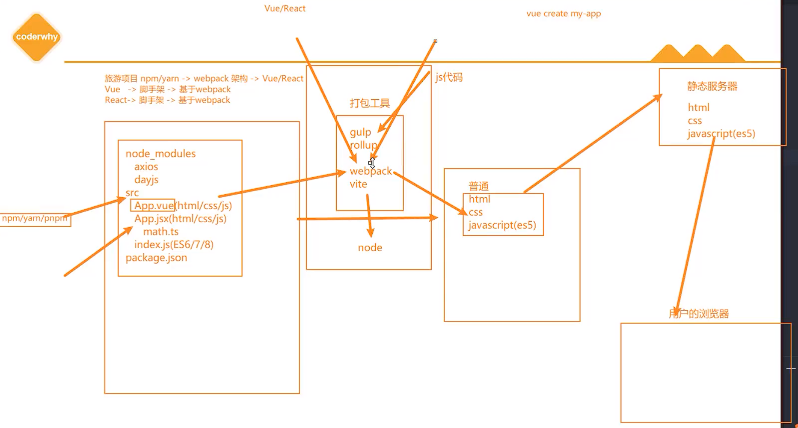

## **内置模块 path**

**path 模块用于对路径和文件进行处理，提供了很多好用的方法。**

**我们知道在 Mac OS、Linux 和 window 上的路径时不一样的**

window 上会使用 \或者 \\ 来作为文件路径的分隔符，当然目前也支持 /；

在 Mac OS、Linux 的 Unix 操作系统上使用 / 来作为文件路径的分隔符；

**那么如果我们在 window 上使用 \ 来作为分隔符开发了一个应用程序，要部署到 Linux 上面应该怎么办呢？**

显示路径会出现一些问题；

所以为了屏蔽他们之间的差异，在开发中对于路径的操作我们可以使用 path 模块；

**可移植操作系统接口（英语：Portable Operating System Interface，缩写为 POSIX）**

Linux 和 Mac OS 都实现了 POSIX 接口；

Window 部分电脑实现了 POSIX 接口；

## **path 常见的 API**

**从路径中获取信息**

dirname：获取文件的父文件夹；

basename：获取文件名；

extname：获取文件扩展名；

```javascript
const path = require("path");

const filepath = "C://abc/cba/nba.txt";

// 1.可以从一个路径中获取一些信息
console.log(path.extname(filepath)); // .txt
console.log(path.basename(filepath)); // nba.txt
console.log(path.dirname(filepath)); // C://abc/cba
```

**路径的拼接：path.join**

如果我们希望将多个路径进行拼接，但是不同的操作系统可能使用的是不同的分隔符；

这个时候我们可以使用 path.join 函数；

```javascript
const path1 = "/abc/cba";
const path2 = "../why/kobe/james.txt";
// console.log(path1 + path2) 这种是字符串的拼接，不是路径拼接

// 2.将多个路径拼接在一起: path.join
console.log(path.join(path1, path2)); // \abc\why\kobe\james.txt
```

**拼接绝对路径：path.resolve**

path.resolve() 方法会把一个路径或路径片段的序列解析为一个绝对路径；

给定的路径的序列是从右往左被处理的，后面每个 path 被依次解析，直到构造完成一个绝对路径；

```javascript
const path = require("path");

// 将多个路径拼接一起, 最终一定返回一个绝对路径: path.resolve
console.log(path.resolve("./abc/cba", "../why/kobe", "/abc.txt"));
```

假如当前运行根目录是在 C 盘，从右往左被处理，/abc.txt 已经是绝对路，那么打印出来的就是 C:\abc.txt

如果在处理完所有给定 path 的段之后，还没有生成绝对路径，则使用当前工作目录；

```javascript
console.log(path.resolve("./abc/cba", "../why/kobe", "./abc.txt"));
```

上面这个处理完所有的 path 还是没有绝对路径，那么会使用当前工作目录，比如我自己的打印结果是下面这样：

C:\Users\Lin\Desktop\Learn_Node_Webpack_Git\04_Path 模块的使用\abc\why\kobe\abc.txt

生成的路径被规范化并删除尾部斜杠，零长度 path 段被忽略；

```javascript
console.log(path.resolve("./abc/cba", "", "../why/kobe", "./abc.txt/"));
```

./abc.txt/中的 txt 后面的/会被删除，""这个表示零长度 path，会被忽略

如果没有 path 传递段，path.resolve()将返回当前工作目录的绝对路径；

```javascript
console.log(path.resolve()); // C:\Users\Lin\Desktop\Learn_Node_Webpack_Git\04_Path模块的使用
```

## **认识 webpack**

**事实上随着前端的快速发展，目前前端的开发已经变的越来越复杂了：**

比如开发过程中我们需要通过模块化的方式来开发；

比如也会使用一些高级的特性来加快我们的开发效率或者安全性，比如通过 ES6+、TypeScript 开发脚本逻辑，通过 sass、

less 等方式来编写 css 样式代码；

比如开发过程中，我们还希望实时的监听文件的变化来并且反映到浏览器上，提高开发的效率；

比如开发完成后我们还需要将代码进行压缩、合并以及其他相关的优化；

等等….

**但是对于很多的前端开发者来说，并不需要思考这些问题，日常的开发中根本就没有面临这些问题：**

这是因为目前前端开发我们通常都会直接使用三大框架来开发：Vue、React、Angular；

但是事实上，这三大框架的创建过程我们都是借助于脚手架（CLI）的；

事实上 Vue-CLI、create-react-app、Angular-CLI 都是基于 webpack 来帮助我们支持模块化、less、TypeScript、打包优化

等的；

## **脚手架依赖 webpack**

事实上我们上面提到的所有脚手架都是依赖于 webpack 的：

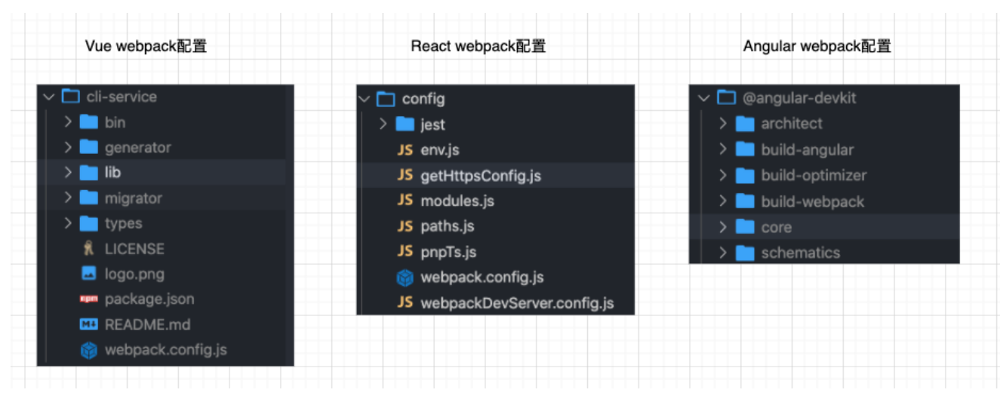

## **Webpack 到底是什么呢？**

**我们先来看一下官方的解释：**

**webpack** is a _static module bundler_ for modern JavaScript applications.

**webpack 是一个静态的模块化打包工具，为现代的 JavaScript 应用程序；**

我们来对上面的解释进行拆解：

打包 bundler：webpack 可以将帮助我们进行打包，所以它是一个打包工具

静态的 static：这样表述的原因是我们最终可以将代码打包成最终的静态资源（部署到静态服务器）；

模块化 module：webpack 默认支持各种模块化开发，ES Module、CommonJS、AMD 等；

现代的 modern：我们前端说过，正是因为现代前端开发面临各种各样的问题，才催生了 webpack 的出现和发展；

## **Webpack 官方的图片**

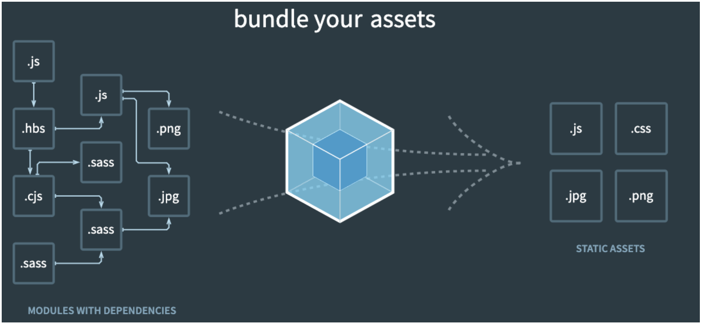

## **Vue 项目加载的文件有哪些呢？**

**JavaScript 的打包：**

将 ES6 转换成 ES5 的语法；

TypeScript 的处理，将其转换成 JavaScript；

**Css 的处理：**

CSS 文件模块的加载、提取；

Less、Sass 等预处理器的处理；

**资源文件 img、font：**

图片 img 文件的加载；

字体 font 文件的加载；

**HTML 资源的处理：**

打包 HTML 资源文件；

**处理 vue 项目的 SFC 文件.vue 文件；**

## **Webpack 的使用前提**

webpack 的官方文档是https://webpack.js.org/

webpack 的中文官方文档是https://webpack.docschina.org/

DOCUMENTATION：文档详情，也是我们最关注的

**Webpack 的运行是依赖 Node 环境的，所以我们电脑上必须有 Node 环境**

所以我们需要先安装 Node.js，并且同时会安装 npm；

我当前电脑上的 node 版本是 v16.15.1，npm 版本是 8.11.0（你也可以使用 nvm 或者 n 来管理 Node 版本）；

Node 官方网站：https://nodejs.org/

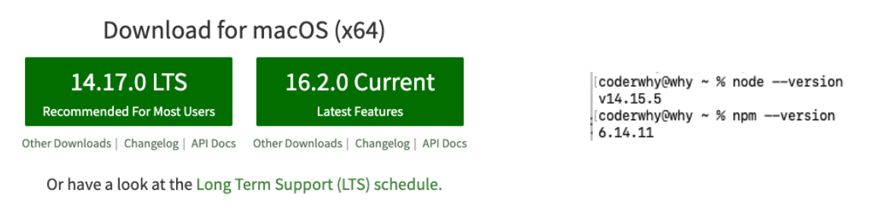

## **Webpack 的安装**

**webpack 的安装目前分为两个：webpack、webpack-cli**

**那么它们是什么关系呢？**

执行 webpack 命令，会执行 node_modules 下的.bin 目录下的 webpack；

webpack 在执行时是依赖 webpack-cli 的，如果没有安装就会报错；

而 webpack-cli 中代码执行时，才是真正利用 webpack 进行编译和打包的过程；

所以在安装 webpack 时，我们需要同时安装 webpack-cli（第三方的脚手架事实上是没有使用 webpack-cli 的，而是类似于自

己的 vue-service-cli 的东西）

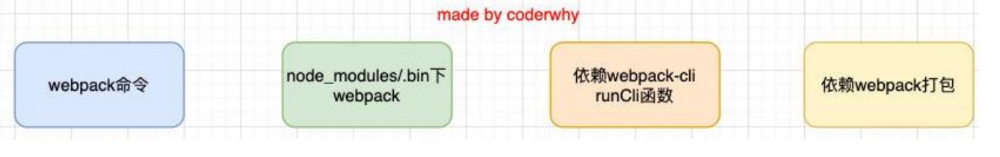

npm install webpack webpack-cli –g # 全局安装

npm install webpack webpack-cli –D # 局部安装

## **Webpack 的默认打包**

我们可以通过 webpack 进行打包，之后运行打包之后的代码

在目录下直接执行 webpack 命令

npx webpack

**生成一个 dist 文件夹，里面存放一个 main.js 的文件，就是我们打包之后的文件：**

这个文件中的代码被压缩和丑化了；

另外我们发现代码中依然存在 ES6 的语法，比如箭头函数、const 等，这是因为默认情况下 webpack 并不清楚我们打包后的文

件是否需要转成 ES5 之前的语法，后续我们需要通过 babel 来进行转换和设置；

**我们发现是可以正常进行打包的，但是有一个问题，webpack 是如何确定我们的入口的呢？**

事实上，当我们运行 webpack 时，webpack 会查找当前目录下的 src/index.js 作为入口；

所以，如果当前项目中没有存在 src/index.js 文件，那么会报错；

**当然，我们也可以通过配置来指定入口和出口**

```javascript
npx webpack --entry ./src/main.js --output-path ./build
```

## **创建局部的 webpack**

前面我们直接执行 webpack 命令使用的是全局的 webpack，如果希望使用局部的可以按照下面的步骤来操作。

第一步：创建 package.json 文件，用于管理项目的信息、库依赖等

npm init

第二步：安装局部的 webpack

npm install webpack webpack-cli -D

第三步：使用局部的 webpack

npx webpack

第四步：在 package.json 中创建 scripts 脚本，执行脚本打包即可

## **Webpack 配置文件**

在通常情况下，webpack 需要打包的项目是非常复杂的，并且我们需要一系列的配置来满足要求，默认配置必然是不可以的。

我们可以在根目录下创建一个 webpack.config.js 文件，来作为 webpack 的配置文件：

## **指定配置文件**

**但是如果我们的配置文件并不是 webpack.config.js 的名字，而是其他的名字呢？**

比如我们将 webpack.config.js 修改成了 wk.config.js；

这个时候我们可以通过 --config 来指定对应的配置文件；

webpack --config wk.config.js

但是每次这样执行命令来对源码进行编译，会非常繁琐，所以我们可以在 package.json 中增加一个新的脚本：

之后我们执行 npm run build 来打包即可。

下面来演示整个过程：

首先，在 01_webpack_basic_test 这个目录下，创建一个 src/index.js，然后引入工具函数

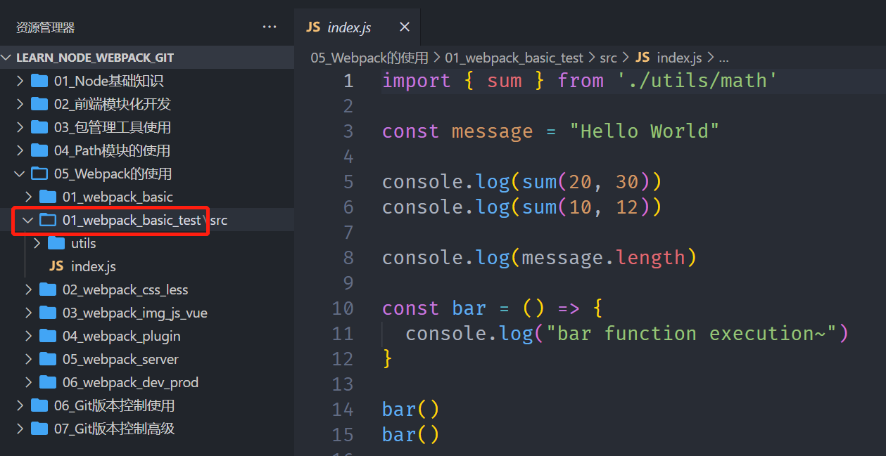

然后，npm init -y => npm install webpack webpack-cli -D => npx webpack，打包完成

执行完上面这些命令之后，就会在当前目录下生成一个 dist 文件夹，下面有个 main.js 文件，是打包之后的文件

在目录下创建一个 index.html，引入打包之后的 main.js，运行在浏览器，可以正常运行

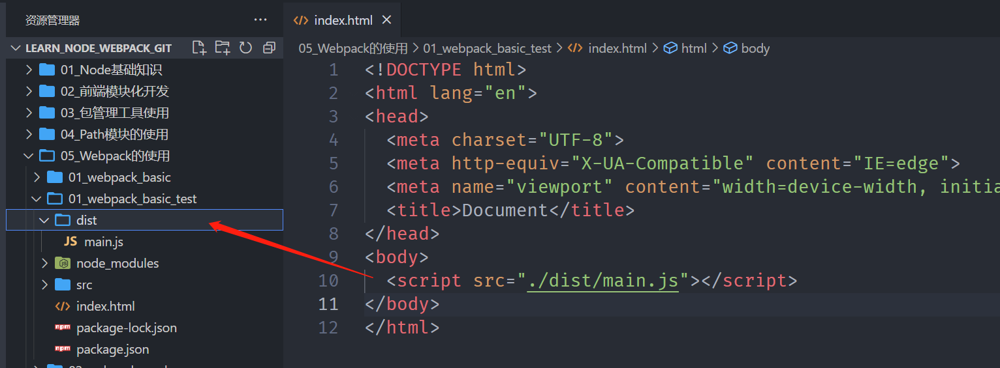

如果 src 下面的文件不叫 index.js，而叫 main.js，直接执行 npx webpack 打包就会报错，因为 webpack 会查找当前目录下的 src/index.js 作为入口

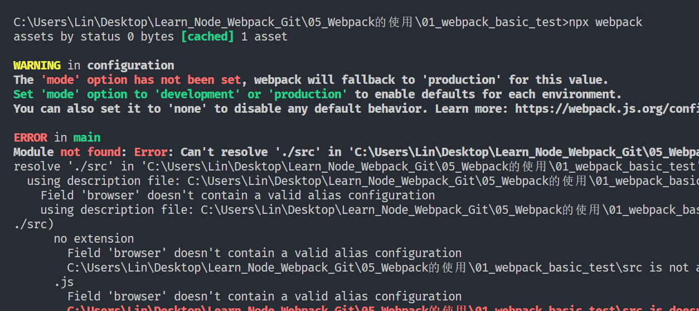

那么就可以指定打包的入口文件

```javascript
npx webpack entry ./src/main.js
```

当然也可以修改打包后的文件夹（原先叫 dist）和文件夹下的文件名（原先叫 main.js）

```javascript
npx webpack --entry ./src/main.js --output-path ./build --output-filename bundle.js
```

可以看到，打包后的文件夹变成了 build，底下的文件变成了 bundle.js

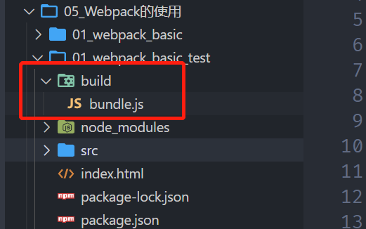

但是上面这个命令很长，每次都得敲这么长的命令很麻烦，我们可以放在配置文件当中

在当前目录下，创建一个 webpack.config.js 文件，放入下面代码，再打包，效果一样

```javascript
const path = require("path");

module.exports = {
  entry: "./src/main.js",
  output: {
    filename: "bundle.js",
    path: path.resolve(__dirname, "./build"),
  },
};
```

当然，我们这个文件的名字如果叫别的名字，比如： wk.config.js，那么就需要--config 来指定对应的配置文件

```javascript
webpack --config wk.config.js
```

上面的命令有点长，可以在 package.json 中增加一个新的脚本

打包的时候只需要执行 npm run bundle 即可打包

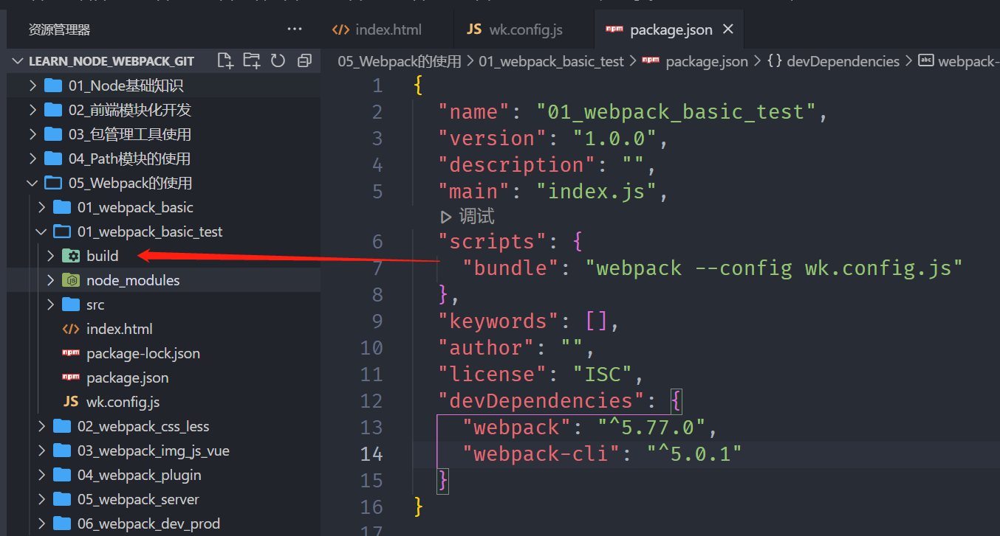

## **Webpack 的依赖图**

**webpack 到底是如何对我们的项目进行打包的呢？**

事实上 webpack 在处理应用程序时，它会根据命令或者配置文件找到入口文件；

从入口开始，会生成一个 依赖关系图，这个依赖关系图会包含应用程序中所需的所有模块（比如.js 文件、css 文件、图片、字

体等）；

然后遍历图结构，打包一个个模块（根据文件的不同使用不同的 loader 来解析）；

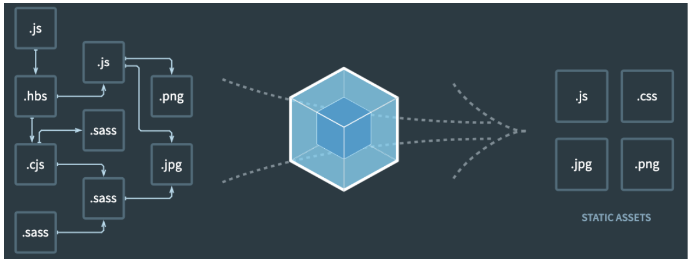

## **编写案例代码**

**我们创建一个 component.js**

通过 JavaScript 创建了一个元素，并且希望给它设置一些样式；

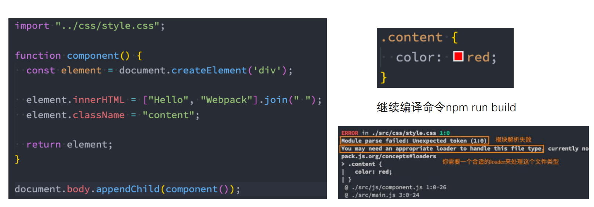

## **css-loader 的使用**

**上面的错误信息告诉我们需要一个 loader 来加载这个 css 文件，但是 loader 是什么呢？**

loader 可以用于对模块的源代码进行转换；

我们可以将 css 文件也看成是一个模块，我们是通过 import 来加载这个模块的；

在加载这个模块时，webpack 其实并不知道如何对其进行加载，我们必须指定对应的 loader 来完成这个功能；

**那么我们需要一个什么样的 loader 呢？**

对于加载 css 文件来说，我们需要一个可以读取 css 文件的 loader；

这个 loader 最常用的是 css-loader；

css-loader 的安装：

npm install css-loader -D

## **css-loader 的使用方案**

**如何使用这个 loader 来加载 css 文件呢？有三种方式：**

内联方式；

CLI 方式（webpack5 中不再使用）；

配置方式；

**内联方式：**内联方式使用较少，因为不方便管理；

在引入的样式前加上使用的 loader，并且使用!分割；

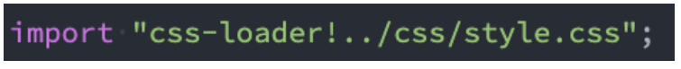

**CLI 方式**

在 webpack5 的文档中已经没有了--module-bind；

实际应用中也比较少使用，因为不方便管理；

## **loader 配置方式**

**配置方式表示的意思是在我们的 webpack.config.js 文件中写明配置信息：**

module.rules 中允许我们配置多个 loader（因为我们也会继续使用其他的 loader，来完成其他文件的加载）；

这种方式可以更好的表示 loader 的配置，也方便后期的维护，同时也让你对各个 Loader 有一个全局的概览；

**module.rules 的配置如下：**

rules 属性对应的值是一个数组：**[Rule]**

数组中存放的是一个个的 Rule，Rule 是一个对象，对象中可以设置多个属性：

test 属性：用于对 resource（资源）进行匹配的，通常会设置成正则表达式；

use 属性：对应的值时一个数组：**[UseEntry]**

UseEntry 是一个对象，可以通过对象的属性来设置一些其他属性

loader：必须有一个 loader 属性，对应的值是一个字符串；

options：可选的属性，值是一个字符串或者对象，值会被传入到 loader 中；

query：目前已经使用 options 来替代；

**传递字符串（如：use: [ 'style-loader' ]）是 loader 属性的简写方式（如：use: [ { loader: 'style-loader'} ]）；**

loader 属性： Rule.use: [ { loader } ] 的简写。

## **Loader 的配置代码**

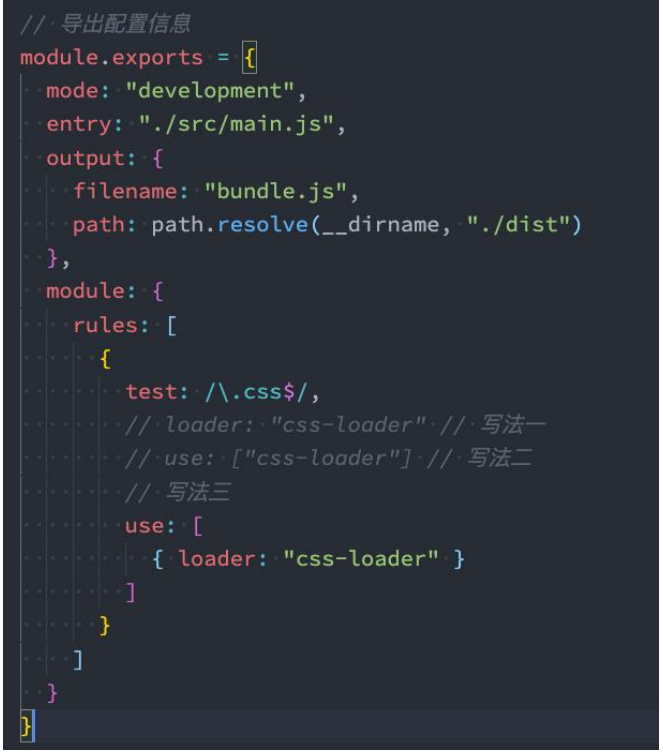

## **认识 style-loader**

我们已经可以通过 css-loader 来加载 css 文件了

但是你会发现这个 css 在我们的代码中并没有生效（页面没有效果）。

这是为什么呢？

因为 css-loader 只是负责将.css 文件进行解析，并不会将解析之后的 css 插入到页面中；

如果我们希望再完成插入 style 的操作，那么我们还需要另外一个 loader，就是 style-loader；

安装 style-loader：

npm install style-loader -D

## **配置 style-loader**

那么我们应该如何使用 style-loader：

在配置文件中，添加 style-loader；

注意：因为 loader 的执行顺序是从右向左（或者说从下到上，或者说从后到前的），所以我们需要将 style-loader 写到 css

loader 的前面；

重新执行编译 npm run build，可以发现打包后的 css 已经生效了：

当前目前我们的 css 是通过页内样式的方式添加进来的；

后续我们也会讲如何将 css 抽取到单独的文件中，并且进行压缩等操作；

```javascript
const path = require("path");

module.exports = {
  entry: "./src/main.js",
  output: {
    filename: "bundle.js",
    path: path.resolve(__dirname, "./build"),
  },
  module: {
    rules: [
      {
        // 告诉webpack匹配什么文件
        test: /\.css$/,
        // use: [ // use中多个loader的使用顺序是从后往前
        //   { loader: "style-loader" },
        //   { loader: "css-loader" }
        // ],
        // 简写一: 如果loader只有一个
        // loader: "css-loader"
        // 简写二: 多个loader不需要其他属性时, 可以直接写loader字符串形式
        use: ["style-loader", "css-loader"],
      },
    ],
  },
};
```

## **如何处理 less 文件？**

在我们开发中，我们可能会使用 less、sass、stylus 的预处理器来编写 css 样式，效率会更高。

那么，如何可以让我们的环境支持这些预处理器呢？

首先我们需要确定，less、sass 等编写的 css 需要通过工具转换成普通的 css；

## **Less 工具处理**

我们可以使用 less 工具来完成它的编译转换：

npm install less -D

执行如下命令：

npx lessc ./src/css/title.less title.css

## **less-loader 处理**

但是在项目中我们会编写大量的 css，它们如何可以自动转换呢？

这个时候我们就可以使用 less-loader，来自动使用 less 工具转换 less 到 css；

npm install less-loader -D

配置 webpack.config.js

```javascript
const path = require("path");

module.exports = {
  entry: "./src/main.js",
  output: {
    filename: "bundle.js",
    path: path.resolve(__dirname, "./build"),
  },
  module: {
    rules: [
      {
        // 告诉webpack匹配什么文件
        test: /\.css$/,
        // use: [ // use中多个loader的使用顺序是从后往前
        //   { loader: "style-loader" },
        //   { loader: "css-loader" }
        // ],
        // 简写一: 如果loader只有一个
        // loader: "css-loader"
        // 简写二: 多个loader不需要其他属性时, 可以直接写loader字符串形式
        use: ["style-loader", "css-loader"],
      },
      {
        test: /\.less$/,
        use: ["style-loader", "css-loader", "less-loader"],
      },
    ],
  },
};
```

## **认识 PostCSS 工具**

什么是 PostCSS 呢？

PostCSS 是一个通过 JavaScript 来转换样式的工具；

这个工具可以帮助我们进行一些 CSS 的转换和适配，比如自动添加浏览器前缀、css 样式的重置；

但是实现这些功能，我们需要借助于 PostCSS 对应的插件；

如何使用 PostCSS 呢？主要就是两个步骤：

第一步：查找 PostCSS 在构建工具中的扩展，比如 webpack 中的 postcss-loader；

第二步：选择可以添加你需要的 PostCSS 相关的插件；

## **postcss-loader**

我们可以借助于构建工具：

在 webpack 中使用 postcss 就是使用 postcss-loader 来处理的；

我们来安装 postcss-loader：

npm install postcss-loader -D

我们修改加载 css 的 loader：（配置文件已经过多，给出一部分了）

注意：因为 postcss 需要有对应的插件才会起效果，所以我们需要配置它的 plugin；

因为我们需要添加前缀，所以要安装 autoprefixer：

npm install autoprefixer -D

```javascript
const path = require("path");

module.exports = {
  entry: "./src/main.js",
  output: {
    filename: "bundle.js",
    path: path.resolve(__dirname, "./build"),
  },
  module: {
    rules: [
      {
        // 告诉webpack匹配什么文件
        test: /\.css$/,
        // use: [ // use中多个loader的使用顺序是从后往前
        //   { loader: "style-loader" },
        //   { loader: "css-loader" }
        // ],
        // 简写一: 如果loader只有一个
        // loader: "css-loader"
        // 简写二: 多个loader不需要其他属性时, 可以直接写loader字符串形式
        use: [
          "style-loader",
          "css-loader",
          {
            loader: "postcss-loader",
            options: {
              postcssOptions: {
                plugins: ["autoprefixer"],
              },
            },
          },
        ],
      },
      {
        test: /\.less$/,
        use: ["style-loader", "css-loader", "less-loader"],
      },
    ],
  },
};
```

使用 autoprefixer 这个插件可以给 CSS 属性加浏览器前缀

上面的写法有点长，我们可以配置单独的 postcss 配置文件，这个文件名叫 postcss.config.js，固定的，不能叫别的名字

我们可以将这些配置信息放到一个单独的文件中进行管理：

在根目录下创建 postcss.config.js

```javascript
module.exports = {
  plugins: ["autoprefixer"],
};
```

## **postcss-preset-env**

事实上，在配置 postcss-loader 时，我们配置插件并不需要使用 autoprefixer。

我们可以使用另外一个插件：postcss-preset-env

postcss-preset-env 也是一个 postcss 的插件；

它可以帮助我们将一些现代的 CSS 特性，转成大多数浏览器认识的 CSS，并且会根据目标浏览器或者运行时环境添加所需的

polyfill；

也包括会自动帮助我们添加 autoprefixer（所以相当于已经内置了 autoprefixer）；

首先，我们需要安装 postcss-preset-env：

npm install postcss-preset-env -D

之后，我们直接修改掉之前的 autoprefixer 即可：

postcss.config.js

```javascript
module.exports = {
  plugins: [
    // require("postcss-preset-env") // 这里require可以省略
    "postcss-preset-env",
  ],
};
```

webpack.config.js

```javascript
const path = require("path");

module.exports = {
  entry: "./src/main.js",
  output: {
    filename: "bundle.js",
    path: path.resolve(__dirname, "./build"),
  },
  module: {
    rules: [
      {
        // 告诉webpack匹配什么文件
        test: /\.css$/,
        // use: [ // use中多个loader的使用顺序是从后往前
        //   { loader: "style-loader" },
        //   { loader: "css-loader" }
        // ],
        // 简写一: 如果loader只有一个
        // loader: "css-loader"
        // 简写二: 多个loader不需要其他属性时, 可以直接写loader字符串形式
        use: [
          "style-loader",
          "css-loader",
          "postcss-loader",
          // {
          //   loader: "postcss-loader",
          //   options: {
          //     postcssOptions: {
          //       plugins: [
          //         "autoprefixer"
          //       ]
          //     }
          //   }
          // }
        ],
      },
      {
        test: /\.less$/,
        use: ["style-loader", "css-loader", "less-loader", "postcss-loader"], // less也可以使用
      },
    ],
  },
};
```
