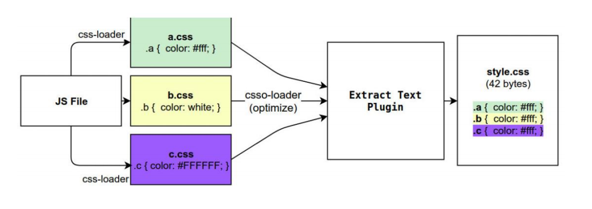
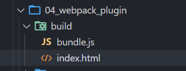
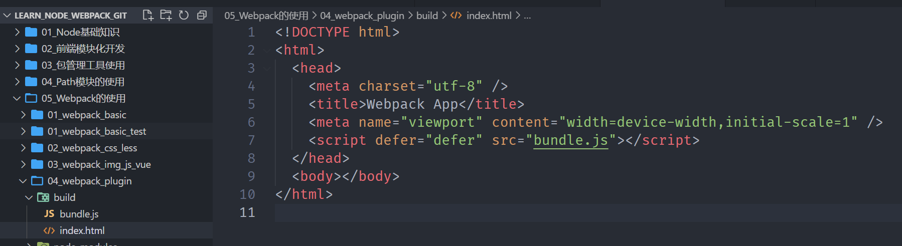
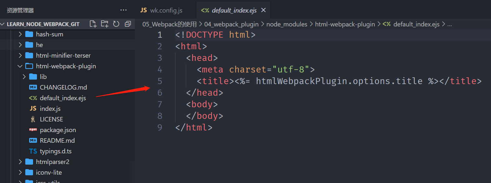
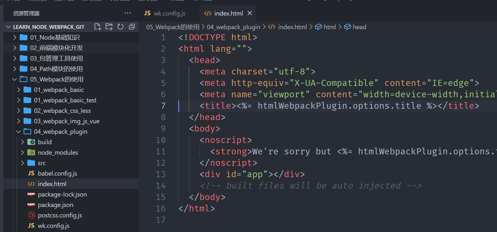
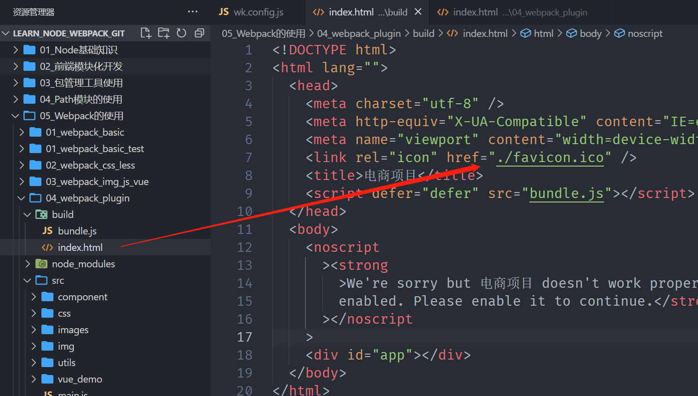
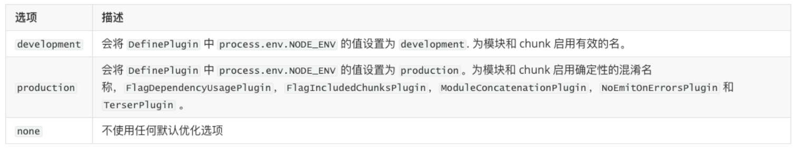
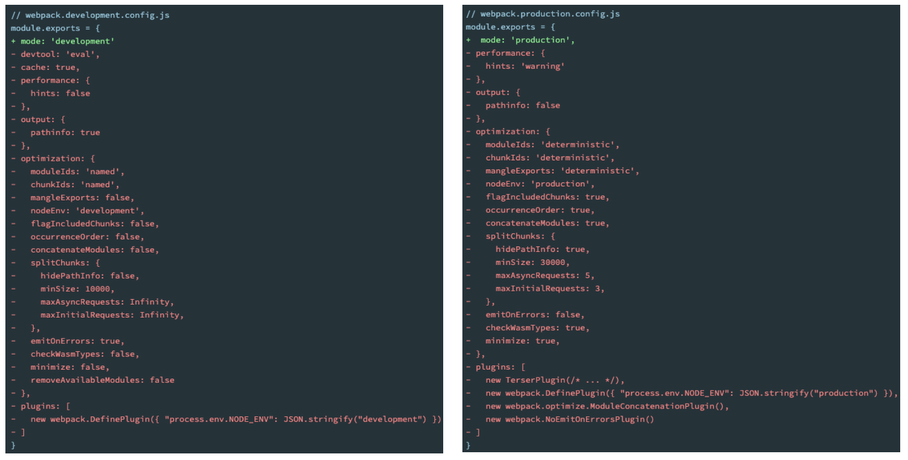

## **认识 Plugin**

**Webpack 的另一个核心是 Plugin，官方有这样一段对 Plugin 的描述：**

While loaders are used to transform certain types of modules, plugins can be leveraged to perform a wider range

of tasks like bundle optimization, asset management and injection of environment variables.

**上面表达的含义翻译过来就是：**

Loader 是用于特定的模块类型进行转换；

Plugin 可以用于执行更加广泛的任务，比如打包优化、资源管理、环境变量注入等；



## **CleanWebpackPlugin**

**前面我们演示的过程中，每次修改了一些配置，重新打包时，都需要手动删除 dist 文件夹：**

我们可以借助于一个插件来帮助我们完成，这个插件就是 CleanWebpackPlugin；

**首先，我们先安装这个插件：**

npm install clean-webpack-plugin -D

**之后在插件中配置：**

```javascript
const { CleanWebpackPlugin } = require("clean-webpack-plugin");

module.exports = {
  plugins: [new CleanWebpackPlugin()],
};
```

除了使用 CleanWebpackPlugin 插件，也可以直接在 output 中配置 clean，效果一样

```javascript
module.exports = {
  mode: "production",
  entry: "./src/main.js",
  output: {
    filename: "bundle.js",
    path: path.resolve(__dirname, "./build"),
    clean: true, // 同CleanWebpackPlugin插件
  },
};
```

## **HtmlWebpackPlugin**

**另外还有一个不太规范的地方：**

我们的 HTML 文件是编写在根目录下的，而最终打包的 dist 文件夹中是没有 index.html 文件的。

在进行项目部署的时，必然也是需要有对应的入口文件 index.html；

所以我们也需要对 index.html 进行打包处理；

**对 HTML 进行打包处理我们可以使用另外一个插件：HtmlWebpackPlugin；**

npm install html-webpack-plugin -D

```javascript
const HtmlWebpackPlugin = require("html-webpack-plugin");

module.exports = {
  plugins: [new HtmlWebpackPlugin()],
};
```

重新打包之后，就会在打包的文件夹下面生成一个 index.html



## **生成 index.html 分析**

**我们会发现，现在自动在 dist 文件夹中，生成了一个 index.html 的文件：**

该文件中也自动添加了我们打包的 bundle.js 文件；



如果我们想改 index.html 文件中的 title，可以在 HtmlWebpackPlugin 中传参

```javascript
new HtmlWebpackPlugin({
  title: "电商项目",
});
```

**这个文件是如何生成的呢？**

默认情况下是根据 ejs 的一个模板来生成的；

在 html-webpack-plugin 的源码中，有一个 default_index.ejs 模块；



## **自定义 HTML 模板**

**如果我们想在自己的模块中加入一些比较特别的内容：**

比如添加一个 noscript 标签，在用户的 JavaScript 被关闭时，给予响应的提示；

比如在开发 vue 或者 react 项目时，我们需要一个可以挂载后续组件的根标签 <div id="app"></div>；

**这个我们需要一个属于自己的 index.html 模块：**

这里将 index.html 事先准备好



index.html

```html
<!DOCTYPE html>
<html lang="">
  <head>
    <meta charset="utf-8" />
    <meta http-equiv="X-UA-Compatible" content="IE=edge" />
    <meta name="viewport" content="width=device-width,initial-scale=1.0" />
    <title><%= htmlWebpackPlugin.options.title %></title>
  </head>
  <body>
    <noscript>
      <strong
        >We're sorry but <%= htmlWebpackPlugin.options.title %> doesn't work
        properly without JavaScript enabled. Please enable it to
        continue.</strong
      >
    </noscript>
    <div id="app"></div>
    <!-- built files will be auto injected -->
  </body>
</html>
```

然后，在插件中使用自定义的模板，打包后的 index.html 就会使用这个模板

```javascript
new HtmlWebpackPlugin({
  title: "电商项目",
  template: "./index.html",
});
```

## **自定义模板数据填充**

**上面的代码中，会有一些类似这样的语法<% 变量 %>，这个是 EJS 模块填充数据的方式。**

**在配置 HtmlWebpackPlugin 时，我们可以添加如下配置：**

**template：**指定我们要使用的模块所在的路径；

**title：**在进行 htmlWebpackPlugin.options.title 读取时，就会读到该信息；

## **DefinePlugin 的介绍**

**但是，这个时候编译还是会报错，因为在我们的模块中还使用到一个 BASE_URL 的常量：**

**这是因为在编译 template 模块时，有一个 BASE_URL：**

```html
<!DOCTYPE html>
<html lang="">
  <head>
    <meta charset="utf-8" />
    <meta http-equiv="X-UA-Compatible" content="IE=edge" />
    <meta name="viewport" content="width=device-width,initial-scale=1.0" />
    <link rel="icon" href="<%= BASE_URL %>favicon.ico" />
    //
    这里有BASE_URL，刚才演示HtmlWebpackPlugin时候先将这里删除，因为BASE_URL必须使用DefinePlugin插件
    <title><%= htmlWebpackPlugin.options.title %></title>
  </head>
  <body>
    <noscript>
      <strong
        >We're sorry but <%= htmlWebpackPlugin.options.title %> doesn't work
        properly without JavaScript enabled. Please enable it to
        continue.</strong
      >
    </noscript>
    <div id="app"></div>
    <!-- built files will be auto injected -->
  </body>
</html>
```

```html
<link rel="icon" href="<%= BASE_URL %>favicon.ico" />
```

但是我们并没有设置过这个常量值，所以会出现没有定义的错误；

**这个时候我们可以使用 DefinePlugin 插件；**

## **DefinePlugin 的使用**

**DefinePlugin 允许在编译时创建配置的全局常量，是一个 webpack 内置的插件（不需要单独安装）：**

**这个时候，编译 template 就可以正确的编译了，会读取到 BASE_URL 的值；**

```javascript
const { DefinePlugin } = require("webpack");

plugins: [
  new DefinePlugin({
    BASE_URL: "'./'",
  }),
];
```

打包后的 index.html 中的 BASE_URL 也被解析成./



当然，我们也可以定义一些全局变量，在项目任何地方都能使用

```javascript
plugins: [
  new DefinePlugin({
    BASE_URL: "'./'",
    coderwhy: "'why'",
    counter: "123",
  }),
];
```

在 main.js 中使用

```javascript
// 使用通过DefinePlugin注入的变量
console.log(coderwhy); // why
console.log(counter); // 123
```

## **Mode 配置**

**前面我们一直没有讲 mode。**

**Mode 配置选项，可以告知 webpack 使用相应模式的内置优化：**

默认值是 production（什么都不设置的情况下）；

可选值有：'none' | 'development' | 'production'；

**这几个选项有什么样的区别呢？**



## **Mode 配置代表更多**

配置了 mode 为 development 或 production，相当于分别配置了对应底下的红色部门。


