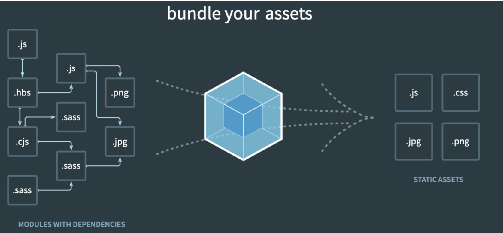
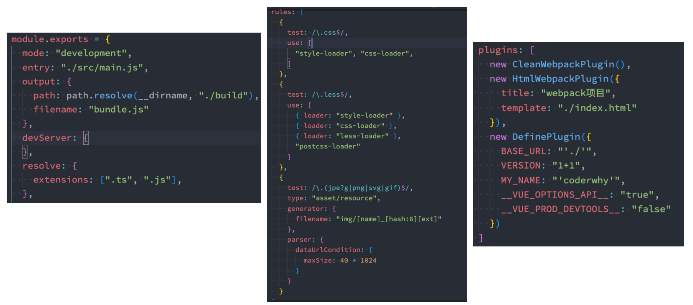
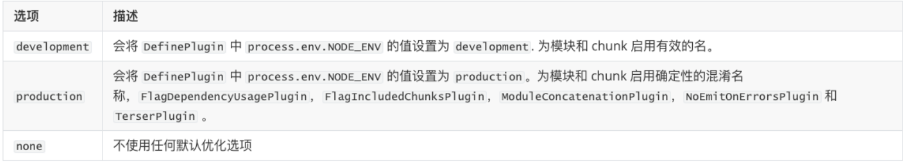
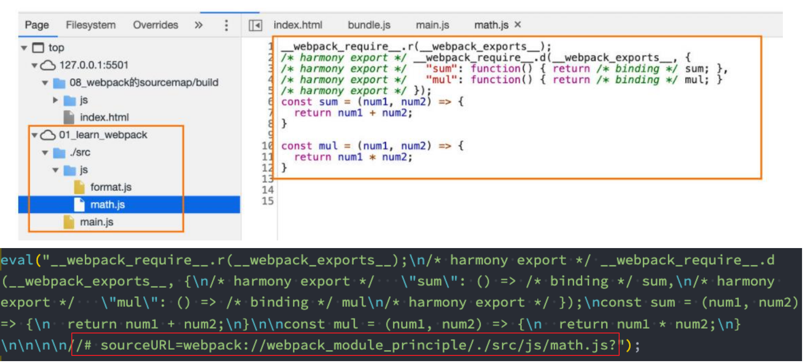
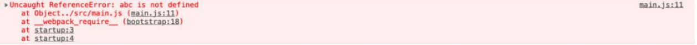

## **Webpack 到底是什么呢？**

**我们先来看一下官方的解释：**

**webpack** is a _static module bundler_ for modern JavaScript applications.

**webpack 是一个静态的模块化打包工具，为现代的 JavaScript 应用程序；**

我们来对上面的解释进行拆解：

打包 bundler：webpack 可以将帮助我们进行打包，所以它是一个打包工具

静态的 static：这样表述的原因是我们最终可以将代码打包成最终的静态资源（部署到静态服务器）；

模块化 module：webpack 默认支持各种模块化开发，ES Module、CommonJS、AMD 等；

现代的 modern：我们前面说过，正是因为现代前端开发面临各种各样的问题，才催生了 webpack 的出现和发展；

## **Webpack 官方的图片**



## **webpack 基本打包回顾**



## **Mode 配置**

**Mode 配置选项，可以告知 webpack 使用相应模式的内置优化：**

默认值是 production（什么都不设置的情况下）；

可选值有：'none' | 'development' | 'production'；

**这几个选项有什么样的区别呢?**



## **Mode 配置代表更多**


## **Webpack 的模块化**

Webpack 打包的代码，允许我们使用各种各样的模块化，但是最常用的是**CommonJS、ES Module**。

那么它是如何帮助我们实现了代码中支持模块化呢？

**我们来研究一下它的原理，包括如下原理：**

CommonJS 模块化实现原理；

ES Module 实现原理；

CommonJS 加载 ES Module 的原理；

ES Module 加载 CommonJS 的原理；

## **认识 source-map**

我们的代码通常运行在浏览器上时，是通过**打包压缩**的：

- 也就是真实跑在浏览器上的代码，和我们编写的代码其实是有差异的；

- 比如 ES6 的代码可能被转换成 ES5；

- 比如对应的代码行号、列号在经过编译后肯定会不一致；

- 比如代码进行丑化压缩时，会将编码名称等修改；

- 比如我们使用了 TypeScript 等方式编写的代码，最终转换成 JavaScript；

但是，当代码报错需要调试时（debug），调试转换后的代码是很困难的

但是我们能保证代码不出错吗？**不可能。**

那么如何可以**调试这种转换后不一致**的代码呢？答案就是**source-map**

- source-map 是从已转换的代码，映射到原始的源文件；
- 使浏览器可以重构原始源并在调试器中显示重建的原始源；

## **如何使用 source-map**

**如何可以使用 source-map 呢？两个步骤：**

第一步：根据源文件，生成 source-map 文件，webpack 在打包时，可以通过配置生成 source-map；

webpack.config.js

```javascript
module.exports = {
  devtool: "source-map",
};
```

第二步：在转换后的代码，最后添加一个注释，它指向 sourcemap；

```json
//# sourceMappingURL=common.bundle.js.map
```

执行 npm run build 打包的时候，就会生成一个 bundle.js 文件和 bundle.js.map，那么 bundle.js 如何关联 bundle.js.map 呢？


打包之后的 bundle.js 最后的注释，它的作用就是用来关联 bundle.js.map。

**浏览器会根据我们的注释，查找相应的 source-map，并且根据 source-map 还原我们的代码，方便进行调试。**

**在 Chrome 中，我们可以按照如下的方式打开 source-map：**

下面这俩默认开启


## **分析 source-map**

最初 source-map 生成的文件大小是原始文件的 10 倍，第二版减少了约 50%，第三版又减少了 50%，所以目前一个 133kb 的文件，

最终的 source-map 的大小大概在 300kb。

**目前的 source-map 长什么样子呢？**

version：当前使用的版本，也就是最新的第三版；

sources：从哪些文件转换过来的 source-map 和打包的代码（最初始的文件）；

names：转换前的变量和属性名称（因为我目前使用的是 development 模式，所以不需要保留转换前的名称）；

names：转换前的变量和属性名称（因为我目前使用的是 development 模式，所以不需要保留转换前的名称）；

file：打包后的文件（浏览器加载的文件）；

sourceContent：转换前的具体代码信息（和 sources 是对应的关系）；

sourceRoot：所有的 sources 相对的根目录；


## **生成 source-map**

**如何在使用 webpack 打包的时候，生成对应的 source-map 呢？**

webpack 为我们提供了非常多的选项（目前是 26 个），来处理 source-map；

https://webpack.docschina.org/configuration/devtool/

选择不同的值，生成的 source-map 会稍微有差异，打包的过程也会有性能的差异，可以根据不同的情况进行选择；

**下面几个值不会生成 source-map**

**false：**不使用 source-map，也就是没有任何和 source-map 相关的内容。

**none：**production 模式下的默认值（什么值都不写） ，不生成 source-map。

**eval：**development 模式下的默认值，不生成 source-map

- 但是它会在 eval 执行的代码中，添加 //# sourceURL=；
- 它会被浏览器在执行时解析，并且在调试面板中生成对应的一些文件目录，方便我们调试代码；

## **eval 的效果**



eval 函数里面的代码会找到上面图标注红色框的文件。

## **source-map 值**

**source-map**：

生成一个独立的 source-map 文件，并且在 bundle 文件中有一个注释，指向 source-map 文件；

**bundle 文件中有如下的注释：**

开发工具会根据这个注释找到 source-map 文件，并且解析；

```json
//# sourceMappingURL=bundle.js.map
```


## **eval-source-map 值**

**eval-source-map**：会生成 sourcemap，但是 source-map 是以 DataUrl 添加到 eval 函数的后面


## **inline-source-map 值**

**inline-source-map**：会生成 sourcemap，但是 source-map 是以 DataUrl 添加到 bundle 文件的后面


## **cheap-source-map**

**cheap-source-map**：（开发环境使用）

会生成 sourcemap，但是会更加高效一些（cheap 低开销），因为它没有生成列映射（Column Mapping）

因为在开发中，我们只需要行信息通常就可以定位到错误了


## **cheap-module-source-map 值**

**cheap-module-source-map**：（开发环境使用）

会生成 sourcemap，类似于 cheap-source-map，但是对源自 loader 的 sourcemap 处理会更好。

**这里有一个很模糊的概念:** 对源自 loader 的 sourcemap 处理会更好，官方也没有给出很好的解释

其实是如果 loader 对我们的源码进行了特殊的处理，比如 babel；

webpack.config.js

每次打包的时候如果想将之前的文件夹删掉，可以进行如下配置：

```javascript
const path = require("path");

module.exports = {
  mode: "production",
  // cheap-module-source-map: 和cheap-source-map比如相似, 但是对来自loader的source-map处理的更好
  devtool: "cheap-module-source-map",
  entry: "./src/main.js",
  output: {
    path: path.resolve(__dirname, "./build"),
    filename: "bundle.js",
    // 重新打包时, 先将之前打包的文件夹删除掉
    clean: true,
  },
  module: {
    rules: [
      {
        test: /\.js$/,
        use: {
          loader: "babel-loader",
        },
      },
    ],
  },
};
```

经过 babel 处理过的 JS 代码会把一些空格去掉，导致无法精确定位到错误信息，比如原先是第 9 行报错，但是如果使用 cheap-source-map 的话，由于 JS 代码的一些空格被去掉了，可能报错就跑到第 7 行去了，此时使用 cheap-module-source-map 就不会去除 JS 代码的空格，能够更加精准的捕获到错误的信息。

## **hidden-source-map 值**

**hidden-source-map**：

会生成 sourcemap，但是不会对 source-map 文件进行引用；

相当于删除了打包文件中对 sourcemap 的引用注释；

```json
// 被删除掉的
//# sourceMappingURL=bundle.js.map
```

**如果我们手动添加进来，那么 sourcemap 就会生效了**

## **nosources-source-map 值**

**nosources-source-map**：

会生成 sourcemap，但是生成的 sourcemap 只有错误信息的提示，不会生成源代码文件；

正确的错误提示：



点击错误提示，无法查看源码：


## **多个值的组合**

**事实上，webpack 提供给我们的 26 个值，是可以进行多组合的。**

**组合的规则如下：**

**inline-|hidden-|eval：**三个值时三选一；

**nosources：**可选值；

**cheap**可选值，并且可以跟随**module**的值；

```javascript
[inline-|hidden-|eval-][nosources-][cheap-[module-]]source-map
```

**那么在开发中，最佳的实践是什么呢？**

开发阶段：推荐使用 source-map 或者 cheap-module-source-map

- 这分别是 vue 和 react 使用的值，可以获取调试信息，方便快速开发；

测试阶段：推荐使用 source-map 或者 cheap-module-source-map

- 测试阶段我们也希望在浏览器下看到正确的错误提示；

发布阶段：false、缺省值（不写）

webpack.config.js

```javascript
const path = require("path");

module.exports = {
  mode: "production",
  // 常见的值:
  // 1.false
  // 2.none => production
  // 3.eval => development
  // 4.source-map => production

  // 不常见的值:
  // 1.eval-source-map: 添加到eval函数的后面
  // 2.inline-source-map: 添加到文件的后面
  // 3.cheap-source-map(dev环境): 低开销, 更加高效
  // 4.cheap-module-source-map: 和cheap-source-map比如相似, 但是对来自loader的source-map处理的更好
  // 5.hidden-source-map: 会生成sourcemap文件, 但是不会对source-map文件进行引用
  devtool: "source-map",
  entry: "./src/main.js",
  output: {
    path: path.resolve(__dirname, "./build"),
    filename: "bundle.js",
  },
  module: {
    rules: [
      {
        test: /\.js$/,
        use: {
          loader: "babel-loader",
        },
      },
    ],
  },
};
```
