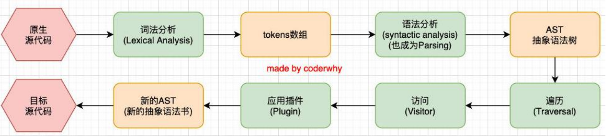
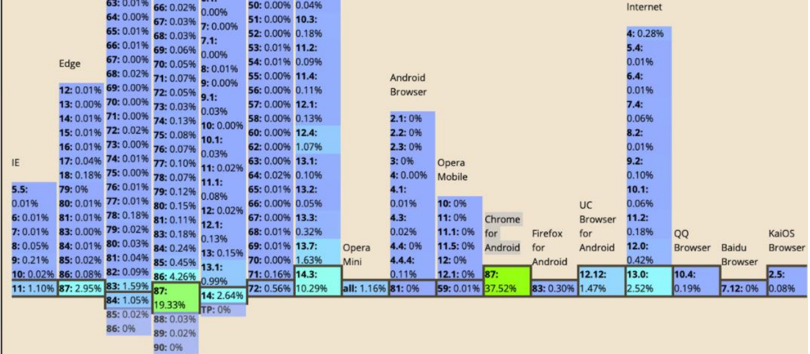
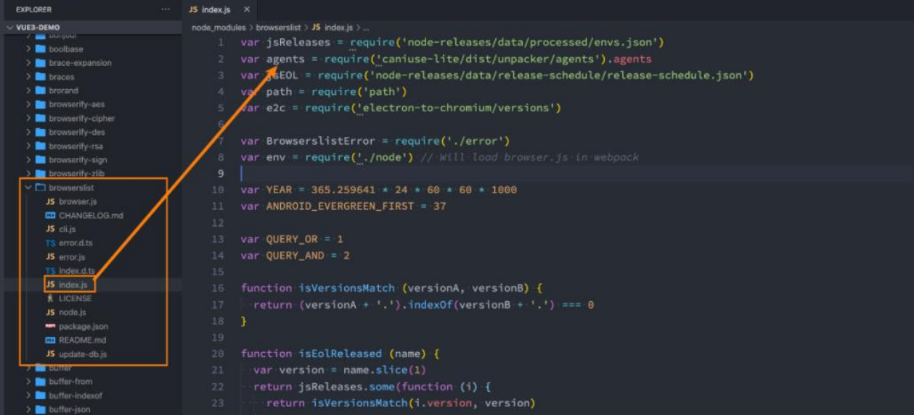
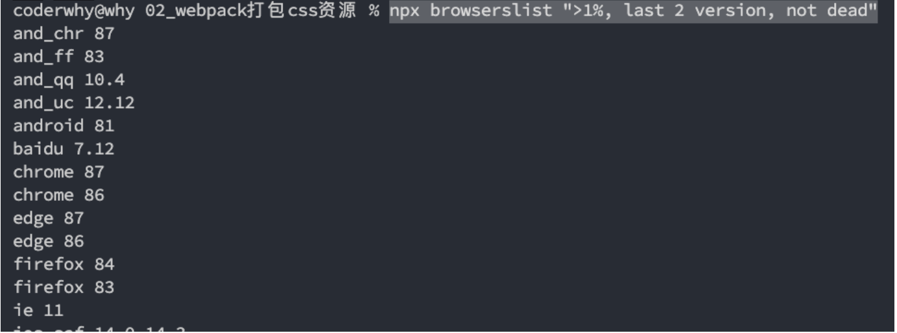
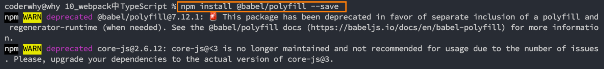
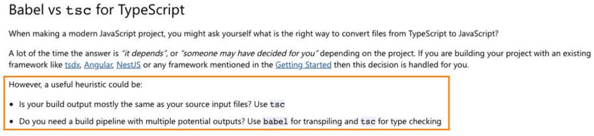

## **为什么需要 babel？**

**事实上，在开发中我们很少直接去接触 babel，但是 babel 对于前端开发来说，目前是不可缺少的一部分：**

开发中，我们想要使用 ES6+的语法，想要使用 TypeScript，开发 React 项目，它们都是离不开 Babel 的；

所以，学习 Babel 对于我们理解代码从编写到线上的转变过程至关重要；

**那么，Babel 到底是什么呢？**

Babel 是一个工具链，主要用于旧浏览器或者缓解中将 ECMAScript 2015+代码转换为向后兼容版本的 JavaScript；

包括：语法转换、源代码转换、Polyfill 实现目标环境缺少的功能等；


## **Babel 命令行使用**

**babel 本身可以作为一个独立的工具（和 postcss 一样），不和 webpack 等构建工具配置来单独使用。**

**如果我们希望在命令行尝试使用 babel，需要安装如下库：**

@babel/core：babel 的核心代码，必须安装；

@babel/cli：可以让我们在命令行使用 babel；

```json
npm install @babel/cli @babel/core
```

**使用 babel 来处理我们的源代码：**

src：是源文件的目录；

--out-dir：指定要输出的文件夹 dist；

```json
npx babel src --out-dir dist
```

上面命令的意思是将 src 下的所有文件打包到 dist 目录下。

## **插件的使用**

```javascript
// 1.ES6中const定义常量
const message = "Hello Babel";
console.log(message);

// 2.ES6中箭头函数
const foo = () => {
  console.log("foo function exec~");
};
foo();
```

上面的代码

**比如我们需要转换箭头函数，那么我们就可以使用箭头函数转换相关的插件：**

```json
npm install @babel/plugin-transform-arrow-functions -D
npx babel src --out-dir dist --plugins=@babel/plugin-transform-arrow-functions
```

这样打包出来的箭头函数就会被转换

**查看转换后的结果：我们会发现 const 并没有转成 var**

这是因为 plugin-transform-arrow-functions，并没有提供这样的功能；

我们需要使用 plugin-transform-block-scoping 来完成这样的功能；

```json
npm install @babel/plugin-transform-block-scoping -D
npx babel src --out-dir dist --plugins=@babel/plugin-transform-block-scoping
,@babel/plugin-transform-arrow-functions
```

## **Babel 的预设 preset**

**但是如果要转换的内容过多，一个个设置是比较麻烦的，我们可以使用预设（preset）：**

后面我们再具体来讲预设代表的含义；

**安装@babel/preset-env 预设：**

```json
npm install @babel/preset-env -D
```

**执行如下命令：**

```json
npx babel src --out-dir dist --presets=@babel/preset-env
```

## **Babel 的底层原理**

**babel 是如何做到将我们的一段代码（ES6、TypeScript、React）转成另外一段代码（ES5）的呢？**

从一种源代码（原生语言）转换成另一种源代码（目标语言），这是什么的工作呢？

就是**编译器**，事实上我们可以将 babel 看成就是一个编译器。

Babel 编译器的作用就是将我们的源代码，转换成浏览器可以直接识别的另外一段源代码；

**Babel 也拥有编译器的工作流程：**

解析阶段（Parsing）

转换阶段（Transformation）

生成阶段（Code Generation）

https://github.com/jamiebuilds/the-super-tiny-compiler

## **babel 编译器执行原理**

**Babel 的执行阶段**


**当然，这只是一个简化版的编译器工具流程，在每个阶段又会有自己具体的工作：**



## **babel-loader**

**在实际开发中，我们通常会在构建工具中通过配置 babel 来对其进行使用的，比如在 webpack 中。**

**那么我们就需要去安装相关的依赖：**

如果之前已经安装了@babel/core，那么这里不需要再次安装；

```json
npm install babel-loader @babel/core
```

**我们可以设置一个规则，在加载 js 文件时，使用我们的 babel：**

webpack.config.js

```javascript
module.exports = {
  module: {
    rules: [
      {
        test: /\.js$/,
        use: {
          loader: "babel-loader",
        },
      },
    ],
  },
};
```

## **指定使用的插件**

**我们必须指定使用的插件才会生效**

```javascript
module.exports = {
  module: {
    rules: [
      {
        test: /\.js$/,
        use: {
          loader: "babel-loader",
          options: {
            plugins: [
              "@babel/plugin-transform-arrow-functions",
              "@babel/plugin-transform-block-scoping",
            ],
          },
        },
      },
    ],
  },
};
```

## **babel-preset**

**如果我们一个个去安装使用插件，那么需要手动来管理大量的 babel 插件，我们可以直接给 webpack 提供一个 preset，**

**webpack 会根据我们的预设来加载对应的插件列表，并且将其传递给 babel。**

```javascript
module.exports = {
  module: {
    rules: [
      {
        test: /\.js$/,
        use: {
          loader: "babel-loader",
          options: {
            plugins: ["@babel/preset-env"],
          },
        },
      },
    ],
  },
};
```

**比如常见的预设有三个：**

- env
- react
- TypeScript

**安装 preset-env：**

```json
npm install @babel/preset-env
```

## **浏览器兼容性**

我们来思考一个问题：**开发中，浏览器的兼容性问题，我们应该如何去解决和处理？**

当然这个问题很笼统，这里我说的兼容性问题不是指屏幕大小的变化适配；

我这里指的兼容性是针对不同的浏览器支持的特性：比如 css 特性、js 语法之间的兼容性；

**我们知道市面上有大量的浏览器：**

有 Chrome、Safari、IE、Edge、Chrome for Android、UC Browser、QQ Browser 等等；

它们的市场占率是多少？我们要不要兼容它们呢？

**其实在很多的脚手架配置中，都能看到类似于这样的配置信息：**

这里的百分之一，就是指市场占有率

```json
> 1%
last 2 versions
not dead
```

## **浏览器市场占有率**

**但是在哪里可以查询到浏览器的市场占有率呢？**

这个最好用的网站，也是我们工具通常会查询的一个网站就是 caniuse；

https://caniuse.com/usage-table



## **认识 browserslist 工具**

**但是有一个问题，我们如何可以在 css 兼容性和 js 兼容性下共享我们配置的兼容性条件呢？**

就是当我们设置了一个条件： > 1%；

我们表达的意思是 css 要兼容市场占有率大于 1%的浏览器，js 也要兼容市场占有率大于 1%的浏览器；

如果我们是通过工具来达到这种兼容性的，比如我们讲到的 postcss-preset-env、babel、autoprefixer 等

**如何可以让他们共享我们的配置呢？**

这个问题的答案就是**Browserslist**；

**Browserslist**是什么？Browserslist 是一个在不同的前端工具之间，共享目标浏览器和 Node.js 版本的配置：

- Autoprefixer
- Babel
- postcss-preset-env
- eslint-plugin-compat
- stylelint-no-unsupported-browser-features
- postcss-normalize
- obsolete-webpack-plugin

## **浏览器查询过程**

**我们可以编写类似于这样的配置：**

```json
> 1%
last 2 versions
not dead
```

**那么之后，这些工具会根据我们的配置来获取相关的浏览器信息，以方便决定是否需要进行兼容性的支持：**

条件查询使用的是 caniuse-lite 的工具，这个工具的数据来自于 caniuse 的网站上；



## **Browserslist 编写规则一：**

**那么在开发中，我们可以编写的条件都有哪些呢？（加粗部分是最常用的）**

**defaults：Browserslist 的默认浏览器（> 0.5%, last 2 versions, Firefox ESR, not dead）。**

**5%：通过全局使用情况统计信息选择的浏览器版本。 >=，<和<=工作过。**

- 5% in US：使用美国使用情况统计信息。它接受两个字母的国家/地区代码。
- \> 5% in alt-AS：使用亚洲地区使用情况统计信息。有关所有区域代码的列表，请参见 caniuse-lite/data/regions
- \> 5% in my stats：使用自定义用法数据。
- \> 5% in browserslist-config-mycompany stats：使用 来自的自定义使用情况数据 browserslist-config-mycompany/browserslist-stats.json。
- cover 99.5%：提供覆盖率的最受欢迎的浏览器。
- cover 99.5% in US：与上述相同，但国家/地区代码由两个字母组成。
- cover 99.5% in my stats：使用自定义用法数据。

**dead：24 个月内没有官方支持或更新的浏览器。现在是 IE 10，IE_Mob 11，BlackBerry 10，BlackBerry 7， Samsung 4 和 OperaMobile 12.1。**

**last 2 versions：每个浏览器的最后 2 个版本。**

last 2 Chrome versions：最近 2 个版本的 Chrome 浏览器。

last 2 major versions 或 last 2 iOS major versions：最近 2 个主要版本的所有次要/补丁版本。

## Browserslist 编写规则二：

**node 10 和 node 10.4：选择最新的 Node.js10.x.x 或 10.4.x 版本。**

current node：Browserslist 现在使用的 Node.js 版本。

maintained node versions：所有 Node.js 版本，仍由 Node.js Foundation 维护。

**iOS 7：直接使用 iOS 浏览器版本 7。**

- Firefox > 20：Firefox 的版本高于 20 >=，<并且<=也可以使用。它也可以与 Node.js 一起使用。
- ie 6-8：选择一个包含范围的版本。
- Firefox ESR：最新的[Firefox ESR]版本。
- PhantomJS 2.1 和 PhantomJS 1.9：选择类似于 PhantomJS 运行时的 Safari 版本。

**extends browserslist-config-mycompany：从 browserslist-config-mycompanynpm 包中查询 。**

**supports es6-module：支持特定功能的浏览器。**

es6-module 这是“我可以使用” 页面 feat 的 URL 上的参数。有关所有可用功能的列表，请参见 。caniuse-lite/data/features

**browserslist config：在 Browserslist 配置中定义的浏览器。**在差异服务中很有用，可用于修改用户的配置，例如 browserslist config and supports es6-module。

**since 2015 或 last 2 years**：自 2015 年以来发布的所有版本（since 2015-03 以及 since 2015-03-10）。

**unreleased versions 或 unreleased Chrome versions**：Alpha 和 Beta 版本。

**not ie <= 8：排除先前查询选择的浏览器。**

## **命令行使用 browserslist**

**我们可以直接通过命令来查询某些条件所匹配到的浏览器：**

```json
npx browserslist ">1%, last 2 version, not dead"
```



## **配置 browserslist**

**我们如何可以配置 browserslist 呢？两种方案：**

方案一：在 package.json 中配置；

方案二：单独的一个配置文件.browserslistrc 文件；

.browserslistrc 文件在项目根目录下

**方案一：package.json 配置：**


**方案二：.browserslistrc 文件**


## **默认配置和条件关系**

**如果没有配置，那么也会有一个默认配置：**


**我们编写了多个条件之后，多个条件之间是什么关系呢？**


## **设置目标浏览器 browserslist**

**我们最终打包的 JavaScript 代码，是需要跑在目标浏览器上的，那么如何告知 babel 我们的目标浏览器呢？**

browserslist 工具

target 属性

**之前我们已经使用了 browserslist 工具，我们可以对比一下不同的配置，打包的区别：**

```json
> 0.1%
last 2 versions
not dead
```

这样配置打包出来的代码会将 ES6 转为 ES5，但是如果进行下面的配置

```json
> 5%
last 2 versions
not dead
```

上面这样配置打包出来的代码就不会将 ES6 转为 ES5

## **设置目标浏览器 targets**

**我们也可以通过 targets 来进行配置：**

webpack.config.js

```javascript
module.exprots = {
  module: {
    rules: [
      {
        test: /\.js?$/,
        use: {
          loader: "babel-loader",
          options: {
            presets: [
              [
                "@babel/preset-env",
                {
                  // 在开发中针对babel的浏览器兼容查询使用browserslist工具, 而不是设置target
                  // 因为browserslist工具, 可以在多个前端工具之间进行共享浏览器兼容性(postcss/babel)
                  targets: ">5%",
                },
              ],
            ],
          },
        },
      },
    ],
  },
};
```

**那么，如果两个同时配置了，哪一个会生效呢？**

配置的 targets 属性会覆盖 browserslist；

但是在开发中，更推荐通过 browserslist 来配置，因为类似于 postcss 工具，也会使用 browserslist，进行统一浏览器的适配；

## **Stage-X 的 preset**

**要了解 Stage-X，我们需要先了解一下 TC39 的组织：**

TC39 是指技术委员会（Technical Committee）第 39 号；

它是 ECMA 的一部分，ECMA 是 “ECMAScript” 规范下的 JavaScript 语言标准化的机构；

ECMAScript 规范定义了 JavaScript 如何一步一步的进化、发展；

**TC39 遵循的原则是：分阶段加入不同的语言特性，新流程涉及四个不同的 Stage**

**Stage 0：**strawman（稻草人），任何尚未提交作为正式提案的讨论、想法变更或者补充都被认为是第 0 阶段的"稻草人"；

**Stage 1：**proposal（提议），提案已经被正式化，并期望解决此问题，还需要观察与其他提案的相互影响；

**Stage 2：**draft（草稿），Stage 2 的提案应提供规范初稿、草稿。此时，语言的实现者开始观察 runtime 的具体实现是否

合理；

**Stage 3：**candidate（候补），Stage 3 提案是建议的候选提案。在这个高级阶段，规范的编辑人员和评审人员必须在最终

规范上签字。Stage 3 的提案不会有太大的改变，在对外发布之前只是修正一些问题；

**Stage 4：**finished（完成），进入 Stage 4 的提案将包含在 ECMAScript 的下一个修订版中；

## **Babel 的 Stage-X 设置**

**在 babel7 之前（比如 babel6 中），我们会经常看到这种设置方式：**

它表达的含义是使用对应的 babel-preset-stage-x 预设；

但是从 babel7 开始，已经不建议使用了，建议使用 preset-env 来设置；


## **Babel 的配置文件**

**像之前一样，我们可以将 babel 的配置信息放到一个独立的文件中，babel 给我们提供了两种配置文件的编写：**

babel.config.json（或者.js，.cjs，.mjs）文件；

.babelrc.json（或者.babelrc，.js，.cjs，.mjs）文件；

**它们两个有什么区别呢？目前很多的项目都采用了多包管理的方式（babel 本身、element-plus、umi 等）；**

.babelrc.json：早期使用较多的配置方式，但是对于配置 Monorepos 项目是比较麻烦的；

babel.config.json（babel7）：可以直接作用于 Monorepos 项目的子包，更加推荐；

babel.config.js，放在项目根目录下

```javascript
module.exports = {
  // plugins: [
  //   "@babel/plugin-transform-arrow-functions",
  //   "@babel/plugin-transform-block-scoping"
  // ]
  presets: [
    [
      "@babel/preset-env",
      {
        // 在开发中针对babel的浏览器兼容查询使用browserslist工具, 而不是设置target
        // 因为browserslist工具, 可以在多个前端工具之间进行共享浏览器兼容性(postcss/babel)
        // targets: ">5%"
      },
    ],
  ],
};
```

## **认识 polyfill**

**Polyfill 是什么呢？**

翻译：一种用于衣物、床具等的聚酯填充材料, 使这些物品更加温暖舒适；

理解：更像是应该填充物（垫片），一个补丁，可以帮助我们更好的使用 JavaScript；

**为什么时候会用到 polyfill 呢？**

比如我们使用了一些语法特性（例如：Promise, Generator, Symbol 等以及实例方法例如 Array.prototype.includes 等）

但是某些浏览器压根不认识这些特性，必然会报错；

我们可以使用 polyfill 来填充或者说打一个补丁，那么就会包含该特性了；

## **如何使用 polyfill？**

**babel7.4.0 之前，可以使用 @babel/polyfill 的包，但是该包现在已经不推荐使用了：**



**babel7.4.0 之后，可以通过单独引入 core-js 和 regenerator-runtime 来完成 polyfill 的使用：**

```json
npm install core-js regenerator-runtime --save
```

## **配置 babel.config.js**

**我们需要在 babel.config.js 文件中进行配置，给 preset-env 配置一些属性：**

useBuiltIns：设置以什么样的方式来使用 polyfill；

corejs：设置 corejs 的版本，目前使用较多的是 3.x 的版本，比如我使用的是 3.8.x 的版本；

- 另外 corejs 可以设置是否对提议阶段的特性进行支持；
- 设置 proposals 属性为 true 即可；

## **useBuiltIns 属性设置**

**useBuiltIns 属性有三个常见的值**

第一个值：false

- 打包后的文件不使用 polyfill 来进行适配；
- 并且这个时候是不需要设置 corejs 属性的；

第二个值：usage

- 会根据源代码中出现的语言特性，自动检测所需要的 polyfill；
- 这样可以确保最终包里的 polyfill 数量的最小化，打包的包相对会小一些；
- 可以设置 corejs 属性来确定使用的 corejs 的版本；

第三个值：entry

- 如果我们依赖的某一个库本身使用了某些 polyfill 的特性，但是因为我们使用的是 usage，所以之后用户浏览器可能会报错；
- 所以，如果你担心出现这种情况，可以使用 entry；
- 并且需要在入口文件中添加 **`import 'core-js/stable'; import 'regenerator-runtime/runtime';**
- 这样做会根据 browserslist 目标导入所有的 polyfill，但是对应的包也会变大；

babel.config.js

```javascript
module.exports = {
  presets: [
    [
      "@babel/preset-env",
      {
        corejs: 3,
        // false: 不使用polyfill进行填充
        useBuiltIns: "entry",
      },
    ],
  ],
};
```

如果设置为 entry，那么需要在需要打包的文件进行引入

src/index.js，比如这里对 src/index.js 的代码进行打包，那么就需要引入

```javascript
// 设置useBuiltIns为entry才需要引入这俩
import "core-js/stable";
import "regenerator-runtime/runtime";

// 4.使用字符串中includes方法
const nickname = "coderwhy";
// String.prototype.includes => String相关的polyfill就会被打包
console.log(nickname.includes("coder"));
```

## **React 的 jsx 支持**

**在我们编写 react 代码时，react 使用的语法是 jsx，jsx 是可以直接使用 babel 来转换的。**

**对 react jsx 代码进行处理需要如下的插件：**

- @babel/plugin-syntax-jsx
- @babel/plugin-transform-react-jsx
- @babel/plugin-transform-react-display-name

**但是开发中，我们并不需要一个个去安装这些插件，我们依然可以使用 preset 来配置：**

```json
npm install @babel/preset-react -D
```

src/index.js

```javascript
import React from "react";
import ReactDom from "react-dom/client";
import App from "./react/App";

// 5.编写react代码
const root = ReactDom.createRoot(document.querySelector("#root"));
root.render(<App />);
```

react/App.jsx

```javascript
import React, { memo, useState } from "react";

const App = memo(() => {
  const [count, setCount] = useState(0);

  return (
    <div>
      <h1>App Count: {count}</h1>
      <button onClick={(e) => setCount(count + 1)}>+1</button>
    </div>
  );
});

export default App;
```

在项目根目录下创建一个 index.html，设置一个根节点进行挂载

```html
<!DOCTYPE html>
<html lang="en">
  <head>
    <meta charset="UTF-8" />
    <meta http-equiv="X-UA-Compatible" content="IE=edge" />
    <meta name="viewport" content="width=device-width, initial-scale=1.0" />
    <title>Document</title>
  </head>
  <body>
    <div id="root"></div>
  </body>
</html>
```

首先，我们需要在 webpack.config.js 中进行配置，主要是处理 jsx 语法，还有就是使用 HtmlWebpackPlugin 插件，这样进行打包时候才会把 index.html 也打包进去。

我们使用 jsx 引入文件如果不想使用后缀名，可以进行 extensions 的配置：

```javascript
const HtmlWebpackPlugin = require("html-webpack-plugin");

module.exports = {
  resolve: {
    extensions: [".js", ".json", ".wasm", ".jsx", ".ts"],
  },
  module: {
    rules: [
      // 针对jsx?代码进行babel处理
      {
        test: /\.jsx?$/, // x?: 0或者1个x
        use: {
          loader: "babel-loader",
        },
      },
    ],
  },
  plugins: [
    new HtmlWebpackPlugin({
      template: "./index.html",
    }),
  ],
};
```

babel.config.js

```javascript
module.exports = {
  presets: [["@babel/preset-react"]],
};
```

## **TypeScript 的编译**

**在项目开发中，我们会使用 TypeScript 来开发，那么 TypeScript 代码是需要转换成 JavaScript 代码。**

**可以通过 TypeScript 的 compiler 来转换成 JavaScript：**

```json
npm install typescript -D
```

**另外 TypeScript 的编译配置信息我们通常会编写一个 tsconfig.json 文件：**

```json
tsc --init
```

**生成配置文件如下：**


**之后我们可以运行 npx tsc 来编译自己的 ts 代码：**

```json
npx tsc
```

## **使用 ts-loader**

**如果我们希望在 webpack 中使用 TypeScript，那么我们可以使用 ts-loader 来处理 ts 文件：**

```json
npm install ts-loader -D
```

**配置 ts-loader：**

webpack.config.js

```javascript
module.exports = {
  module: {
    rules: [
      {
        test: /\.ts$/,
        use: "ts-loader",
      },
    ],
  },
};
```

**之后，我们通过 npm run build 打包即可。**

## **使用 babel-loader**

**除了可以使用 TypeScript Compiler 来编译 TypeScript 之外，我们也可以使用 Babel：**

Babel 是有对 TypeScript 进行支持；

我们可以使用插件： @babel/tranform-typescript；

但是更推荐直接使用 preset：@babel/preset-typescript；

**我们来安装@babel/preset-typescript：**

```json
npm install @babel/preset-typescript -D
```

webpack.config.js

```javascript
module.exports = {
  module: {
    rules: [
      {
        test: /\.ts$/,
        use: "babel-loader",
      },
    ],
  },
};
```

babel.config.js

```javascript
module.exports = {
  presets: [
    [
      "@babel/preset-typescript",
      {
        corejs: 3,
        useBuiltIns: "usage",
      },
    ],
  ],
};
```

## **ts-loader 和 babel-loader 选择**

**那么我们在开发中应该选择 ts-loader 还是 babel-loader 呢？**

**使用 ts-loader（TypeScript Compiler）**

- 来直接编译 TypeScript，那么只能将 ts 转换成 js；
- 如果我们还希望在这个过程中添加对应的 polyfill，那么 ts-loader 是无能为力的；
- 我们需要借助于 babel 来完成 polyfill 的填充功能；

**使用 babel-loader（Babel）**

- 来直接编译 TypeScript，也可以将 ts 转换成 js，并且可以实现 polyfill 的功能；
- 但是 babel-loader 在编译的过程中，不会对类型错误进行检测；

**那么在开发中，我们如何可以同时保证两个情况都没有问题呢？**

math.js

```typescript
export function sum(num1: number, num2: number) {
  return num1 + num2;
}

console.log(sum(20, 100));

export function formatPrice(priceString: string) {
  if (priceString.includes("$")) {
    return "xxxx";
  } else {
    return "yyyy";
  }
}
```

## **编译 TypeScript 最佳实践**

**事实上 TypeScript 官方文档有对其进行说明：**



**也就是说我们使用 Babel 来完成代码的转换，使用 tsc 来进行类型的检查。**

**但是，如何可以使用 tsc 来进行类型的检查呢？**

在这里，我在 scripts 中添加了两个脚本，用于类型检查；

我们执行 npm run type-check 可以对 ts 代码的类型进行检测；

我们执行 npm run type-check-watch 可以实时的检测类型错误；

package.json

```json
{
  "scripts": {
    "ts-check": "tsc --noEmit",
    "ts-check-watch": "tsc --noEmit --watch"
  }
}
```

先执行 npm run ts-check-watch 对 ts 代码进行实时检测，然后再执行 npm run build 进行打包。
