## **如何使用 webpack 性能优化？**

**webpack 作为前端目前使用最广泛的打包工具，在面试中也是经常会被问到的。**

**比较常见的面试题包括：**

可以配置哪些属性来进行 webpack 性能优化？

前端有哪些常见的性能优化？（问到前端性能优化时，除了其他常见的，也完全可以从 webpack 来回答）

**webpack 的性能优化较多，我们可以对其进行分类：**

- 优化一：打包后的结果，上线时的性能优化。（比如分包处理、减小包体积、CDN 服务器等）
- 优化二：优化打包速度，开发或者构建时优化打包速度。（比如 exclude、cache-loader 等）

**大多数情况下，我们会更加侧重于优化一，这对于线上的产品影响更大。**

**在大多数情况下 webpack 都帮我们做好了该有的性能优化：**

比如配置 mode 为 production 或者 development 时，默认 webpack 的配置信息；

但是我们也可以针对性的进行自己的项目优化；

**接下来，我们来学习一下 webpack 性能优化的更多细节。**

## **性能优化 - 代码分离**

**代码分离（Code Splitting）是 webpack 一个非常重要的特性：**

它主要的目的是将代码分离到不同的 bundle 中，之后我们可以按需加载，或者并行加载这些文件；

比如默认情况下，所有的 JavaScript 代码（业务代码、第三方依赖、暂时没有用到的模块）在首页全部都加载，就会影响首页

的加载速度；

代码分离可以分出更小的 bundle，以及控制资源加载优先级，提供代码的加载性能；

分包处理的优势和必要性：

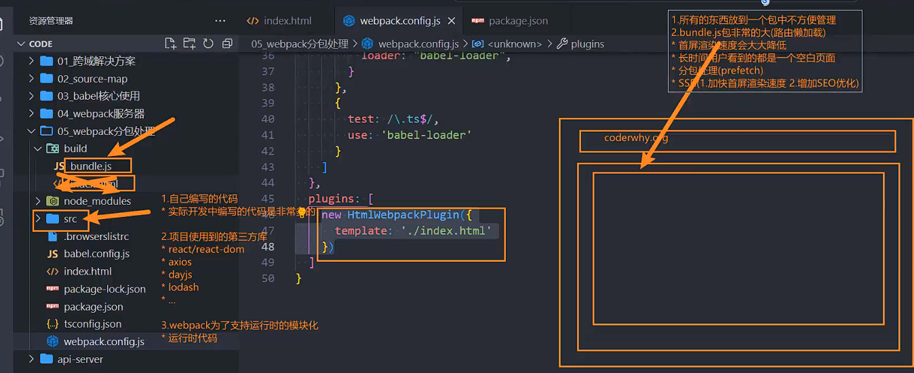

**Webpack 中常用的代码分离有三种：**

入口起点：使用 entry 配置手动分离代码；

防止重复：使用 Entry Dependencies 或者 SplitChunksPlugin 去重和分离代码；

动态导入：通过模块的内联函数调用来分离代码；

## **多入口起点**

**入口起点的含义非常简单，就是配置多入口：**

比如配置一个 index.js 和 main.js 的入口；

正常情况下，如果我们只配置一个入口文件，那么只会打包一个，配置如下：

webapck.config.js

```javascript
const path = require("path");

module.exports = {
  entry: "./src/index.js",
  output: {
    path: path.resolve(__dirname, "./build"),
    filename: "bundle.js",
  },
};
```

可以看到执行 npm run build 打包之后的 index.html 只会引入 bundle.js，并没有对我们的 main.js 进行引入

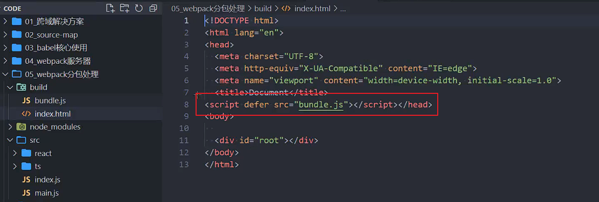

如果想要对 main.js 也进行打包，就需要进行多入口的配置，配置如下：

webpack.config.js

```javascript
module.exports = {
  entry: {
    index: {
      import: "./src/index.js",
    },
    main: {
      import: "./src/main.js",
    },
  },
  output: {
    path: path.resolve(__dirname, "./build"),
    // placeholder
    filename: "[name]-bundle.js",
  },
};
```

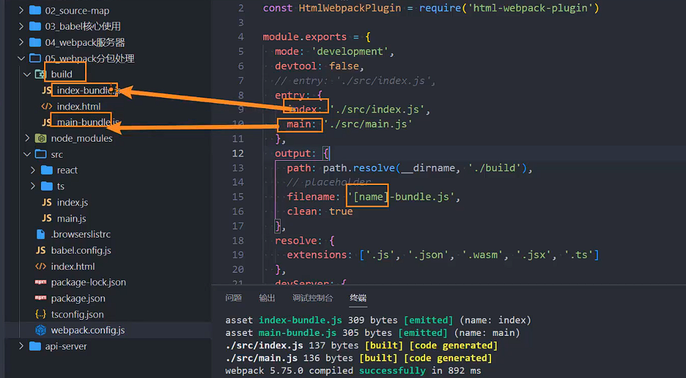


## **Entry Dependencies(入口依赖)**

**假如我们的 index.js 和 main.js 都依赖 axios**：

如果我们单纯的进行入口分离，那么打包后的两个 bunlde 都有会有一份 axios；

事实上我们可以对他们进行共享；

没有进行共享配置之前执行 npm run build 进行打包，打包之后在 index-bundle.js 和 main-bundle.js 中都会有 axios 的源代码，这样就造成了性能上的浪费。

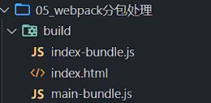

webpack.config.js

```javascript
module.exports = {
  entry: {
    index: {
      import: "./src/index.js",
      dependOn: "shared",
    },
    main: {
      import: "./src/main.js",
      dependOn: "shared",
    },
    shared: ["axios"],
  },
};
```

进行共享配置之后，再执行 npm run build，就会多出一个 shared-bundle.js，里面放的就是 axios 的依赖


## **动态导入(dynamic import)**

**另外一个代码拆分的方式是动态导入时，webpack 提供了两种实现动态导入的方式：**

第一种，使用 ECMAScript 中的 import() 语法来完成，也是目前推荐的方式；

第二种，使用 webpack 遗留的 require.ensure，目前已经不推荐使用；

**比如我们有一个模块 bar.js：**

该模块我们希望在代码运行过程中来加载它（比如判断一个条件成立时加载）；

因为我们并不确定这个模块中的代码一定会用到，所以最好拆分成一个独立的 js 文件；

这样可以保证不用到该内容时，浏览器不需要加载和处理该文件的 js 代码；

这个时候我们就可以使用动态导入；

**注意：使用动态导入 bar.js：**

在 webpack 中，通过动态导入获取到一个对象；

真正导出的内容，在该对象的 default 属性中，所以我们需要做一个简单的解构；

为了，作比较，我们首先在 src 下创建 router 文件夹，分别有 about.js 和 category.js

about.js

```javascript
const h1 = document.createElement("h1");
h1.textContent = "About Page";
document.body.append(h1);
```

category.js

```javascript
const h1 = document.createElement("h1");
h1.textContent = "Category Page";
document.body.append(h1);
```

接着在 main.js 中导入使用

```javascript
import "./router/about";
import "./router/category";

const btn1 = document.createElement("button");
const btn2 = document.createElement("button");
btn1.textContent = "关于";
btn2.textContent = "分类";
document.body.append(btn1);
document.body.append(btn2);
```

执行 npm run build 进行打包，about.js 和 category.js 是会被打包进去

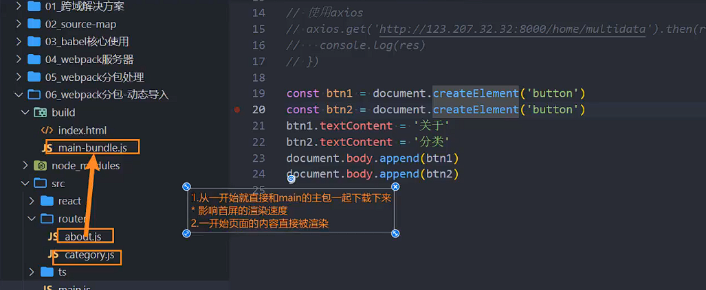

实际上我们应该是点击关于按钮的时候才把 about.js 引入，点击分类按钮把 category.js 引入，那么就可以下面这样

main.js

```javascript
const btn1 = document.createElement("button");
const btn2 = document.createElement("button");
btn1.textContent = "关于";
btn2.textContent = "分类";
document.body.append(btn1);
document.body.append(btn2);

btn1.onclick = function () {
  import("./router/about");
};

btn2.onclick = function () {
  import("./router/category");
};
```

这次再次执行 npm run build 打包，会多出来 2 个文件，这 2 个文件名字可以改，后面再说。

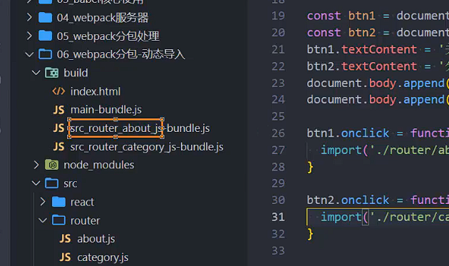

打开打包之后的 index.html，一开始不会加载打包之后的 src_router_about_js-bundle.js 和 src_router_category_js-bundle.js


而是等到点击的时候再加载对应的 js 文件。

动态导入可以拿到结果，如果想使用 about.js 里面的方法

about.js

```javascript
const h1 = document.createElement("h1");
h1.textContent = "About Page";
document.body.append(h1);

function about() {
  console.log("about function exec~");
}

export { about };
```

main.js

```javascript
...
btn1.onclick = function() {
  import('./router/about').then(res => {
    res.about()
  })
}
```

但是如果在 about.js 中使用的是 export default 的方式导出的话，使用方式又会有点不一样

about.js

```javascript
const name = "ABOUT";

export default name;
```

main.js

```javascript
btn1.onclick = function () {
  import("./router/about").then((res) => {
    res.default();
  });
};
```

## **动态导入的文件命名**

**动态导入的文件命名：**

因为动态导入通常是一定会打包成独立的文件的，所以并不会再 cacheGroups 中进行配置；

那么它的命名我们通常会在 output 中，通过 chunkFilename 属性来命名；

webpack.config.js

```javascript
module.exports = {
  output: {
    // 单独针对分包的文件进行命名
    chunkFilename: "[name]_chunk.js",
  },
};
```


除了加上 name，也可以加上 id，默认打包出来 id 和 name 的名字一样

```javascript
module.exports = {
  output: {
    // 单独针对分包的文件进行命名
    chunkFilename: "[id]_[name]_chunk.js",
  },
};
```


事实上，id 和 name 的名字都可以修改，id 的修改后面再讲，这里先学习怎么修改 name。

**但是，你会发现默认情况下我们获取到的 [name] 是和 id 的名称保持一致的**

如果我们希望修改 name 的值，可以通过 magic comments（魔法注释）的方式；

main.js

```javascript
btn1.onclick = function () {
  import(/* webpackChunkName: "about" */ "./router/about").then((res) => {
    res.about();
    res.default();
  });
};

btn2.onclick = function () {
  import(/* webpackChunkName: "category" */ "./router/category");
};
```

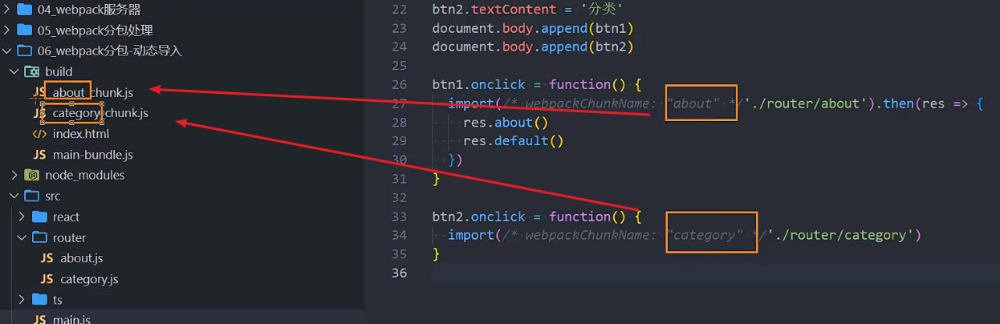

## **SplitChunks**

app.js 打包会打包到 main-bundle.js 中，动态引入的 about 和 category 也会打包生成对应的 chunk.js 文件，但是像第三方库，比如 Vue、React、axios 等，这些如果在 main.js 中使用，默认会被打包到 main-bundle.js 中，如果这些第三方库，想进行单独打包生成一个 vendor.js 文件，那么就可以使用 splitChunks。

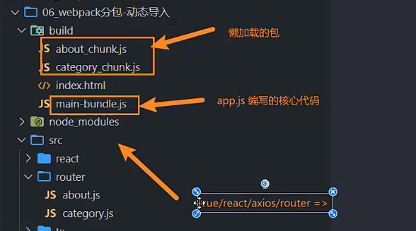

**另外一种分包的模式是 splitChunk，它底层是使用 SplitChunksPlugin 来实现的：**

因为该插件 webpack 已经默认安装和集成，所以我们并不需要单独安装和直接使用该插件；

只需要提供 SplitChunksPlugin 相关的配置信息即可；

**Webpack 提供了 SplitChunksPlugin 默认的配置，我们也可以手动来修改它的配置：**

比如默认配置中，chunks 仅仅针对于异步（async）请求，我们可以设置为 initial 或者 all；

```javascript
module.exports = {
  optimization: {
    splitChunks: {
      chunks: "all",
    },
  },
};
```

main.js

```javascript
import react from "react";
```

使用了 react，打包之后发现有个 vendors 的包

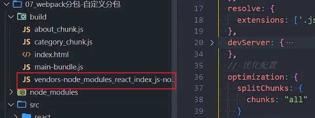

## **SplitChunks 自定义配置解析**

**Chunks:**

默认值是 async

另一个值是 initial，表示对通过的代码进行处理

all 表示对同步和异步代码都进行处理

**minSize：**

拆分包的大小, 至少为 minSize；

如果一个包拆分出来达不到 minSize,那么这个包就不会拆分；

**maxSize：**

将大于 maxSize 的包，拆分为不小于 minSize 的包；

**cacheGroups：**

用于对拆分的包就行分组，比如一个 lodash 在拆分之后，并不会立即打包，而是会等到有没有其他符合规则的包一起来打包；

test 属性：匹配符合规则的包；

name 属性：拆分包的 name 属性；

filename 属性：拆分包的名称，可以自己使用 placeholder 属性；

```javascript
module.exports = {
  optimization: {
    splitChunks: {
      chunks: "all",
      // 当一个包大于指定的大小时, 继续进行拆包
      // maxSize: 20000,
      // // 将包拆分成不小于minSize的包
      // minSize: 10000, // 默认值是20000即 20kb
      minSize: 10,

      // 自己对需要进行拆包的内容进行分包
      cacheGroups: {
        utils: {
          test: /utils/,
          filename: "[id]_utils.js",
        },
        vendors: {
          // /node_modules/
          // window上面 /\
          // mac上面 /
          test: /[\\/]node_modules[\\/]/,
          filename: "[id]_vendors.js",
        },
      },
    },
  },
};
```

这样打包之后，utlis 和 node_modules 下的所有文件都有对应的包

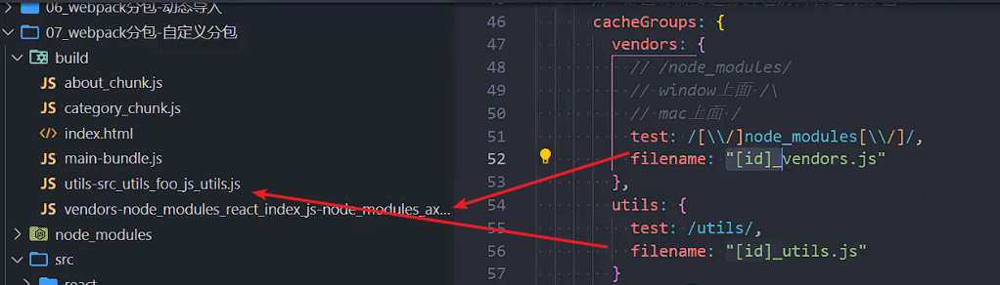

## **optimization.chunkIds 配置**

**optimization.chunkIds 配置用于告知 webpack 模块的 id 采用什么算法生成。**

**有三个比较常见的值：**

natural：按照数字的顺序使用 id；

named：development 下的默认值，一个可读的名称的 id；

deterministic：确定性的，在不同的编译中不变的短数字 id

- 在 webpack4 中是没有这个值的；
- 那个时候如果使用 natural，那么在一些编译发生变化时，就会有问题；

**最佳实践：**

开发过程中，我们推荐使用 named；

打包过程中，我们推荐使用 deterministic；

```javascript
module.exports = {
  mode: "production",
  devtool: false,
  optimization: {
    // 设置生成的chunkId的算法
    // development: named
    // production: deterministic(确定性)
    // webpack4中使用: natural
    chunkIds: "deterministic",
  },
};
```

使用 named 打包出来可以看到完整的名字

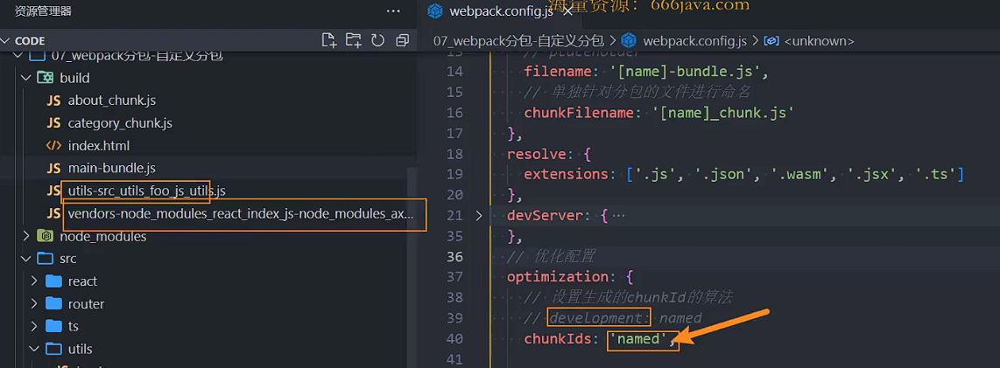

使用 deterministic 打包出来生成一个固定的数字，这个 deterministic 是 webpack5 新增的

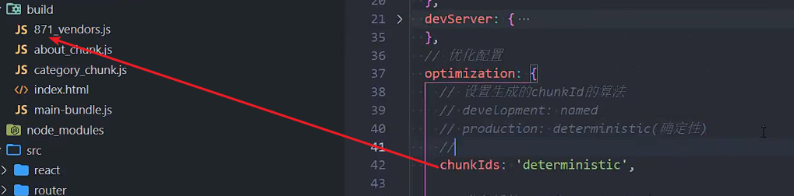

早期的 webpack4 没有 deterministic，使用的是 natural

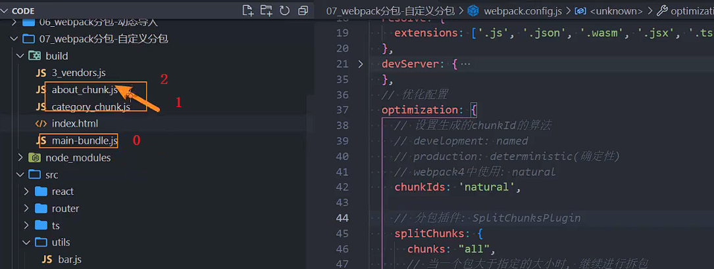

打包出来为什么是 3_vendors.js，是因为打包了其他三个文件，0 1 2，到 vendors.js，刚好是 3。

但是使用 natural 是有弊端的，假如没有引用 about.js，那么生成出来就会变成 2_vendors.js，这样会有点浪费性能，而使用 deterministic 就不会有这个问题，是个固定的数字。

## **optimization.runtimeChunk 配置**

**配置 runtime 相关的代码是否抽取到一个单独的 chunk 中：**

runtime 相关的代码指的是在运行环境中，对模块进行解析、加载、模块信息相关的代码；

比如我们的 component、bar 两个通过 import 函数相关的代码加载，就是通过 runtime 代码完成的；

**抽离出来后，有利于浏览器缓存的策略：**

比如我们修改了业务代码（main），那么 runtime 和 component、bar 的 chunk 是不需要重新加载的；

比如我们修改了 component、bar 的代码，那么 main 中的代码是不需要重新加载的；

设置的值：

- true/multiple：针对每个入口打包一个 runtime 文件；
- single：打包一个 runtime 文件；
- 对象：name 属性决定 runtimeChunk 的名称；

设置 true 和 multiple 的效果一样

```javascript
module.exports = {
  optimization: {
    runtimeChunk: true,
  },
};
```


设置成 single，只会打包一个 runtime.bundle.js


也可以设置成一个对象

```javascript
module.exports = {
  optimization: {
    runtimeChunk: {
      name: "runtime-why",
    },
  },
};
```


对象里面除了写 name，还支持传入 function，会打包出来 2 个文件

```javascript
module.exports = {
  optimization: {
    runtimeChunk: {
      name: function (entrypoint) {
        return `why-${entrypoint.name}`;
      },
    },
  },
};
```


## **Prefetch 和 Preload**

**webpack v4.6.0+ 增加了对预获取和预加载的支持。**

**在声明 import 时，使用下面这些内置指令，来告知浏览器：**

**prefetch**(预获取)：将来某些导航下可能需要的资源

**preload**(预加载)：当前导航下可能需要资源

**与 prefetch 指令相比，preload 指令有许多不同之处：**

preload chunk 会在父 chunk 加载时，以并行方式开始加载。prefetch chunk 会在父 chunk 加载结束后开始加载。

preload chunk 具有中等优先级，并立即下载。prefetch chunk 在浏览器闲置时下载。

preload chunk 会在父 chunk 中立即请求，用于当下时刻。prefetch chunk 会用于未来的某个时刻。

main.js

```javascript
btn1.onclick = function () {
  import(
    /* webpackChunkName: "about" */
    /* webpackPrefetch: true */
    "./router/about"
  ).then((res) => {
    res.about();
    res.default();
  });
};

btn2.onclick = function () {
  import(
    /* webpackChunkName: "category" */
    /* webpackPrefetch: true */
    "./router/category"
  );
};
```

打包之后打开浏览器就会看到这 2 个 js 文件也会被加载出来，但是顺序一定要在其他资源加载完毕之后。再次刷新浏览器获取是通过 prefetch cache 获取。


## **什么是 CDN？**

**CDN 称之为内容分发网络（Content Delivery Network 或 Content Distribution Network，缩写：CDN）**

它是指通过相互连接的网络系统，利用最靠近每个用户的服务器；

更快、更可靠地将音乐、图片、视频、应用程序及其他文件发送给用户；

来提供高性能、可扩展性及低成本的网络内容传递给用户；


在开发中，我们使用 CDN 主要是两种方式：

方式一：打包的所有静态资源，放到 CDN 服务器，

用户所有资源都是通过 CDN 服务器加载的；

方式二：一些第三方资源放到 CDN 服务器上；

## **购买 CDN 服务器**

**如果所有的静态资源都想要放到 CDN 服务器上，我们需要购买自己的 CDN 服务器；**

目前阿里、腾讯、亚马逊、Google 等都可以购买 CDN 服务器；

我们可以直接修改 publicPath，在打包时添加上自己的 CDN 地址；


## **第三方库的 CDN 服务器**

**通常一些比较出名的开源框架都会将打包后的源码放到一些比较出名的、免费的 CDN 服务器上：**

国际上使用比较多的是 unpkg、JSDelivr、cdnjs；

国内也有一个比较好用的 CDN 是 bootcdn；

**在项目中，我们如何去引入这些 CDN 呢？**

第一，在打包的时候我们不再需要对类似于 lodash 或者 dayjs 这些库进行打包；

第二，在 html 模块中，我们需要自己加入对应的 CDN 服务器地址；

**第一步，我们可以通过 webpack 配置，来排除一些库的打包：**

**第二步，在 html 模块中，加入 CDN 服务器地址：**

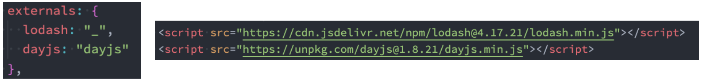

```javascript
module.exports = {
  // 排除某些包不需要进行打包
  externals: {
    react: "React",
    // key属性名: 排除的框架的名称
    // value值: 从CDN地址请求下来的js中提供对应的名称
    axios: "axios",
  },
};
```

index.html

```javascript
<!DOCTYPE html>
<html lang="en">
<head>
  <meta charset="UTF-8">
  <meta http-equiv="X-UA-Compatible" content="IE=edge">
  <meta name="viewport" content="width=device-width, initial-scale=1.0">
  <title>Document</title>
</head>
<body>

  <div id="root"></div>
  <script src="https://cdn.bootcdn.net/ajax/libs/axios/1.2.0/axios.min.js"></script>
  <script src="https://cdn.bootcdn.net/ajax/libs/react/18.2.0/umd/react.production.min.js"></script>
</body>
</html>
```

## **认识 shimming**

**shimming 是一个概念，是某一类功能的统称：**

shimming 翻译过来我们称之为 垫片，相当于给我们的代码填充一些垫片来处理一些问题；

比如我们现在依赖一个第三方的库，这个第三方的库本身依赖 lodash，但是默认没有对 lodash 进行导入（认为全局存在

lodash），那么我们就可以通过 ProvidePlugin 来实现 shimming 的效果；

**注意：webpack 并不推荐随意的使用 shimming**

Webpack 背后的整个理念是使前端开发更加模块化；

也就是说，需要编写具有封闭性的、不存在隐含依赖（比如全局变量）的彼此隔离的模块；

## **Shimming 预支全局变量**

**目前我们的 lodash、dayjs 都使用了 CDN 进行引入，所以相当于在全局是可以使用\_和 dayjs 的**

假如一个文件中我们使用了 axios，但是没有对它进行引入，那么下面的代码是会报错的；

**我们可以通过使用 ProvidePlugin 来实现 shimming 的效果：**

ProvidePlugin 能够帮助我们在每个模块中，通过一个变量来获取一个 package；

如果 webpack 看到这个模块，它将在最终的 bundle 中引入这个模块；

另外 ProvidePlugin 是 webpack 默认的一个插件，所以不需要专门导入；

**这段代码的本质是告诉 webpack：**

如果你遇到了至少一处用到 axios 变量的模块实例，那请你将 axios package 引入进来，并将其提供给需要用到它的模块。

假设 abc.js 是一个第三方库，但是这个第三方库没有引用 axios 和 dayjs

```javascript
// import axios from 'axios'
// import dayjs from 'dayjs'

axios.get("http://123.207.32.32:8000/home/multidata").then((res) => {
  console.log(res);
});

// console.log(axios)

console.log(dayjs(new Date()).format("YYYY-MM-DD HH:mm:ss"));
```

那么就需要使用 ProvidePlugin 进行配置：

```javascript
const { ProvidePlugin } = require("webpack");

module.exports = {
  plugins: [
    new ProvidePlugin({
      axios: ["axios", "default"], // 注意，这里使用axios.get本质上使用的是axios.default.get
      dayjs: "dayjs",
    }),
  ],
};
```

axios 最新版的导出方式改为 axios as default

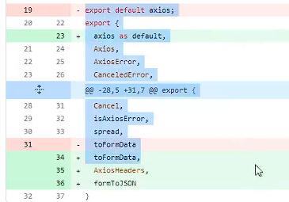

## **MiniCssExtractPlugin**

**MiniCssExtractPlugin 可以帮助我们将 css 提取到一个独立的 css 文件中，该插件需要在 webpack4+才可以使用。**

**首先，我们需要安装 mini-css-extract-plugin：**

```json
npm install mini-css-extract-plugin -D
```

**配置 rules 和 plugins：**

main.js

```javascript
import "./css/style.css";
```

webpack.config.js

```javascript
const MiniCssExtractPlugin = require("mini-css-extract-plugin");

module.exports = {
  module: {
    rules: [
      {
        test: /\.css$/,
        use: [
          // 'style-loader', 开发阶段
          MiniCssExtractPlugin.loader, // 生产阶段
          "css-loader",
        ],
      },
    ],
  },
  plugins: [
    // 完成css的提取
    new MiniCssExtractPlugin({
      filename: "css/[name].css",
      chunkFilename: "css/[name]_chunk.css", // 如果有动态引入的css可以配置
    }),
  ],
};
```

前面加上 css/打包之后就会生成一个 css 文件夹，之前的 js 分包配置也是可以加上 js/，这样打包之后如下结构：

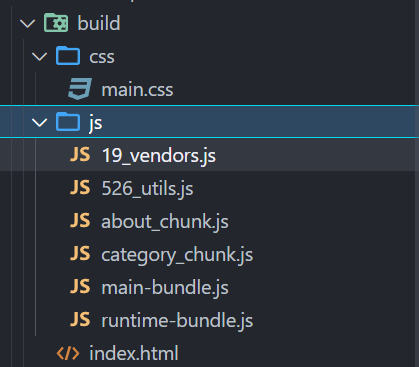

## **Hash、ContentHash、ChunkHash**

**在我们给打包的文件进行命名的时候，会使用 placeholder，placeholder 中有几个属性比较相似：**

hash、chunkhash、contenthash

hash 本身是通过 MD4 的散列函数处理后，生成一个 128 位的 hash 值（32 个十六进制）；

**hash 值的生成和整个项目有关系：**

比如我们现在有两个入口 index.js 和 main.js；

它们分别会输出到不同的 bundle 文件中，并且在文件名称中我们有使用 hash；

这个时候，如果修改了 index.js 文件中的内容，那么 hash 会发生变化；

那就意味着两个文件的名称都会发生变化；

**chunkhash 可以有效的解决上面的问题，它会根据不同的入口进行借来解析来生成 hash 值：**

比如我们修改了 index.js，那么 main.js 的 chunkhash 是不会发生改变的；

**contenthash 表示生成的文件 hash 名称，只和内容有关系：**

比如我们的 index.js，引入了一个 style.css，style.css 有被抽取到一个独立的 css 文件中；

这个 css 文件在命名时，如果我们使用的是 chunkhash；

那么当 index.js 文件的内容发生变化时，css 文件的命名也会发生变化；

这个时候我们可以使用 contenthash；

webpack.config.js

```javascript
const path = require("path");
const MiniCssExtractPlugin = require("mini-css-extract-plugin");

module.exports = {
  mode: "development",
  entry: {
    index: "./src/index.js",
    main: "./src/main.js",
  },
  output: {
    clean: true,
    path: path.resolve(__dirname, "./build"),
    filename: "[name]_[contenthash]_bundle.js",
    chunkFilename: "[contenthash]_chunk.js",
  },
  module: {
    rules: [
      {
        test: /\.css$/,
        use: [MiniCssExtractPlugin.loader, "css-loader"],
      },
    ],
  },
  plugins: [
    new MiniCssExtractPlugin({
      filename: "[contenthash]_[name].css",
    }),
  ],
};
```

## **认识 DLL 库（了解）**

**DLL 是什么呢？**

DLL 全程是动态链接库（Dynamic Link Library），是为软件在 Windows 中实现共享函数库的一种实现方式；

那么 webpack 中也有内置 DLL 的功能，它指的是我们可以将能够共享，并且不经常改变的代码，抽取成一个共享的库；

这个库在之后编译的过程中，会被引入到其他项目的代码中；

**DDL 库的使用分为两步:**

第一步：打包一个 DLL 库；

第二步：项目中引入 DLL 库；

**注意：在升级到 webpack4 之后，React 和 Vue 脚手架都移除了 DLL 库（下面的 vue 作者的回复），所以知道有这么一个概念即**

**可。**

## **打包一个 DLL 库**

如何打包一个 DLLPlugin？（创建一个新的项目）

webpack 帮助我们内置了一个 DllPlugin 可以帮助我们打包一个 DLL 的库文件；


webpack.dll.js

```javascript
const path = require("path");
const webpack = require("webpack");
const TerserPlugin = require("terser-webpack-plugin");

module.exports = {
  entry: {
    react: ["react", "react-dom"],
  },
  output: {
    path: path.resolve(__dirname, "./dll"),
    filename: "dll_[name].js",
    library: "dll_[name]",
  },
  optimization: {
    minimizer: [
      new TerserPlugin({
        extractComments: false,
      }),
    ],
  },
  plugins: [
    new webpack.DllPlugin({
      name: "dll_[name]",
      path: path.resolve(__dirname, "./dll/[name].manifest.json"),
    }),
  ],
};
```

package.json

```json
{
  "scripts": {
    "dll": "webpack --config ./webpack.dll.js"
  }
}
```

## **使用打包的 DLL 库**

如果我们在我们的代码中使用了 react、react-dom，我们有配置 splitChunks 的情况下，他们会进行分包，打包到

一个独立的 chunk 中。

但是现在我们有了 dll_react，不再需要单独去打包它们，可以直接去引用 dll_react 即可：

第一步：通过 DllReferencePlugin 插件告知要使用的 DLL 库；

第二步：通过 AddAssetHtmlPlugin 插件，将我们打包的 DLL 库引入到 Html 模块中；


config/webpack.comm.js

```javascript
const resolveApp = require("./paths");
const AddAssetHtmlPlugin = require("add-asset-html-webpack-plugin");

...

plugins: [
  new webpack.DllReferencePlugin({
    context: resolveApp("./"),
    manifest: resolveApp("./dll/react.manifest.json")
  }),
  new AddAssetHtmlPlugin({
    filepath: resolveApp('./dll/dll_react.js')
  })
]
```

path.js

```javascript
const path = require("path");

// node中的api
const appDir = process.cwd();
const resolveApp = (relativePath) => path.resolve(appDir, relativePath);

module.exports = resolveApp;
```

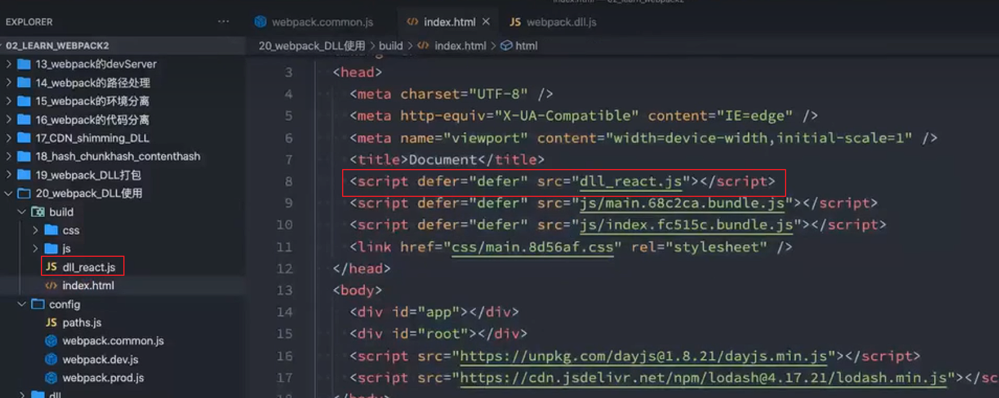
