## **Terser 介绍和安装**

**什么是 Terser 呢？**

Terser 是一个 JavaScript 的解释（Parser）、Mangler（绞肉机）/Compressor（压缩机）的工具集；

早期我们会使用 uglify-js 来压缩、丑化我们的 JavaScript 代码，但是目前已经不再维护，并且不支持 ES6+的语法；

Terser 是从 uglify-es fork 过来的，并且保留它原来的大部分 API 以及适配 uglify-es 和 uglify-js@3 等；

**也就是说，Terser 可以帮助我们压缩、丑化我们的代码，让我们的 bundle 变得更小。**

**因为 Terser 是一个独立的工具，所以它可以单独安装：**

```json
# 全局安装
npm install terser -g
# 局部安装
npm install terser -D
```

## **命令行使用 Terser**

**我们可以在命令行中使用 Terser：**

```json
terser [input files] [options]
# 举例说明
terser js/file1.js -o foo.min.js -c -m
```

**我们这里来讲解几个 Compress option 和 Mangle(乱砍) option：**

因为他们的配置非常多，我们不可能一个个解析，更多的查看文档即可；

https://github.com/terser/terser#compress-options

https://github.com/terser/terser#mangle-options

## **Compress 和 Mangle 的 options**

**Compress option：**

arrows：class 或者 object 中的函数，转换成箭头函数；

arguments：将函数中使用 arguments[index]转成对应的形参名称；

dead_code：移除不可达的代码（tree shaking）；

其他属性可以查看文档；

**Mangle option**

toplevel：默认值是 false，顶层作用域中的变量名称，进行丑化（转换）；

keep_classnames：默认值是 false，是否保持依赖的类名称；

keep_fnames：默认值是 false，是否保持原来的函数名称；

其他属性可以查看文档；

```json
npx terser ./src/abc.js -o abc.min.js -c
arrows,arguments=true,dead_code -m
toplevel=true,keep_classnames=true,keep_fnames=true
```

abc.js

```javascript
const message = "Hello World";
console.log(message);

function foo(num1, num2) {
  console.log("foo function exec~");
  console.log(arguments[0], arguments[1]);
}
foo();

const obj = {
  name: "why",
  bar() {
    return "bar";
  },
};

// 不可达的代码
if (false) {
  console.log("哈哈哈哈哈");
  console.log("呵呵呵呵呵");
}

class Person {}
const p = new Person();
```

执行 npx terser ./src/abc.js -o abc.min.js，就会在同级目录下多一个 abc.min.js 的文件，这个文件是 abc.js 压缩过后的代码。

abc.min.js，实际上是被压缩了，这里为了看的更清楚，格式化一下

```javascript
const o = "Hello World";
function foo(o, n) {
  console.log("foo function exec~"), console.log(o, n);
}
console.log(o), foo();
const n = { name: "why", bar: () => "bar" };
class Person {}
const c = new Person();
```

arrows=true 之后，bar 函数就变成了箭头函数；

arguments=true 之后，就可以打印 num1 和 num2；

dead_code=true 之后，if (false)的代码就没了；

toplevel=true 之后，代码就进行了丑化，一些变量名比如 message 就变成了 o；

但是如果不想函数名被压缩，可以设置 keep_classnames=true，可以发现 foo 函数名还在；

不想类名被压缩，设置 keep_fnames=true，类名 Person 还在。

## **Terser 在 webpack 中配置**

**真实开发中，我们不需要手动的通过 terser 来处理我们的代码，我们可以直接通过 webpack 来处理：**

在 webpack 中有一个 minimizer 属性，在 production 模式下，默认就是使用 TerserPlugin 来处理我们的代码的；

如果我们对默认的配置不满意，也可以自己来创建 TerserPlugin 的实例，并且覆盖相关的配置；

**首先，我们需要打开 minimize，让其对我们的代码进行压缩（默认 production 模式下已经打开了）**

**其次，我们可以在 minimizer 创建一个 TerserPlugin：**

extractComments：默认值为 true，表示会将注释抽取到一个单独的文件中；

在开发中，我们不希望保留这个注释时，可以设置为 false；

parallel：使用多进程并发运行提高构建的速度，默认值是 true

- 并发运行的默认数量： os.cpus().length - 1；
- 我们也可以设置自己的个数，但是使用默认值即可；

terserOptions：设置我们的 terser 相关的配置

- compress：设置压缩相关的选项；
- mangle：设置丑化相关的选项，可以直接设置为 true；
- toplevel：顶层变量是否进行转换；
- keep_classnames：保留类的名称；
- keep_fnames：保留函数的名称；

```javascript
const TerserPlugin = require("terser-webpack-plugin");

module.exports = {
  optimization: {
    minimize: true,
    // 代码优化: TerserPlugin => 让代码更加简单 => Terser
    minimizer: [
      // JS压缩的插件: TerserPlugin
      new TerserPlugin({
        extractComments: false,
        terserOptions: {
          compress: {
            arguments: true,
            unused: true,
          },
          mangle: true,
          // toplevel: false
          keep_fnames: true,
        },
      }),
    ],
  },
};
```

unused（默认为 true，为 true 就会进行 tree shaking，删除无效代码）设置为 false 的意思是，比如下面的 abc.js

```javascript
function sum(num1, num2) {
  return num1 + num2;
}
```

定义了函数但是没有被使用，如果也想要被打包，就可以设置 unused 设置为 false。

## **CSS 的压缩**

**另一个代码的压缩是 CSS：**

CSS 压缩通常是去除无用的空格等，因为很难去修改选择器、属性的名称、值等；

CSS 的压缩我们可以使用另外一个插件：css-minimizer-webpack-plugin；

css-minimizer-webpack-plugin 是使用 cssnano 工具来优化、压缩 CSS（也可以单独使用）；

**第一步，安装 css-minimizer-webpack-plugin：**

```json
npm install css-minimizer-webpack-plugin -D
```

**第二步，在 optimization.minimizer 中配置**

```javascript
const CSSMinimizerPlugin = require("css-minimizer-webpack-plugin");

module.exports = {
  optimization: {
    minimize: true,
    // 代码优化: TerserPlugin => 让代码更加简单 => Terser
    minimizer: [
      // JS压缩的插件: TerserPlugin
      new TerserPlugin({
        extractComments: false,
        terserOptions: {
          compress: {
            arguments: true,
            unused: true,
          },
          mangle: true,
          // toplevel: false
          keep_fnames: true,
        },
      }),
      // CSS压缩的插件: CSSMinimizerPlugin
      new CSSMinimizerPlugin({
        // parallel: true // 默认是true，可以不用配置
      }),
    ],
  },
};
```

## 导出公共配置的函数

目前我们对 webpack 进行配置是在 webpack.config.js 中，如果我们想自定义配置，比如放在 config/comm.config.js，就要进行如下配置：

之前的 webpack.config.js 配置如下：

```javascript
const path = require("path");
const HtmlWebpackPlugin = require("html-webpack-plugin");
const TerserPlugin = require("terser-webpack-plugin");
const { ProvidePlugin } = require("webpack");
const MiniCssExtractPlugin = require("mini-css-extract-plugin");
const CSSMinimizerPlugin = require("css-minimizer-webpack-plugin");

module.exports = {
  mode: "production",
  devtool: false,
  // entry: './src/index.js',
  entry: "./src/main.js",
  output: {
    clean: true,
    path: path.resolve(__dirname, "./build"),
    // placeholder
    filename: "js/[name]-bundle.js",
    // 单独针对分包的文件进行命名
    chunkFilename: "js/[name]_chunk.js",
    // publicPath: 'http://coderwhycdn.com/'
  },
  // 排除某些包不需要进行打包
  // externals: {
  //   react: "React",
  //   // key属性名: 排除的框架的名称
  //   // value值: 从CDN地址请求下来的js中提供对应的名称
  //   axios: "axios"
  // },
  resolve: {
    extensions: [".js", ".json", ".wasm", ".jsx", ".ts"],
  },
  devServer: {
    static: ["public", "content"],
    port: 3000,
    compress: true,
    proxy: {
      "/api": {
        target: "http://localhost:9000",
        pathRewrite: {
          "^/api": "",
        },
        changeOrigin: true,
      },
    },
    historyApiFallback: true,
  },
  // 优化配置
  optimization: {
    // 设置生成的chunkId的算法
    // development: named
    // production: deterministic(确定性)
    // webpack4中使用: natural
    chunkIds: "deterministic",
    // runtime的代码是否抽取到单独的包中(早Vue2脚手架中)
    runtimeChunk: {
      name: "runtime",
    },
    // 分包插件: SplitChunksPlugin
    splitChunks: {
      chunks: "all",
      // 当一个包大于指定的大小时, 继续进行拆包
      // maxSize: 20000,
      // // 将包拆分成不小于minSize的包
      // minSize: 10000,
      minSize: 10,

      // 自己对需要进行拆包的内容进行分包
      cacheGroups: {
        utils: {
          test: /utils/,
          filename: "js/[id]_utils.js",
        },
        vendors: {
          // /node_modules/
          // window上面 /\
          // mac上面 /
          test: /[\\/]node_modules[\\/]/,
          filename: "js/[id]_vendors.js",
        },
      },
    },
    minimize: true,
    // 代码优化: TerserPlugin => 让代码更加简单 => Terser
    minimizer: [
      // JS压缩的插件: TerserPlugin
      new TerserPlugin({
        extractComments: false,
        terserOptions: {
          compress: {
            arguments: true,
            unused: true,
          },
          mangle: true,
          // toplevel: false
          keep_fnames: true,
        },
      }),
      // CSS压缩的插件: CSSMinimizerPlugin
      new CSSMinimizerPlugin({
        // parallel: true
      }),
    ],
  },
  module: {
    rules: [
      {
        test: /\.jsx?$/,
        use: {
          loader: "babel-loader",
        },
      },
      {
        test: /\.ts$/,
        use: "babel-loader",
      },
      {
        test: /\.css$/,
        use: [
          // 'style-loader', 开发阶段
          MiniCssExtractPlugin.loader, // 生产阶段
          "css-loader",
        ],
      },
    ],
  },
  plugins: [
    new HtmlWebpackPlugin({
      template: "./index.html",
    }),
    new ProvidePlugin({
      axios: ["axios", "default"],
      // get: ['axios', 'get'],
      dayjs: "dayjs",
    }),
    // 完成css的提取
    new MiniCssExtractPlugin({
      filename: "css/[name].css",
      chunkFilename: "css/[name]_chunk.css",
    }),
  ],
};
```

我们可以把 module.exports 的对象单独抽取为一个变量，变成下面这样

这里有个需要注意的点：output 路径需要改为../build

```javascript
const commonConfig = {
  ...
  output: {
    path: path.resolve(__dirname, '../build'), // 这里配置需要修改
  },
  ...
}

// webpack允许导出一个函数
module.exports = function(env) {
  const isProduction = env.production
  if (isProduction) {
    console.log("生产环境")
  } else {
    console.log("开发环境")
  }
  return commonConfig
}
```

还有需要修改 package.json 的配置

```json
{
  "scripts": {
    "build": "webpack --config ./config/comm.config.js --env production",
    "serve": "webpack serve --config ./config/comm.config.js --env development"
  }
}
```

这样执行 npm run build，isProduction 为 true 是生产环境，npm run server，isProduction 为 false 是开发环境。

## 开发和生产环境分离

首先，需要安装 webpack-merge

```json
npm install webpack-merge -D
```

config/comm.config.js

开发和生产环境都需要的配置放在 config/comm.config.js 中

```javascript
const path = require("path");
const HtmlWebpackPlugin = require("html-webpack-plugin");
const { ProvidePlugin } = require("webpack");
const MiniCssExtractPlugin = require("mini-css-extract-plugin");
const { merge } = require("webpack-merge");
const devConfig = require("./dev.config");
const prodConfig = require("./prod.config");

/**
 * 抽取开发和生产环境的配置文件
 * 1.将配置文件导出的是一个函数, 而不是一个对象
 * 2.从上向下查看所有的配置属性应该属于哪一个文件
 * * comm/dev/prod
 * 3.针对单独的配置文件进行定制化
 * * css加载: 使用的不同的loader可以根据isProduction动态获取
 */

const getCommonConfig = function (isProdution) {
  return {
    entry: "./src/main.js",
    output: {
      clean: true,
      path: path.resolve(__dirname, "../build"),
      // placeholder
      filename: "js/[name]-bundle.js",
      // 单独针对分包的文件进行命名
      chunkFilename: "js/[name]_chunk.js",
      // publicPath: 'http://coderwhycdn.com/'
    },
    resolve: {
      extensions: [".js", ".json", ".wasm", ".jsx", ".ts"],
    },
    module: {
      rules: [
        {
          test: /\.jsx?$/,
          use: {
            loader: "babel-loader",
          },
        },
        {
          test: /\.ts$/,
          use: "babel-loader",
        },
        {
          test: /\.css$/,
          use: [
            // // 'style-loader', //开发阶段
            // MiniCssExtractPlugin.loader, // 生产阶段
            isProdution ? MiniCssExtractPlugin.loader : "style-loader",
            "css-loader",
          ],
        },
      ],
    },
    plugins: [
      new HtmlWebpackPlugin({
        template: "./index.html",
      }),
      new ProvidePlugin({
        axios: ["axios", "default"],
        // get: ['axios', 'get'],
        dayjs: "dayjs",
      }),
    ],
  };
};

// webpack允许导出一个函数
module.exports = function (env) {
  const isProduction = env.production;
  let mergeConfig = isProduction ? prodConfig : devConfig;
  return merge(getCommonConfig(isProduction), mergeConfig);
};
```

config/dev.config.js

开发环境配置

```javascript
module.exports = {
  mode: "development",
  devServer: {
    static: ["public", "content"],
    port: 3000,
    compress: true,
    proxy: {
      "/api": {
        target: "http://localhost:9000",
        pathRewrite: {
          "^/api": "",
        },
        changeOrigin: true,
      },
    },
    historyApiFallback: true,
  },
  plugins: [],
};
```

config/prod.config.js

```javascript
const TerserPlugin = require("terser-webpack-plugin");
const MiniCssExtractPlugin = require("mini-css-extract-plugin");
const CSSMinimizerPlugin = require("css-minimizer-webpack-plugin");

module.exports = {
  mode: "production",
  // 优化配置
  optimization: {
    chunkIds: "deterministic",
    // runtime的代码是否抽取到单独的包中(早Vue2脚手架中)
    runtimeChunk: {
      name: "runtime",
    },
    // 分包插件: SplitChunksPlugin
    splitChunks: {
      chunks: "all",
      minSize: 10,

      // 自己对需要进行拆包的内容进行分包
      cacheGroups: {
        utils: {
          test: /utils/,
          filename: "js/[id]_utils.js",
        },
        vendors: {
          // /node_modules/
          // window上面 /\
          // mac上面 /
          test: /[\\/]node_modules[\\/]/,
          filename: "js/[id]_vendors.js",
        },
      },
    },
    minimize: true,
    // 代码优化: TerserPlugin => 让代码更加简单 => Terser
    minimizer: [
      // JS压缩的插件: TerserPlugin
      new TerserPlugin({
        extractComments: false,
        terserOptions: {
          compress: {
            arguments: true,
            unused: true,
          },
          mangle: true,
          // toplevel: false
          keep_fnames: true,
        },
      }),
      // CSS压缩的插件: CSSMinimizerPlugin
      new CSSMinimizerPlugin({
        // parallel: true
      }),
    ],
  },
  plugins: [
    // 完成css的提取
    new MiniCssExtractPlugin({
      filename: "css/[name].css",
      chunkFilename: "css/[name]_chunk.css",
    }),
  ],
};
```

## **什么是 Tree Shaking**

**什么是 Tree Shaking 呢？**

Tree Shaking 是一个术语，在计算机中表示消除死代码（dead_code）；

最早的想法起源于 LISP，用于消除未调用的代码（纯函数无副作用，可以放心的消除，这也是为什么要求我们在进行函数式

编程时，尽量使用纯函数的原因之一）；

后来 Tree Shaking 也被应用于其他的语言，比如 JavaScript、Dart；

**JavaScript 的 Tree Shaking：**

对 JavaScript 进行 Tree Shaking 是源自打包工具 rollup（后面我们也会讲的构建工具）；

这是因为 Tree Shaking 依赖于 ES Module 的静态语法分析（不执行任何的代码，可以明确知道模块的依赖关系）；

webpack2 正式内置支持了 ES2015 模块，和检测未使用模块的能力；

在 webpack4 正式扩展了这个能力，并且通过 package.json 的 sideEffects 属性作为标记，告知 webpack 在编译时，哪里文

件可以安全的删除掉；

webpack5 中，也提供了对部分 CommonJS 的 tree shaking 的支持；

https://github.com/webpack/changelog-v5#commonjs-tree-shaking

## **webpack 实现 Tree Shaking**

**事实上 webpack 实现 Tree Shaking 采用了两种不同的方案：**

usedExports：通过标记某些函数是否被使用，之后通过 Terser 来进行优化的；

sideEffects：跳过整个模块/文件，直接查看该文件是否有副作用；

## **usedExports**

**将 mode 设置为 development 模式：**

为了可以看到 usedExports 带来的效果，我们需要设置为 development 模式

因为在 production 模式下，webpack 默认的一些优化会带来很大的影响。

**设置 usedExports 为 true 和 false 对比打包后的代码：**

在 usedExports 设置为 true 时，会有一段注释：unused harmony export mul；

这段注释的意义是什么呢？告知 Terser 在优化时，可以删除掉这段代码；

**这个时候，我们讲 minimize 设置 true：**

usedExports 设置为 false 时，mul 函数没有被移除掉；

usedExports 设置为 true 时，mul 函数有被移除掉；

**所以，usedExports 实现 Tree Shaking 是结合 Terser 来完成的。**

生成环境 usedExports 默认为 true

demo/math.js

```javascript
export function sum(num1, num2) {
  return num1 + num2;
}

export function mul(num1, num2) {
  return num1 * num2;
}
```

demo.js

```javascript
import { sum } from "./demo/math";

console.log(sum(20, 30));
```

其中 sum 函数被引用了，mul 函数没有被引用。

```javascript
module.exports = {
  mode: "development",
  devtool: false,
  // 优化配置
  optimization: {
    // 导入模块时, 分析模块中的哪些函数有被使用, 哪些函数没有被使用.
    usedExports: true,
  },
};
```

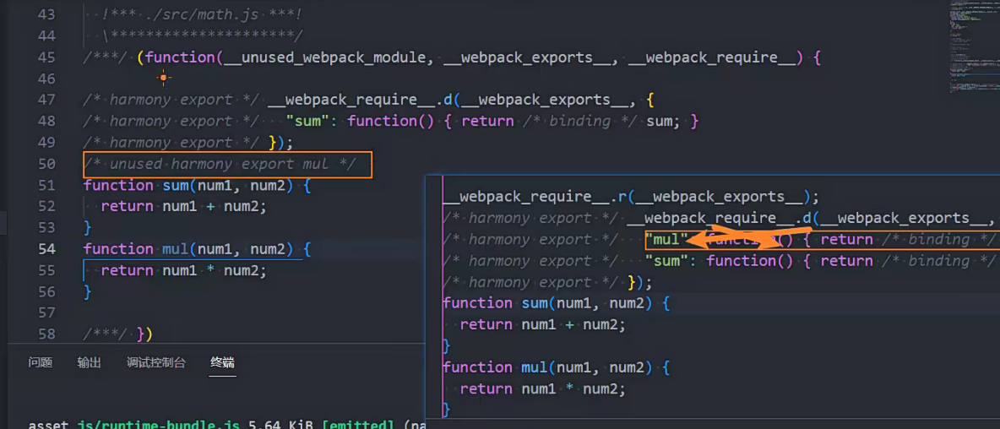

从上图可以看到设置 usedExports 为 true 之后，mul 函数就被移除了。

## **sideEffects**

**sideEffects 用于告知 webpack compiler 哪些模块时有副作用的：**

副作用的意思是这里面的代码有执行一些特殊的任务，不能仅仅通过 export 来判断这段代码的意义；

副作用的问题，在讲 React 的纯函数时是有讲过的；

**在 package.json 中设置 sideEffects 的值：**

如果我们将 sideEffects 设置为 false，就是告知 webpack 可以安全的删除未用到的 exports；

如果有一些我们希望保留，可以设置为数组；

**比如我们有一个 format.js、style.css 文件：**

该文件在导入时没有使用任何的变量来接受；

那么打包后的文件，不会保留 format.js、style.css 相关的任何代码；

demo/parse-lyric.js

```javascript
export function parseLyric(lyricString) {
  return [];
}

export function test() {}

// 模块的副作用代码
// 推荐: 在平时编写模块的时候, 尽量编写纯模块
window.lyric = "哈哈哈哈哈";
```

demo.js

```javascript
// 2.只导入模块, 但是没有引入任何的内容
import "./demo/parse-lyric";
```

打包之后发现 parseLyric 和 test 都被删除了，但是 window.lyric 并没有被删除，因为这个是有副作用的代码。

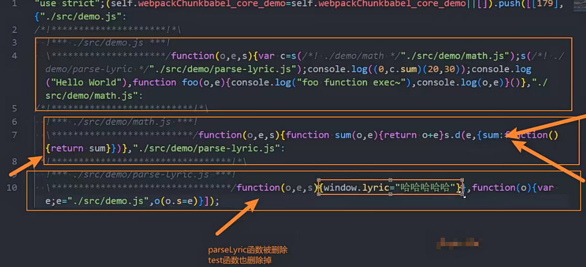

假如，我们把 demo/parse-lyric.js 中的

```javascript
window.lyric = "哈哈哈哈哈";
```

删掉，那么再次打包，会发现整个模块依然没有被删除掉

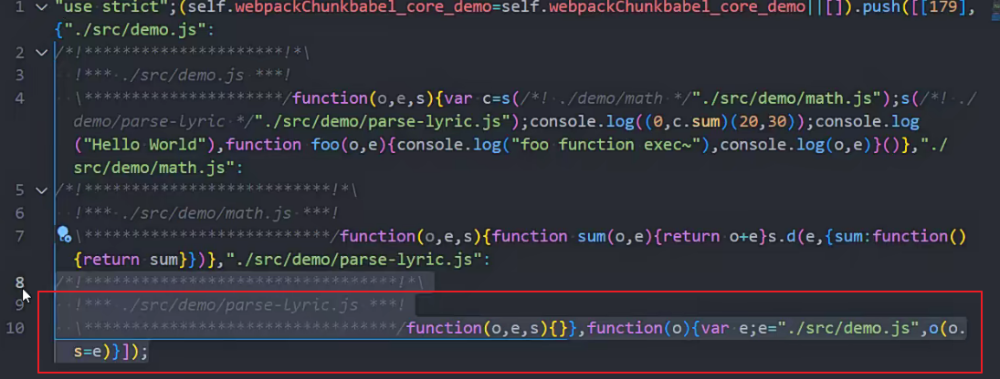

如果我们想将整个模块删除掉，可以在 package.json 中进行配置

package.json

```json
{
  "sideEffects": false
}
```

设置为 false 告诉 webpack，所有的文件都没有副作用，那么再次打包整个文件就会被删除。

但是假如

```javascript
window.lyric = "哈哈哈哈哈";
```

这行副作用代码没有被删除，别的地方需要使用到，设置 sideEffects 为 false，就会把整个文件删除，那么引用的地方就会报错。

所以，推荐: 在平时编写模块的时候, 尽量编写纯模块，不要有副作用代码。

当然，我们也可以给 sideEffects 配置为一个数组

package.json

```json
{
  "sideEffects": [
    "./src/demo/parse-lyric.js" // 告诉webpack这个文件存在副作用代码，这样打包的时候不会被tree shaking掉
  ]
}
```

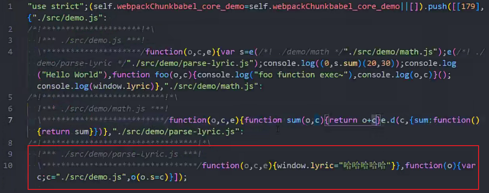

我们除了引入 js，还会引入 css

```javascript
// 3.import css文件
import "./css/style.css";
```

假如 sideEffects 设置为 false，那么 css 也会被 tree shaking 掉，所以，也需要在 sideEffects 中把 css 配置进去

```json
{
  "sideEffects": ["*.css"]
}
```

这样 css 就会被保留下来。

## **Webpack 中 tree shaking 的设置**

**所以，如何在项目中对 JavaScript 的代码进行 TreeShaking 呢（生成环境）？**

在 optimization 中配置 usedExports 为 true，来帮助 Terser 进行优化；

在 package.json 中配置 sideEffects，直接对模块进行优化；

## **CSS 实现 Tree Shaking**

**上面我们学习的都是关于 JavaScript 的 Tree Shaking，那么 CSS 是否也可以进行 Tree Shaking 操作呢？**

CSS 的 Tree Shaking 需要借助于一些其他的插件；

在早期的时候，我们会使用 PurifyCss 插件来完成 CSS 的 tree shaking，但是目前该库已经不再维护了（最新更新也是在 4 年前

了）；

目前我们可以使用另外一个库来完成 CSS 的 Tree Shaking：PurgeCSS，也是一个帮助我们删除未使用的 CSS 的工具；

**安装 PurgeCss 的 webpack 插件：**

```json
npm install purgecss-webpack-plugin -D
```

## **配置 PurgeCss**

**配置这个插件（生产环境）：**

paths：表示要检测哪些目录下的内容需要被分析，这里我们可以使用 glob；

注意：这里安装的 glob 如果使用最新的 8.x 版本会有问题，所以我们安装 7.x 的版本

8.x 的版本打印

```json
glob.sync(`${path.resolve(__dirname, '../src')}/**/*`, { nodir: true })
```

发现是个空数组，也就找不到文件

```json
npm install glob@7.* -D
```

默认情况下，Purgecss 会将我们的 html 标签的样式移除掉，如果我们希望保留，可以添加一个 safelist 的属性；

```javascript
const glob = require("glob");
const { PurgeCSSPlugin } = require("purgecss-webpack-plugin");

module.exports = {
  plugins: [
    // 对CSS进行TreeShaking
    new PurgeCSSPlugin({
      // 找到src的所有文件，但是不包括文件夹(nodir: true)
      paths: glob.sync(`${path.resolve(__dirname, "../src")}/**/*`, {
        nodir: true,
      }),
      safelist: function () {
        return {
          standard: ["html", "body"], // 保留html和body的样式
        };
      },
    }),
  ],
};
```

**purgecss 也可以对 less 文件进行处理（所以它是对打包后的 css 进行 tree shaking 操作）；**

## **Scope Hoisting**

**什么是 Scope Hoisting 呢？**

Scope Hoisting 从 webpack3 开始增加的一个新功能；

功能是对作用域进行提升，并且让 webpack 打包后的代码更小、运行更快；

**默认情况下 webpack 打包会有很多的函数作用域，包括一些（比如最外层的）IIFE：**

无论是从最开始的代码运行，还是加载一个模块，都需要执行一系列的函数；

Scope Hoisting 可以将函数合并到一个模块中来运行；

**使用 Scope Hoisting 非常的简单，webpack 已经内置了对应的模块：**

在 production 模式下，默认这个模块就会启用；

在 development 模式下，我们需要自己来打开该模块；

```javascript
module.exports = {
  mode: "development",
  devtool: false,
  plugins: [
    // 作用域提升
    new webpack.optimize.ModuleConcatenationPlugin(),
  ],
};
```

没有配置之前，想要拿到 sum 函数，需要跨作用域。

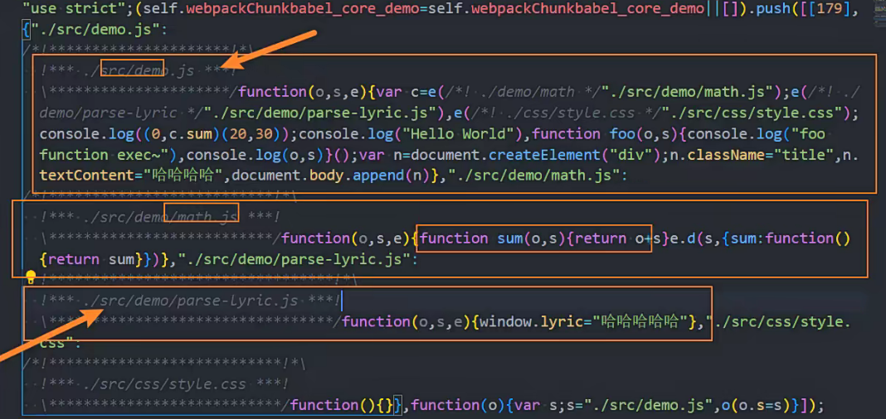

配置之后在一个模块里面，直接使用。

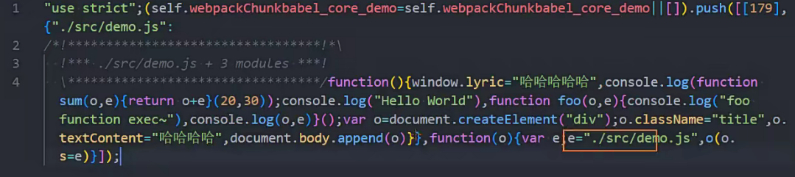

## **什么是 HTTP 压缩？**

**HTTP 压缩是一种内置在 服务器 和 客户端 之间的，以改进传输速度和带宽利用率的方式；**

**HTTP 压缩的流程什么呢？**

第一步：HTTP 数据在服务器发送前就已经被压缩了；（可以在 webpack 中完成）

第二步：兼容的浏览器在向服务器发送请求时，会告知服务器自己支持哪些压缩格式；

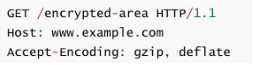

第三步：服务器在浏览器支持的压缩格式下，直接返回对应的压缩后的文件，并且在响应头中告知浏览器；

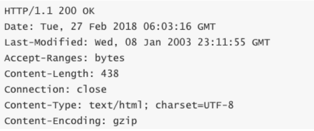

## **目前的压缩格式**

**目前的压缩格式非常的多：**

compress – UNIX 的“compress”程序的方法（历史性原因，不推荐大多数应用使用，应该使用 gzip 或 deflate）；

deflate – 基于 deflate 算法（定义于 RFC 1951）的压缩，使用 zlib 数据格式封装；

gzip – GNU zip 格式（定义于 RFC 1952），是目前使用比较广泛的压缩算法；

br – 一种新的开源压缩算法，专为 HTTP 内容的编码而设计；

## **Webpack 对文件压缩**

开发环境如果想要进行压缩，设置 compress 为 true 即可。

```javascript
module.exports = {
  mode: 'development',
  devServer: {
    ...
    compress: true,
    ...
  },
}
```

**webpack 中相当于是实现了 HTTP 压缩的第一步操作，我们可以使用 CompressionPlugin。**

**第一步，安装 CompressionPlugin：**

```json
npm install compression-webpack-plugin -D
```

**第二步，使用 CompressionPlugin 即可：**

```javascript
const CompressionPlugin = require("compression-webpack-plugin");

module.exports = {
  mode: "production",
  devtool: false,
  plugins: [
    // 对打包后的文件(js/css)进行压缩
    new CompressionPlugin({
      test: /\.(js|css)$/,
      algorithm: "gzip",
    }),
  ],
};
```

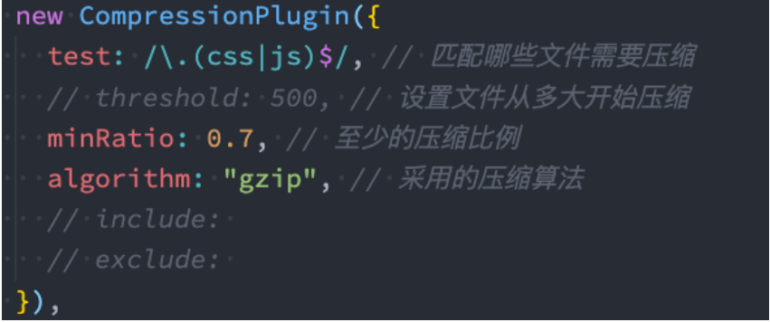

## **HTML 文件中代码的压缩**

我们之前使用了**HtmlWebpackPlugin**插件来生成 HTML 的模板，事实上它还有一些其他的配置：

**inject：设置打包的资源插入的位置**

true、 false 、body、head，默认是插入到 head 中

**cache：设置为 true，只有当文件改变时，才会生成新的文件（默认值也是 true）**

**minify：默认会使用一个插件 html-minifier-terser**

webpack.comm.js

```javascript
const HtmlWebpackPlugin = require("html-webpack-plugin");

const getCommonConfig = function (isProdution) {
  return {
    plugins: [
      new HtmlWebpackPlugin({
        template: "./index.html",
        cache: true,
        minify: isProdution
          ? {
              // 移除注释
              removeComments: true,
              // 移除属性
              removeEmptyAttributes: true,
              // 移除默认属性
              removeRedundantAttributes: true,
              // 折叠空白字符
              collapseWhitespace: true,
              // 压缩内联的CSS
              minifyCSS: true,
              // 压缩JavaScript
              minifyJS: {
                mangle: {
                  toplevel: true,
                },
              },
            }
          : false, // 开发环境不压缩
      }),
    ],
  };
};
```

index.html

```html
<!DOCTYPE html>
<html lang="en">
  <head>
    <meta charset="UTF-8" />
    <meta http-equiv="X-UA-Compatible" content="IE=edge" />
    <meta name="viewport" content="width=device-width, initial-scale=1.0" />
    <title>Document</title>
    <style>
      .btn {
        font-size: 30px;
      }
    </style>
  </head>
  <body>
    <!-- react的root -->
    <div id="root"></div>

    <div class=""></div>
    <input type="text" />

    <!-- <script src="https://cdn.bootcdn.net/ajax/libs/axios/1.2.0/axios.min.js"></script> -->
    <script src="https://cdn.bootcdn.net/ajax/libs/react/18.2.0/umd/react.production.min.js"></script>
    <script>
      const message = "hello html";
      console.log(message);
    </script>
  </body>
</html>
```

removeComments 设置为 true，上面的注释会被移除。

removeEmptyAttributes 设置为 true，class ="" 会被移除。

removeRedundantAttributes 设置为 true，input 中的 type="text"会被移除。

collapseWhitespace 设置为 true，空白字符会被移除。

minifyCSS 设置为 true，style 中的样式会被压缩。

## **分析一：打包的时间分析**

**如果我们希望看到每一个 loader、每一个 Plugin 消耗的打包时间，可以借助于一个插件：speed-measure-webpack-plugin**

注意：该插件在最新的 webpack 版本中存在一些兼容性的问题（和部分 Plugin 不兼容）

截止 2021-3-10 日，但是目前该插件还在维护，所以可以等待后续是否更新；

我这里暂时的做法是把不兼容的插件先删除掉，也就是不兼容的插件不显示它的打包时间就可以了；

**第一步，安装 speed-measure-webpack-plugin 插件**

```json
npm install speed-measure-webpack-plugin -D
```

**第二步，使用 speed-measure-webpack-plugin 插件**

创建插件导出的对象 SpeedMeasurePlugin；

使用 smp.wrap 包裹我们导出的 webpack 配置；

webpack.comm.js

```javascript
const SpeedMeasurePlugin = require('speed-measure-webpack-plugin')

const smp = new SpeedMeasurePlugin()

...
// webpack允许导出一个函数
module.exports = function(env) {
  const isProduction = env.production
  let mergeConfig = isProduction ? prodConfig: devConfig
  const finalConfig = merge(getCommonConfig(isProduction), mergeConfig)
  return smp.wrap(finalConfig)
}
```

## **分析二：打包后文件分析**

**方案一：生成一个 stats.json 的文件**

package.json

```json
{
  "scripts": {
    "build": "webpack --config ./config/comm.config.js --env production --profile --json=stats.json"
  }
}
```

**通过执行 npm run build 可以获取到一个 stats.json 的文件：**

这个文件我们自己分析不容易看到其中的信息；

可以放到 `https://github.com/webpack/analyse`，进行分析

目前，这个仓库打开之后有个分析地址，已经失效

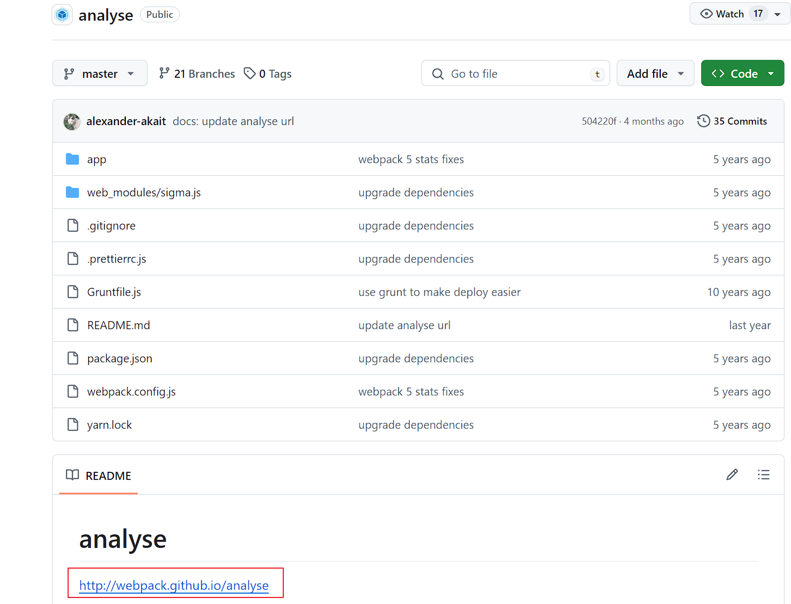

只能把这个项目 clone 下来，然后安装依赖跑起来，把生成的 stats.json 拖进去，就可以看到分析信息

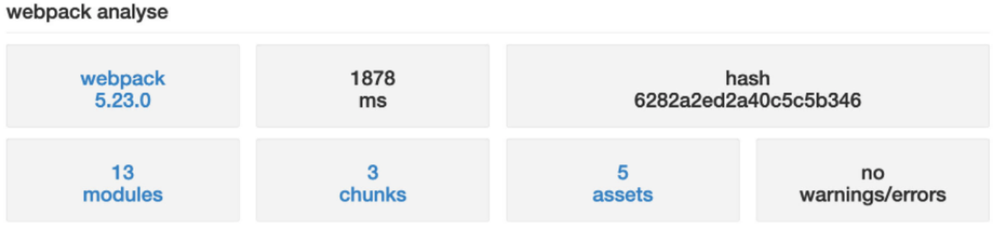

## **分析二：打包后文件分析**

**方案二：使用 webpack-bundle-analyzer 工具**

另一个非常直观查看包大小的工具是 webpack-bundle-analyzer。

**第一步，我们可以直接安装这个工具：**

```json
npm install webpack-bundle-analyzer -D
```

**第二步，我们可以在 webpack 配置中使用该插件：**

**在打包 webpack 的时候，这个工具是帮助我们打开一个 8888 端口上的服务，我们可以直接的看到每个包的大小。**

比如有一个包时通过一个 Vue 组件打包的，但是非常的大，那么我们可以考虑是否可以拆分出多个组件，并且对其进行懒加载；

比如一个图片或者字体文件特别大，是否可以对其进行压缩或者其他的优化处理；

```javascript
const { BundleAnalyzerPlugin } = require("webpack-bundle-analyzer");

module.exports = {
  mode: "production",
  devtool: false,
  plugins: [
    // 对打包后的结果进行分析
    new BundleAnalyzerPlugin(),
  ],
};
```

## **Webpack 的启动流程**

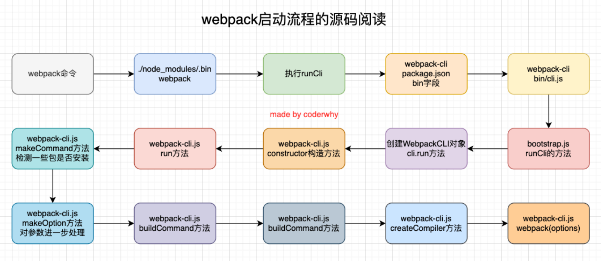

## **Webpack 源码阅读**

第一步：下载 webpack 的源码

https://github.com/webpack/webpack

第二步：安装项目相关的依赖

```json
npm install
```

第三步：编写自己的源代码

这里我创建了一个 why 文件夹，里面存放了一些代码

第四步：编写 webpack 的配置文件

webpack.config.js

第五步：编写启动的文件 build.js

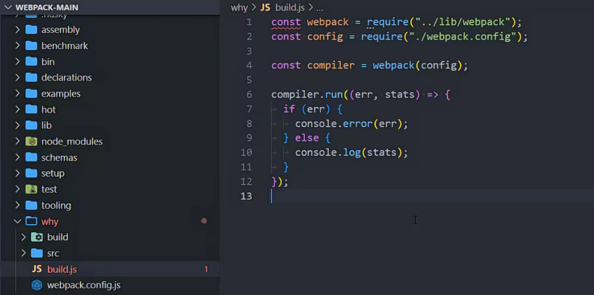

```javascript
const webpack = require("../webpack");
const config = require("./webpack.config");

const compiler = webpack(config);

compiler.run((err, stats) => {
  if (err) {
    console.error(err);
  } else {
    console.log(stats);
  }
});
```

## **创建 Compiler**

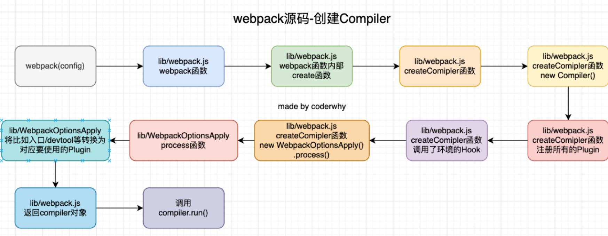

## **Compiler 中 run 方法执行的 Hook**

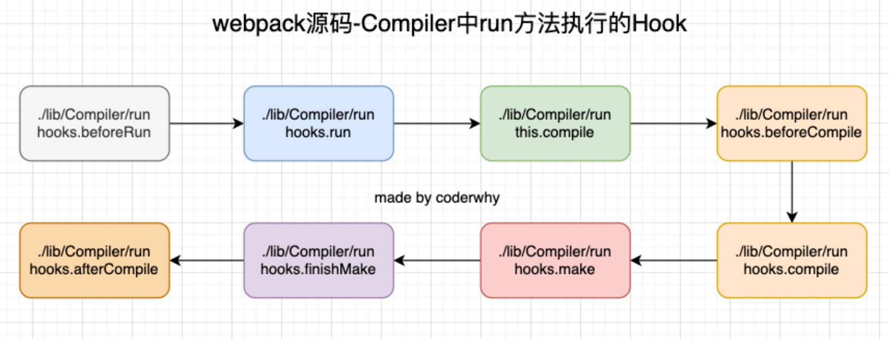

## **Compilation 对 Module 的处理**

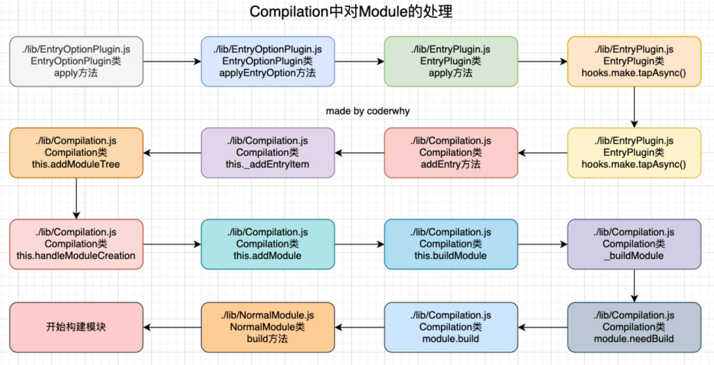

## **module 的 build 阶段**

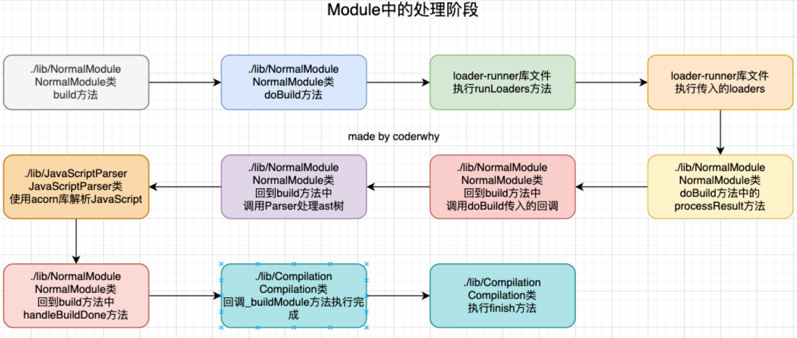

## **输出 asset 阶段**

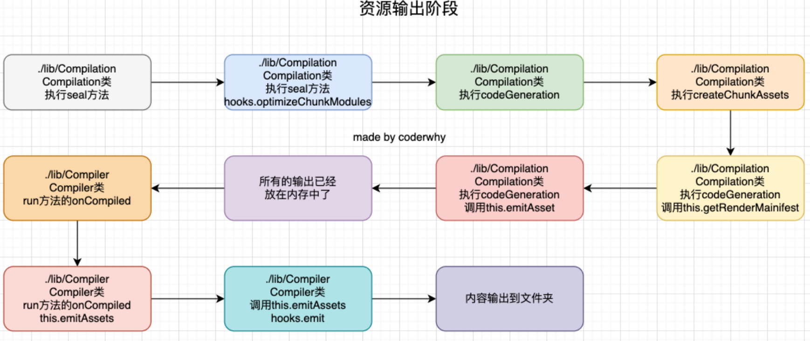

## **Compiler 和 Compilation 的区别**

Compiler 和 Compilation 的区别

在 webpack 构建的之初就会创建的一个对象, 并且在 webpack 的整个生命周期都会存在(before - run - beforeCompiler - compile -

make - finishMake - afterCompiler - done)

只要是做 webpack 的编译, 都会先创建一个 Compiler

Compilation 是到准备编译模块(比如 main.js), 才会创建 Compilation 对象

主要是存在于 compile - make 阶段主要使用的对象

watch -> 源代码发生改变就需要重新编译模块

Compiler 可以继续使用(如果我修改 webpack 的配置, 那么需要重新执行 run run build)

Compilation 需要创建一个新的 Compilation 对象
