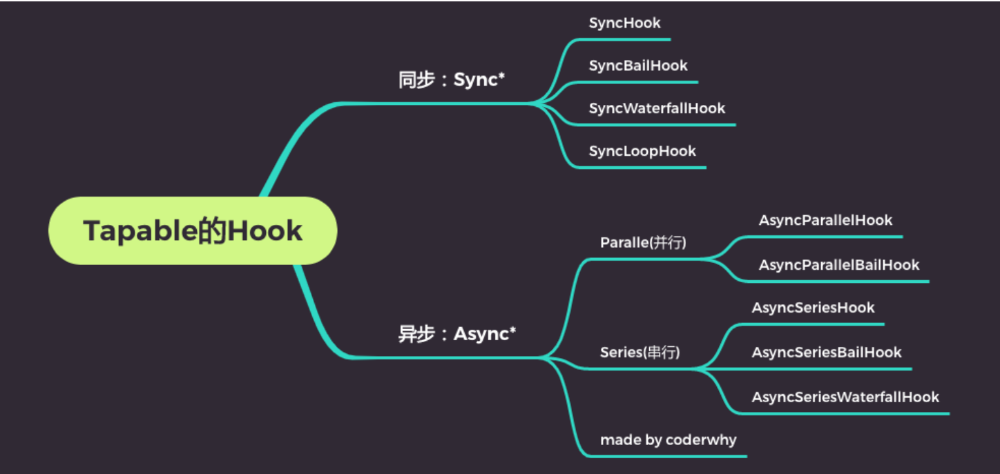
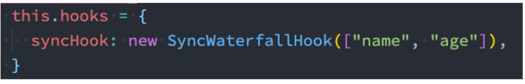
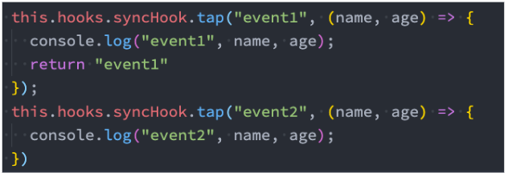
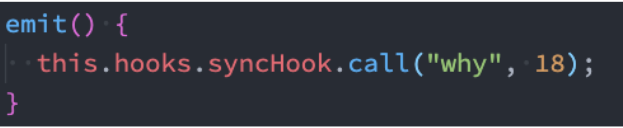

## Webpack 和 Tapable

我们知道 webpack 有两个非常重要的类：Compiler 和 Compilation

他们通过注入插件的方式，来监听 webpack 的所有生命周期；

插件的注入离不开各种各样的 Hook，而他们的 Hook 是如何得到的呢？

其实是创建了 Tapable 库中的各种 Hook 的实例；

所以，如果我们想要学习自定义插件，最好先了解一个库：Tapable

Tapable 是官方编写和维护的一个库；

Tapable 是管理着需要的 Hook，这些 Hook 可以被应用到我们的插件中；

## Tapable 有哪些 Hook 呢？



## Tapable 的 Hook 分类

同步和异步的：

以 sync 开头的，是同步的 Hook；

以 async 开头的，两个事件处理回调，不会等待上一次处理回调结束后再执行下一次回调；

其他的类别

- bail：当有返回值时，就不会执行后续的事件触发了；
- Loop：当返回值为 true，就会反复执行该事件，当返回值为 undefined 或者不返回内容，就退出事件；
- Waterfall：当返回值不为 undefined 时，会将这次返回的结果作为下次事件的第一个参数；
- Parallel：并行，会同时执行次事件处理回调结束，才执行下一次事件处理回调；
- Series：串行，会等待上一是异步的 Hook；

## Hook 的使用过程

第一步：创建 Hook 对象



第二步：注册 Hook 中的事件



第三步：触发事件



```javascript
const {
  SyncHook,
  SyncBailHook,
  SyncLoopHook,
  SyncWaterfallHook,
} = require("tapable");
const { AsyncSeriesHook, AsyncParallelHook } = require("tapable");

let counter = 0;

class HYLearnTapable {
  constructor() {
    this.hooks = {
      // syncHook: new SyncHook(["name", "age"])
      // bail: 在某一个事件监听的函数中, 如果有返回值, 那么后续的监听的事件就不会执行了
      // syncHook: new SyncBailHook(["name", "age"])
      // loop:在某个时间监听的函数中, 如果返回值为true, 那么这个回调函数就会循环执行.(返回undefined, 就停止执行)
      // syncHook: new SyncLoopHook(["name", "age"])
      // waterfall: 在某个时间监听的函数中, 如果有返回值, 那么它的返回值会作为下一次事件监听函数的第一个参数
      syncHook: new SyncWaterfallHook(["name", "age"]),

      // series: 在一个hook中, 监听了多次事件(多个回调函数), 这两个回调函数是串行执行
      asyncHook: new AsyncSeriesHook(["name", "age"]),

      // parallel: 在一个hook中, 监听了多次事件(多个回调函数), 这两个回调函数是并行执行
      // asyncHook: new AsyncParallelHook(["name", "age"])
    };

    // this.hooks.syncHook.tap("event1", (name, age) => {
    //   console.log("event1", name, age);
    //   return "event1";
    // });

    // this.hooks.syncHook.tap("event2", (name, age) => {
    //   console.log("event2", name, age);
    // });

    // this.hooks.asyncHook.tapAsync("event1", (name, age, callback) => {
    //   setTimeout(() => {
    //     console.log("event1", name, age);
    //     callback();
    //   }, 2000);
    // });

    // this.hooks.asyncHook.tapAsync("event2", (name, age, callback) => {
    //   setTimeout(() => {
    //     console.log("event2", name, age);
    //     callback();
    //   }, 2000);
    // });

    this.hooks.asyncHook.tapPromise("event1", (name, age) => {
      return new Promise((resolve, reject) => {
        setTimeout(() => {
          console.log("event1", name, age);
          resolve();
        }, 2000);
      });
    });

    this.hooks.asyncHook.tapPromise("event2", (name, age) => {
      return new Promise((resolve, reject) => {
        setTimeout(() => {
          console.log("event2", name, age);
          resolve();
        }, 2000);
      });
    });
  }

  emit() {
    // this.hooks.syncHook.call("why", 18);

    // this.hooks.asyncHook.callAsync("kobe", 30, () => {
    //   console.log("第一次事件执行完成");
    // });

    this.hooks.asyncHook.promise("james", 33).then(() => {
      console.log("事件监听完成");
    });
  }
}

const lt = new HYLearnTapable();
lt.emit();
```

## 自定义 Plugin

在之前的学习中，我们已经使用了非常多的 Plugin：

- CleanWebpackPlugin
- HTMLWebpackPlugin
- MiniCSSExtractPlugin
- CompressionPlugin
- 等等

这些 Plugin 是如何被注册到 webpack 的生命周期中的呢？

第一：在 webpack 函数的 createCompiler 方法中，注册了所有的插件；

第二：在注册插件时，会调用插件函数或者插件对象的 apply 方法；

第三：插件方法会接收 compiler 对象，我们可以通过 compiler 对象来注册 Hook 的事件；

第四：某些插件也会传入一个 compilation 的对象，我们也可以监听 compilation 的 Hook 事件；

## 开发自己的插件

如何开发自己的插件呢？

目前大部分插件都可以在社区中找到，但是推荐尽量使用在维护，并且经过社区验证的；

这里我们开发一个自己的简单插件：将静态文件自动上传服务器中；

自定义插件的过程：

创建 AutoUploadWebpackPlugin 类；

编写 apply 方法：

- 通过 ssh 连接服务器；
- 删除服务器原来的文件夹；
- 上传文件夹中的内容；

在 webpack 的 plugins 中，使用 AutoUploadWebpackPlugin 类；

webpack.config.js

```javascript
const path = require("path");
const HtmlWebpackPlugin = require("html-webpack-plugin");
const AutoUploadPlugin = require("./plugins/AutoUploadPlugin");

module.exports = {
  entry: "./src/main.js",
  output: {
    path: path.resolve(__dirname, "./build"),
    filename: "bundle.js",
  },
  plugins: [
    new HtmlWebpackPlugin(),
    new AutoUploadPlugin({
      host: "123.207.32.32",
      username: "root",
      password: "",
      removePath: "/root/test",
    }),
  ],
};
```

plugins/AutoUploadPlugin.js

```javascript
const { NodeSSH } = require("node-ssh");

class AutoUploadPlugin {
  constructor(options) {
    this.ssh = new NodeSSH();
    this.options = options;
  }

  apply(compiler) {
    compiler.hooks.afterEmit.tapAsync(
      "AutoUploadPlugin",
      async (compilation, callback) => {
        // 1.获取输出的文件夹
        const outputPath = compilation.outputOptions.path;

        // 2.连接服务器(ssh连接)
        await this.connectServer();

        // 3.删除原来目录中的内容
        const serverDir = this.options.remotePath;
        await this.ssh.execCommand(`rm -rf ${serverDir}/*`);

        // 4.上传文件到服务器(ssh连接)
        await this.uploadFiles(outputPath, serverDir);

        // 5.关闭ssh
        this.ssh.dispose();

        callback();
      }
    );
  }

  async connectServer() {
    await this.ssh.connect({
      host: this.options.host,
      username: this.options.username,
      password: this.options.password,
    });

    console.log("连接成功~");
  }

  async uploadFiles(localPath, remotePath) {
    const status = await this.ssh.putDirectory(localPath, remotePath, {
      recursive: true,
      concurrency: 10,
    });
    console.log("传送到服务器: ", status ? "成功" : "失败");
  }
}

module.exports = AutoUploadPlugin;
```
