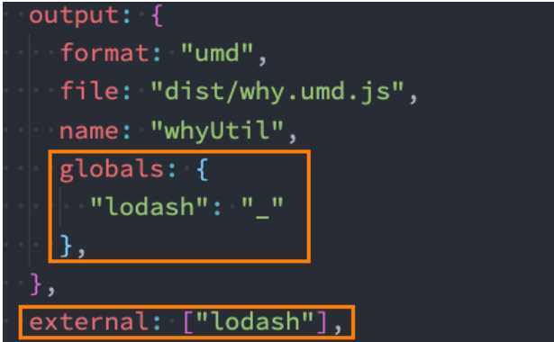
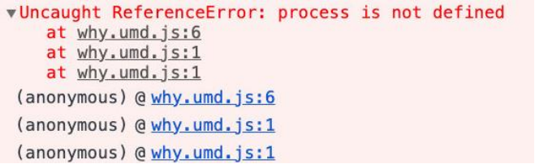

## **认识 rollup**

**我们来看一下官方对 rollup 的定义：**

Rollup is a module bundler for JavaScript which compiles small pieces of code into something larger and more complex,

such as a library or application.

Rollup 是一个 JavaScript 的模块化打包工具，可以帮助我们编译小的代码到一个大的、复杂的代码中，比如一个库或者一个应用程序；

**我们会发现 Rollup 的定义、定位和 webpack 非常的相似：**

Rollup 也是一个模块化的打包工具，但是 Rollup 主要是针对 ES Module 进行打包的；

另外 webpack 通常可以通过各种 loader 处理各种各样的文件，以及处理它们的依赖关系；

rollup 更多时候是专注于处理 JavaScript 代码的（当然也可以处理 css、font、vue 等文件）；

另外 rollup 的配置和理念相对于 webpack 来说，更加的简洁和容易理解；

在早期 webpack 不支持 tree shaking 时，rollup 具备更强的优势；

**目前 webpack 和 rollup 分别应用在什么场景呢？**

通常在实际项目开发过程中，我们都会使用 webpack（比如 react、angular 项目都是基于 webpack 的）；

在对库文件进行打包时，我们通常会使用 rollup（比如 vue、react、dayjs 源码本身都是基于 rollup 的，Vite 底层使用 Rollup）；

## **Rollup 基本使用**

**我们可以先安装 rollup：**

```json
# 全局安装
npm install rollup -g
# 局部安装
npm install rollup -D
```

**创建 main.js 文件，打包到 bundle.js 文件中：**

```json
# 打包浏览器的库
npx rollup ./src/main.js -f iife -o dist/bundle.js
# 打包AMD的库
npx rollup ./src/main.js -f amd -o dist/bundle.js
# 打包CommonJS的库
npx rollup ./src/main.js -f cjs -o dist/bundle.js
# 打包通用的库（必须跟上name）
npx rollup ./src/main.js -f umd --name mathUtil -o dist/bundle.js
```

## **Rollup 的配置文件**

**我们可以将配置信息写到配置文件中 rollup.config.js 文件：**

**我们可以对文件进行分别打包，打包出更多的库文件（用户可以根据不同的需求来引入）：**

rollup.config.js

```javascript
module.exports = {
  // 入口
  input: "./lib/index.js",
  // 出口
  output: [
    {
      format: "umd",
      name: "whyUtils",
      file: "./build/bundle.umd.js",
    },
    {
      format: "amd",
      file: "./build/bundle.amd.js",
    },
    {
      format: "cjs",
      file: "./build/bundle.cjs.js",
    },
    {
      format: "iife",
      name: "whyUtils",
      file: "./build/bundle.browser.js",
    },
  ],
};
```

打包的时候执行

```json
npx rollup -c
```

## **解决 commonjs 和第三方库问题**

**安装解决 commonjs 的库：**

```json
npm install @rollup/plugin-commonjs -D
```

**安装解决 node_modules 的库：**

```json
npm install @rollup/plugin-node-resolve -D
```

**打包和排除 lodash**



```javascript
// 默认lodash没有被打包是因为它使用commonjs, rollup默认情况下只会处理es module
const commonjs = require("@rollup/plugin-commonjs");
const nodeResolve = require("@rollup/plugin-node-resolve");

module.exports = {
  // 入口
  input: "./lib/index.js",
  // 出口
  output: {
    format: "umd",
    name: "whyUtils",
    file: "./build/bundle.umd.js",
    globals: {
      lodash: "_", // 自己的业务代码lodash需要打包
    },
  },
  external: ["lodash"], // 库文件不需要打包loadsh
  plugins: [commonjs(), nodeResolve()],
};
```

lib/index.js

```javascript
import { sum, mul } from "./utils/math";
import { formatPrice } from "./utils/format";
import _ from "lodash";

function foo() {
  console.log("foo exection~");
  console.log(sum(20, 30));
  console.log(formatPrice());
  console.log(_.join(["abc", "cba"]));

  const message = "Hello World";
  console.log(message);
}

export { foo, sum, mul };
```

lib/utils/format.js

使用的是 commonjs

```javascript
function formatPrice() {
  return "¥" + 10000000;
}

module.exports = {
  formatPrice,
};
```

## **Babel 转换代码**

**如果我们希望将 ES6 转成 ES5 的代码，可以在 rollup 中使用 babel。**

**安装 rollup 对应的 babel 插件：**

```json
npm install @rollup/plugin-babel -D
```

**修改配置文件：**

需要配置 babel.config.js 文件；

babelHelpers

## **Teser 代码压缩**

**如果我们希望对代码进行压缩，可以使用@rollup/plugin-terser：**

```json
npm install @rollup/plugin-terser -D
```

**配置 terser**

```javascript
// 默认lodash没有被打包是因为它使用commonjs, rollup默认情况下只会处理es module
const commonjs = require("@rollup/plugin-commonjs");
const nodeResolve = require("@rollup/plugin-node-resolve");

// 使用代码转换和压缩
const { babel } = require("@rollup/plugin-babel");
const terser = require("@rollup/plugin-terser");

module.exports = {
  // 入口
  input: "./lib/index.js",
  // 出口
  output: {
    format: "umd",
    name: "whyUtils",
    file: "./build/bundle.umd.js",
    globals: {
      lodash: "_",
    },
  },
  external: ["lodash"],
  plugins: [
    commonjs(),
    nodeResolve(),
    babel({
      babelHelpers: "bundled",
      exclude: /node_modules/,
    }),
    terser(),
  ],
};
```

babel.config.js

```javascript
module.exports = {
  presets: [["@babel/preset-env"]],
};
```

## **处理 css 文件**

**如果我们项目中需要处理 css 文件，可以使用 postcss：**

```json
npm install rollup-plugin-postcss postcss -D
```

**配置 postcss 的插件**

```javascript
const postcss = require("rollup-plugin-postcss");

module.exports = {
  plugins: [postcss()],
};
```

如果想要处理浏览器前缀，根目录下增加 postcss.config.js，做如下配置：

```javascript
module.exports = {
  plugins: [require("postcss-preset-env")],
};
```

## **处理 vue 文件**

**处理 vue 文件我们需要使用 rollup-plugin-vue 插件：**

**但是注意：默认情况下我们安装的是 vue3.x 的版本，所以我这里指定了一下 rollup-plugin-vue 的版本；**

```json
npm install rollup-plugin-vue @vue/compiler-sfc -D
```

**使用 vue 的插件**

```javascript
const vue = require("rollup-plugin-vue");

module.exports = {
  plugins: [vue()],
};
```

## **打包 vue 报错**

**在我们打包 vue 项目后，运行会报如下的错误：**



**这是因为在我们打包的 vue 代码中，用到 process.env.NODE_ENV，所以我们可以使用一个插件 rollup-plugin-replace 设置**

**它对应的值：**

```json
npm install @rollup/plugin-replace -D
```

**配置插件信息：**

```javascript
const replace = require("@rollup/plugin-replace");

module.exports = {
  plugins: [
    ...replace({
      "process.env.NODE_ENV": JSON.stringify("production"),
    }),
  ],
};
```

## **搭建本地服务器**

**第一步：使用 rollup-plugin-serve 搭建服务**

```json
npm install rollup-plugin-serve -D
```

**第二步：当文件发生变化时，自动刷新浏览器**

```json
npm install rollup-plugin-livereload -D
```

**第三步：启动时，开启文件监听**

```json
npx rollup -c -w
```

```javascript
const serve = require("rollup-plugin-serve");
const livereload = require("rollup-plugin-livereload");

module.exports = {
  plugins: [
    serve({
      port: 8000,
      open: true,
      contentBase: ".",
    }),
    livereload(),
  ],
};
```

## **区分开发环境**

**我们可以在 package.json 中创建一个开发和构建的脚本：**

package.json

```json
"scripts": {
  "build": "rollup -c --environment NODE_ENV:production",
  "serve": "rollup -c --environment NODE_ENV:development -w"
}
```

rollup.config.js

```javascript
// 默认lodash没有被打包是因为它使用commonjs, rollup默认情况下只会处理es module
const commonjs = require("@rollup/plugin-commonjs");
const nodeResolve = require("@rollup/plugin-node-resolve");

// 使用代码转换和压缩
const { babel } = require("@rollup/plugin-babel");
const terser = require("@rollup/plugin-terser");
const postcss = require("rollup-plugin-postcss");
const vue = require("rollup-plugin-vue");
const replace = require("@rollup/plugin-replace");
const serve = require("rollup-plugin-serve");
const livereload = require("rollup-plugin-livereload");

const isProduction = process.env.NODE_ENV === "production";
const plugins = [
  commonjs(),
  nodeResolve(),
  babel({
    babelHelpers: "bundled",
    exclude: /node_modules/,
  }),
  postcss(),
  vue(),
  replace({
    "process.env.NODE_ENV": JSON.stringify("production"),
    preventAssignment: true, // 去除警告
  }),
];

if (isProduction) {
  plugins.push(terser());
} else {
  const extraPlugins = [
    serve({
      port: 8000,
      open: true,
      contentBase: ".",
    }),
    livereload(),
  ];
  plugins.push(...extraPlugins);
}

module.exports = {
  // 入口
  input: "./src/index.js",
  // 出口
  output: {
    format: "umd",
    name: "whyUtils",
    file: "./build/bundle.umd.js",
    globals: {
      lodash: "_",
    },
  },
  plugins: plugins,
};
```
