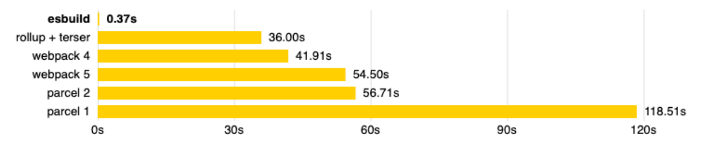

## **认识 vite**

**什么是 vite 呢？**

官方的定位：下一代前端开发与构建工具；

**如何定义下一代开发和构建工具呢？**

我们知道在实际开发中，我们编写的代码往往是不能被浏览器直接识别的，比如 ES6、TypeScript、Vue 文件等等；

所以我们必须通过构建工具来对代码进行转换、编译，类似的工具有 webpack、rollup、parcel；

但是随着项目越来越大，需要处理的 JavaScript 呈指数级增长，模块越来越多；

构建工具需要很长的时间才能开启服务器，HMR 也需要几秒钟才能在浏览器反应出来；

所以也有这样的说法：天下苦 webpack 久矣；

**Vite (法语意为 "快速的"，发音 /vit/) 是一种新型前端构建工具，能够显著提升前端开发体验。**

## **Vite 的构造**

**它主要由两部分组成：**

一个开发服务器，它基于原生 ES 模块提供了丰富的内建功能，HMR 的速度非常快速；

一套构建指令，它使用 rollup 打开我们的代码，并且它是预配置的，可以输出生产环境的优化过的静态资源；

**在浏览器支持 ES 模块之前，JavaScript 并没有提供原生机制让开发者以模块化的方式进行开发。**

这也正是我们对 “打包” 这个概念熟悉的原因：使用工具抓取、处理并将我们的源码模块串联成可以在浏览器中运行的文件。

时过境迁，我们见证了诸如 webpack、Rollup 和 Parcel 等工具的变迁，它们极大地改善了前端开发者的开发体验。

然而，当我们开始构建越来越大型的应用时，需要处理的 JavaScript 代码量也呈指数级增长。包含数千个模块的大型项目相

当普遍。

基于 JavaScript 开发的工具就会开始遇到性能瓶颈：通常需要很长时间（甚至是几分钟！）才能启动开发服务器，即使使用

模块热替换（HMR），文件修改后的效果也需要几秒钟才能在浏览器中反映出来。

**Vite 旨在利用生态系统中的新进展解决上述问题：**

浏览器开始原生支持 ES 模块，且越来越多 JavaScript 工具使用编译型语言编写。

## **浏览器原生支持模块化**

src/main.js

```javascript
import { sum, mul } from "./utils/math";
import _ from "../node_modules/lodash-es/lodash.default.js";

// es6的代码
const message = "Hello World";
console.log(message);

const foo = () => {
  console.log("foo function exec~");
};
foo();

// 模块化代码的使用
console.log(sum(20, 30));
console.log(mul(20, 30));

console.log(_.join(["abc", "cba"]));
```

utils/math.js

```javascript
export function sum(num1, num2) {
  return num1 + num2;
}

export function mul(num1, num2) {
  return num1 * num2;
}
```

index.html

```html
<!DOCTYPE html>
<html lang="en">
  <head>
    <meta charset="UTF-8" />
    <meta http-equiv="X-UA-Compatible" content="IE=edge" />
    <meta name="viewport" content="width=device-width, initial-scale=1.0" />
    <title>Document</title>
  </head>
  <body>
    <script src="./src/main.js" type="module"></script>
  </body>
</html>
```

**但是如果我们不借助于其他工具，直接使用 ES Module 来开发有什么问题呢？**

首先，我们会发现在使用 loadash 时，加载了上百个模块的 js 代码，对于浏览器发送请求是巨大的消耗；

其次，我们的代码中如果有 TypeScript、less、vue 等代码时，浏览器并不能直接识别；

**事实上，vite 就帮助我们解决了上面的所有问题。**

## **Vite 的安装**

**首先，我们安装一下 vite 工具：**

```json
npm install vite –g
npm install vite -d
```

**通过 vite 来启动项目：**

```json
npx vite
```

## **Vite 对 css 的支持**

**vite 可以直接支持 css 的处理**

直接导入 css 即可；

**vite 可以直接支持 css 预处理器，比如 less**

直接导入 less；

之后安装 less 编译器；

```json
npm install less -D
```

**vite 直接支持 postcss 的转换：**

只需要安装 postcss，并且配置 postcss.config.js 的配置文件即可；

```json
npm install postcss postcss-preset-env -D
```

postcss.config.js

```javascript
module.exports = {
  plugins: [require("postcss-preset-env")],
};
```

## **Vite 对 TypeScript 的支持**

**vite 对 TypeScript 是原生支持的，它会直接使用 ESBuild 来完成编译：**

只需要直接导入即可；

**如果我们查看浏览器中的请求，会发现请求的依然是 ts 的代码：**

这是因为 vite 中的服务器 Connect 会对我们的请求进行转发；

获取 ts 编译后的代码，给浏览器返回，浏览器可以直接进行解析；

**注意：在 vite2 中，已经不再使用 Koa 了，而是使用 Connect 来搭建的服务器**


## **Vite 对 vue 的支持**

**vite 对 vue 提供第一优先级支持：**

Vue 3 单文件组件支持：@vitejs/plugin-vue

Vue 3 JSX 支持：@vitejs/plugin-vue-jsx

Vue 2 支持：underfin/vite-plugin-vue2

**安装支持 vue 的插件：**

```json
npm install @vitejs/plugin-vue -D
```

**在 vite.config.js 中配置插件：**

```javascript
import { defineConfig } from "vite";
import vue from "@vitejs/plugin-vue";

// 使用defineConfig有代码提示
export default defineConfig({
  plugins: [vue()],
});
```

## **Vite 对 react 的支持**

**.jsx 和 .tsx 文件同样开箱即用，它们也是通过 ESBuild 来完成的编译：**

所以我们只需要直接编写 react 的代码即可；

注意：在 index.html 加载 main.js 时，我们需要将 main.js 的后缀，修改为 main.jsx 作为后缀名；

```html
<!DOCTYPE html>
<html lang="en">
  <head>
    <meta charset="UTF-8" />
    <meta http-equiv="X-UA-Compatible" content="IE=edge" />
    <meta name="viewport" content="width=device-width, initial-scale=1.0" />
    <title>Document</title>
  </head>
  <body>
    <div id="app"></div>
    <div id="root"></div>

    <script src="./src/main.jsx" type="module"></script>
  </body>
</html>
```

## **Vite 打包项目**

**我们可以直接通过 vite build 来完成对当前项目的打包工具：**

```json
npx vite build
```

**我们可以通过 preview 的方式，开启一个本地服务来预览打包后的效果：**

```json
npx vite preview
```

## **Vite 脚手架工具**

**在开发中，我们不可能所有的项目都使用 vite 从零去搭建，比如一个 react 项目、Vue 项目；**

这个时候 vite 还给我们提供了对应的脚手架工具；

**所以 Vite 实际上是有两个工具的：**

vite：相当于是一个构件工具，类似于 webpack、rollup；

@vitejs/create-app：类似 vue-cli、create-react-app；

**如果使用脚手架工具呢？**

```json
npm create vite
yarn create vite
pnpm create vite
```

## **ESBuild 解析**

**ESBuild 的特点：**

超快的构建速度，并且不需要缓存；

支持 ES6 和 CommonJS 的模块化；

支持 ES6 的 Tree Shaking；

支持 Go、JavaScript 的 API；

支持 TypeScript、JSX 等语法编译；

支持 SourceMap；

支持代码压缩；

支持扩展其他插件；

## **ESBuild 的构建速度**

**ESBuild 的构建速度和其他构建工具速度对比：**



**ESBuild 为什么这么快呢？**

使用 Go 语言编写的，可以直接转换成机器代码，而无需经过字节码；

ESBuild 可以充分利用 CPU 的多内核，尽可能让它们饱和运行；

ESBuild 的所有内容都是从零开始编写的，而不是使用第三方，所以从一开始就可以考虑各种性能问题；

等等....
