## **链表以及数组的缺点**

**链表和数组一样，可以用于存储一系列的元素，但是链表和数组的实现机制完全不同。**

**这一章中，我们就来学习一下另外一种非常常见的用于存储数据的线性结构：链表。**

**数组**：

要存储多个元素，数组（或选择链表）可能是最常用的数据结构。

我们之前说过，几乎每一种编程语言都有默认实现数组结构。

**但是数组也有很多缺点：**

- 数组的创建通常需要申请一段连续的内存空间(一整块的内存)，并且大小是固定的(大多数编程语言数组都是固定的)，所以当

当前数组不能满足容量需求时，需要扩容。 (一般情况下是申请一个更大的数组，比如 2 倍。 然后将原数组中的元素复制过去)

- 而且在数组开头或中间位置插入数据的成本很高，需要进行大量元素的位移。
- 尽管 JavaScript 的 Array 底层可以帮我们做这些事，但背后的原理依然是这样。

## **链表的优势**

**要存储多个元素，另外一个选择就是链表。**

**但不同于数组，链表中的元素在内存中不必是连续的空间。**

链表的每个元素由一个存储元素本身的节点和一个指向下一个元素的引用(有些语言称为指针或者链接)组成。

**相对于数组，链表有一些优点：**

内存空间不是必须连续的

- 可以充分利用计算机的内存，实现灵活的内存动态管理。

链表不必在创建时就确定大小，并且大小可以无限的延伸下去。

链表在插入和删除数据时，时间复杂度可以达到 O(1)。

- 相对数组效率高很多

**相对于数组，链表有一些缺点：**

链表访问任何一个位置的元素时，都需要从头开始访问。(无法跳过第一个元素访问任何一个元素)。

无法通过下标直接访问元素，需要从头一个个访问，直到找到对应的元素。

## **链表到底是什么?**

**什么是链表呢?**

其实上面我们已经简单的提过了链表的结构，我们这里更加详细的分析一下。

链表类似于火车：有一个火车头，火车头会连接一个节点，节点上有乘客(类似于数据)，并且这个节点会连接下一个节点，以此类推。

**链表的火车结构：**

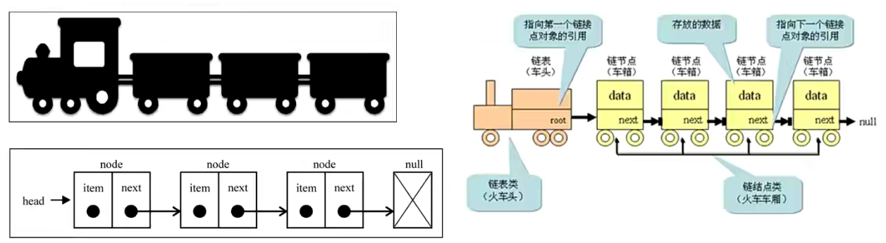

## **链表结构的封装**

**我们先来创建一个链表类**

```typescript
// 1.创建Node节点类
class Node<T> {
  value: T;
  next: Node<T> | null = null;
  constructor(value: T) {
    this.value = value;
  }
}

// 2.创建LinkedList的类
class LinkedList<T> {
  head: Node<T> | null = null;
  private size: number = 0;

  get length() {
    return this.size;
  }
}

const linkedList = new LinkedList<string>();
console.log(linkedList.head);

export {};
```

**代码解析：**

封装一个 Node 类，用于封装每一个节点上的信息（包括值和指向下一个节点的引用），它是一个泛型类。

封装一个 LinkedList 类，用于表示我们的链表结构。 (和 Java 中的链表同名，不同 Java 中的这个类是一个双向链表，在第二阶段中我们也会实现双向链表结构)。

链表中我们保存两个属性，一个是链表的长度，一个是链表中第一个节点。

当然，还有很多链表的操作方法。 我们放在下一节中学习。

## **链表常见操作**

**我们先来认识一下，链表中应该有哪些常见的操作**

append(element)：向链表尾部添加一个新的项

insert(position，element)：向链表的特定位置插入一个新的项。

get(position) ：获取对应位置的元素

indexOf(element)：返回元素在链表中的索引。如果链表中没有该元素则返回-1。

update(position，element) ：修改某个位置的元素

removeAt(position)：从链表的特定位置移除一项。

remove(element)：从链表中移除一项。

isEmpty()：如果链表中不包含任何元素，返回 true，如果链表长度大于 0 则返回 false。

size()：返回链表包含的元素个数。与数组的 length 属性类似。

**整体你会发现操作方法和数组非常类似，因为链表本身就是一种可以代替数组的结构。**

## **append 方法**

**向链表尾部追加数据可能有两种情况：**

链表本身为空，新添加的数据时唯一的节点。

链表不为空，需要向其他节点后面追加节点。

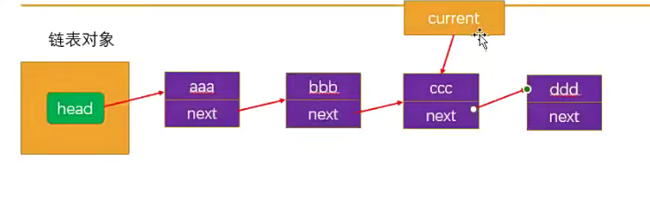

## **链表的遍历方法（traverse）**

**为了可以方便的看到链表上的每一个元素，我们实现一个遍历链表每一个元素的方法：**

这个方法首先将当前结点设置为链表的头结点。

然后，在 while 循环中，我们遍历链表并打印当前结点的数据。

在每次迭代中，我们将当前结点设置为其下一个结点，直到遍历完整个链表

```typescript
// 1.创建Node节点类
class Node<T> {
  value: T;
  next: Node<T> | null = null;
  constructor(value: T) {
    this.value = value;
  }
}

// 2.创建LinkedList的类
class LinkedList<T> {
  private head: Node<T> | null = null;
  private size: number = 0;

  get length() {
    return this.size;
  }

  // 追加节点
  append(value: T) {
    // 1.根据value创建一个新节点
    const newNode = new Node(value);

    // 2.判断this.head是否为null
    if (!this.head) {
      this.head = newNode;
    } else {
      let current = this.head;
      while (current.next) {
        current = current.next;
      }

      // current肯定是指向最后一个节点的
      current.next = newNode;
    }

    // 3.size++
    this.size++;
  }

  // 遍历链表的方法
  traverse() {
    const values: T[] = [];

    let current = this.head;
    while (current) {
      values.push(current.value);
      current = current.next;
    }

    console.log(values.join("->"));
  }
}

const linkedList = new LinkedList<string>();
linkedList.append("aaa");
linkedList.append("bbb");
linkedList.append("ccc");
linkedList.append("ddd");

linkedList.traverse();

export {};
```

## **insert 方法**

**接下来实现另外一个添加数据的方法：在任意位置插入数据。**

**添加到第一个位置：**

添加到第一个位置，表示新添加的节点是头，就需要将原来的头节点，作为新节点的 next

另外这个时候的 head 应该指向新节点。


**添加到其他位置：**

如果是添加到其他位置，就需要先找到这个节点位置了。

我们通过 while 循环，一点点向下找。 并且在这个过程中保存上一个节点和下一个节点。

找到正确的位置后，将新节点的 next 指向下一个节点，将上一个节点的 next 指向新的节点。

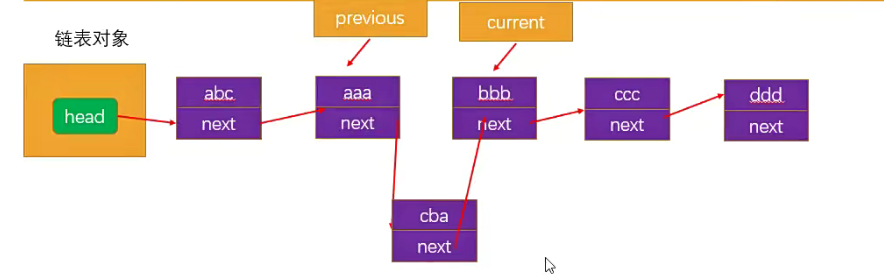

```typescript
// 1.创建Node节点类
class Node<T> {
  value: T;
  next: Node<T> | null = null;
  constructor(value: T) {
    this.value = value;
  }
}

// 2.创建LinkedList的类
class LinkedList<T> {
  private head: Node<T> | null = null;
  private size: number = 0;

  get length() {
    return this.size;
  }

  // 追加节点
  append(value: T) {
    // 1.根据value创建一个新节点
    const newNode = new Node(value);

    // 2.判断this.head是否为null
    if (!this.head) {
      this.head = newNode;
    } else {
      let current = this.head;
      while (current.next) {
        current = current.next;
      }

      // current肯定是指向最后一个节点的
      current.next = newNode;
    }

    // 3.size++
    this.size++;
  }

  // 遍历链表的方法
  traverse() {
    const values: T[] = [];

    let current = this.head;
    while (current) {
      values.push(current.value);
      current = current.next;
    }

    console.log(values.join("->"));
  }

  // 插入方法: abc
  insert(value: T, position: number): boolean {
    // 1.越界的判断
    if (position < 0 || position > this.size) return false;

    // 2.根据value创建新的节点
    const newNode = new Node(value);

    // 3.判断是否需要插入头部
    if (position === 0) {
      newNode.next = this.head;
      this.head = newNode;
    } else {
      let current = this.head;
      let previous: Node<T> | null = null;
      let index = 0;
      while (index++ < position && current) {
        previous = current;
        current = current.next;
      }
      // index === position
      newNode.next = current;
      previous!.next = newNode;
    }
    this.size++;

    return true;
  }
}

const linkedList = new LinkedList<string>();
linkedList.append("aaa");
linkedList.append("bbb");
linkedList.append("ccc");
linkedList.append("ddd");

linkedList.insert("abc", 0);
linkedList.traverse();
linkedList.insert("cba", 2);
linkedList.insert("nba", 6);
linkedList.traverse();

export {};
```

## **removeAt 方法**

**移除数据有两种常见的方式：**

根据位置移除对应的数据

根据数据，先找到对应的位置，再移除数据

**移除第一项的信息：**

移除第一项时，直接让 head 指向第二项信息就可以啦。

那么第一项信息没有引用指向，就在链表中不再有效，后面会被回收掉。

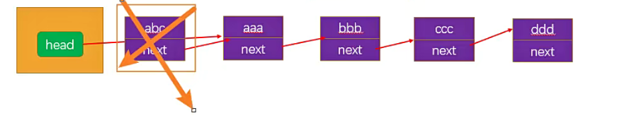

**移除其他项的信息：**

移除其他项的信息操作方式是相同的。

首先，我们需要通过 while 循环，找到正确的位置。

找到正确位置后，就可以直接将上一项的 next 指向 current 项的 next，这样中间的项就没有引用指向它，也就不再存在于链表后，会面会被回收掉。

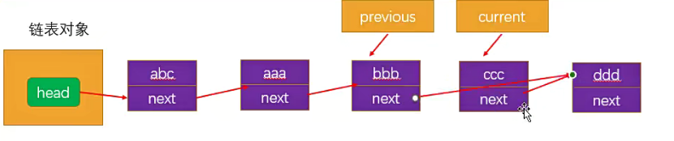

```typescript
// 1.创建Node节点类
class Node<T> {
  value: T;
  next: Node<T> | null = null;
  constructor(value: T) {
    this.value = value;
  }
}

// 2.创建LinkedList的类
class LinkedList<T> {
  private head: Node<T> | null = null;
  private size: number = 0;

  get length() {
    return this.size;
  }

  // 追加节点
  append(value: T) {
    // 1.根据value创建一个新节点
    const newNode = new Node(value);

    // 2.判断this.head是否为null
    if (!this.head) {
      this.head = newNode;
    } else {
      let current = this.head;
      while (current.next) {
        current = current.next;
      }

      // current肯定是指向最后一个节点的
      current.next = newNode;
    }

    // 3.size++
    this.size++;
  }

  // 遍历链表的方法
  traverse() {
    const values: T[] = [];

    let current = this.head;
    while (current) {
      values.push(current.value);
      current = current.next;
    }

    console.log(values.join("->"));
  }

  // 插入方法:
  insert(value: T, position: number): boolean {
    // 1.越界的判断
    if (position < 0 || position > this.size) return false;

    // 2.根据value创建新的节点
    const newNode = new Node(value);

    // 3.判断是否需要插入头部
    if (position === 0) {
      newNode.next = this.head;
      this.head = newNode;
    } else {
      let current = this.head;
      let previous: Node<T> | null = null;
      let index = 0;
      while (index++ < position && current) {
        previous = current;
        current = current.next;
      }
      // index === position
      newNode.next = current;
      previous!.next = newNode;
    }
    this.size++;

    return true;
  }

  // 删除方法:
  removeAt(position: number): T | null {
    // 1.越界的判断
    if (position < 0 || position >= this.size) return null;

    // 2.判断是否是删除第一个节点
    let current = this.head;
    if (position === 0) {
      this.head = current?.next ?? null;
    } else {
      let previous: Node<T> | null = null;
      let index = 0;
      while (index++ < position && current) {
        previous = current;
        current = current.next;
      }

      // 找到需要的节点
      previous!.next = current?.next ?? null;
    }

    this.size--;

    return current?.value ?? null;
  }
}

const linkedList = new LinkedList<string>();
linkedList.append("aaa");
linkedList.append("bbb");
linkedList.append("ccc");
linkedList.append("ddd");

linkedList.insert("abc", 0);
linkedList.traverse();
linkedList.insert("cba", 2);
linkedList.insert("nba", 6);
linkedList.traverse();

// 测试删除节点
linkedList.removeAt(0);
linkedList.removeAt(0);
linkedList.traverse();

console.log(linkedList.removeAt(2));
linkedList.traverse();
console.log(linkedList.removeAt(3));
linkedList.traverse();

export {};
```

## **get 方法**

**get(position) ：获取对应位置的元素**

```typescript
// 1.创建Node节点类
class Node<T> {
  value: T;
  next: Node<T> | null = null;
  constructor(value: T) {
    this.value = value;
  }
}

// 2.创建LinkedList的类
class LinkedList<T> {
  private head: Node<T> | null = null;
  private size: number = 0;

  get length() {
    return this.size;
  }

  // 追加节点
  append(value: T) {
    // 1.根据value创建一个新节点
    const newNode = new Node(value);

    // 2.判断this.head是否为null
    if (!this.head) {
      this.head = newNode;
    } else {
      let current = this.head;
      while (current.next) {
        current = current.next;
      }

      // current肯定是指向最后一个节点的
      current.next = newNode;
    }

    // 3.size++
    this.size++;
  }

  // 遍历链表的方法
  traverse() {
    const values: T[] = [];

    let current = this.head;
    while (current) {
      values.push(current.value);
      current = current.next;
    }

    console.log(values.join("->"));
  }

  // 插入方法:
  insert(value: T, position: number): boolean {
    // 1.越界的判断
    if (position < 0 || position > this.size) return false;

    // 2.根据value创建新的节点
    const newNode = new Node(value);

    // 3.判断是否需要插入头部
    if (position === 0) {
      newNode.next = this.head;
      this.head = newNode;
    } else {
      let current = this.head;
      let previous: Node<T> | null = null;
      let index = 0;
      while (index++ < position && current) {
        previous = current;
        current = current.next;
      }
      // index === position
      newNode.next = current;
      previous!.next = newNode;
    }
    this.size++;

    return true;
  }

  // 删除方法:
  removeAt(position: number): T | null {
    // 1.越界的判断
    if (position < 0 || position >= this.size) return null;

    // 2.判断是否是删除第一个节点
    let current = this.head;
    if (position === 0) {
      this.head = current?.next ?? null;
    } else {
      let previous: Node<T> | null = null;
      let index = 0;
      while (index++ < position && current) {
        previous = current;
        current = current.next;
      }

      // 找到需要的节点
      previous!.next = current?.next ?? null;
    }

    this.size--;

    return current?.value ?? null;
  }

  // 获取方法:
  get(position: number): T | null {
    // 越界问题
    if (position < 0 || position >= this.size) return null;

    // 2.查找元素, 并且范围元素
    let index = 0;
    let current = this.head;
    while (index++ < position && current) {
      current = current.next;
    }

    // index === position
    return current?.value ?? null;
  }
}

const linkedList = new LinkedList<string>();
console.log("------------ 测试append ------------");
linkedList.append("aaa");
linkedList.append("bbb");
linkedList.append("ccc");
linkedList.append("ddd");

console.log("------------ 测试insert ------------");
linkedList.insert("abc", 0);
linkedList.traverse();
linkedList.insert("cba", 2);
linkedList.insert("nba", 6);
linkedList.traverse();

// 测试删除节点
console.log("------------ 测试removeAt ------------");
linkedList.removeAt(0);
linkedList.removeAt(0);
linkedList.traverse();

console.log(linkedList.removeAt(2));
linkedList.traverse();
console.log(linkedList.removeAt(3));
linkedList.traverse();

console.log("------------ 测试get ------------");
console.log(linkedList.get(0));
console.log(linkedList.get(1));
console.log(linkedList.get(2));

export {};
```

## 遍历节点的操作重构

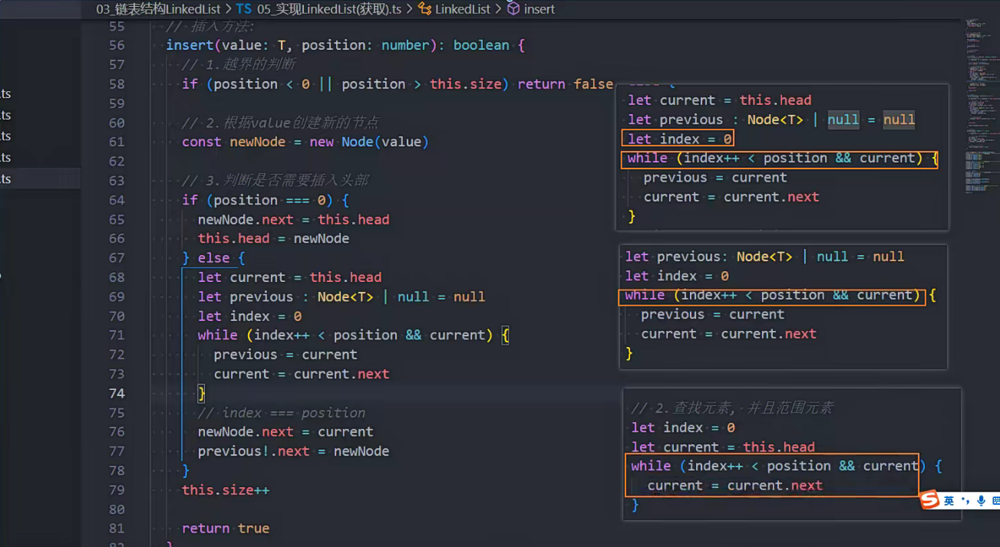

```typescript
// 1.创建Node节点类
class Node<T> {
  value: T;
  next: Node<T> | null = null;
  constructor(value: T) {
    this.value = value;
  }
}

// 2.创建LinkedList的类
class LinkedList<T> {
  private head: Node<T> | null = null;
  private size: number = 0;

  get length() {
    return this.size;
  }

  // 封装私有方法
  // 根据position获取到当前的节点(不是节点的value, 而是获取节点)
  private getNode(position: number): Node<T> | null {
    let index = 0;
    let current = this.head;
    while (index++ < position && current) {
      current = current.next;
    }
    return current;
  }

  // 追加节点
  append(value: T) {
    // 1.根据value创建一个新节点
    const newNode = new Node(value);

    // 2.判断this.head是否为null
    if (!this.head) {
      this.head = newNode;
    } else {
      let current = this.head;
      while (current.next) {
        current = current.next;
      }

      // current肯定是指向最后一个节点的
      current.next = newNode;
    }

    // 3.size++
    this.size++;
  }

  // 遍历链表的方法
  traverse() {
    const values: T[] = [];

    let current = this.head;
    while (current) {
      values.push(current.value);
      current = current.next;
    }

    console.log(values.join("->"));
  }

  // 插入方法:
  insert(value: T, position: number): boolean {
    // 1.越界的判断
    if (position < 0 || position > this.size) return false;

    // 2.根据value创建新的节点
    const newNode = new Node(value);

    // 3.判断是否需要插入头部
    if (position === 0) {
      newNode.next = this.head;
      this.head = newNode;
    } else {
      const previous = this.getNode(position - 1);
      newNode.next = previous!.next;
      previous!.next = newNode;
    }
    this.size++;

    return true;
  }

  // 删除方法:
  removeAt(position: number): T | null {
    // 1.越界的判断
    if (position < 0 || position >= this.size) return null;

    // 2.判断是否是删除第一个节点
    let current = this.head;
    if (position === 0) {
      this.head = current?.next ?? null;
    } else {
      // 重构成如下代码
      const previous = this.getNode(position - 1);
      // 找到需要的节点
      previous!.next = previous?.next?.next ?? null;
    }

    this.size--;

    return current?.value ?? null;
  }

  // 获取方法:
  get(position: number): T | null {
    // 越界问题
    if (position < 0 || position >= this.size) return null;

    // 2.查找元素, 并且范围元素
    return this.getNode(position)?.value ?? null;
  }
}

const linkedList = new LinkedList<string>();
console.log("------------ 测试append ------------");
linkedList.append("aaa");
linkedList.append("bbb");
linkedList.append("ccc");
linkedList.append("ddd");
linkedList.traverse();

console.log("------------ 测试insert ------------");
linkedList.insert("abc", 0);
linkedList.traverse();
linkedList.insert("cba", 2);
linkedList.insert("nba", 6);
linkedList.traverse();

// 测试删除节点
console.log("------------ 测试removeAt ------------");
linkedList.removeAt(0);
linkedList.removeAt(0);
linkedList.traverse();

console.log(linkedList.removeAt(2));
linkedList.traverse();
console.log(linkedList.removeAt(3));
linkedList.traverse();

console.log("------------ 测试get ------------");
console.log(linkedList.get(0));
console.log(linkedList.get(1));
console.log(linkedList.get(2));

export {};
```

## **update 方法**

**update(position，element) ：修改某个位置的元素**

## **indexOf 方法**

**我们来完成另一个功能：根据元素获取它在链表中的位置**

## **remove 方法以及其他方法**

**有了上面的 indexOf 方法，我们可以非常方便实现根据元素来删除信息**

## **isEmpty 方法**

```typescript
// 1.创建Node节点类
class Node<T> {
  value: T;
  next: Node<T> | null = null;
  constructor(value: T) {
    this.value = value;
  }
}

// 2.创建LinkedList的类
class LinkedList<T> {
  private head: Node<T> | null = null;
  private size: number = 0;

  get length() {
    return this.size;
  }

  // 封装私有方法
  // 根据position获取到当前的节点(不是节点的value, 而是获取节点)
  private getNode(position: number): Node<T> | null {
    let index = 0;
    let current = this.head;
    while (index++ < position && current) {
      current = current.next;
    }
    return current;
  }

  // 追加节点
  append(value: T) {
    // 1.根据value创建一个新节点
    const newNode = new Node(value);

    // 2.判断this.head是否为null
    if (!this.head) {
      this.head = newNode;
    } else {
      let current = this.head;
      while (current.next) {
        current = current.next;
      }

      // current肯定是指向最后一个节点的
      current.next = newNode;
    }

    // 3.size++
    this.size++;
  }

  // 遍历链表的方法
  traverse() {
    const values: T[] = [];

    let current = this.head;
    while (current) {
      values.push(current.value);
      current = current.next;
    }

    console.log(values.join("->"));
  }

  // 插入方法:
  insert(value: T, position: number): boolean {
    // 1.越界的判断
    if (position < 0 || position > this.size) return false;

    // 2.根据value创建新的节点
    const newNode = new Node(value);

    // 3.判断是否需要插入头部
    if (position === 0) {
      newNode.next = this.head;
      this.head = newNode;
    } else {
      const previous = this.getNode(position - 1);
      newNode.next = previous!.next;
      previous!.next = newNode;
    }
    this.size++;

    return true;
  }

  // 删除方法:
  removeAt(position: number): T | null {
    // 1.越界的判断
    if (position < 0 || position >= this.size) return null;

    // 2.判断是否是删除第一个节点
    let current = this.head;
    if (position === 0) {
      this.head = current?.next ?? null;
    } else {
      // 重构成如下代码
      const previous = this.getNode(position - 1);
      // 找到需要的节点
      previous!.next = previous?.next?.next ?? null;
    }

    this.size--;

    return current?.value ?? null;
  }

  // 获取方法:
  get(position: number): T | null {
    // 越界问题
    if (position < 0 || position >= this.size) return null;

    // 2.查找元素, 并且范围元素
    return this.getNode(position)?.value ?? null;
  }

  // 更新方法:
  update(value: T, position: number): boolean {
    if (position < 0 || position >= this.size) return false;
    // 获取对应位置的节点, 直接更新即可
    const currentNode = this.getNode(position);
    currentNode!.value = value;
    return true;
  }

  // 根据值, 获取对应位置的索引
  indexOf(value: T): number {
    // 从第一个节点开始, 向后遍历
    let current = this.head;
    let index = 0;
    while (current) {
      if (current.value === value) {
        return index;
      }
      current = current.next;
      index++;
    }

    return -1;
  }

  // 删除方法: 根据value删除节点
  remove(value: T): T | null {
    const index = this.indexOf(value);
    return this.removeAt(index);
  }

  // 判读单链表是否为空的方法
  isEmpty() {
    return this.size === 0;
  }
}

const linkedList = new LinkedList<string>();
console.log("------------ 测试append ------------");
linkedList.append("aaa");
linkedList.append("bbb");
linkedList.append("ccc");
linkedList.append("ddd");
linkedList.traverse();

console.log("------------ 测试insert ------------");
linkedList.insert("abc", 0);
linkedList.traverse();
linkedList.insert("cba", 2);
linkedList.insert("nba", 6);
linkedList.traverse();

// 测试删除节点
console.log("------------ 测试removeAt ------------");
linkedList.removeAt(0);
linkedList.removeAt(0);
linkedList.traverse();

console.log(linkedList.removeAt(2));
linkedList.traverse();
console.log(linkedList.removeAt(3));
linkedList.traverse();

console.log("------------ 测试get ------------");
console.log(linkedList.get(0));
console.log(linkedList.get(1));
console.log(linkedList.get(2));

console.log("------------ 测试update ------------");
linkedList.update("why", 1);
linkedList.update("kobe", 2);

console.log("------------ 测试indexOf ------------");
console.log(linkedList.indexOf("cba"));
console.log(linkedList.indexOf("why"));
console.log(linkedList.indexOf("kobe"));
console.log(linkedList.indexOf("james"));

console.log("------------ 测试remove ------------");
linkedList.remove("why");
linkedList.remove("cba");
linkedList.remove("kobe");
linkedList.traverse();
console.log(linkedList.isEmpty());

export {};
```

## **707. 设计链表 -字节、腾讯等公司面试题**

**707.** **设计链表**

https://leetcode.cn/problems/design-linked-list/

**设计链表的实现。**

您可以选择使用单链表或双链表。

单链表中的节点应该具有两个属性：val 和 next。val 是当前节点的值，next 是指向下一个节点的指针/引用。

如果要使用双向链表，则还需要一个属性 prev 以指示链表中的上一个节点。假设链表中的所有节点都是 0-index 的。

**在链表类中实现这些功能：**

- get(index)：获取链表中第 index 个节点的值。如果索引无效，则返回-1。

- addAtHead(val)：在链表的第一个元素之前添加一个值为 val 的节点。插入后，新节点将成为链表的第一个节点。

- addAtTail(val)：将值为 val 的节点追加到链表的最后一个元素。

- addAtIndex(index,val)：在链表中的第 index 个节点之前添加值为 val 的节点。如果 index 等于链表的长度，则该节点将附加到链表的末尾。如果 index 大于链表长度，则不会插入节点。如果 index 小于 0，则在头部插入节点。

- deleteAtIndex(index)：如果索引 index 有效，则删除链表中的第 index 个节点。

上面的 get 方法相当于 get 方法，addAtHead 方法相当于 insert(value, 0)，addAtTail 相当于 append 方法，addAtIndex 相当于 insert 方法，deleteAtIndex 相当于 removeAt 方法。

## **237. 删除链表中的节点 – 字节、阿里等公司面试题**

**237.** **删除链表中的节点**

https://leetcode.cn/problems/delete-node-in-a-linked-list/description/

**有一个单链表的 head，我们想删除它其中的一个节点** **node。**

给你一个需要删除的节点 node 。

你将 **无法访问** 第一个节点 head。

**链表的所有值都是 唯一的，并且保证给定的节点** **node** **不是链表中的最后一个节点。**

**删除给定的节点。注意，删除节点并不是指从内存中删除它。这里的意思是：**

- 给定节点的值不应该存在于链表中。

- 链表中的节点数应该减少 1。

- node 前面的所有值顺序相同。

- node 后面的所有值顺序相同。

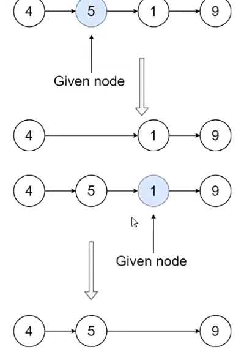

正常来说，比如上图想删除 5 这个节点，只需要让 4 指向 1 就可以，但是这道题，不允许访问前 1 个节点，也就是 4 无法指向 1。

那么就需要换个思路，先让 5 变成 1，然后再由这个 1 指向 9，本质上相当于删了 1。

```typescript
class ListNode {
  val: number;
  next: ListNode | null;
  constructor(val?: number, next?: ListNode | null) {
    this.val = val === undefined ? 0 : val;
    this.next = next === undefined ? null : next;
  }
}

function deleteNode(node: ListNode | null): void {
  node!.val = node!.next!.val;
  node!.next = node!.next!.next;
}
```

## **206. 反转链表 – 字节、谷歌等面试题**

**206. 反转链表**

https://leetcode.cn/problems/reverse-linked-list/

**给你单链表的头节点** **head** **，请你反转链表，并返回反转后的链表。**

**进阶：链表可以选用迭代或递归方式完成反转。你能否用两种方法解决这道题？**

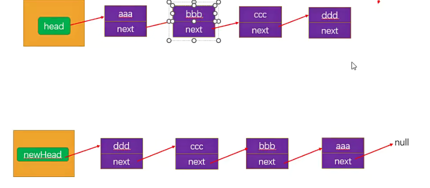

使用栈的方式

```typescript
import ListNode from "./面试题_ListNode";

function reverseList(head: ListNode | null): ListNode | null {
  // 什么情况下链表不需要处理?
  // 1.head本身为null的情况
  if (head === null) return null;
  // 2.只有head一个节点
  if (head.next === null) return head;

  // 数组模拟栈结构
  const stack: ListNode[] = [];
  let current: ListNode | null = head;
  while (current) {
    stack.push(current);
    current = current.next;
  }

  // 以此从栈结构中取出元素, 放到一个新的链表中
  const newHead: ListNode = stack.pop()!; // 取出最后一个
  let newHeadCurrent = newHead;
  while (stack.length) {
    const node = stack.pop()!;
    newHeadCurrent.next = node;
    newHeadCurrent = newHeadCurrent.next;
  }

  // 注意: 获取到最后一个节点时, 一定要将节点的next置为null
  newHeadCurrent.next = null;

  return newHead;
}

// 模拟数据进行测试
const node1 = new ListNode(1);
node1.next = new ListNode(2);
node1.next.next = new ListNode(3);

const newHead = reverseList(node1);

let current = newHead;
while (current) {
  console.log(current.val);
  current = current.next;
}

export {};
```

面试题\_ListNode.ts

```typescript
class ListNode {
  val: number;
  next: ListNode | null;
  constructor(val?: number, next?: ListNode | null) {
    this.val = val === undefined ? 0 : val;
    this.next = next === undefined ? null : next;
  }
}

export default ListNode;
```

## **206. 反转链表（非递归）**

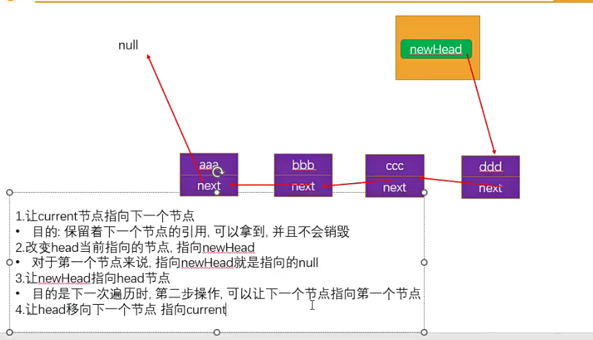

实现思路是先让 aaa 的 next 指向 null，但是如果指向 null，意味着后面的指向就全部消失，所以需要使用一个 current 变量指向 aaa 的下一个节点，也就是 bbb，目的是可以保留 bbb 节点的引用；紧接着改变节点的指向，指向 newHead，newHead 从 null 开始；接着让 newHead 指向 head 节点（此时是在 aaa），目的是下次遍历到 bbb 的时候，执行第 2 步，指向 newHead，也就是刚好指向 aaa；最后一步，让 head 移向下一个节点即可。

```typescript
import ListNode from "./面试题_ListNode";

function reverseList(head: ListNode | null): ListNode | null {
  // 1.判断节点为null, 或者只要一个节点, 那么直接返回即可
  if (head === null || head.next === null) return head;

  // 2.反转链表结构
  let newHead: ListNode | null = null;
  while (head) {
    const current: ListNode | null = head.next;
    head.next = newHead;
    newHead = head;
    head = current;
  }

  return newHead;
}

// 模拟数据进行测试
const node1 = new ListNode(1);
node1.next = new ListNode(2);
node1.next.next = new ListNode(3);

const newHead = reverseList(node1);

let current = newHead;
while (current) {
  console.log(current.val);
  current = current.next;
}

export {};
```

## **206. 反转链表（递归）**

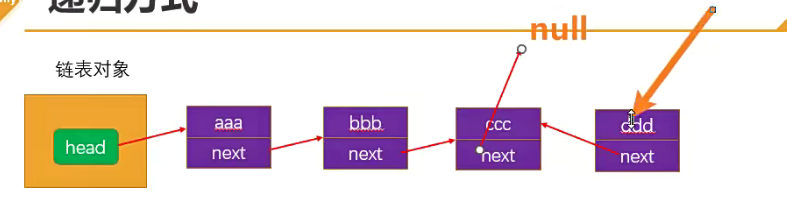

实现思路是使用递归，那么就会先从 ddd 开始，但是因为 ddd 的 next 是 null，直接返回；所以也就是从 ccc 开始，让 ccc 的下一个节点 ddd 的 next 执行当前节点也就是 ccc，然后让 ccc 指向 null，以此类推。

```typescript
import ListNode from "./面试题_ListNode";

function reverseList(head: ListNode | null): ListNode | null {
  // 如果使用的是递归, 那么递归必须有结束条件
  // if (head === null) return null
  // if (head.next === null) return head
  if (head === null || head.next === null) return head;
  const newHead = reverseList(head?.next ?? null);

  // 完成想要做的操作是在这个位置
  // 第一次来到这里的时候, 是倒数第二个节点，因为最后一个节点的next是null，直接返回了
  head.next.next = head;
  head.next = null;

  return newHead;
}

// 模拟数据进行测试
const node1 = new ListNode(1);
node1.next = new ListNode(2);
node1.next.next = new ListNode(3);

const newHead = reverseList(node1);

let current = newHead;
while (current) {
  console.log(current.val);
  current = current.next;
}

export {};
```

## 接口设计

```typescript
import ILinkedList from "./ILinkedList";

// 1.创建Node节点类
class Node<T> {
  value: T;
  next: Node<T> | null = null;
  constructor(value: T) {
    this.value = value;
  }
}

// 2.创建LinkedList的类
class LinkedList<T> implements ILinkedList<T> {
  private head: Node<T> | null = null;
  private length: number = 0;

  size() {
    return this.length;
  }

  peek(): T | undefined {
    return this.head?.value;
  }

  // 封装私有方法
  // 根据position获取到当前的节点(不是节点的value, 而是获取节点)
  private getNode(position: number): Node<T> | null {
    let index = 0;
    let current = this.head;
    while (index++ < position && current) {
      current = current.next;
    }
    return current;
  }

  // 追加节点
  append(value: T) {
    // 1.根据value创建一个新节点
    const newNode = new Node(value);

    // 2.判断this.head是否为null
    if (!this.head) {
      this.head = newNode;
    } else {
      let current = this.head;
      while (current.next) {
        current = current.next;
      }

      // current肯定是指向最后一个节点的
      current.next = newNode;
    }

    // 3.size++
    this.length++;
  }

  // 遍历链表的方法
  traverse() {
    const values: T[] = [];

    let current = this.head;
    while (current) {
      values.push(current.value);
      current = current.next;
    }

    console.log(values.join("->"));
  }

  // 插入方法:
  insert(value: T, position: number): boolean {
    // 1.越界的判断
    if (position < 0 || position > this.length) return false;

    // 2.根据value创建新的节点
    const newNode = new Node(value);

    // 3.判断是否需要插入头部
    if (position === 0) {
      newNode.next = this.head;
      this.head = newNode;
    } else {
      const previous = this.getNode(position - 1);
      newNode.next = previous!.next;
      previous!.next = newNode;
    }
    this.length++;

    return true;
  }

  // 删除方法:
  removeAt(position: number): T | null {
    // 1.越界的判断
    if (position < 0 || position >= this.length) return null;

    // 2.判断是否是删除第一个节点
    let current = this.head;
    if (position === 0) {
      this.head = current?.next ?? null;
    } else {
      // 重构成如下代码
      const previous = this.getNode(position - 1);
      // 找到需要的节点
      previous!.next = previous?.next?.next ?? null;
    }

    this.length--;

    return current?.value ?? null;
  }

  // 获取方法:
  get(position: number): T | null {
    // 越界问题
    if (position < 0 || position >= this.length) return null;

    // 2.查找元素, 并且范围元素
    return this.getNode(position)?.value ?? null;
  }

  // 更新方法:
  update(value: T, position: number): boolean {
    if (position < 0 || position >= this.length) return false;
    // 获取对应位置的节点, 直接更新即可
    const currentNode = this.getNode(position);
    currentNode!.value = value;
    return true;
  }

  // 根据值, 获取对应位置的索引
  indexOf(value: T): number {
    // 从第一个节点开始, 向后遍历
    let current = this.head;
    let index = 0;
    while (current) {
      if (current.value === value) {
        return index;
      }
      current = current.next;
      index++;
    }

    return -1;
  }

  // 删除方法: 根据value删除节点
  remove(value: T): T | null {
    const index = this.indexOf(value);
    return this.removeAt(index);
  }

  // 判读单链表是否为空的方法
  isEmpty() {
    return this.length === 0;
  }
}

const linkedList = new LinkedList<string>();
console.log("------------ 测试append ------------");
linkedList.append("aaa");
linkedList.append("bbb");
linkedList.append("ccc");
linkedList.append("ddd");
linkedList.traverse();

console.log("------------ 测试insert ------------");
linkedList.insert("abc", 0);
linkedList.traverse();
linkedList.insert("cba", 2);
linkedList.insert("nba", 6);
linkedList.traverse();

// 测试删除节点
console.log("------------ 测试removeAt ------------");
linkedList.removeAt(0);
linkedList.removeAt(0);
linkedList.traverse();

console.log(linkedList.removeAt(2));
linkedList.traverse();
console.log(linkedList.removeAt(3));
linkedList.traverse();

console.log("------------ 测试get ------------");
console.log(linkedList.get(0));
console.log(linkedList.get(1));
console.log(linkedList.get(2));

console.log("------------ 测试update ------------");
linkedList.update("why", 1);
linkedList.update("kobe", 2);

console.log("------------ 测试indexOf ------------");
console.log(linkedList.indexOf("cba"));
console.log(linkedList.indexOf("why"));
console.log(linkedList.indexOf("kobe"));
console.log(linkedList.indexOf("james"));

console.log("------------ 测试remove ------------");
linkedList.remove("why");
linkedList.remove("cba");
linkedList.remove("kobe");
linkedList.traverse();
console.log(linkedList.isEmpty());

export {};
```

ILinkedList.ts

```typescript
import IList from "../types/IList";

interface ILinkedList<T> extends IList<T> {
  append(value: T): void;
  traverse(): void;
  insert(value: T, position: number): boolean;
  removeAt(position: number): T | null;
  get(positon: number): T | null;
  update(value: T, position: number): boolean;
  indexOf(value: T): number;
  remove(value: T): T | null;
}

export default ILinkedList;
```

types/IList.ts

```typescript
export default interface IList<T> {
  // peek
  peek(): T | undefined;
  // 判断是否为空
  isEmpty(): boolean;
  // 元素的个数
  size(): number;
}
```

## **什么是算法复杂度（现实案例）？**

**前面我们已经解释了什么是算法？其实就是解决问题的一系列步骤操作、逻辑。**

**对于同一个问题，我们往往其实有多种解决它的思路和方法，也就是可以采用不同的算法。**

但是不同的算法，其实效率是不一样的。

**举个例子（现实的例子）：在一个庞大的图书馆中，我们需要找一本书。**

在图书已经按照某种方式摆好的情况下（数据结构是固定的）

**方式一：顺序查找**

一本本找，直到找到想要的书；（累死）

**方式二：先找分类，分类中找这本书**

先找到分类，在分类中再顺序或者某种方式查找；

**方式三：找到一台电脑，查找书的位置，直接找到；**

图书馆通常有自己的图书管理系统；

利用图书管理系统先找到书的位置，再直接过去找到；

## **什么是算法复杂度（程序案例）？**

**我们再具一个程序中的案例：让我们来比较两种不同算法在查找数组中（数组有序）给定元素的时间复杂度。**

**方式一:** **顺序查找**

这种算法从头到尾遍历整个数组，依次比较每个元素和给定元素的值。

如果找到相等的元素，则返回下标；如果遍历完整个数组都没找到，则返回-1。

```typescript
/**
 * 顺序查找的算法
 * @param array 查找的数组
 * @param num 查找的元素
 * @returns 查找到的索引, 未找到返回-1
 */
function sequentSearch(array: number[], num: number) {
  const length = array.length;
  for (let i = 0; i < length; i++) {
    const item = array[i];
    if (item === num) {
      return i;
    }
  }
  return -1;
}

const index = sequentSearch([1, 3, 5, 10, 100, 222, 333], 222);
console.log(index);

export default sequentSearch;
```

**方式二：二分查找**

这种算法假设数组是有序的，每次选择数组中间的元素与给定元素进行比较。

如果相等，则返回下标；如果给定元素比中间元素小，则在数组的左半部分继续查找；

如果给定元素比中间元素大，则在数组的右半部分继续查找；

这样每次查找都会将查找范围减半，直到找到相等的元素或者查找范围为空；

```typescript
function binarySearch(array: number[], num: number) {
  // 1.定义左边的索引
  let left = 0;
  // 2.定义右边的索引
  let right = array.length - 1;

  // 3.开始查找
  while (left <= right) {
    let mid = Math.floor((left + right) / 2);
    const midNum = array[mid];
    if (midNum === num) {
      return mid;
    } else if (midNum < num) {
      left = mid + 1;
    } else {
      right = mid - 1;
    }
  }

  return -1;
}

const index = binarySearch([1, 3, 5, 10, 100, 222, 333], 222);
console.log(index);

export default binarySearch;
```

## **顺序查找和二分查找的测试代码**

```typescript
import { testOrderSearchEfficiency } from "hy-algokit";

import sequentSearch from "./01_查找算法-顺序查找";
import binarySearch from "./02_查找算法-二分查找";

const MAX_LENGTH = 10000000;
const nums = new Array(MAX_LENGTH).fill(0).map((_, index) => index);
const num = MAX_LENGTH / 2;

const startTime = performance.now();
// const index = sequentSearch(nums, num)
const index = binarySearch(nums, num);
const endTime = performance.now();
console.log("索引的位置:", index, "消耗的时间:", endTime - startTime);

testOrderSearchEfficiency(sequentSearch);
testOrderSearchEfficiency(binarySearch);

// console.log(performance.now())

export {};
```

hy-algokit 这个库内部也是使用 performance.now 来计算时间。

顺序查找算法的时间复杂度是 O(n)

二分查找算法的时间复杂度是 O(log n)

## **大 O 表示法（Big O notation）**

**大 O 表示法（Big O notation）英文翻译为大 O 符号（维基百科翻译），中文通常翻译为大 O 表示法（标记法）。**

这个记号则是在德国数论学家爱德蒙·兰道的著作中才推广的，因此它有时又称为兰道符号（Landau symbols）。

代表“order of ...”（……阶）的大 O，最初是一个大写希腊字母“Ο”（omicron），现今用的是大写拉丁字母“O”。

**大 O 符号在分析算法效率的时候非常有用。**

举个例子，解决一个规模为 n 的问题所花费的时间（或者所需步骤的数目）可以表示为：

当 n 增大时，n² 项开始占据主导地位，其他各项可以被忽略；

举例说明：当 n=500

4n² 项是 2n 项的 1000 倍大，因此在大多数场合下，省略后者对表达式的值的影响将是可以忽略不计的。

进一步看，如果我们与任一其他级的表达式比较，n² 的系数也是无关紧要的。

**我们就说该算法具有 n² 阶（平方阶）的时间复杂度，表示为 O(n²)。**

## **大 O 表示法 - 常见的对数结**

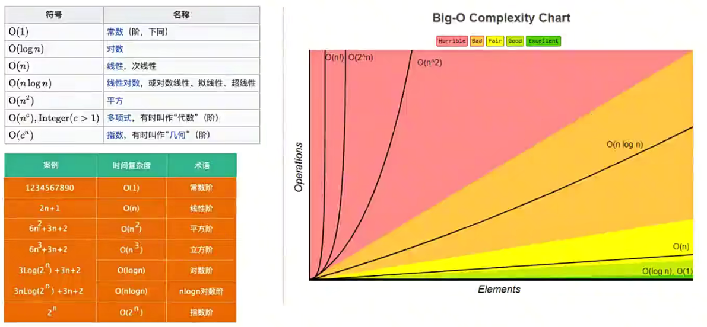

## **空间复杂度**

**空间复杂度指的是程序运行过程中所需要的额外存储空间。**

空间复杂度也可以用大 O 表示法来表示；

空间复杂度的计算方法与时间复杂度类似，通常需要分析程序中需要额外分配的内存空间，如数组、变量、对象、递归调用等。

**举个栗子 🌰：**

对于一个简单的递归算法来说，每次调用都会在内存中分配新的栈帧，这些栈帧占用了额外的空间。

因此，该算法的空间复杂度是 O(n)，其中 n 是递归深度。

而对于迭代算法来说，在每次迭代中不需要分配额外的空间，因此其空间复杂度为 O(1)。

**当空间复杂度很大时，可能会导致内存不足，程序崩溃。**

**在平时进行算法优化时，我们通常会进行如下的考虑：**

使用尽量少的空间（优化空间复杂度）；

使用尽量少的时间（优化时间复杂度）；

特定情况下：使用空间换时间或使用时间换空间；

## **数组和链表的复杂度对比**

**接下来，我们使用大 O 表示法来对比一下数组和链表的时间复杂度：**

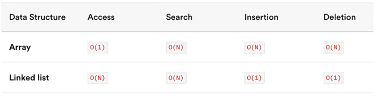

**数组是一种连续的存储结构，通过下标可以直接访问数组中的任意元素。**

时间复杂度：对于数组，随机访问时间复杂度为 O(1)，插入和删除操作时间复杂度为 O(n)。

空间复杂度：数组需要连续的存储空间，空间复杂度为 O(n)。

**链表是一种链式存储结构，通过指针链接起来的节点组成，访问链表中元素需要从头结点开始遍历。**

时间复杂度：对于链表，随机访问时间复杂度为 O(n)，插入和删除操作时间复杂度为 O(1)。

空间复杂度：链表需要为每个节点分配存储空间，空间复杂度为 O(n)。

**在实际开发中，选择使用数组还是链表需要根据具体应用场景来决定。**

如果数据量不大，且需要频繁随机访问元素，使用数组可能会更好。

如果数据量大，或者需要频繁插入和删除元素，使用链表可能会更好。
