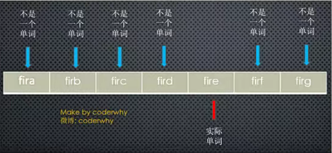
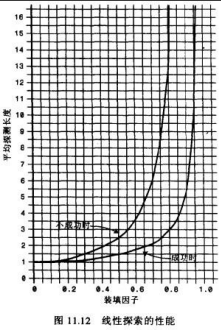
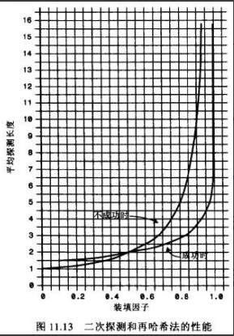
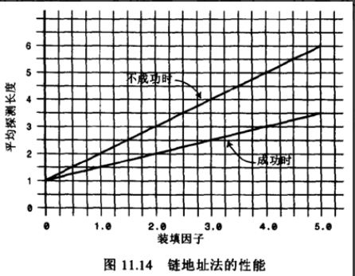

## **哈希表的介绍**

**哈希表是一种非常重要的数据结构，但是很多学习编程的人一直搞不懂哈希表到底是如何实现的。**

在这一章节中，我们就一点点来实现一个自己的哈希表。

通过实现来理解哈希表背后的原理和它的优势

**几乎所有的编程语言都有直接或者间接的应用这种数据结构。**

**哈希表通常是基于**数组进行实现的，但是相对于数组，它也很多的优势：

它可以提供非常快速的插入-删除-查找操作；

无论多少数据，插入和删除值都接近常量的时间：即 O(1)的时间复杂度。实际上，只需要几个机器指令即可完成；

哈希表的速度比树还要快，基本可以瞬间查找到想要的元素；

哈希表相对于树来说编码要容易很多；

**哈希表相对于数组的一些**不足：

哈希表中的数据是没有顺序的，所以不能以一种固定的方式(比如从小到大)来遍历其中的元素（没有特殊处理情况下）。

通常情况下，哈希表中的 key 是不允许重复的，不能放置相同的 key，用于保存不同的元素。

## **哈希表到底是什么呢？**

**那么，哈希表到底是什么呢？**

我们只是说了一下它的优势，似乎还是没有说它到底长什么样子？

这也是哈希表不好理解的地方，不像数组和链表，甚至是树一样直接画出你就知道它的结构，甚至是原理了。

它的结构就是数组，但是它神奇的地方在于对数组下标值的一种变换，这种变换我们可以使用哈希函数，通过哈希函数可以获取到 HashCode。

不着急，我们慢慢来认识它到底是什么。

**我们通过二个案例，案例需要你挑选某种数据结构，而你会发现最好的选择就是哈希表**

案例一：公司使用一种数据结构来保存所有员工；

案例二：使用一种数据结构存储单词信息，比如有 50000 个单词。找到单词后每个单词有自己的翻译&读音&应用等等；


## **案例一：公司员工存储**

**案例介绍：**

假如一家公司有 1000 个员工，现在我们需要将这些员工的信息使用某种数据结构来保存起来

你会采用什么数据结构呢？

**方案一：数组**

一种方案是按照顺序将所有的员工依次存入一个长度为 1000 的数组中。

每个员工的信息都保存在数组的某个位置上。

但是我们要查看某个具体员工的信息怎么办呢？一个个找吗？不太好找。

数组最大的优势是什么？通过下标值去获取信息。

所以为了可以通过数组快速定位到某个员工，最好给员工信息中添加一个员工编号(工号)，而编号对应的就是员工的下标值。

当查找某个员工的信息时，通过员工编号可以快速定位到员工的信息位置。

**方案二：链表**

链表对应插入和删除数据有一定的优势。

但是对于获取员工的信息，每次都必须从头遍历到尾，这种方式显然不是特别适合我们这里。

**最终方案：**

这样看最终方案似乎就是数组了。

- 但是数组还是有缺点，什么缺点呢？

- 但是如果我们只知道员工的姓名，比如 why，但是不知道 why 的员工编号，你怎么办呢？

**只能线性查找？效率非常的低**

- 能不能有一种办法，让 why 的名字和它的员工编号产生直接的关系呢？

- 也就是通过 why 这个名字，我们就能获取到它的索引值，而再通过索引值我就能获取到 why 的信息呢？

- 这样的方案已经存在了，就是使用哈希函数，让某个 key 的信息和索引值对应起来。

## **案例二：50000 个单词的存储**

**案例介绍：**

使用一种数据结构存储单词信息，比如有 50000 个单词。

找到单词后每个单词有自己的翻译&读音&应用等等

**方案一：数组？**

这个案例更加明显能感受到数组的缺陷。

我拿到一个单词 Iridescent，我想知道这个单词的翻译/读音/应用。

怎么可以从数组中查到这个单词的位置呢？

线性查找？50000 次比较？

如果你使用数组来实现这个功能，效率会非常非常低，而且你一定没有学习过数据结构。

**方案二：链表？**

不需要考虑了吧？

**方案三：有没有一种方案，可以将单词转成数组的下标值呢？**

如果单词转成数组的下标，那么以后我们要查找某个单词的信息，直接按照下标值一步即可访问到想要的元素。

## **字母转数字的方案一**

**似乎所有的案例都指向了一目标：**&#8203;将字符串转成下标值

**但是，怎样才能将一个字符串转成数组的下标值呢？**

单词/字符串转下标值，其实就是字母/文字转数字

怎么转？

**现在我们需要设计一种方案，可以将**单词转成适当的下标值：

其实计算机中有很多的编码方案就是用数字代替单词的字符。就是字符编码。(常见的字符编码？)

比如 ASCII 编码：a 是 97，b 是 98，依次类推 122 代表 z

我们也可以设计一个自己的编码系统，比如 a 是 1，b 是 2，c 是 3，依次类推，z 是 26。

当然我们可以加上空格用 0 代替，就是 27 个字符(不考虑大写问题)

但是，有了编码系统后，一个单词如何转成数字呢？

**方案一：数字相加**

一种转换单词的简单方案就是把单词每个字符的编码求和。

例如单词 cats 转成数字：3+1+20+19=43，那么 43 就作为 cats 单词的下标存在数组中。

**问题：按照这种方案有一个很明显的问题就是很多单词最终的下标可能都是 43。**

比如 was/tin/give/tend/moan/tick 等等。

我们知道数组中一个下标值位置只能存储一个数据

如果存入后来的数据，必然会造成数据的覆盖。

一个下标存储这么多单词显然是不合理的。

虽然后面的方案也会出现，但是要尽量避免。

## **字母转数字的方案二**

**方案二：幂的连乘**

现在，我们想通过一种算法，让 cats 转成数字后不那么普通。

数字相加的方案就有些过于普通了。

有一种方案就是使用幂的连乘，什么是幂的连乘呢？

其实我们平时使用的大于 10 的数字，可以用一种幂的连乘来表示它的唯一性：

比如：7654 = 7*10³+6*10²+5\*10+4

我们的单词也可以使用这种方案来表示：比如 cats = 3*27³+1*27²+20\*27+17= 60337

这样得到的数字可以基本保证它的唯一性，不会和别的单词重复。

**问题：如果一个单词是 zzzzzzzzzz(一般英文单词不会超过 10 个字符)。那么得到的数字超过 7000000000000。**

数组可以表示这么大的下标值吗？

而且就算能创建这么大的数组，事实上有很多是无效的单词。

创建这么大的数组是没有意义的。



两种方案总结：

第一种方案(把数字相加求和)产生的数组下标太少。

第二种方案(与 27 的幂相乘求和)产生的数组下标又太多。

## **下标的压缩算法**

**现在需要一种压缩方法，把幂的连乘方案系统中得到的巨大整数范围压缩到可接受的数组范围中。**

对于英文词典，多大的数组才合适呢？

如果只有 50000 个单词，可能会定义一个长度为 50000 的数组。

但是实际情况中，往往需要更大的空间来存储这些单词。

因为我们不能保证单词会映射到每一个位置。

比如两倍的大小：100000。

**如何压缩呢？**

现在，就找一种方法，把 0 到超过 7000000000000 的范围，压缩为从 0 到 100000。

有一种简单的方法就是使用取余操作符，它的作用是得到一个数被另外一个数整除后的余数。

**取余操作的实现：**

为了看到这个方法如何工作，我们先来看一个小点的数字范围压缩到一个小点的空间中。

假设把从 0~199 的数字，比如使用 largeNumber 代表，压缩为从 0 到 9 的数字，比如使用 smallRange 代表。

下标值的结果：index = largeNumber % smallRange;

当一个数被 10 整除时，余数一定在 0~9 之间;

比如 13%10=3，157%10=7。

当然，这中间还是会有重复，不过重复的数量明显变小了。

因为我们的数组是 100000，而只有 50000 个单词。

就好比，你在 0~199 中间选取 5 个数字，放在这个长度为 10 的数组中，也会重复，但是重复的概率非常小。(后面我们会讲到真的发生重复了应该怎么解决）

## **哈希表的一些概念**

**认识了上面的内容，相信你应该懂了哈希表的原理了，我们来看看几个概念：**

**哈希化：**&#8203;将大数字转化成数组范围内下标的过程，我们就称之为哈希化。

**哈希函数：**&#8203;通常我们会将单词转成大数字，大数字在进行哈希化的代码实现放在一个函数中，这个函数我们称为哈希函数。

**哈希表：**&#8203;最终将数据插入到的这个数组，对整个结构的封装，我们就称之为是一个哈希表。

**但是，我们还有问题需要解决：**

虽然，我们在一个 100000 的数组中，放 50000 个单词已经足够。

但是通过哈希化后的下标值依然可能会 **重复**，如何解决这种重复的问题呢？

## **什么是冲突？**

**尽管 50000 个单词，我们使用了 100000 个位置来存储，并且通过一种相对比较好的哈希函数来完成。但是依然有可能会发生冲突。**

比如 melioration 这个单词，通过哈希函数得到它数组的下标值后，发现那个位置上已经存在一个单词 demystify

因为它经过哈希化后和 melioration 得到的下标实现相同的。


**这种情况我们成为冲突。**

**虽然我们不希望这种情况发生，当然更希望每个下标对应一个数据项，但是通常这是不可能的。**

**冲突不可避免，我们只能解决冲突。**

**就像之前 0~199 的数字选取 5 个放在长度为 10 的单元格中**

如果我们随机选出来的是 33，82，11，45，90，那么最终它们的位置会是 3-2-1-5-0，没有发生冲突。

33 % 10 = 3，82 % 10 = 2， 11 % 10 = 1, 45 % 10 = 5， 90 % 10 = 0

但是如果其中有一个 33，还有一个 73 呢？还是发生了冲突。

**我们需要针对** **这种冲突**提出一些解决方案

虽然冲突的可能性比较小，你依然需要考虑到这种情况

以便发生的时候进行对应的处理代码。

如何解决这种冲突呢？常见的情况有**两种方案。**

- 链地址法。

- 开放地址法。

## **链地址法**

**链地址法是一种比较常见的解决冲突的方案。(也称为拉链法)**

其实，如果你理解了为什么产生冲突，看到图后就可以立马理解链地址法是什么含义了。


## **链地址法解析**

**图片解析：**

从图片中我们可以看出，链地址法解决冲突的办法是每个数组单元中存储的不再是单个数据，而是一个链条。

这个链条使用什么数据结构呢？常见的是数组或者链表。

比如是链表，也就是每个数组单元中存储着一个链表。一旦发现重复，将重复的元素插入到链表的首端或者末端即可。

当查询时，先根据哈希化后的下标值找到对应的位置，再取出链表，依次查询找寻找的数据。

**数组还是链表呢？**

数组或者链表在这里其实都可以，效率上也差不多。

因为根据哈希化的 index 找出这个数组或者链表时，通常就会使用线性查找，这个时候数组和链表的效率是差不多的。

当然在某些实现中，会将新插入的数据放在数组或者链表的最前面，因为觉得新插入的数据用于取出的可能性更大。

这种情况最好采用链表，因为数组在首位插入数据是需要所有其他项后移的，链表就没有这样的问题。

当然，我觉得出于这个也看业务需求，不见得新的数据就访问次数会更多：比如我们微信新添加的好友，可能是刚认识的，

联系的频率不见得比我们的老朋友更多，甚至新加的只是聊一两句。

所以，这里个人觉得选择数组或者链表都是可以的。

## **开放地址法**

了解即可，效率比较低。

**开放地址法的主要工作方式是寻找空白的单元格来添加重复的数据。**

**我们还是通过图片来了解开放地址法的工作方式。**


图片解析：

从图片的文字中我们可以了解到开放地址法其实就是要寻找空白的位置来放置冲突的数据项。

但是探索这个位置的方式不同，有三种方法：

- 线性探测

- 二次探测

- 再哈希法

## **线性探测**

线性探测非常好理解：**线性的查找空白的单元**。

**插入的 32：**

经过哈希化得到的 index=2，但是在插入的时候，发现该位置已经有了 82。怎么办呢？

线性探测就是从 index 位置+1 开始一点点查找合适的位置来放置 32，什么是合适的位置呢？

空的位置就是合适的位置，在我们上面的例子中就是 index=3 的位置，这个时候 32 就会放在该位置。

**查询 32 呢？**

查询 32 和插入 32 比较相似。

首先经过哈希化得到 index=2，比如 2 的位置结果和查询的数值是否相同，相同那么就直接返回。

不相同呢？线性查找，从 index 位置+1 开始查找和 32 一样的。

这里有一个特别需要注意的地方：如果 32 的位置我们之前没有插入，是否将整个哈希表查询一遍来确定 32 存不存在吗？

当然不是，查询过程有一个约定，就是查询到空位置，就停止。

因为查询到这里有空位置，32 之前不可能跳过空位置去其他的位置。

## **线性探测的问题**

**删除 32 呢？**

删除操作和插入查询比较类似，但是也有一个特别注意点。

注意：删除操作一个数据项时，不可以将这个位置下标的内容设置为 null，为什么呢？

因为将它设置为 null 可能会影响我们之后查询其他操作，所以通常删除一个位置的数据项时，我们可以将它进行特殊处理(比如设置为-1)。

当我们之后看到-1 位置的数据项时，就知道查询时要继续查询，但是插入时这个位置可以放置数据。

**线性探测的问题：**

线性探测有一个比较严重的问题，就是聚集。什么是聚集呢？

比如我在没有任何数据的时候，插入的是 22-23-24-25-26，那么意味着下标值：2-3-4-5-6 的位置都有元素。

这种一连串填充单元就叫做聚集。

聚集会影响哈希表的性能，无论是插入/查询/删除都会影响。

比如我们插入一个 32，会发现连续的单元都不允许我们放置数据，并且在这个过程中我们需要探索多次。

二次探测可以解决一部分这个问题，我们一起来看一看。

## **二次探测**

我们刚才谈到，**线性探测存在的问题**：

如果之前的数据是连续插入的，那么新插入的一个数据可能需要探测很长的距离。

二**次探测在线性探测的基础上进行了优化**：

二次探测主要优化的是探测时的步长，什么意思呢？

线性探测，我们可以看成是步长为 1 的探测，比如从下标值 x 开始，那么线性测试就是 x+1，x+2，x+3 依次探测。

二次探测，对步长做了优化，比如从下标值 x 开始，x+1²，x+2²，x+3²。

这样就可以一次性探测比较长的距离，比避免那些聚集带来的影响。

二次探测的问题：

但是二次探测依然存在问题，比如我们连续插入的是 32-112-82-2-192，那么它们依次累加的时候步长的相同的。

也就是这种情况下会造成步长不一样的一种聚集。还是会影响效率。(当然这种可能性相对于连续的数字会小一些)

怎么根本解决这个问题呢？让每个人的步长不一样，一起来看看再哈希法吧。

## **再哈希法**

为了消除线性探测和二次探测中无论步长+1 还是步长+平法中存在的问题, 还有一种最常用的解决方案: **再哈希法**.

**再哈希法:**

二次探测的算法产生的探测序列步长是固定的: 1, 4, 9, 16, 依次类推.

现在需要一种方法: 产生一种依赖关键字的探测序列, 而不是每个关键字都一样.

那么, 不同的关键字即使映射到相同的数组下标, 也可以使用不同的探测序列.

再哈希法的做法就是: 把关键字用另外一个哈希函数, 再做一次哈希化, 用这次哈希化的结果作为步长.

对于指定的关键字, 步长在整个探测中是不变的, 不过不同的关键字使用不同的步长.

**第二次哈希化需要具备如下特点:**

和第一个哈希函数不同. (不要再使用上一次的哈希函数了, 不然结果还是原来的位置)

不能输出为 0(否则, 将没有步长. 每次探测都是原地踏步, 算法就进入了死循环)

**其实, 我们不用费脑细胞来设计了, 计算机专家已经设计出一种工作很好的哈希函数:**

stepSize = constant - (key % constant)

其中 constant 是质数, 且小于数组的容量.

例如: stepSize = 5 - (key % 5), 满足需求, 并且结果不可能为 0.

## **哈希化的效率**

**哈希表中执行插入和搜索操作效率是非常高的**

如果没有产生冲突，那么效率就会更高。

如果发生冲突，存取时间就依赖后来的探测长度。

平均探测长度以及平均存取时间，取决于填装因子，随着填装因子变大，探测长度也越来越长。

随着填装因子变大，效率下降的情况，在不同开放地址法方案中比链地址法更严重，所以我们来对比一下他们的效率，再决定我们选取的方案。

**在分析效率之前，我们先了解一个概念：装填因子。**

装填因子表示当前哈希表中已经包含的数据项和整个哈希表长度的比值。

装填因子 = 总数据项 / 哈希表长度。

开放地址法的装填因子最大是多少呢？1，因为它必须寻找到空白的单元才能将元素放入。

链地址法的装填因子呢？可以大于 1，因为拉链法可以无限的延伸下去，只要你愿意。(当然后面效率就变低了)

## **线性探测效率**

**下面的等式显示了线性探测时，探测序列(P)和填装因子(L)的关系**

**公式来自于 Knuth(算法分析领域的专家，现代计算机的先驱人物)，这些公式的推导自己去看了一下，确实有些繁琐，这里不再给出推导过程，仅仅说明它的效率。**

图片解析：

当填装因子是 1/2 时，成功的搜索需要 1.5 次比较，不成功的搜索需要 2.5 次

当填装因子为 2/3 时，分别需要 2.0 次和 5.0 次比较

如果填装因子更大，比较次数会非常大。

应该使填装因子保持在 2/3 以下，最好在 1/2 以下，另一方面，填装因子越低，对于给定数量的数据项，就需要越多的空间。

实际情况中，最好的填装因子取决于存储效率和速度之间的平衡，随着填装因子变小，存储效率下降，而速度上升。



## **二次探测和再哈希化**

**二次探测和再哈希法的性能相当。它们的性能比线性探测略好。**

图片解析：

当填装因子是 0.5 时，成功和不成的查找平均需要 2 次比较

当填装因子为 2/3 时，分别需要 2.37 和 3.0 次比较

当填装因子为 0.8 时，分别需要 2.9 和 5.0 次

因此对于较高的填装因子，对比线性探测，二次探测和再哈希法还是可以忍受的。



## **链地址法**

**链地址法的效率分析有些不同，一般来说比开放地址法简单。我们来分析一下这个公式应该是怎么样的。**

假如哈希表包含 arraySize 个数据项，每个数据项有一个链表，在表中一共包含 N 个数据项。

那么，平均起来每个链表有多少个数据项呢？非常简单，N / arraySize。

有没有发现这个公式有点眼熟？其实就是装填因子。

**OK，那么我们现在就可以求出查找成功和不成功的次数了**

成功可能只需要查找链表的一半即可：1 + loadFactor/2

不成功呢？可能需要将整个链表查询完才知道不成功：1 + loadFactor。

**经过上面的比较我们可以发现，链地址法相对来说效率是好于开放地址法的。**

**所以在真实开发中，使用链地址法的情况较多**

因为它不会因为添加了某元素后性能急剧下降。

比如在 Java 的 HashMap 中使用的就是链地址法。



## **哈希函数**

**讲了很久的哈希表理论知识，你有没有发现在整个过程中，一个非常重要的东西：**哈希函数呢？

**好的哈希函数应该尽可能让计算的过程变得简单，提高计算的效率。**

哈希表的主要优点是它的速度，所以在速度上不能满足，那么就达不到设计的目的了。

提高速度的一个办法就是让哈希函数中尽量少的有乘法和除法。因为它们的性能是比较低的。

**设计好的哈希函数应该具备哪些优点呢？**

快速的计算

哈希表的优势就在于效率，所以快速获取到对应的 hashCode 非常重要。

- 我们需要通过快速的计算来获取到元素对应的 hashCode

均匀的分布

- 哈希表中，无论是链地址法还是开放地址法，当多个元素映射到同一个位置的时候，都会影响效率。

- 所以，优秀的哈希函数应该尽可能将元素映射到不同的位置，让元素在哈希表中均匀的分布。

## **快速计算：霍纳法则**

**在前面，我们计算哈希值的时候使用的方式**

cats = 3*27³+1*27²+20\*27+17= 60337

**这种方式是**直观的计算结果，那么这种计算方式会进行

**几次乘法几次加法**呢？

当然，我们可能不止 4 项，可能有更多项

我们抽象一下，这个表达式其实是一个多项式：

a(n)x^n+a(n-1)x^(n-1)+…+a(1)x+a(0)

**现在问题就变成了多项式**有多少次乘法和加法：

乘法次数：n ＋(n－1)＋…＋ 1 ＝ n(n+1)/2

加法次数：n 次

O(N²)

**多项式的优化：霍纳法则**

解决这类求值问题的高效算法--霍纳法则。在中国，霍纳法则也被称为秦九韶算法。

**通过如下变换我们可以得到一种快得多的算法，即**

Pn(x)= anx^n+a(n－1)x^(n-1)+…+a1x+a0=

((…(((anx +an－1)x+an－2)x+ an－3)…)x+a1)x+a0，

这种求值的方式我们称为霍纳法则。

**变换后，我们需要多少次乘法，多少次加法呢？**

乘法次数：N 次

加法次数：N 次。

**如果使用大 O 表示时间复杂度的话，我们直接从 O(N²)降到了 O(N)。**

## **均匀分布**

**均匀的分布**

在设计哈希表时，我们已经有办法处理映射到相同下标值的情况：链地址法或者开放地址法。

但是无论哪种方案，为了提供效率，最好的情况还是让数据在哈希表中均匀分布。

因此，我们需要在使用常量的地方，尽量使用质数。

哪些地方我们会使用到常量呢？

**质数的使用：**

哈希表的长度。

N 次幂的底数(我们之前使用的是 27)

为什么他们使用质数，会让哈希表分布更加均匀呢？

- 质数和其他数相乘的结果相比于其他数字更容易产生唯一性的结果，减少哈希冲突。

- Java 中的 N 次幂的底数选择的是 31，是经过长期观察分布结果得出的；

## **Java 中的 HashMap**

**Java 中的哈希表采用的是链地址法。**

**HashMap 的初始长度是 16，每次自动扩展(我们还没有聊到扩展的话题)，长度必须是 2 的次幂。**

这是为了服务于从 Key 映射到 index 的算法。60000000 % 100 = 数字。下标值

**HashMap 中为了提高效率，采用了位运算的方式。**

HashMap 中 index 的计算公式：**index = HashCode（Key） & （Length - 1）**

比如计算 book 的 hashcode，结果为十进制的 3029737，二进制的 101110001110101110 1001

假定 HashMap 长度是默认的 16，计算 Length-1 的结果为十进制的 15，二进制的 1111

把以上两个结果做**与运算**，101110001110101110 1001 & 1111 = 1001，十进制是 9，所以 index=9

**但是，我个人发现 JavaScript 中进行较大数据的位运算时会出问题，所以我的代码实现中还是使用了取模。**

另外，我这里为了方便代码之后向开放地址法中迁移，容量还是选择使用质数。

## **N 次幂的底数**

**这里采用质数的原因是为了产生的数据不按照某种规律递增。**

比如我们这里有一组数据是按照 4 进行递增的：0 4 8 12 16，将其映射到长度为 8 的哈希表中。

它们的位置是多少呢？0 - 4 - 0 - 4，依次类推。

如果我们哈希表本身不是质数，而我们递增的数量可以使用质数，比如 5，那么 0 5 10 15 20

它们的位置是多少呢？0 - 5 - 2 - 7 - 4，依次类推。也可以尽量让数据均匀的分布。

我们之前使用的是 27，这次可以使用一个接近的数，比如 31/37/41 等等。一个比较常用的数是 31 或 37。

**总之，质数是一个非常神奇的数字。**

**这里建议两处都使用质数：**

哈希表中数组的长度。

N 次幂的底数。

## **哈希表的实现**

**现在，我们就给出哈希函数的实现：**

```typescript
/**
 * 哈希函数, 将key映射成index
 * @param key 转换的key
 * @param max 数组的长度(最大的数值)
 * @returns 索引值
 */
function hashFunc(key: string, max: number): number {
  // 1.计算hashCode cats => 60337(27为底的时候)
  let hashCode = 0;
  const length = key.length;
  for (let i = 0; i < length; i++) {
    // 霍纳法则计算hashCode
    hashCode = 31 * hashCode + key.charCodeAt(i);
  }

  // 2.求出索引值
  const index = hashCode % max;

  return index;
}

// 测试哈希函数
// loadFactor = 4 / 7 = 0.57...
console.log(hashFunc("abc", 7));
console.log(hashFunc("cba", 7));
console.log(hashFunc("nba", 7));
console.log(hashFunc("mba", 7));

// loadFactor = 6 / 7 = 0.85...
console.log(hashFunc("aaa", 7));
console.log(hashFunc("bbb", 7));

export default hashFunc;
```

为什么使用 31，因为共有 26 个字母，加上一个空格，总共 27， 31 是离 27 比较近的质数。

## **创建哈希表**

**经过前面那么多内容的学习，我们现在可以真正实现自己的哈希表了。**

可能你学到这里的时候，已经感觉到数据结构的一些复杂性；

但是如果你仔细品味，你也会发现它在设计时候的巧妙和优美；

当你爱上它的那一刻，你也真正爱上了编程，爱上数据结构；

**我们这里采用链地址法来实现哈希表：**

实现的哈希表(基于 storage 的数组)每个 index 对应的是一个数组(bucket)。(当然基于链表也可以。)

bucket 中存放什么呢？我们最好将 key 和 value 都放进去，我们继续使用一个数组。(其实其他语言使用元组更好)

最终我们的哈希表的数据格式是这样：[[ [k，v]，[k，v]，[k，v] ] ，[ [k，v]，[k，v] ]，[ [k，v] ] ]

**代码解析：**

我们定义了三个属性：

storage 作为我们的数组，数组中存放相关的元素。

count 表示当前已经存在了多少数据。

limit 用于标记数组中一共可以存放多少个元素。

```typescript
class HashTable<T = any> {
  // 创建一个数组, 用来存放链地址法中的链(数组)
  private storage: [string, T][] = [];
  // 定义数组的长度
  private length: number = 7;
  // 记录已经存放元素的个数
  private count: number = 0;
}

const hashTable = new HashTable();
// hashTable.put("aaa", 100)

export default HashTable;
```

## **插入&修改数据**

**哈希表的插入和修改操作是同一个函数：**

因为，当使用者传入一个<Key，Value>时

如果原来不存该 key，那么就是插入操作。

如果已经存在该 key，那么就是修改操作。

**代码解析：**

步骤 1：根据传入的 key 获取对应的 hashCode，也就是数组的 index

步骤 2：从哈希表的 index 位置中取出桶(另外一个数组)

步骤 3：查看上一步的 bucket 是否为 null

- 为 null，表示之前在该位置没有放置过任何的内容，那么就新建一个数组[]

步骤 4：查看是否之前已经放置过 key 对应的 value

- 如果放置过，那么就是依次替换操作，而不是插入新的数据。

- 我们使用一个变量 isUpdate 来记录是否是修改操作

步骤 5：如果不是修改操作，那么插入新的数据。

- 在 bucket 中 push 新的[key，value]即可。

- 注意：这里需要将 count+1，因为数据增加了一项。

```typescript
class HashTable<T = any> {
  // 创建一个数组, 用来存放链地址法中的链(数组)
  private storage: [string, T][][] = [];
  // 定义数组的长度
  private length: number = 7;
  // 记录已经存放元素的个数
  private count: number = 0;

  private hashFunc(key: string, max: number) {
    // 1.计算hashCode cats => 60337(27为底的时候)
    let hashCode = 0;
    const length = key.length;
    for (let i = 0; i < length; i++) {
      // 霍纳法则计算hashCode
      hashCode = 31 * hashCode + key.charCodeAt(i);
    }

    // 2.求出索引值
    const index = hashCode % max;

    return index;
  }

  // 插入/修改
  put(key: string, value: T) {
    // 1.根据key获取数组中对应的索引值
    const index = this.hashFunc(key, this.length);

    // 2.取出索引值对应位置的数组(桶)
    let bucket = this.storage[index];

    // 3.判断bucket是否有值
    if (!bucket) {
      bucket = [];
      this.storage[index] = bucket;
    }

    // 4.确定已经有一个数组了, 但是数组中是否已经存在key是不确定的
    let isUpdate = false;
    for (let i = 0; i < bucket.length; i++) {
      const tuple = bucket[i];
      const tupleKey = tuple[0];
      if (tupleKey === key) {
        // 修改/更新的操作
        tuple[1] = value;
        isUpdate = true;
      }
    }

    // 5.如果上面的代码没有进行覆盖, 那么在该位置进行添加
    if (!isUpdate) {
      bucket.push([key, value]);
      this.count++;
    }
  }
}

const hashTable = new HashTable();
hashTable.put("aaa", 100);
hashTable.put("aaa", 200);
hashTable.put("bbb", 300);

const tuple: [number, number][][] = [[[111, 222]]];

export default HashTable;
```

## **获取数据**

**获取数据：**

根据 key 获取对应的 value

**代码解析：**

步骤 1：根据 key 获取 hashCode(也就是 index)

步骤 2：根据 index 取出 bucket。

步骤 3：因为如果 bucket 都是 null，那么说明这个位置之前并没有插入过数据。

步骤 4：有了 bucket，就遍历，并且如果找到，就将对应的 value 返回即可。

步骤 5：没有找到，返回 null

```typescript
class HashTable<T = any> {
  // 创建一个数组, 用来存放链地址法中的链(数组)
  private storage: [string, T][][] = [];
  // 定义数组的长度
  private length: number = 7;
  // 记录已经存放元素的个数
  private count: number = 0;

  private hashFunc(key: string, max: number) {
    // 1.计算hashCode cats => 60337(27为底的时候)
    let hashCode = 0;
    const length = key.length;
    for (let i = 0; i < length; i++) {
      // 霍纳法则计算hashCode
      hashCode = 31 * hashCode + key.charCodeAt(i);
    }

    // 2.求出索引值
    const index = hashCode % max;

    return index;
  }

  // 插入/修改
  put(key: string, value: T) {
    // 1.根据key获取数组中对应的索引值
    const index = this.hashFunc(key, this.length);

    // 2.取出索引值对应位置的数组(桶)
    let bucket = this.storage[index];

    // 3.判断bucket是否有值
    if (!bucket) {
      bucket = [];
      this.storage[index] = bucket;
    }

    // 4.确定已经有一个数组了, 但是数组中是否已经存在key是不确定的
    let isUpdate = false;
    for (let i = 0; i < bucket.length; i++) {
      const tuple = bucket[i];
      const tupleKey = tuple[0];
      if (tupleKey === key) {
        // 修改/更新的操作
        tuple[1] = value;
        isUpdate = true;
      }
    }

    // 5.如果上面的代码没有进行覆盖, 那么在该位置进行添加
    if (!isUpdate) {
      bucket.push([key, value]);
      this.count++;
    }
  }

  // 获取值
  get(key: string): T | undefined {
    // 1.根据key获取索引值index
    const index = this.hashFunc(key, this.length);

    // 2.获取bucket(桶)
    const bucket = this.storage[index];
    if (!bucket) return undefined;

    // 3.对bucket进行遍历
    for (let i = 0; i < bucket.length; i++) {
      const tuple = bucket[i];
      const tupleKey = tuple[0];
      const tupleValue = tuple[1];
      if (tupleKey === key) {
        return tupleValue;
      }
    }

    return undefined;
  }
}

const hashTable = new HashTable();
hashTable.put("aaa", 100);
hashTable.put("aaa", 200);
hashTable.put("bbb", 300);
hashTable.put("ccc", 400);

console.log(hashTable.get("aaa"));
console.log(hashTable.get("bbb"));
console.log(hashTable.get("ccc"));

console.log(hashTable.get("ddd"));
console.log(hashTable.get("abc"));

export default HashTable;
```

## **删除数据**

**删除数据：**

我们根据对应的 key，删除对应的 key/value

**代码解析：**

思路和获取数据相似，不再给出解析

```typescript
class HashTable<T = any> {
  // 创建一个数组, 用来存放链地址法中的链(数组)
  private storage: [string, T][][] = [];
  // 定义数组的长度
  private length: number = 7;
  // 记录已经存放元素的个数
  private count: number = 0;

  private hashFunc(key: string, max: number) {
    // 1.计算hashCode cats => 60337(27为底的时候)
    let hashCode = 0;
    const length = key.length;
    for (let i = 0; i < length; i++) {
      // 霍纳法则计算hashCode
      hashCode = 31 * hashCode + key.charCodeAt(i);
    }

    // 2.求出索引值
    const index = hashCode % max;

    return index;
  }

  // 插入/修改
  put(key: string, value: T) {
    // 1.根据key获取数组中对应的索引值
    const index = this.hashFunc(key, this.length);

    // 2.取出索引值对应位置的数组(桶)
    let bucket = this.storage[index];

    // 3.判断bucket是否有值
    if (!bucket) {
      bucket = [];
      this.storage[index] = bucket;
    }

    // 4.确定已经有一个数组了, 但是数组中是否已经存在key是不确定的
    let isUpdate = false;
    for (let i = 0; i < bucket.length; i++) {
      const tuple = bucket[i];
      const tupleKey = tuple[0];
      if (tupleKey === key) {
        // 修改/更新的操作
        tuple[1] = value;
        isUpdate = true;
      }
    }

    // 5.如果上面的代码没有进行覆盖, 那么在该位置进行添加
    if (!isUpdate) {
      bucket.push([key, value]);
      this.count++;
    }
  }

  // 获取值
  get(key: string): T | undefined {
    // 1.根据key获取索引值index
    const index = this.hashFunc(key, this.length);

    // 2.获取bucket(桶)
    const bucket = this.storage[index];
    if (!bucket) return undefined;

    // 3.对bucket进行遍历
    for (let i = 0; i < bucket.length; i++) {
      const tuple = bucket[i];
      const tupleKey = tuple[0];
      const tupleValue = tuple[1];
      if (tupleKey === key) {
        return tupleValue;
      }
    }

    return undefined;
  }

  // 删除操作
  delete(key: string): T | undefined {
    // 1.获取索引值的位置
    const index = this.hashFunc(key, this.length);

    // 2.获取bucket(桶)
    const bucket = this.storage[index];
    if (!bucket) return undefined;

    // 3.遍历桶数组
    for (let i = 0; i < bucket.length; i++) {
      const tuple = bucket[i];
      const tupleKey = tuple[0];
      const tupleValue = tuple[1];
      if (tupleKey === key) {
        bucket.splice(i, 1);
        this.count--;
        return tupleValue;
      }
    }

    return undefined;
  }
}

const hashTable = new HashTable();
hashTable.put("aaa", 100);
hashTable.put("aaa", 200);
hashTable.put("bbb", 300);
hashTable.put("ccc", 400);

console.log(hashTable.get("aaa"));
console.log(hashTable.get("bbb"));
console.log(hashTable.get("ccc"));

console.log("delete:", hashTable.delete("aaa"));
console.log("get:", hashTable.get("aaa"));

export default HashTable;
```

## **哈希表扩容的思想**

**为什么需要扩容？**

目前，我们是将所有的数据项放在长度为 7 的数组中的。

因为我们使用的是链地址法，loadFactor 可以大于 1，所以这个哈希表可以无限制的插入新数据。

但是，随着数据量的增多，每一个 index 对应的 bucket 会越来越长，也就造成效率的降低。

所以，在合适的情况对数组进行扩容，比如扩容两倍。

**如何进行扩容？**

扩容可以简单的将容量增大两倍(不是质数吗？质数的问题后面再讨论)

但是这种情况下，所有的数据项一定要同时进行修改(重新调用哈希函数，来获取到不同的位置)

比如 hashCode=12 的数据项，在 length=8 的时候，index=4。在长度为 16 的时候呢？index=12。

这是一个耗时的过程，但是如果数组需要扩容，那么这个过程是必要的。

**什么情况下扩容呢？**

比较常见的情况是 loadFactor>0.75 的时候进行扩容。

比如 Java 的哈希表就是在装填因子大于 0.75 的时候，对哈希表进行扩容。

## **扩容和缩容**

**我们来实现一下扩容函数**

**代码解析：**

步骤 1：先将之前数组保存起来，因为我们待会儿会将 storeage = []

步骤 2：之前的属性值需要重置。

步骤 3：遍历所有的数据项，重新插入到哈希表中。

**在什么时候调用扩容方法呢？**

在每次添加完新的数据时，都进行判断。(也就是 put 方法中)

缩容是判断 loadFactor<0.25，并且当前的 length 大于 7，进行缩容，在 delete 方法中进行缩容。

```typescript
class HashTable<T = any> {
  // 创建一个数组, 用来存放链地址法中的链(数组)
  storage: [string, T][][] = [];
  // 定义数组的长度
  private length: number = 7;
  // 记录已经存放元素的个数
  private count: number = 0;

  private hashFunc(key: string, max: number) {
    // 1.计算hashCode cats => 60337(27为底的时候)
    let hashCode = 0;
    const length = key.length;
    for (let i = 0; i < length; i++) {
      // 霍纳法则计算hashCode
      hashCode = 31 * hashCode + key.charCodeAt(i);
    }

    // 2.求出索引值
    const index = hashCode % max;

    return index;
  }

  // 扩容或缩容
  private resize(newLength: number) {
    // 设置新的长度
    this.length = newLength;

    // 获取原来所有的数据, 并且重新放入到新的容量数组中
    // 1.对数据进行初始化操作
    const oldStorage = this.storage;
    this.storage = [];
    this.count = 0;

    // 2.获取原来数据, 放入新的数组中
    oldStorage.forEach((bucket) => {
      if (!bucket) return;

      for (let i = 0; i < bucket.length; i++) {
        const tuple = bucket[i];
        this.put(tuple[0], tuple[1]); // 再hash化
      }
    });
  }

  // 插入/修改
  put(key: string, value: T) {
    // 1.根据key获取数组中对应的索引值
    const index = this.hashFunc(key, this.length);

    // 2.取出索引值对应位置的数组(桶)
    let bucket = this.storage[index];

    // 3.判断bucket是否有值
    if (!bucket) {
      bucket = [];
      this.storage[index] = bucket;
    }

    // 4.确定已经有一个数组了, 但是数组中是否已经存在key是不确定的
    let isUpdate = false;
    for (let i = 0; i < bucket.length; i++) {
      const tuple = bucket[i];
      const tupleKey = tuple[0];
      if (tupleKey === key) {
        // 修改/更新的操作
        tuple[1] = value;
        isUpdate = true;
      }
    }

    // 5.如果上面的代码没有进行覆盖, 那么在该位置进行添加
    if (!isUpdate) {
      bucket.push([key, value]);
      this.count++;

      // 发现loadFactor比例已经大于0.75, 那么就直接扩容
      const loadFactor = this.count / this.length;
      if (loadFactor > 0.75) {
        this.resize(this.length * 2);
      }
    }
  }

  // 获取值
  get(key: string): T | undefined {
    // 1.根据key获取索引值index
    const index = this.hashFunc(key, this.length);

    // 2.获取bucket(桶)
    const bucket = this.storage[index];
    if (!bucket) return undefined;

    // 3.对bucket进行遍历
    for (let i = 0; i < bucket.length; i++) {
      const tuple = bucket[i];
      const tupleKey = tuple[0];
      const tupleValue = tuple[1];
      if (tupleKey === key) {
        return tupleValue;
      }
    }

    return undefined;
  }

  // 删除操作
  delete(key: string): T | undefined {
    // 1.获取索引值的位置
    const index = this.hashFunc(key, this.length);

    // 2.获取bucket(桶)
    const bucket = this.storage[index];
    if (!bucket) return undefined;

    // 3.遍历桶数组
    for (let i = 0; i < bucket.length; i++) {
      const tuple = bucket[i];
      const tupleKey = tuple[0];
      const tupleValue = tuple[1];
      if (tupleKey === key) {
        bucket.splice(i, 1);
        this.count--;

        // 如果loadFactor小于0.25, 缩容操作
        const loadFactor = this.count / this.length;
        if (loadFactor < 0.25 && this.length > 7) {
          this.resize(Math.floor(this.length / 2));
        }

        return tupleValue;
      }
    }

    return undefined;
  }
}

const hashTable = new HashTable();
// length: 7
// count: 8
// loadFactor: 8 / 7 = 1.1xxxxx
hashTable.put("aaa", 100);
hashTable.put("aaa", 200);
hashTable.put("bbb", 300);
hashTable.put("ccc", 400);
hashTable.put("abc", 111);
hashTable.put("cba", 222);

console.log(hashTable.storage);

hashTable.put("nba", 333);
hashTable.put("mba", 444);
console.log(hashTable.storage);

// 如果loadFactor > 0.75进行扩容操作

hashTable.delete("nba");
hashTable.delete("mba");
hashTable.delete("abc");
hashTable.delete("cba");
hashTable.delete("aaa");

console.log(hashTable.storage);

export default HashTable;
```

## **容量质数**

我们前面提到过，容量最好是**质数**。

虽然在链地址法中将容量设置为质数，没有在开放地址法中重要，

但是其实链地址法中质数作为容量也更利于数据的均匀分布。所以，我们还是完成一下这个步骤。

**我们这里先讨论一个常见的面试题，判断一个数是质数。**

**质数的特点：**

质数也称为素数。

质数表示大于 1 的自然数中，只能被 1 和自己整除的数。

**OK，了解了这个特点，应该不难写出它的算法：**

```typescript
/**
 * 根据传入的数字, 判断是否是一个质数
 * @param num 要判断的数字
 * @returns 是否是一个质数
 */
function isPrime(num: number): boolean {
  // 质数的特点: 只能被1和num整除
  // 如果传入的是8
  // 2~7
  for (let i = 2; i < num; i++) {
    if (num % i === 0) {
      return false;
    }
  }

  // 2~7都遍历完成后, 依然是没有返回false
  return true;
}

console.log(isPrime(8));
console.log(isPrime(14));
console.log(isPrime(15));

console.log(isPrime(17));
console.log(isPrime(23));

export {};
```

## **更高效的质数判断**

**但是，这种做法的效率并不高。为什么呢？**

对于每个数 n，其实并不需要从 2 判断到 n-1

一个数若可以进行因数分解，那么分解时得到的两个数一定是一个小于等于 sqrt(n)，一个大于等于 sqrt(n)。

注意： sqrt 是 square root 的缩写，表示平方根；

比如 16 可以被分别。那么是 2*8，2 小于 sqrt(16)，也就是 4，8 大于 4。而 4*4 都是等于 sqrt(n)

所以其实我们遍历到等于 sqrt(n)即可

```typescript
/**
 * 根据传入的数字, 判断是否是一个质数
 * @param num 要判断的数字
 * @returns 是否是一个质数
 */
function isPrime(num: number): boolean {
  // 质数的特点: 只能被1和num整除
  // 11是否是一个质数
  // 平方根 3.xxx
  // 循环次数: 2~10
  // 16 = 2x8
  // 16 = 4x4
  const sqrt = Math.sqrt(num);
  for (let i = 2; i <= sqrt; i++) {
    if (num % i === 0) {
      return false;
    }
  }

  // 2~7都遍历完成后, 依然是没有返回false
  return true;
}

console.log(isPrime(8));
console.log(isPrime(14));
console.log(isPrime(15));

console.log(isPrime(17));
console.log(isPrime(23));

export {};
```

## **扩容的质数**

**前面，我们有对容量进行扩展，方式是：原来的容量 x 2**

比如之前的容量是 7，那么扩容后就是 14。14 还是一个质数吗？

显然不是，所以我们还需要一个方法，来实现一个新的容量为质数的算法。

**那么我们可以封装获取新的容量的代码(质数)**

```typescript
class HashTable<T = any> {
  // 创建一个数组, 用来存放链地址法中的链(数组)
  storage: [string, T][][] = [];
  // 定义数组的长度
  private length: number = 7;
  // 记录已经存放元素的个数
  private count: number = 0;

  private hashFunc(key: string, max: number) {
    // 1.计算hashCode cats => 60337(27为底的时候)
    let hashCode = 0;
    const length = key.length;
    for (let i = 0; i < length; i++) {
      // 霍纳法则计算hashCode
      hashCode = 31 * hashCode + key.charCodeAt(i);
    }

    // 2.求出索引值
    const index = hashCode % max;

    return index;
  }

  isPrime(num: number): boolean {
    const sqrt = Math.sqrt(num);
    for (let i = 2; i <= sqrt; i++) {
      if (num % i === 0) {
        return false;
      }
    }

    return true;
  }

  private getNextPrime(num: number) {
    let newPrime = num;
    while (!this.isPrime(newPrime)) {
      newPrime++;
    }

    return newPrime;
  }

  private resize(newLength: number) {
    // 设置新的长度
    let newPrime = this.getNextPrime(newLength);
    if (newPrime < 7) newPrime = 7;
    this.length = newPrime;

    // 获取原来所有的数据, 并且重新放入到新的容量数组中
    // 1.对数据进行初始化操作
    const oldStorage = this.storage;
    this.storage = [];
    this.count = 0;

    // 2.获取原来数据, 放入新的数组中
    oldStorage.forEach((bucket) => {
      if (!bucket) return;

      for (let i = 0; i < bucket.length; i++) {
        const tuple = bucket[i];
        this.put(tuple[0], tuple[1]);
      }
    });
  }

  // 插入/修改
  put(key: string, value: T) {
    // 1.根据key获取数组中对应的索引值
    const index = this.hashFunc(key, this.length);

    // 2.取出索引值对应位置的数组(桶)
    let bucket = this.storage[index];

    // 3.判断bucket是否有值
    if (!bucket) {
      bucket = [];
      this.storage[index] = bucket;
    }

    // 4.确定已经有一个数组了, 但是数组中是否已经存在key是不确定的
    let isUpdate = false;
    for (let i = 0; i < bucket.length; i++) {
      const tuple = bucket[i];
      const tupleKey = tuple[0];
      if (tupleKey === key) {
        // 修改/更新的操作
        tuple[1] = value;
        isUpdate = true;
      }
    }

    // 5.如果上面的代码没有进行覆盖, 那么在该位置进行添加
    if (!isUpdate) {
      bucket.push([key, value]);
      this.count++;

      // 发现loadFactor比例已经大于0.75, 那么就直接扩容
      const loadFactor = this.count / this.length;
      if (loadFactor > 0.75) {
        this.resize(this.length * 2);
      }
    }
  }

  // 获取值
  get(key: string): T | undefined {
    // 1.根据key获取索引值index
    const index = this.hashFunc(key, this.length);

    // 2.获取bucket(桶)
    const bucket = this.storage[index];
    if (!bucket) return undefined;

    // 3.对bucket进行遍历
    for (let i = 0; i < bucket.length; i++) {
      const tuple = bucket[i];
      const tupleKey = tuple[0];
      const tupleValue = tuple[1];
      if (tupleKey === key) {
        return tupleValue;
      }
    }

    return undefined;
  }

  // 删除操作
  delete(key: string): T | undefined {
    // 1.获取索引值的位置
    const index = this.hashFunc(key, this.length);

    // 2.获取bucket(桶)
    const bucket = this.storage[index];
    if (!bucket) return undefined;

    // 3.遍历桶数组
    for (let i = 0; i < bucket.length; i++) {
      const tuple = bucket[i];
      const tupleKey = tuple[0];
      const tupleValue = tuple[1];
      if (tupleKey === key) {
        bucket.splice(i, 1);
        this.count--;

        // 如果loadFactor小于0.25, 缩容操作
        const loadFactor = this.count / this.length;
        if (loadFactor < 0.25 && this.length > 7) {
          this.resize(Math.floor(this.length / 2));
        }

        return tupleValue;
      }
    }

    return undefined;
  }
}

const hashTable = new HashTable();
// length: 7
// count: 8
// loadFactor: 8 / 7 = 1.1xxxxx
hashTable.put("aaa", 100);
hashTable.put("aaa", 200);
hashTable.put("bbb", 300);
hashTable.put("ccc", 400);
hashTable.put("abc", 111);
hashTable.put("cba", 222);

console.log(hashTable.storage);

hashTable.put("nba", 333);
hashTable.put("mba", 444);
console.log(hashTable.storage);

// 如果loadFactor > 0.75进行扩容操作

hashTable.delete("nba");
hashTable.delete("mba");
hashTable.delete("abc");
hashTable.delete("cba");
hashTable.delete("aaa");

console.log(hashTable.storage);

export default HashTable;
```

7 扩容成 14,14 不是质数，往上找最近的质数 17。
