## **Vue Router 集成**

### **1.1 安装 vue-router**

通过 pnpm 安装 Vue Router

```json
pnpm i vue-router
```

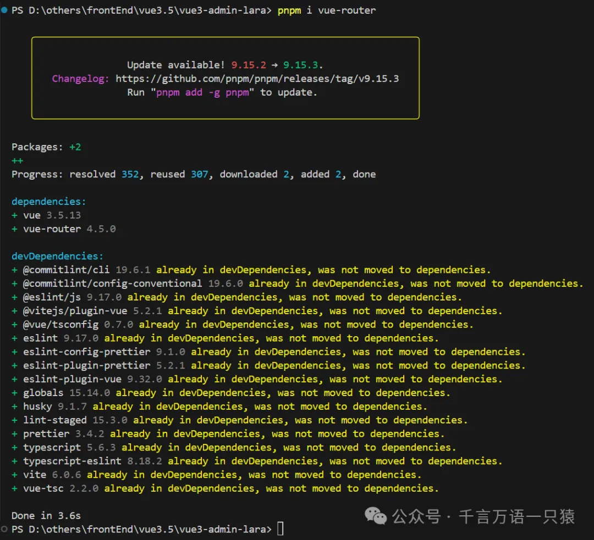

### **1.2 配置 Router**

在 src 文件夹下新建 views 文件夹，新建文件 Home.vue 和 About.vue

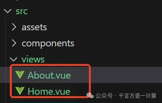

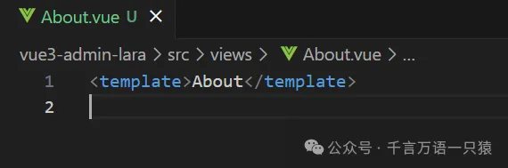

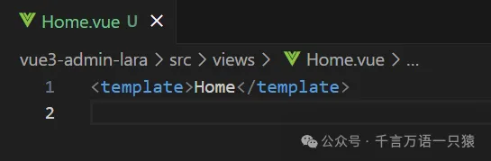

在 src 文件夹下新建 router 文件夹，在 router 下新建 index.ts 用来配置路由

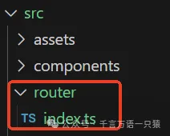

```typescript
//router/index.ts
import {
  createRouter,
  createWebHistory,
  type RouteRecordRaw,
} from "vue-router";
const routes: RouteRecordRaw[] = [
  {
    path: "/home",
    component: () => import("../views/Home.vue"),
  },
  {
    path: "/about",
    component: () => import("../views/About.vue"),
  },
];
export default createRouter({
  routes, //路由表
  history: createWebHistory(), //路由模式
});
```

### **1.3 引用 Router**

在 main.ts 中引入路由

```typescript
//main.ts
import { createApp } from "vue";
import "./style.css";
import App from "./App.vue";
import router from "./router";
const app = createApp(App);
app.use(router);
app.mount("#app");
```

在 App.vue 中添加入口

```html
//App.vue
<script setup lang="ts">
  import { RouterView } from "vue-router";
</script>
<template>
  <RouterLink to="/home">首页</RouterLink>
  <RouterLink to="/about">关于</RouterLink>
  <RouterView></RouterView>
</template>
<style scoped></style>
```

### **1.4 运行项目**

运行项目

```json
npm run dev
```

启动后，点击【首页】【关于】会显示对应页面内容

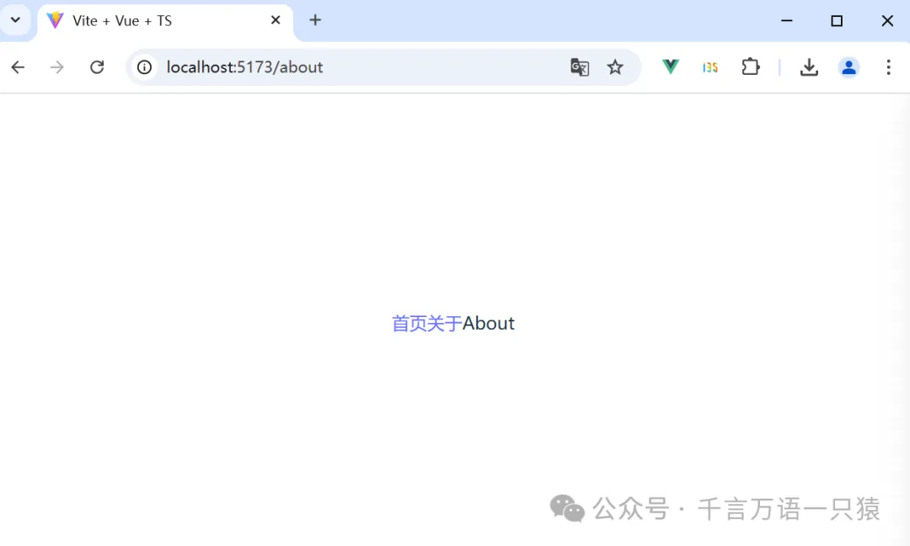

## **Pinia 集成**

### **2.1 安装 Pinia**

通过 pnpm 安装 Pinia

```json
pnpm install pinia
```

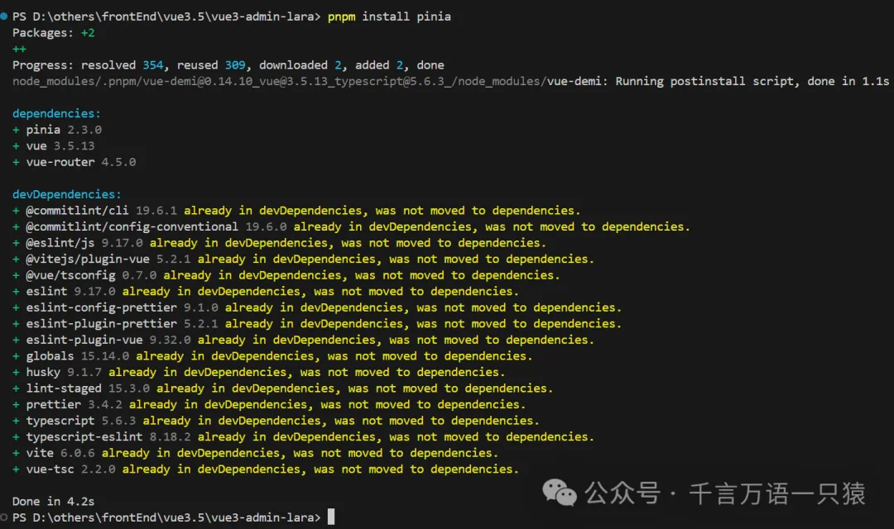

### **2.2 配置 Pinia**

在 src 文件夹下新建文件夹 stores，根据项目需要在 stores 下新建容器 ts 文件，此处示例新建文件 counter.ts

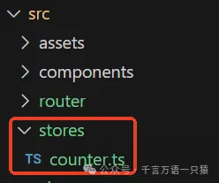

```typescript
//counter.ts
import { defineStore } from "pinia";
import { ref } from "vue";
export const useCounterStore = defineStore("counter", () => {
  //vue3中的setup函数
  const count = ref(0);
  const increment = () => {
    count.value++;
  };
  return { count, increment };
});
```

### **2.3 引用 Pinia**

在 main.ts 中引入 Pinia

```typescript
//main.ts
import { createApp } from "vue";
import "./style.css";
import App from "./App.vue";
import router from "./router";
import { createPinia } from "pinia";
const app = createApp(App);
const pinia = createPinia();
app.use(router);
app.use(pinia);
app.mount("#app");
```

在 App.vue 中应用

```html
//App.vue
<template>
  <RouterLink to="/home">首页</RouterLink>
  <RouterLink to="/about">关于</RouterLink>
  {{ store.count }}
  <button @click="store.increment">+</button>
  <RouterView></RouterView>
</template>
<script lang="ts" setup>
  import { useCounterStore } from "./stores/counter";
  const store = useCounterStore();
</script>
<style scoped></style>
```

### **2.4 运行项目**

运行项目

```json
npm run dev
```

启动后，点击【+】按钮，数字相应增加

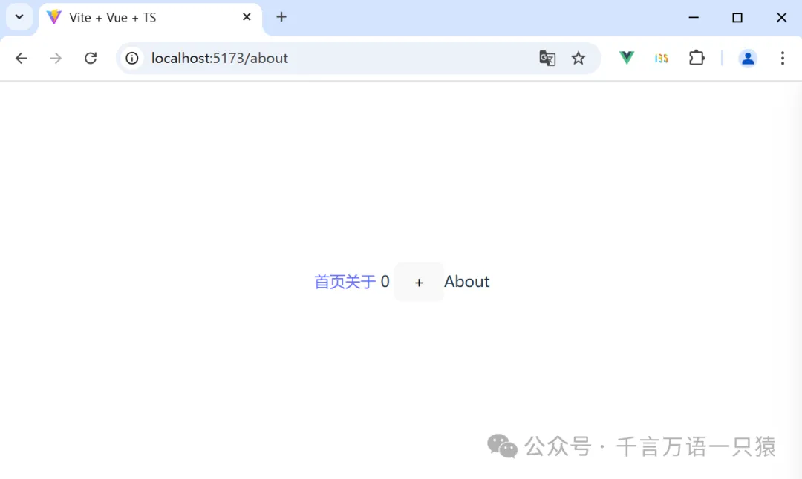

## **其他配置**

### **3.1 配置别名**

在 vite.config.ts 中配置别名，这样后续写路径更便捷

```typescript
//vite.config.ts
import { defineConfig } from "vite";
import vue from "@vitejs/plugin-vue";
import path from "path";
// https://vite.dev/config/
export default defineConfig({
  resolve: {
    alias: [{ find: "@", replacement: path.resolve(__dirname, "src") }],
  },
  plugins: [vue()],
});
```

这样路由中配置可修改成

```typescript
//router/index.ts
import {
  createRouter,
  createWebHistory,
  type RouteRecordRaw,
} from "vue-router";
const routes: RouteRecordRaw[] = [
  {
    path: "/home",
    component: () => import("@/views/Home.vue"),
  },
  {
    path: "/about",
    component: () => import("@/views/About.vue"),
  },
];
export default createRouter({
  routes, //路由表
  history: createWebHistory(), //路由模式
});
```

### **3.2 配置 tsconfig**

上面配置别名后，代码可以正常运行，但代码中会出现 TypeScrip 的飘红报错，还需修改一下 TypeScrip 的配置。

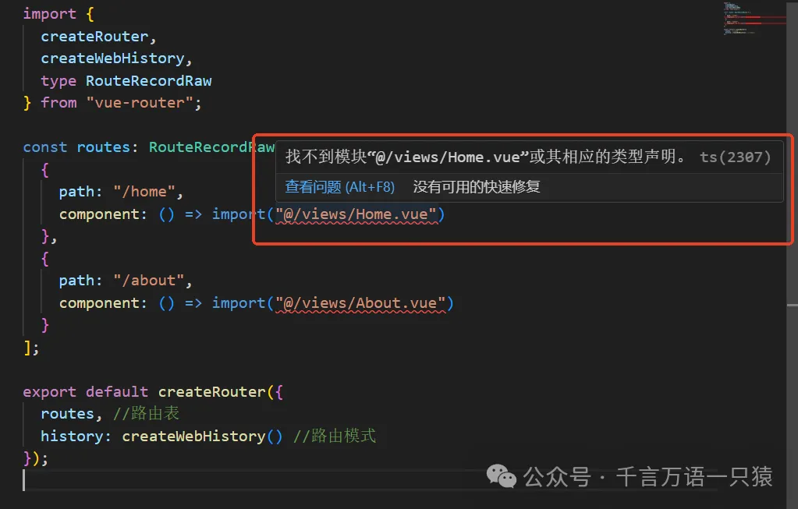

如图，TypeScrip 的配置文件有三个。

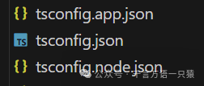

在 Vue 3 项目中，这三个 TypeScrip t 配置文件有不同的用途：

> - `tsconfig.json`: 这是项目的根配置文件，定义了 TypeScript 编译器的全局选项，比如编译目标、模块系统、包含和排除的文件等。
> - `tsconfig.app.json`: 这个文件通常继承自`tsconfig.json`，并为 Vue 应用的前端源代码提供特定的编译选项。它可能包含针对前端构建的优化设置，比如特定的路径别名或不同的编译输出目录。
> - `tsconfig.node.json`: 这个文件同样继承自`tsconfig.json`，但它是为 Node.js 环境中的代码（如服务器端渲染或构建脚本）设计的。它可能包含 Node.js 特定的编译选项，比如不同的模块解析策略。

简而言之，tsconfig.json 是基础配置，而 tsconfig.app.json 和 tsconfig.node.json 是针对不同运行环境的定制配置。

这里我们配置 tsconfig.app.json，添加 baseUrl 和 paths。

```json
//tsconfig.app.json
{
  "extends": "@vue/tsconfig/tsconfig.dom.json",
  "compilerOptions": {
    "tsBuildInfoFile": "./node_modules/.tmp/tsconfig.app.tsbuildinfo",
    /* Linting */
    "strict": true,
    "noUnusedLocals": true,
    "noUnusedParameters": true,
    "noFallthroughCasesInSwitch": true,
    "noUncheckedSideEffectImports": true,
    "baseUrl": ".",
    "paths": {
      "@/*": ["src/*"]
    }
  },
  "include": ["src/**/*.ts", "src/**/*.tsx", "src/**/*.vue"]
}
```

配置好以后，就不会报错了。（如果还有飘红，就重启编辑器即可）

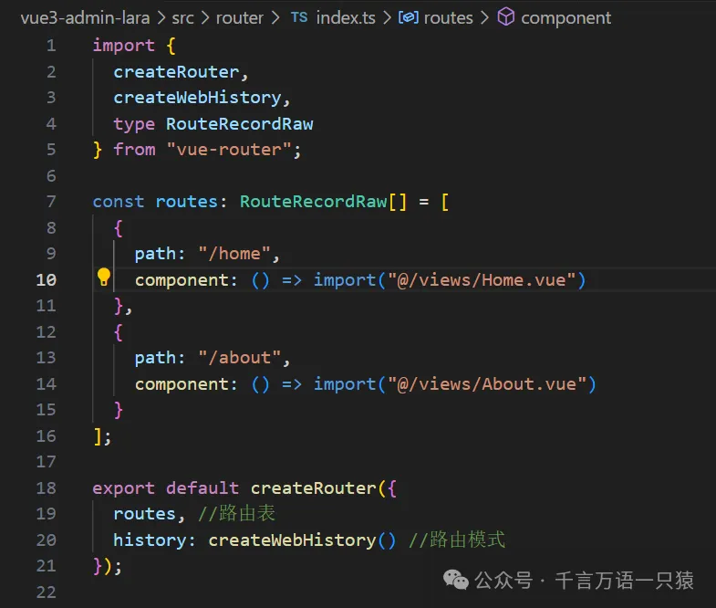

### **3.3 安装 Vue-official 插件**

如下图，在 vscode 中搜索 Vue-official 插件，安装 Vue-official 插件。

> `Vue-Official `是 Vue 的 VSCode 官方插件，原名 `Volar`，提供语法高亮、代码片段、智能感知和错误检查等功能，支持 Vue 2 和 Vue 3，特别适用于 Vue3.4 以上版本，新增了对 Vue3.4 新特性的支持，如属性同名简写和拖拽导入组件。该插件集成了 `Vetur `的功能并有所增强，建议在 Vue 3 项目中使用时禁用 `Vetur`。

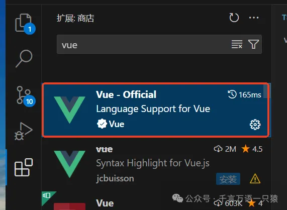

安装后，点击图标，选择【添加到工作区建议】。

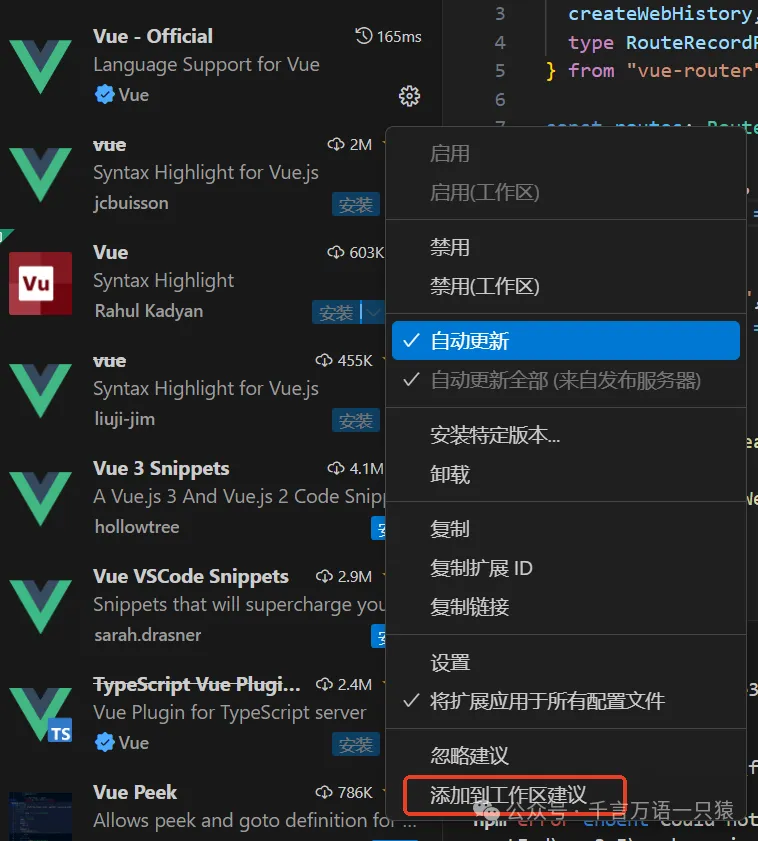

点击后，会在项目文件夹 .vscode 下的 extensions.json 中添加配置，没有的话手动添加一下。

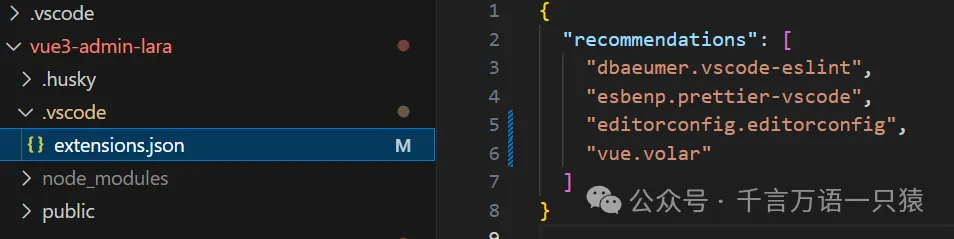

## **Element-plus 集成**

### **4.1 安装 element-plus**

通过 pnpm 安装 element-plus 组件库

```json
pnpm install element-plus
```

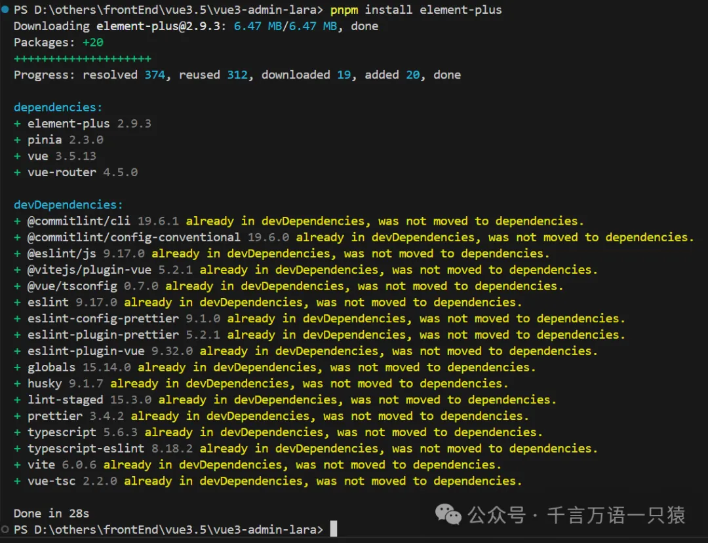

### **4.2 引用 element-plus**

在 main.ts 中引入 element-plus

```typescript
//main.ts
import { createApp } from "vue";
import "./style.css";
import App from "./App.vue";
import router from "./router";
import { createPinia } from "pinia";
import ElementPlus from "element-plus";
import "element-plus/dist/index.css";
const app = createApp(App);
const pinia = createPinia();
app.use(router);
app.use(pinia);
app.use(ElementPlus);
app.mount("#app");
```

修改 tsconfig.app.json 配置，增加 element-plus 类型提示

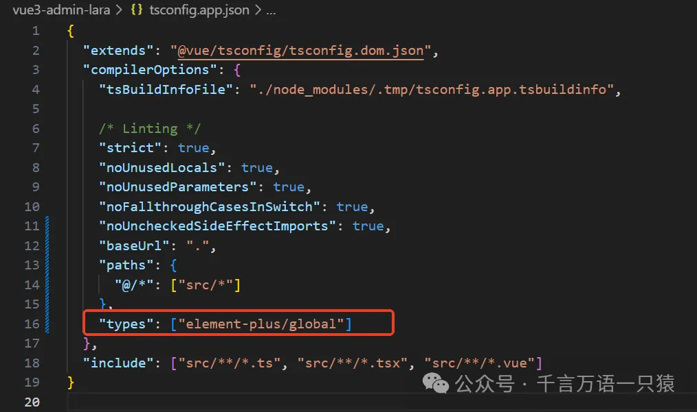

配置好后，在页面中应用 element-plus 组件就会有提示，这样可以提高开发效率。

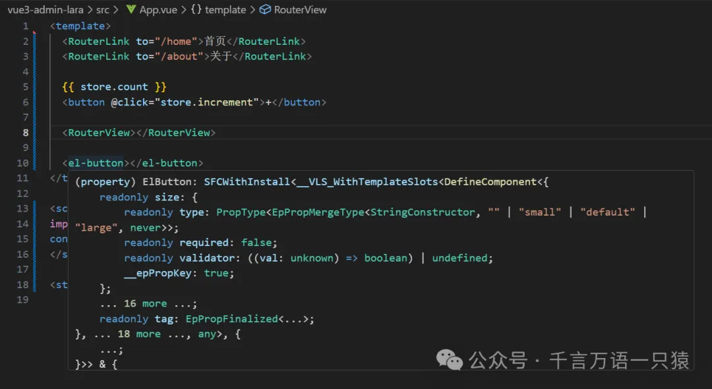

在 App.vue 中应用

```html
//App.vue
<template>
  <RouterLink to="/home">首页</RouterLink>
  <RouterLink to="/about">关于</RouterLink>
  {{ store.count }}
  <button @click="store.increment">+</button>
  <RouterView></RouterView>
  <el-button type="primary">按钮</el-button>
</template>
<script lang="ts" setup>
  import { useCounterStore } from "./stores/counter";
  const store = useCounterStore();
</script>
<style scoped></style>
```

### **4.4 运行项目**

运行项目

```json
npm run dev
```

启动后，可正常显示 element-plus 组件

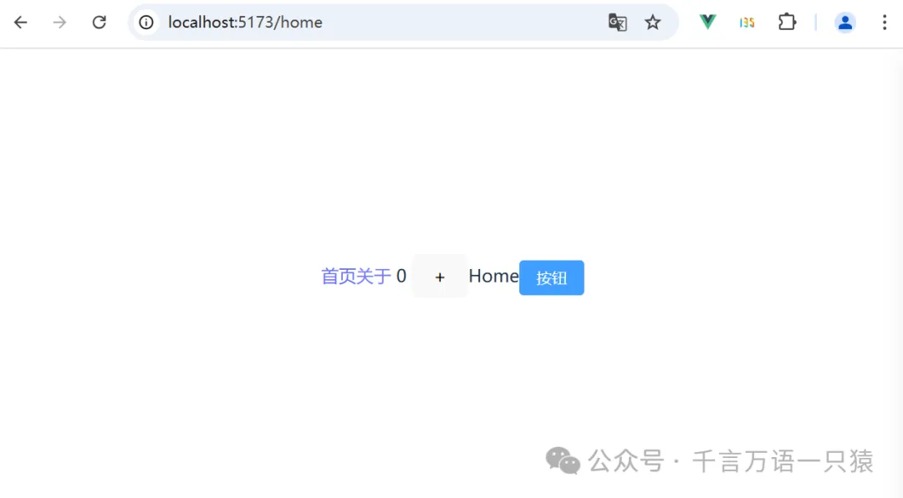

以上，我们的代码基本就搭建好了。
