本章主要是关于整体页面布局及样式处理，在进行这一章代码前，先将前两章中的示例代码部分删除（如 Home.vue、About.vue、counter.ts、App.vue 中引用等）

## **整体页面布局**

页面整体布局构成了产品的框架基础，通常涵盖主导航、侧边栏菜单、面包屑导航以及核心内容展示区域等关键元素

### **1.1 创建 layout 布局组件**

在 src 文件夹下新建文件夹 layout，用于放置页面整体布局相关的组件页面。在 layout 文件夹下新建文件 index.vue

```html
//layout/index.vue
<template>
  <div class="app-wrapper">
    <div class="sidebar-container">侧边导航</div>
    <div class="main-container">
      <div class="header">
        <div class="navbar">导航条1</div>
        <div class="tags-view">导航条2</div>
      </div>
      <div class="app-main">
        <router-view></router-view>
      </div>
    </div>
  </div>
</template>
```

### **1.2 创建 Dashboard 页面**

删除 main.ts 中引用的默认样式 style.css，在 views 文件夹下新建 Dashboard 文件夹，在 Dashboard 文件夹下新建文件 index.vue 文件

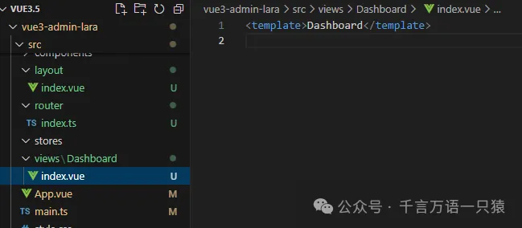

### **1.3 配置路由**

修改 router/index.ts

```typescript
//router/index.ts
import {
  createRouter,
  createWebHistory,
  type RouteRecordRaw,
} from "vue-router";
import Layout from "@/layout/index.vue";
const routes: RouteRecordRaw[] = [
  {
    path: "/",
    component: Layout,
    redirect: "/dashboard",
    children: [
      {
        path: "dashboard",
        name: "Dashboard",
        component: () => import("@/views/Dashboard/index.vue"),
      },
    ],
  },
];
export default createRouter({
  routes, //路由表
  history: createWebHistory(), //路由模式
});
```

### **1.4 启动项目**

启动项目，查看页面

```json
npm run dev
```

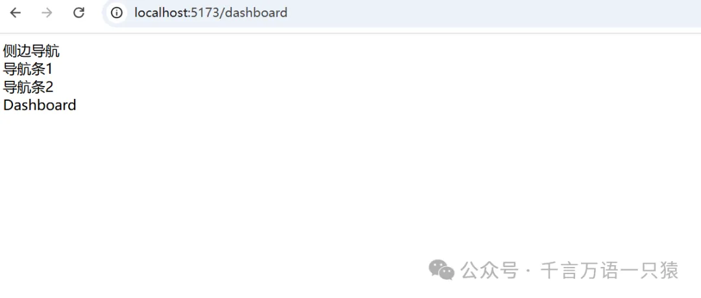

## **样式处理**

样式使用 Sass + Unocss 编写，使用前先安装 Sass 和 Unocss。

### **2.1 安装 Sass**

> Sass 是一种强大的 CSS 预处理器，它扩展了 CSS 的功能，增加了变量、嵌套规则、混合（mixins）、继承、函数等高级特性。Sass 提供了更高效、更易于维护的样式编写方式。通过编译，Sass 代码转换为标准的 CSS，兼容所有浏览器。Sass 有两种语法格式：SCSS（类似于 CSS 的语法）和 Indented Sass（缩进语法）。它广泛应用于大型项目和框架中，有助于提高开发效率和代码的可读性。

使用 pnpm 安装 Sass

```json
pnpm install sass -D
```

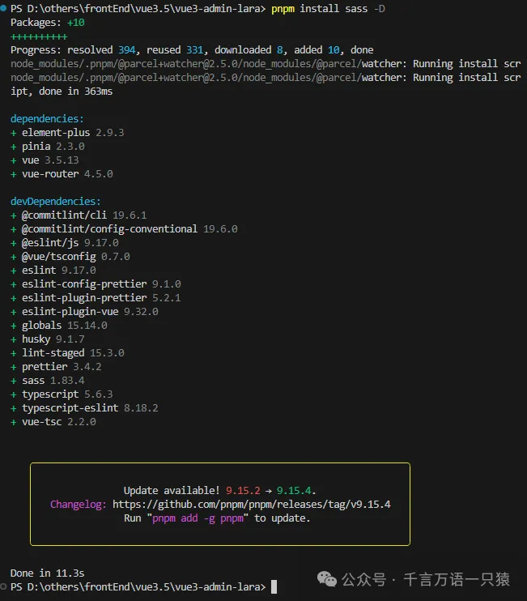

### **2.2 安装 UnoCss**

> UnoCSS 是一个即时按需的原子化 CSS 引擎，它提供了一种灵活、强大、快速且愉快的方式来生成和定制 CSS。这个引擎的特点是不需要解析、抽象语法树（AST）或扫描，因此它在性能上比其他类似的 CSS 引擎（如 Windi CSS 或 Tailwind CSS JIT）快五倍。UnoCSS 是轻量级的，零依赖，并且对浏览器友好，其大小约为 6kb（使用 minbrotli 压缩）

> `@unocss/preset-uno` 是 UnoCSS 的一个预设，它提供了一系列基于原子化 CSS 的实用类。这个预设包含了大量的通用样式规则，如颜色、间距、字体大小、边框、布局等，使得开发者可以快速应用这些样式到 HTML 元素上，而无需编写具体的 CSS 代码。`@unocss/preset-uno` 的目标是提供一种简洁、直观的方式来构建界面，同时保持高性能和低维护成本。

> `@unocss/preset-attributify` 是另一个 UnoCSS 预设，它允许开发者使用属性（attributes）而不是类（classes）来应用原子化 CSS 样式。这种方法的优点是可以减少 HTML 中的类名数量，使标记更加简洁，并且可以更容易地应用动态样式。例如，你可以直接在 HTML 元素上使用 `bg-red`、`text-lg` 等属性来改变背景颜色或文本大小，而不需要在元素上添加相应的类。这使得 UnoCSS 的使用更加灵活，尤其是在处理动态内容和响应式设计时。

使用 pnpm 安装 UnoCss

```json
pnpm i unocss @unocss/preset-uno @unocss/preset-attributify -D
```

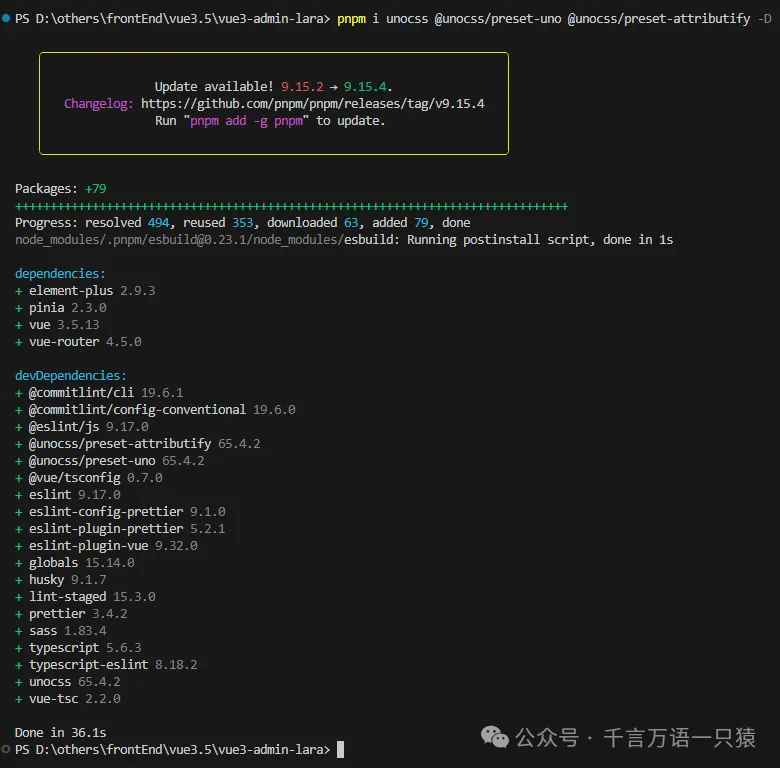

安装好后，在项目根目录下新建配置文件 uno.config.ts 对 Unocss 进行配置

```typescript
//uno.config.ts
import { defineConfig } from "unocss";
import presetAttributify from "@unocss/preset-attributify";
import presetUno from "@unocss/preset-uno";
export default defineConfig({
  presets: [presetAttributify(), presetUno()],
});
```

在 vite.config.ts 中引入


在 vite.config.ts 中引入

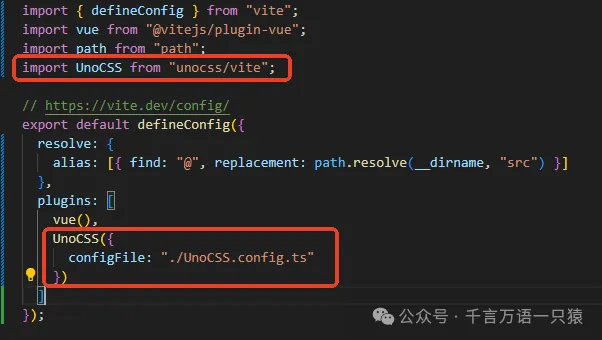

```typescript
//vite.config.ts
import { defineConfig } from "vite";
import vue from "@vitejs/plugin-vue";
import path from "path";
import UnoCSS from "unocss/vite";
// https://vite.dev/config/
export default defineConfig({
  resolve: {
    alias: [{ find: "@", replacement: path.resolve(__dirname, "src") }],
  },
  plugins: [
    vue(),
    UnoCSS({
      configFile: "./UnoCSS.config.ts",
    }),
  ],
});
```

在 main.ts 中导入 Unocss

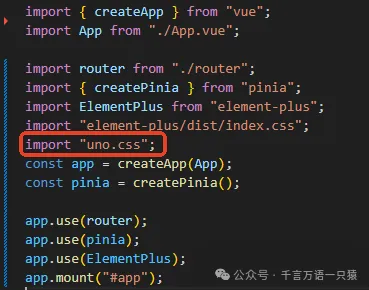

```typescript
//main.ts
import { createApp } from "vue";
import App from "./App.vue";
import router from "./router";
import { createPinia } from "pinia";
import ElementPlus from "element-plus";
import "element-plus/dist/index.css";
import "uno.css";
const app = createApp(App);
const pinia = createPinia();
app.use(router);
app.use(pinia);
app.use(ElementPlus);
app.mount("#app");
```

接着，安装 unocss 插件，这样在代码中会有 unocss 的代码提示

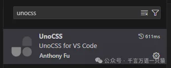

在页面中使用 Unocss，如在 layout.vue 中添加 text-red 属性

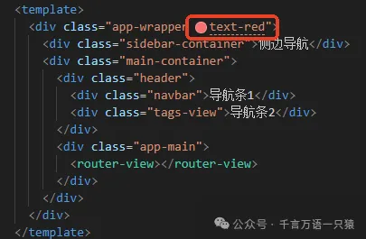

效果如下：


### **2.3 Sass + Unocss 结合使用**

Unocss 可以在页面内添加到 class 中使用，或直接如上文所示以行内属性的形式使用，但这样不好维护，为了便于维护，我们希望可以在\<style>\</style>中使用，这样既可以享受 Sass 的语法优势，也可以享受 Unocss 的语法优势，也更方便维护。为了达到这个目的，需要安装一个插件 `@unocss/transformer-directives` 。（一般不建议 Sass 和 Unocss 一起使用，但是一起用还挺方便的，看个人需求吧~）

> `@unocss/transformer-directives` 是 UnoCSS 的一个转换器插件，用于处理 CSS 文件中的特定指令，如 `@apply`、`@screen` 和 `theme()`。它允许开发者将原子化类应用到自定义选择器，通过媒体查询条件应用样式，以及访问主题配置。这样，UnoCSS 的功能得以扩展，使得样式编写更加灵活和强大，同时保持代码的简洁和可维护性。

使用 pnpm 安装 `@unocss/transformer-directives`

```json
pnpm i @unocss/transformer-directives
```

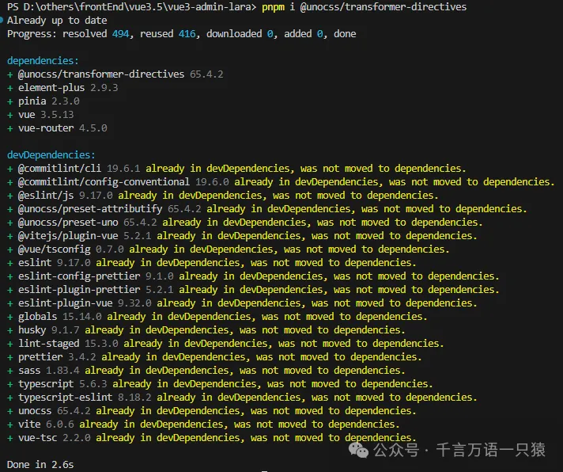

在 uno.config.ts 中引入

```typescript
//uno.config.ts
import { defineConfig } from "unocss";
import presetAttributify from "@unocss/preset-attributify";
import presetUno from "@unocss/preset-uno";
import transformDirective from "@unocss/transformer-directives";
export default defineConfig({
  presets: [presetAttributify(), presetUno()],
  transformers: [transformDirective()], // apply
});
```

在页面\<style>\</style>中使用

```html
//layout/index.vue
<template>
  <div class="app-wrapper">
    <div class="sidebar-container">侧边导航</div>
    <div class="main-container">
      <div class="header">
        <div class="navbar">导航条1</div>
        <div class="tags-view">导航条2</div>
      </div>
      <div class="app-main">
        <router-view></router-view>
      </div>
    </div>
  </div>
</template>
<style lang="scss">
  .app-wrapper {
    @apply text-red w-full h-full;
  }
</style>
```

效果如下：

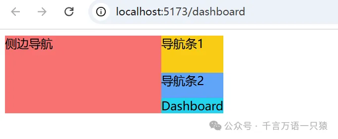

### **2.4 清除默认样式**

现在，项目中还存在一些默认样式，为了避免对后续样式的影响，需要对这些默认样式进行清除，这里我们使用 pnpm 安装 Normalize.css 插件来清除默认样式

> Normalize.css 是一个现代的 CSS 重置方案，旨在提高网页在不同浏览器中的样式一致性。它保留有用的浏览器默认样式，同时修复常见浏览器间的差异和 bug，确保 HTML 元素在多种环境下表现一致。与传统的 CSS Reset 不同，Normalize.css 更加细腻，专注于提升可用性和可访问性，适用于追求一致性和标准化的项目。它被广泛用于众多框架和网站，如 Twitter Bootstrap 和 HTML5 Boilerplate，是现代网页开发的必备工具。

```json
pnpm install normalize.css
```

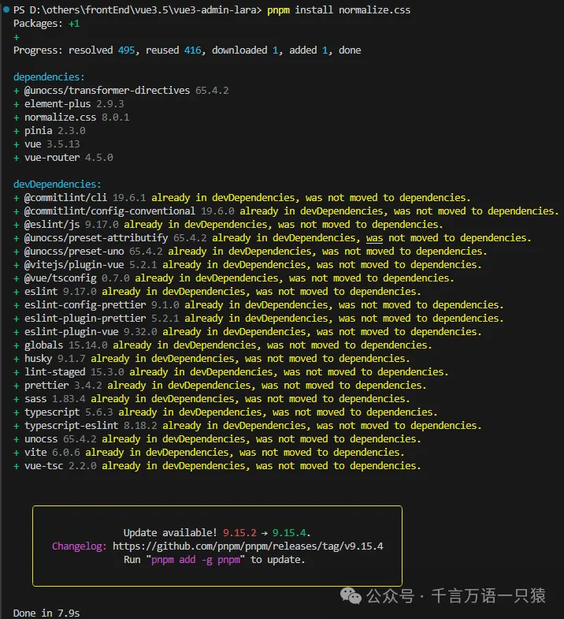

在 main.ts 中引入


```typescript
//main.ts
import { createApp } from "vue";
import App from "./App.vue";
import router from "./router";
import "normalize.css/normalize.css";
import { createPinia } from "pinia";
import ElementPlus from "element-plus";
import "element-plus/dist/index.css";
import "uno.css";
const app = createApp(App);
const pinia = createPinia();
app.use(router);
app.use(pinia);
app.use(ElementPlus);
app.mount("#app");
```

引入后，可以看见默认的样式已经清除（空隙等）

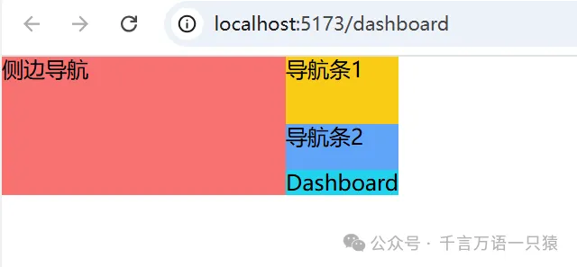

### **2.5 完善 layout 样式**

完善 layout.vue 的样式

```html
//layout.vue
<template>
  <div class="app-wrapper">
    <div class="sidebar-container">侧边导航</div>
    <div class="main-container">
      <div class="header">
        <div class="navbar">导航条1</div>
        <div class="tags-view">导航条2</div>
      </div>
      <div class="app-main">
        <router-view></router-view>
      </div>
    </div>
  </div>
</template>
<style lang="scss">
  .app-wrapper {
    @apply flex w-full h-full;
    .sidebar-container {
      @apply bg-red w-[210px];
    }
    .main-container {
      @apply flex flex-col flex-1;
    }
    .header {
      @apply h-84px;
      .navbar {
        @apply h-50px bg-yellow;
      }
      .tags-view {
        @apply h-34px bg-blue;
      }
    }
    .app-main {
      @apply bg-cyan;
      min-height: calc(100vh - 84px);
    }
  }
</style>
```

效果如下：

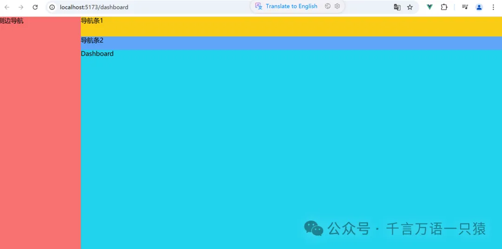

### **2.6 提取公共变量**

Vite 支持 Css Modules，使用起来非常简单，它允许你将 CSS 类名局部化，从而避免全局冲突。在 Vite 中使用 Css Modules 的步骤大致如下：

> 1. **命名 CSS 文件**：CSS Modules 要求你的样式文件以 `.module.css` 为后缀。例如，如果你有一个名为 `styles.css` 的文件，你需要将其重命名为 `styles.module.css`。
> 2. **编写 CSS**：在 `styles.module.css` 文件中，你可以像往常一样编写 CSS。
> 3. **组件中导入和使用**：在你的组件中，你可以导入这个 CSS 文件，Vite 会自动将其识别为 CSS Modules。然后你可以像使用对象一样使用这些样式。

在 src 下新建文件夹 style，新建文件 variables.module.scss，提取公共变量，scss 中声明好的变量在 js 中也可以使用

```scss
//variable.module.scss
$sideBarWidth: 210px;
$navBarHeight: 50px;
$tagsViewHeight: 34px;
```

在 style 下创建 index.scss 文件，引入 variables.modules.scss，在:root 中定义 css 的变量

```scss
//index.scss
@import "./variables.module.scss";
:root {
  --sidebar-width: #{$sideBarWidth};
  --navbar-height: #{$navBarHeight};
  --tagsview-height: #{$tagsViewHeight};
}
```

在 main.ts 中引入 index.scss

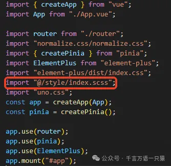

```typescript
//main.ts
import { createApp } from "vue";
import App from "./App.vue";
import router from "./router";
import "normalize.css/normalize.css";
import { createPinia } from "pinia";
import ElementPlus from "element-plus";
import "element-plus/dist/index.css";
import "@/style/index.scss";
import "uno.css";
const app = createApp(App);
const pinia = createPinia();
app.use(router);
app.use(pinia);
app.use(ElementPlus);
app.mount("#app");
```

修改 layout.vue 中相关 css 的值

```html
//layout.vue
<template>
  <div class="app-wrapper">
    <div class="sidebar-container">侧边导航</div>
    <div class="main-container">
      <div class="header">
        <div class="navbar">导航条1</div>
        <div class="tags-view">导航条2</div>
      </div>
      <div class="app-main">
        <router-view></router-view>
      </div>
    </div>
  </div>
</template>
<style lang="scss">
  .app-wrapper {
    @apply flex w-full h-full;
    .sidebar-container {
      @apply bg-red w-[var(--sidebar-width)];
    }
    .main-container {
      @apply flex flex-col flex-1;
    }
    .header {
      @apply h-84px;
      .navbar {
        @apply h-[var(--navbar-height)] bg-yellow;
      }
      .tags-view {
        @apply h-[var(--tagsview-height)] bg-blue;
      }
    }
    .app-main {
      @apply bg-cyan;
      min-height: calc(100vh - var(--tagsview-height) - var(--navbar-height));
    }
  }
</style>
```

修改后效果

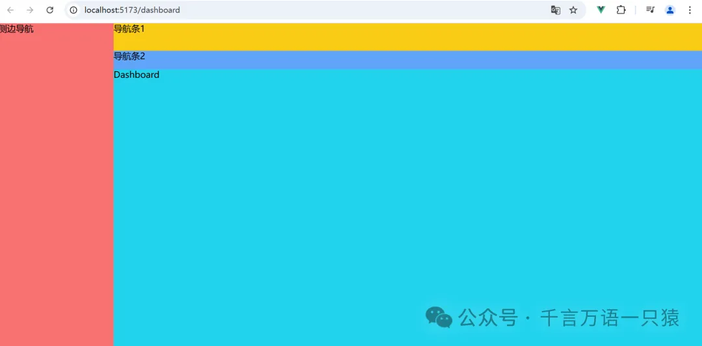

这样，整体布局及大概的样式就设置好了。
