目前，项目中的 Element Plus 组件库是全部导入，而我们希望按需导入。因为按需导入 Element Plus 组件库，能显著减小应用体积，提高加载速度，优化资源利用。它让项目结构更模块化，降低维护成本，减少潜在冲突。

## **安装插件**

首先，屏蔽掉之前全部引入的代码

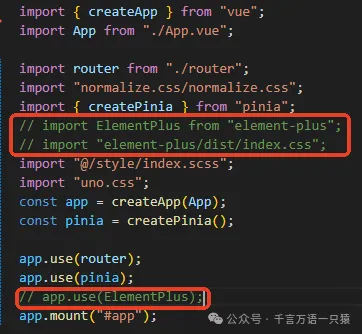

通过 pnpm 安装 unplugin-vue-components 和 unplugin-auto-import 插件，可自动按需导入，无需手动操作，兼顾开发效率与性能优化。

> **`unplugin-vue-components`** 是一个 Vue 3 的组件自动导入插件。它的主要功能如下：
>
> - **自动导入组件**：无需手动导入每个 Vue 组件，插件会自动识别并在需要时导入。
> - **按需加载**：只导入项目中实际使用的组件，减少应用的整体大小。
> - **支持多种 UI 库**：内置了对许多流行 UI 库的支持，如 Element Plus、Vuetify、Ant Design Vue 等。
> - **简化项目配置**：通过简单的配置，即可实现组件的自动导入，减少项目配置的复杂性

> **`unplugin-auto-import`** 是一个用于自动导入 Vue 3 API 和其他库的 API 的插件。它的主要功能包括：
>
> - **自动导入 API**：无需手动导入 Vue 3 的 API（如 `ref`, `reactive`, `onMounted` 等），插件会自动处理。
> - **减少冗余代码**：减少项目中重复的导入语句，使代码更加简洁。
> - **支持自定义配置**：可以配置需要自动导入的 API，以及排除某些不需要自动导入的 API。
> - **兼容性**：与 TypeScript 和其他构建工具（如 Vite、Webpack）兼容。

```json
pnpm install -D unplugin-vue-components unplugin-auto-import
```

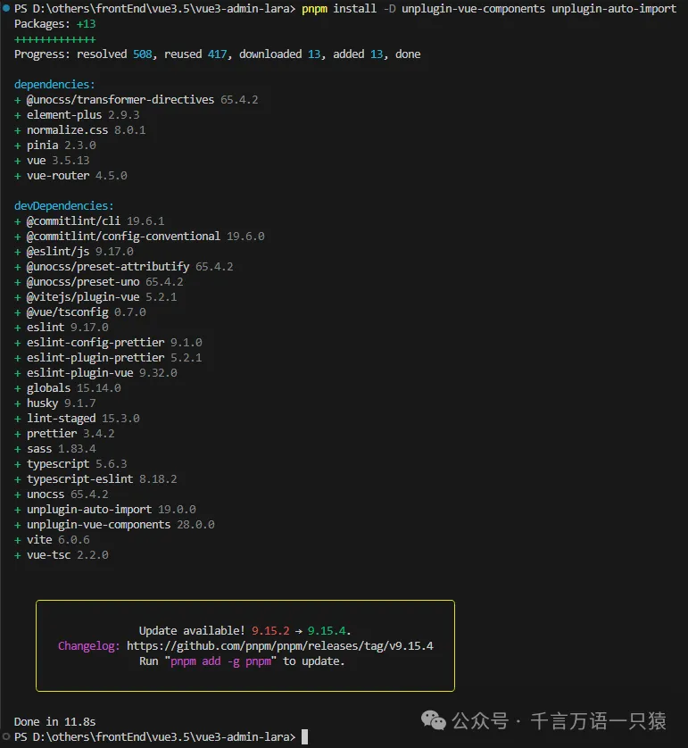

## **普通组件自动导入配置**

### **2.1 vite 配置**

在 vite.config.ts 中引入

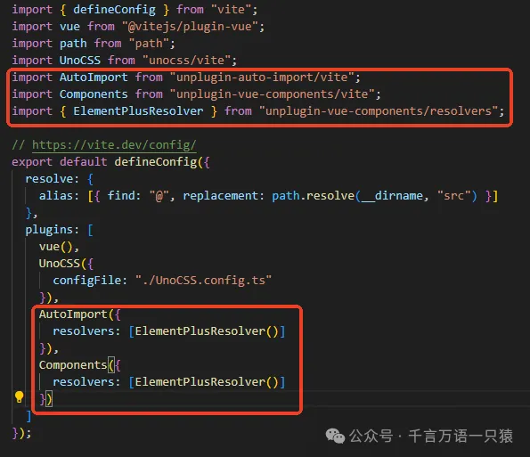

```typescript
//vite.config.ts
import { defineConfig } from "vite";
import vue from "@vitejs/plugin-vue";
import path from "path";
import UnoCSS from "unocss/vite";
import AutoImport from "unplugin-auto-import/vite";
import Components from "unplugin-vue-components/vite";
import { ElementPlusResolver } from "unplugin-vue-components/resolvers";
// https://vite.dev/config/
export default defineConfig({
  resolve: {
    alias: [{ find: "@", replacement: path.resolve(__dirname, "src") }],
  },
  plugins: [
    vue(),
    UnoCSS({
      configFile: "./UnoCSS.config.ts",
    }),
    AutoImport({
      resolvers: [ElementPlusResolver()],
    }),
    Components({
      resolvers: [ElementPlusResolver()],
    }),
  ],
});
```

### **2.2 Element Plus 组件自动导入**

在 dashboard.vue 中尝试引入一个 Element Plus 组件

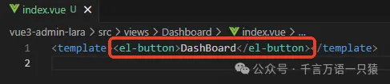

npm run dev 启动项目，可以看见页面能正常显示按钮，说明 Element Plus 组件已经自动按需导入了

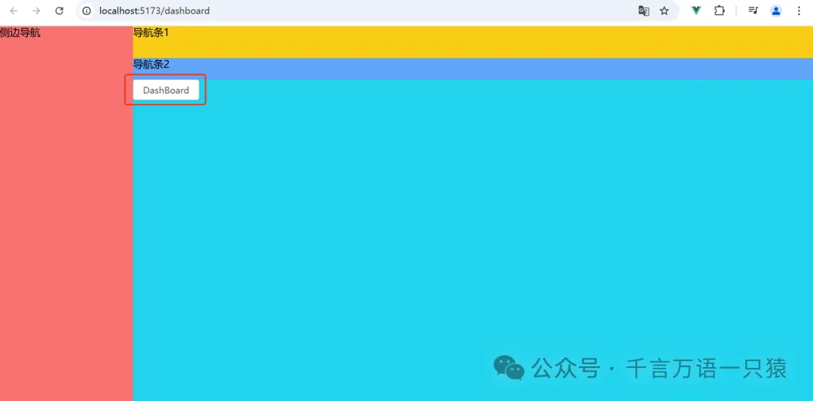

### **2.3 自定义组件自动导入**

一般自定义组件使用时，需要在页面用 import 引入，否则会报错。其实，自定义组件也可以实现按需自定义导入，修改 vite.config.ts 配置如下

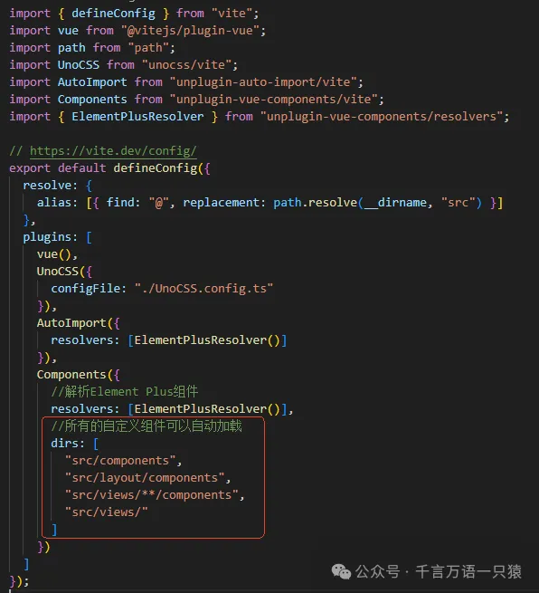

```typescript
//vite.config.ts
import { defineConfig } from "vite";
import vue from "@vitejs/plugin-vue";
import path from "path";
import UnoCSS from "unocss/vite";
import AutoImport from "unplugin-auto-import/vite";
import Components from "unplugin-vue-components/vite";
import { ElementPlusResolver } from "unplugin-vue-components/resolvers";
// https://vite.dev/config/
export default defineConfig({
  resolve: {
    alias: [{ find: "@", replacement: path.resolve(__dirname, "src") }],
  },
  plugins: [
    vue(),
    UnoCSS({
      configFile: "./UnoCSS.config.ts",
    }),
    AutoImport({
      resolvers: [ElementPlusResolver()],
    }),
    Components({
      //解析Element Plus组件
      resolvers: [ElementPlusResolver()],
      //所有的自定义组件可以自动加载
      dirs: [
        "src/components",
        "src/layout/components",
        "src/views/**/components",
        "src/views/",
      ],
    }),
  ],
});
```

这样，在页面中使用配置好的文件夹下的组件时，就会自动导入，如下图，可以在 Dashboard.vue 中直接使用 Test 组件，不需要 import

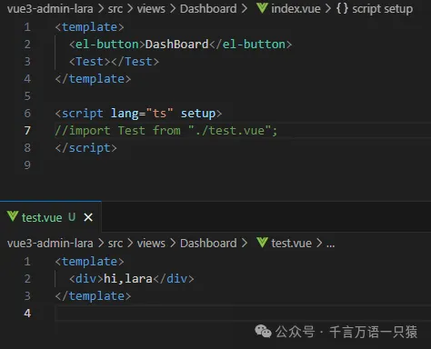

页面效果如下


### **2.4 自动生成的配置文件**

在配置自动导入过程中，会自动生成两个文件 auto-imports.d.ts 和 components.d.ts

> **auto-imports.d.ts**
>
> - **作用**：这个文件通常由一些自动导入插件生成，如 `unplugin-auto-import`。它包含了项目中使用的库、框架或自定义工具函数的类型声明，使得开发者可以在项目中直接使用这些功能，而无需在每个文件顶部手动编写 `import` 语句。
> - **内容**：文件中通常会声明全局性的类型、函数、组件等，例如 Vue Composition API 的 `ref`, `reactive`, `onMounted` 等，或者是其他库的 API。
> - **生成方式**：通过配置自动导入插件的选项，指定生成的类型声明文件的路径。

> **components.d.ts**
>
> - **作用**：这个文件通常用于 Vue.js 项目，由 Vue 的构建工具链（如 Vite 或 Vue CLI）自动生成。它包含了项目中所有 Vue 组件的类型声明，使得开发者可以在模板中直接使用这些组件，而无需导入。
> - **内容**：文件中会为每个 Vue 组件生成一个类型声明，这些声明告诉 TypeScript 编译器这些组件的存在以及它们的 props、slots 等。
> - **生成方式**：在 Vue 项目中，通常是通过 `vue-loader` 或其他相关的 Vue 插件自动检测项目中的组件，并生成相应的类型声明。

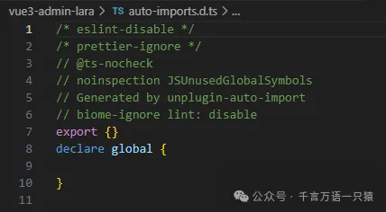


## **API 自动导入配置**

在 vite 中使用 unplugin-auto-import 插件，会自动扫描代码，在需要的地方插入必要的导入语句。通常用于自动导入某些库或模块中的 API。

如图，在 vite.config.ts 中增加配置

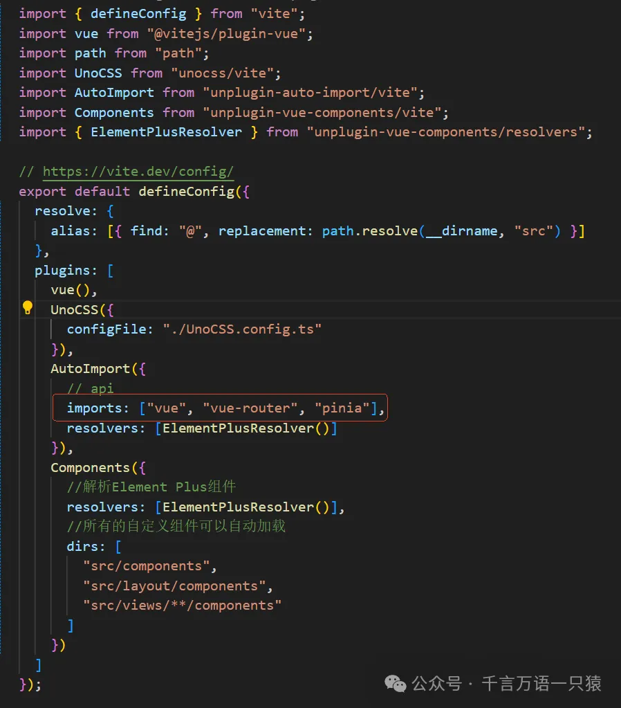

```typescript
//vite.config.ts
import { defineConfig } from "vite";
import vue from "@vitejs/plugin-vue";
import path from "path";
import UnoCSS from "unocss/vite";
import AutoImport from "unplugin-auto-import/vite";
import Components from "unplugin-vue-components/vite";
import { ElementPlusResolver } from "unplugin-vue-components/resolvers";
// https://vite.dev/config/
export default defineConfig({
  resolve: {
    alias: [{ find: "@", replacement: path.resolve(__dirname, "src") }],
  },
  plugins: [
    vue(),
    UnoCSS({
      configFile: "./UnoCSS.config.ts",
    }),
    AutoImport({
      // api
      imports: ["vue", "vue-router", "pinia"],
      resolvers: [ElementPlusResolver()],
    }),
    Components({
      //解析Element Plus组件
      resolvers: [ElementPlusResolver()],
      //所有的自定义组件可以自动加载
      dirs: [
        "src/components",
        "src/layout/components",
        "src/views/**/components",
      ],
    }),
  ],
});
```

在配置完成后，您就可以在项目中直接使用 `vue`、`vue-router` 和 `pinia` 的 API，而无需手动导入它们。例如，您可以直接使用 `ref`、`computed` 等 Vue 的响应式 API，而无需在文件顶部写 `import { ref, computed } from 'vue'`。

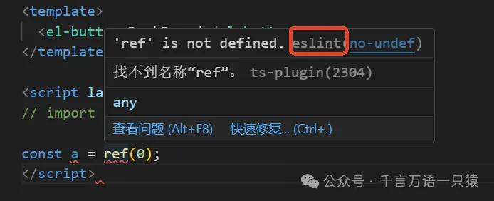

如上图，虽然现在不需要在文件顶部通过 import 导入 vue 等的 api，但是 eslint 会飘红报错，这需要在 vite.config.ts 中修改一个 eslint 的配置。

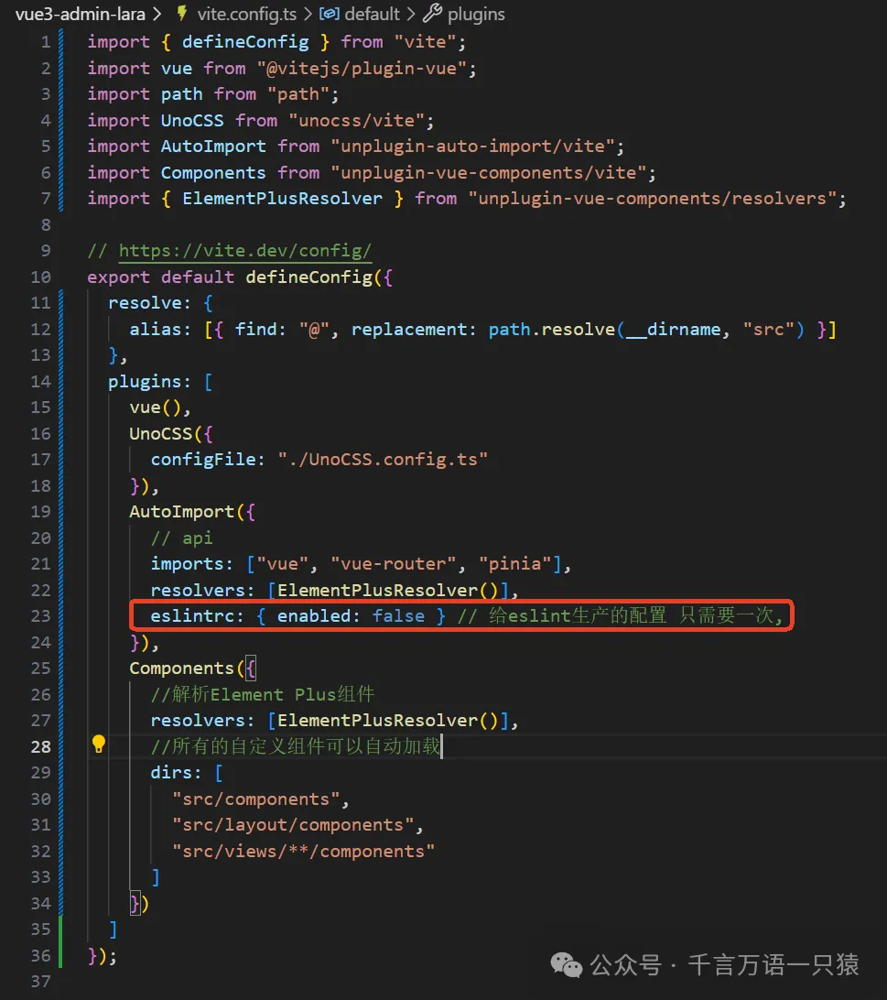

```typescript
//vite.config.ts
import { defineConfig } from "vite";
import vue from "@vitejs/plugin-vue";
import path from "path";
import UnoCSS from "unocss/vite";
import AutoImport from "unplugin-auto-import/vite";
import Components from "unplugin-vue-components/vite";
import { ElementPlusResolver } from "unplugin-vue-components/resolvers";
// https://vite.dev/config/
export default defineConfig({
  resolve: {
    alias: [{ find: "@", replacement: path.resolve(__dirname, "src") }],
  },
  plugins: [
    vue(),
    UnoCSS({
      configFile: "./UnoCSS.config.ts",
    }),
    AutoImport({
      // api
      imports: ["vue", "vue-router", "pinia"],
      resolvers: [ElementPlusResolver()],
      eslintrc: { enabled: false }, // 给eslint生产的配置 只需要一次,
    }),
    Components({
      //解析Element Plus组件
      resolvers: [ElementPlusResolver()],
      //所有的自定义组件可以自动加载
      dirs: [
        "src/components",
        "src/layout/components",
        "src/views/**/components",
      ],
    }),
  ],
});
```

配置后，会生成一个 .eslintrc-auto-import.json 文件

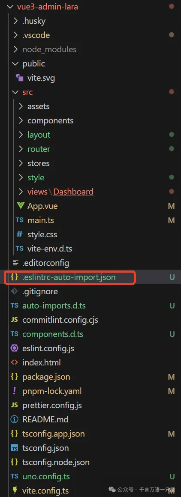

在 eslint.config.js 中引入

```typescript
//eslint.config.js
import globals from "globals";
import pluginJs from "@eslint/js"; // 推荐的js规范
import tseslint from "typescript-eslint"; // 推荐的ts规范
import pluginVue from "eslint-plugin-vue"; // 推荐的vue的规范
import prettierRecommended from "eslint-plugin-prettier/recommended";
import { createRequire } from "module";
const require = createRequire(import.meta.url);
const autoImport = require("./.eslintrc-auto-import.json");
export default [
  { files: ["**/*.{js,mjs,cjs,ts,vue}"] },
  {
    languageOptions: {
      globals: {
        ...globals.browser,
        ...globals.node,
        ...autoImport.globals,
      },
    },
  },
  pluginJs.configs.recommended,
  ...tseslint.configs.recommended,
  ...pluginVue.configs["flat/essential"],
  {
    files: ["**/*.vue"],
    languageOptions: { parserOptions: { parser: tseslint.parser } },
  },
  {
    // 自定义规则,根据需要增加  eslint 主要是校验代码规范  prettier  格式化代码的
    rules: {
      "no-console": "warn",
      "vue/multi-word-component-names": "off",
    },
  },
  prettierRecommended, // 覆盖掉eslint的规范
];
```

修改 tsconfig.app.json 的 types

```json
//tsconfig.app.json
{
  "extends": "@vue/tsconfig/tsconfig.dom.json",
  "compilerOptions": {
    "tsBuildInfoFile": "./node_modules/.tmp/tsconfig.app.tsbuildinfo",
    /* Linting */
    "strict": true,
    "noUnusedLocals": true,
    "noUnusedParameters": true,
    "noFallthroughCasesInSwitch": true,
    "noUncheckedSideEffectImports": true,
    "baseUrl": ".",
    "paths": {
      "@/*": ["src/*"]
    },
    "types": ["element-plus/global", "./auto-imports.d.ts", "./components.d.ts"]
  },
  "include": ["src/**/*.ts", "src/**/*.tsx", "src/**/*.vue"]
}
```

这样，页面中就不会报错了

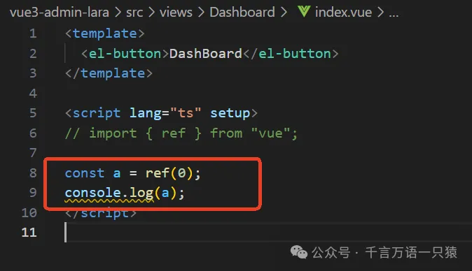

页面也正常显示


## **服务型组件自动导入配置**

服务型组件是指那些不依赖于传统 DOM 挂载点的组件，它们通常提供全局级别的功能，如消息提示、通知、确认对话框等。以下是一些 Element Plus 中的服务型组件：

1. **ElMessage**：用于显示全局消息提示，支持成功、警告、消息和错误等不同类型的提示。它可以直接通过 `this.$message` 或 `ElMessage` 方法调用，无需在模板中插入任何标签。
2. **ElNotification**：用于显示全局通知，它类似于消息提示，但是通常用于显示更复杂或需要用户进行交互的通知。可以通过 `this.$notification` 或 `ElNotification` 方法调用。
3. **ElMessageBox**：提供模态对话框功能，用于显示警告、确认消息或收集用户输入。它可以通过 `this.$msgbox`, `this.$alert`, `this.$confirm` 或 `ElMessageBox` 方法来调用。
4. **ElLoading**：用于全局或局部显示加载状态。可以通过过 `this.$loading` 或 `ElLoading.service` 方法来调用。

由于服务型组件的特点，上文中组件自动导入配置就无法生效，使用时需要单独引入。

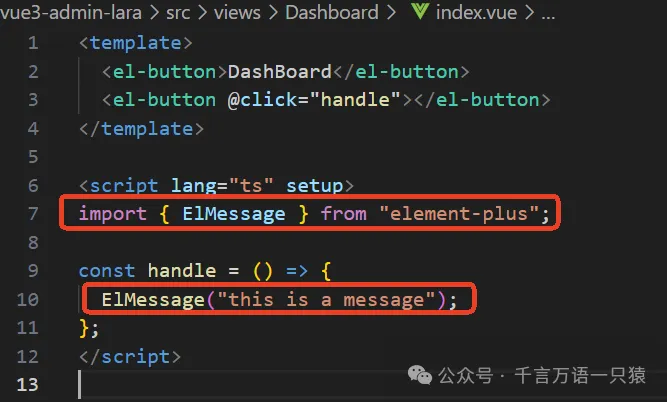

为了使服务型组件也可以自动导入，这里需要单独配置。

在 src 下新建 plugins 文件夹，新建文件 element.ts

```typescript
//element.ts
import type { App } from "vue";
import { ElMessage, ElNotification, ElMessageBox } from "element-plus";
export default (app: App) => {
  // 都放到组件的实例上了
  app.config.globalProperties.$message = ElMessage;
  app.config.globalProperties.$notify = ElNotification;
  app.config.globalProperties.$confirm = ElMessageBox.confirm;
  app.config.globalProperties.$alert = ElMessageBox.alert;
  app.config.globalProperties.$prompt = ElMessageBox.prompt;
};
export type Size = "default" | "small" | "large";
```

在 main.ts 中引入 element.ts

```typescript
//main.ts
import { createApp } from "vue";
import App from "./App.vue";
import router from "./router";
import "normalize.css/normalize.css";
import { createPinia } from "pinia";
import element from "./plugins/element";
// import ElementPlus from "element-plus";
// import "element-plus/dist/index.css";
import "@/style/index.scss";
import "uno.css";
const app = createApp(App);
const pinia = createPinia();
app.use(router);
app.use(pinia);
app.use(element);
// app.use(ElementPlus);
app.mount("#app");
```

这样，就可以在页面中通过实例直接使用了

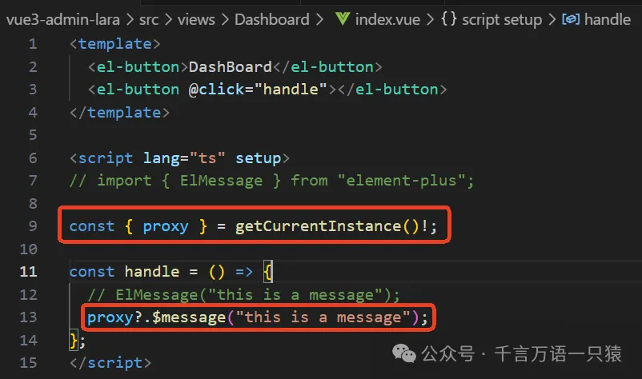

页面中点击按钮，可以发现消息功能正常，但是样式还存在问题

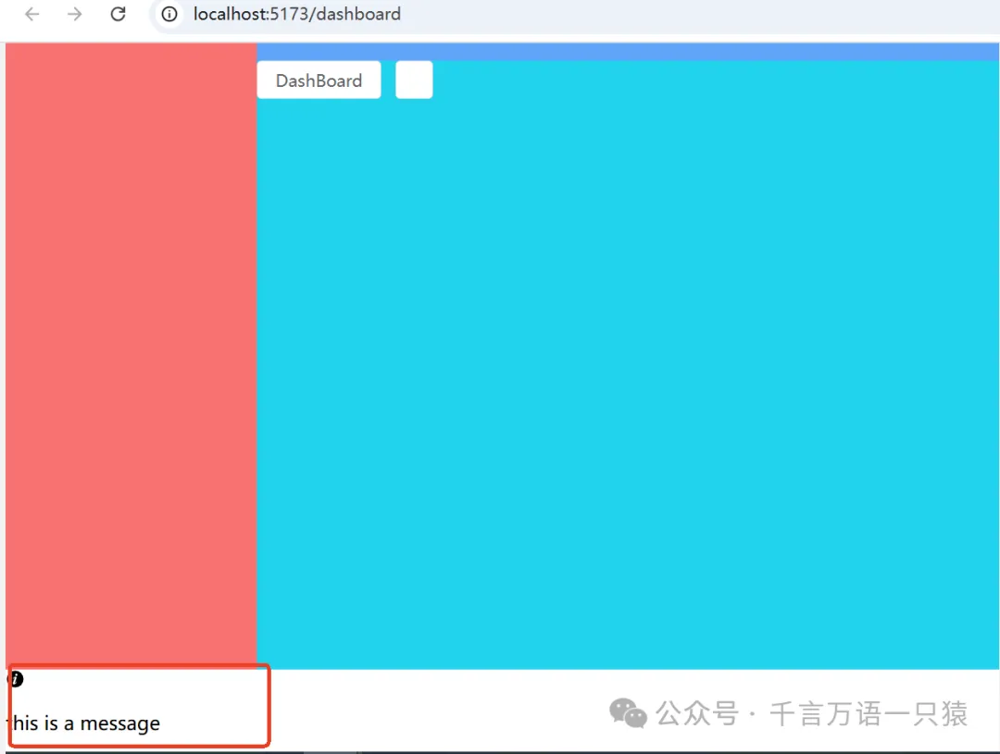

解决样式问题，需要通过 pnpm 安装插件 unplugin-element-plus 来自动导入样式

```json
pnpm i unplugin-element-plus
```

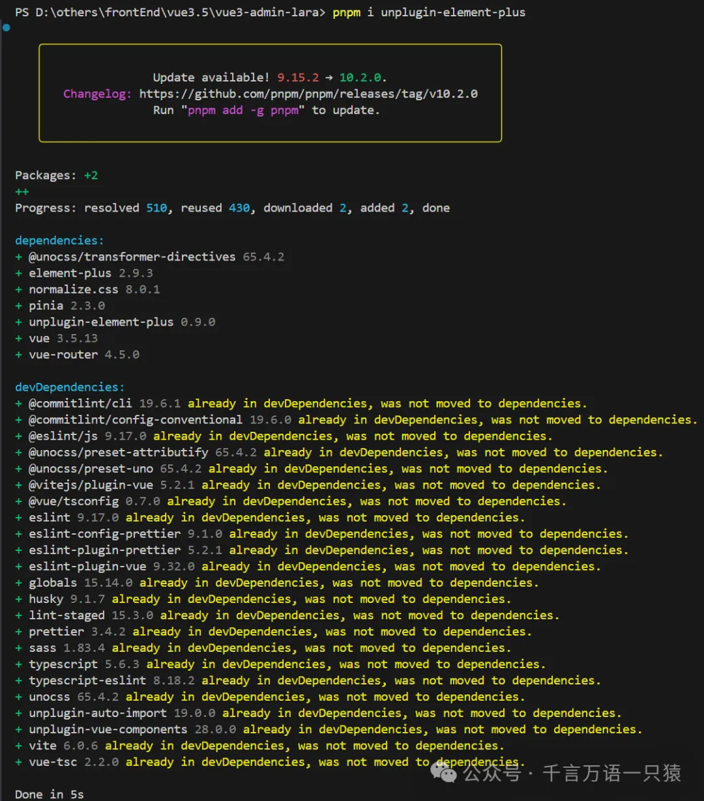

在 vite.config.ts 中引入

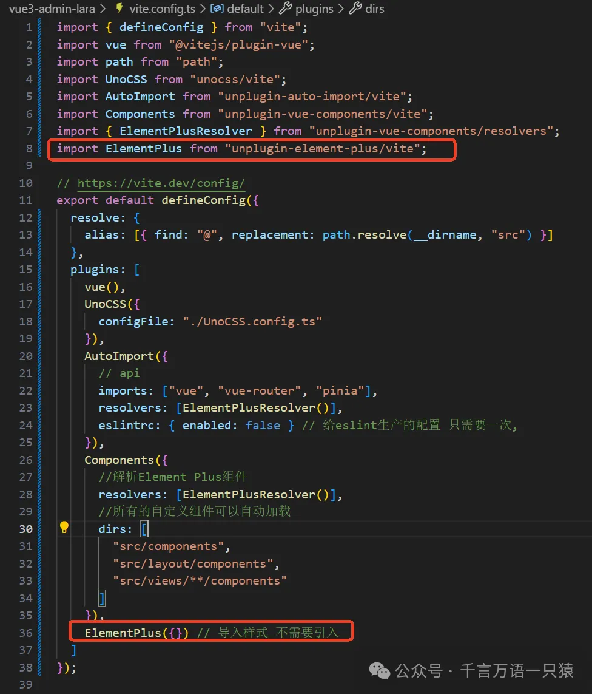

```typescript
//vite.config.ts
import { defineConfig } from "vite";
import vue from "@vitejs/plugin-vue";
import path from "path";
import UnoCSS from "unocss/vite";
import AutoImport from "unplugin-auto-import/vite";
import Components from "unplugin-vue-components/vite";
import { ElementPlusResolver } from "unplugin-vue-components/resolvers";
import ElementPlus from "unplugin-element-plus/vite";
// https://vite.dev/config/
export default defineConfig({
  resolve: {
    alias: [{ find: "@", replacement: path.resolve(__dirname, "src") }],
  },
  plugins: [
    vue(),
    UnoCSS({
      configFile: "./UnoCSS.config.ts",
    }),
    AutoImport({
      // api
      imports: ["vue", "vue-router", "pinia"],
      resolvers: [ElementPlusResolver()],
      eslintrc: { enabled: false }, // 给eslint生产的配置 只需要一次,
    }),
    Components({
      //解析Element Plus组件
      resolvers: [ElementPlusResolver()],
      //所有的自定义组件可以自动加载
      dirs: [
        "src/components",
        "src/layout/components",
        "src/views/**/components",
      ],
    }),
    ElementPlus({}), // 导入样式 不需要引入
  ],
});
```

配置完成后，页面就能正常显示了，样式都是按需加载的

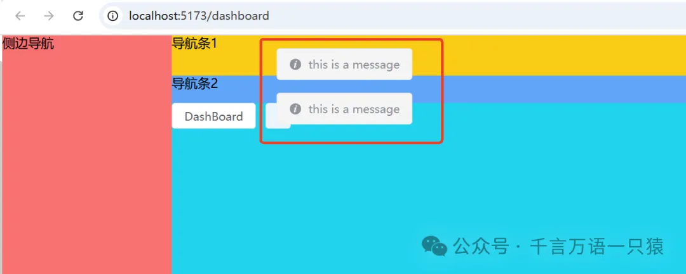

现在，我们的项目更加高效且易于管理了。这样的改进虽然简单，但效果显著，让我们的工作变得更轻松。期待未来，我们能继续这样一点一滴地进步。
