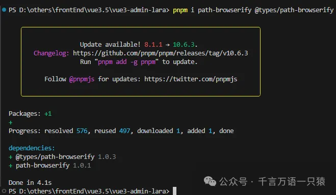
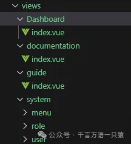
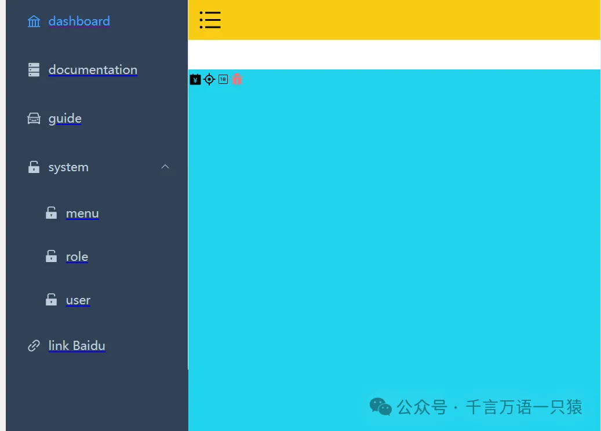
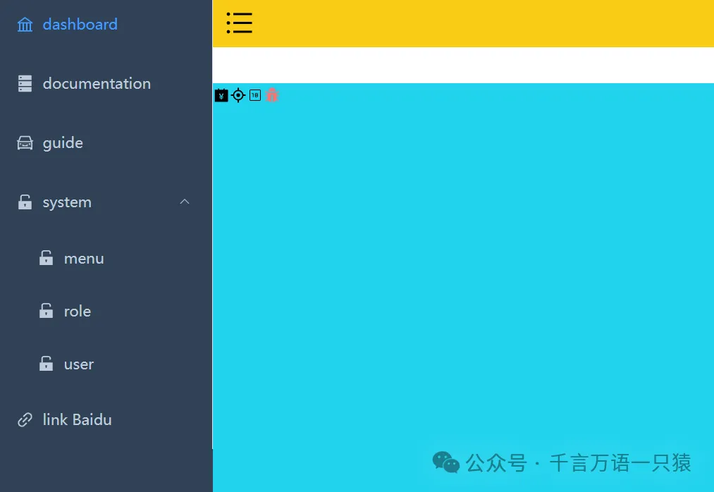

## **菜单递归组件**

### **1.1 安装插件 path-browserify**

path-browserify 是一款专门用于在浏览器环境中模拟 Node.js path 模块功能的 JavaScript 库。在 Node.js 中，path 模块为处理文件和目录路径提供了诸多实用方法，但浏览器本身并不具备这样的功能。path-browserify 填补了这一空白，使得开发者在前端项目中也能便捷地处理路径相关操作。

它支持路径拼接，通过 path.join()方法可将多个路径片段组合成一个完整路径，自动适配不同操作系统的路径分隔符。path.resolve()能把相对路径转换为绝对路径，path.normalize()用于规范路径，去除冗余部分。还可利用 path.dirname()和 path.basename()分割路径，分别获取目录名和文件名。

通过 npm 安装后，在项目中以 ES Module 或 CommonJS 方式引入即可使用。在 Webpack 等构建工具中，需配置别名来确保正确引用。常用于前端构建工具配置、浏览器端涉及路径处理的场景以及跨平台开发，助力代码在不同环境下实现路径操作的一致性 。

@types/path-browserify 专门为 path-browserify 库提供 TypeScript 类型定义。在 TypeScript 项目里，它能让代码拥有更可靠的类型保障。借助@types/path-browserify，开发人员使用 path-browserify 时，像 path.join 这类方法，编译器会自动检查传入参数类型是否匹配，返回值类型是否正确。若类型有误，能及时报错，避免运行时错误。安装十分简单，通过 npm install @types/path-browserify 即可。安装后，它无缝对接 TypeScript 项目，为路径操作代码带来智能提示与类型检查，显著提升代码质量与开发效率 。\*

通过 pnpm 安装插件

```json
pnpm i path-browserify @types/path-browserify
```



### **1.2** **SidebarItemLink 组件**

```html
//src/layout/components/Sidebar/SidebarItemLink.vue
<template>
  <component :is="componentType" v-bind="componentProps">
    <slot></slot>
  </component>
</template>
<script lang="ts" setup>
  import { isExternal } from "@/utils/validate";
  const { to } = defineProps<{
    to: string;
  }>();
  const isExt = computed(() => isExternal(to));
  const componentType = computed(() => {
    return isExt.value ? "a" : "router-link";
  });
  const componentProps = computed(() => {
    if (isExt.value) {
      return {
        href: to,
        target: "_blank",
      };
    } else {
      return {
        to,
      };
    }
  });
</script>
```

## **1.3 SidebarItem 组件**

```html
//src/layout/components/Sidebar/SidebarItem.vue
<template>
  <!-- 我们需要将路由表中的路径进行添加 index -->
  <template v-if="!item.meta?.hidden">
    <sidebar-item-link
      v-if="filteredChildren.length <= 1 && !item.meta?.alwaysShow"
      :to="resolvePath(singleChildRoute.path)"
    >
      <el-menu-item :index="resolvePath(singleChildRoute.path)">
        <el-icon v-if="iconName">
          <svg-icon :icon-name="iconName" />
        </el-icon>
        <template #title>{{ singleChildRoute.meta.title }}</template>
      </el-menu-item>
    </sidebar-item-link>
    <el-sub-menu v-else :index="item.path">
      <template #title>
        <el-icon v-if="iconName"> <svg-icon :icon-name="iconName" /> </el-icon>
        <span>{{ item.meta?.title }}</span>
      </template>
      <sidebar-item
        v-for="child of filteredChildren"
        :key="child.path"
        :item="child"
        :base-path="resolvePath(child.path)"
      ></sidebar-item>
    </el-sub-menu>
  </template>
</template>
<script lang="ts" setup>
  import type { RouteRecordRaw } from "vue-router";
  import path from "path-browserify";
  const { item, basePath } = defineProps<{
    item: RouteRecordRaw;
    basePath: string;
  }>();
  // 如果只有一个儿子，说明我们直接渲染这里的一个儿子即可
  // 如果菜单对应的children有多个 ，使用el-submenu去渲染
  const filteredChildren = computed(() =>
    (item.children || []).filter((child) => !child.meta?.hidden)
  );
  // 要渲染的路由  system => children[]
  const singleChildRoute = computed(
    () =>
      filteredChildren.value.length === 1
        ? filteredChildren.value[0]
        : { ...item, path: "" }
    // 此处我们将自己的path置为“” 防止重复拼接
  );
  // 要渲染的图标
  const iconName = computed(() => singleChildRoute.value.meta?.icon);
  // 解析父路径 + 子路径  (resolve 可以解析绝对路径
  //   /system  /sytem/memu -> /sytem/memu)
  //   /  dashboard => /dashboard
  const resolvePath = (childPath: string) => path.join(basePath, childPath);
</script>
```

## **组件引用**

在 src/layout/components/Sidebar/index.vue 中引用菜单递归组件，代码如下：

```html
//src/layout/components/Sidebar/index.vue
<template>
  <div>
    <el-menu
      class="sidebar-container-menu"
      router
      :default-active="defaultActive"
      :background-color="varaibles.menuBg"
      :text-color="varaibles.menuText"
      :active-text-color="varaibles.menuActiveText"
      :collapse="sidebar.opened"
    >
      <sidebar-item
        v-for="route in routes"
        :key="route.path"
        :item="route"
        :base-path="route.path"
      />
      <!-- 增加父路径，用于el-menu-item渲染的时候拼接 -->
    </el-menu>
  </div>
  <!-- :collapse="true" -->
</template>
<script lang="ts" setup>
  import { useAppStore } from "@/stores/app";
  import varaibles from "@/style/variables.module.scss";
  import { routes } from "@/router";
  const route = useRoute();
  const { sidebar } = useAppStore();
  const defaultActive = computed(() => {
    // .....
    return route.path;
  });
</script>
<style scoped></style>
```

## **页面及路由配置**

在 views 文件夹下新建页面，如：



在 src/router 下新建类型文件 typings.d.ts，如下：

```typescript
//src/router/typings.d.ts
import "vue-router";
// 给模块添加额外类型 ， ts中的接口合并
declare module "vue-router" {
  interface RouteMeta {
    icon?: string;
    title?: string;
    hidden?: boolean;
    alwaysShow?: boolean;
    breadcrumb?: boolean;
    affix?: boolean;
    noCache?: boolean;
  }
}
```

在 src/router/index.ts 中进行页面路由配置，代码如下：

```typescript
//src/router/index.ts
import {
  createRouter,
  createWebHistory,
  type RouteRecordRaw,
} from "vue-router";
import Layout from "@/layout/index.vue";
export const constantRoutes: RouteRecordRaw[] = [
  {
    path: "/",
    component: Layout,
    redirect: "/dashboard",
    children: [
      {
        path: "dashboard",
        name: "dashboard",
        component: () => import("@/views/dashboard/index.vue"),
        meta: {
          icon: "ant-design:bank-outlined",
          title: "dashboard",
          affix: true, // 固定在tagsViews中
          noCache: true, //   不需要缓存
        },
      },
    ],
  },
];
export const asyncRoutes: RouteRecordRaw[] = [
  {
    path: "/documentation",
    component: Layout,
    redirect: "/documentation/index",
    children: [
      {
        path: "index",
        name: "documentation",
        component: () => import("@/views/documentation/index.vue"),
        meta: {
          icon: "ant-design:database-filled",
          title: "documentation",
        },
      },
    ],
  },
  {
    path: "/guide",
    component: Layout,
    redirect: "/guide/index",
    children: [
      {
        path: "index",
        name: "guide",
        component: () => import("@/views/guide/index.vue"),
        meta: {
          icon: "ant-design:car-twotone",
          title: "guide",
        },
      },
    ],
  },
  {
    path: "/system",
    component: Layout,
    redirect: "/system/menu",
    meta: {
      icon: "ant-design:unlock-filled",
      title: "system",
      alwaysShow: true,
      // breadcrumb: false
      // 作为父文件夹一直显示
    },
    children: [
      {
        path: "menu",
        name: "menu",
        component: () => import("@/views/system/menu/index.vue"),
        meta: {
          icon: "ant-design:unlock-filled",
          title: "menu",
        },
      },
      {
        path: "role",
        name: "role",
        component: () => import("@/views/system/role/index.vue"),
        meta: {
          icon: "ant-design:unlock-filled",
          title: "role",
        },
      },
      {
        path: "user",
        name: "user",
        component: () => import("@/views/system/user/index.vue"),
        meta: {
          icon: "ant-design:unlock-filled",
          title: "user",
        },
      },
    ],
  },
  {
    path: "/external-link",
    component: Layout,
    children: [
      {
        path: "http://www.baidu.com",
        redirect: "/",
        meta: {
          icon: "ant-design:link-outlined",
          title: "link Baidu",
        },
      },
    ],
  },
];
// 需要根据用户赋予的权限来动态添加异步路由
export const routes = [...constantRoutes, ...asyncRoutes];
export default createRouter({
  routes, // 路由表
  history: createWebHistory(), //  路由模式
});
```

## **菜单样式问题解决**

以上步骤后，页面显示如下，发现菜单标题下方有蓝色线条。



修改 src/style/index.scss

```scss
//src/style/index.scss
//@import "./variables.module.scss"; 弃用
@import "./variables.module.scss";
:root {
  --sidebar-width: #{$sideBarWidth};
  --navbar-height: #{$navBarHeight};
  --tagsview-height: #{$tagsViewHeight};
  --menu-bg: #{$menuBg};
}
a {
  @apply decoration-none active:(decoration-none) hover:(decoration-none);
}
```

修改后，页面显示如下：



## **菜单组件缓存**

在 dashboard.index 中加个输入框，输入值后，切换到其他菜单，再切换回来，发现输入的值已经置空，想要缓存已经输入的值，需要做组件的缓存。

### **5.1 AppMain 组件**

在 layout/components 下新建 AppMain.vue

```html
//layout/components/AppMain.vue
<template>
  <router-view v-slot="{ Component }">
    <transition name="fade">
      <keep-alive>
        <component :is="Component" :key="$route.path"></component>
      </keep-alive>
    </transition>
  </router-view>
</template>
<script lang="ts" setup></script>
<style lang="scss">
  .fade-enter-active,
  .fade-leave-active {
    @apply transition-all duration-500 pos-absolute;
  }
  .fade-enter-from {
    @apply opacity-0 translate-x-[50px];
  }
  .fade-leave-to {
    @apply opacity-0 translate-x-[-50px];
  }
</style>
```

### **5.2 修改 layout/index.vue**

修改 layout/index.vue，引入 AppMain.vue，代码如下：

```html
//src/layout/index.vue
<template>
  <div class="app-wrapper">
    <div class="sidebar-container">
      <sidebar></sidebar>
    </div>
    <div class="main-container">
      <div class="header">
        <!--  上边包含收缩的导航条 -->
        <navbar></navbar>
      </div>
      <div class="app-main">
        <app-main></app-main>
      </div>
    </div>
  </div>
</template>
<style lang="scss" scoped>
  .app-wrapper {
    @apply flex w-full h-full;
    .sidebar-container {
      // 跨组件设置样式
      @apply bg-[var(--menu-bg)];
      :deep(.sidebar-container-menu:not(.el-menu--collapse)) {
        @apply w-[var(--sidebar-width)];
      }
    }
    .main-container {
      @apply flex flex-col flex-1;
    }
    .header {
      @apply h-84px;
      .navbar {
        @apply h-[var(--navbar-height)] bg-yellow;
      }
      .tags-view {
        @apply h-[var(--tagsview-height)] bg-blue;
      }
    }
    .app-main {
      @apply bg-cyan;
      min-height: calc(100vh - var(--tagsview-height) - var(--navbar-height));
    }
  }
</style>
```

这样，切换菜单后，就能对组件进行缓存。

以上，菜单组件就完成了。
