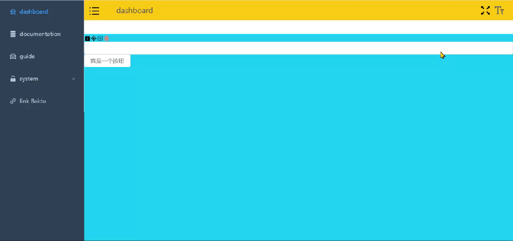

## **组件尺寸切换**

### **1.1 用 Pinia 进行 Size 的持久化存储**

首先，在 src/plugins/element.ts 中增加 size 类型，代码如下：

```typescript
//src/plugins/element.ts
import type { App } from "vue";
import { ElMessage, ElNotification, ElMessageBox } from "element-plus";
export default (app: App) => {
  // 都放到组件的实例上了
  app.config.globalProperties.$message = ElMessage;
  app.config.globalProperties.$notify = ElNotification;
  app.config.globalProperties.$confirm = ElMessageBox.confirm;
  app.config.globalProperties.$alert = ElMessageBox.alert;
  app.config.globalProperties.$prompt = ElMessageBox.prompt;
};
export type Size = "default" | "small" | "large";
```

然后，在 src/stores/app.ts 中对 Size 进行本地持久化存储处理，代码如下：

```typescript
//src/stores/app.ts
import type { Size } from "@/plugins/element";
export const useAppStore = defineStore(
  "app",
  () => {
    // setup
    const state = reactive({
      sidebar: {
        opened: true,
      },
      size: "default" as Size,
      // ...
      // theme
    });
    const sidebar = computed(() => state.sidebar);
    const toggleSidebar = () => {
      state.sidebar.opened = !state.sidebar.opened;
    };
    const size = computed(() => state.size);
    const setSize = (size: Size) => (state.size = size);
    return { state, sidebar, toggleSidebar, size, setSize };
  },
  {
    persist: {
      storage: window.localStorage,
      pick: ["state.sidebar", "state.size"],
    },
  }
);
```

### **1.2 SizeSelect 组件开发**

在 src/components 下新建 SizeSelect 文件夹，新建文件 index.vue，代码如下：

```html
//src/components/SizeSelect/index.vue
<template>
  <el-dropdown trigger="click">
    <span class="el-dropdown-link">
      <svg-icon
        custom-class="w-2em h-2em"
        icon-name="ant-design:font-size-outlined"
      ></svg-icon>
    </span>
    <template #dropdown>
      <el-dropdown-menu>
        <el-dropdown-item
          :disabled="item.value === store.size"
          v-for="item in sizeOptions"
          :key="item.label"
          @click="store.setSize(item.value as Size)"
        >
          {{ item.label }}</el-dropdown-item
        >
      </el-dropdown-menu>
    </template>
  </el-dropdown>
</template>
<script lang="ts" setup>
  import { type Size } from "@/plugins/element";
  import { useAppStore } from "@/stores/app";
  const store = useAppStore();
  const sizeOptions = ref([
    {
      label: "Default",
      value: "default",
    },
    {
      label: "Large",
      value: "large",
    },
    {
      label: "Small",
      value: "small",
    },
  ]);
</script>
```

### **1.3 页面引用**

在 src/layout/components/Navbar.vue 下引用 SizeSelect 组件，代码如下：

```html
//src/layout/components/Navbar.vue
<template>
  <div class="navbar" flex>
    <hamburger
      @toggleCollapse="toggleSidebar"
      :collapse="sidebar.opened"
    ></hamburger>
    <BreadCrumb></BreadCrumb>
    <div flex justify-end flex-1 items-center mr-20px>
      <screenfull mx-5px></screenfull>
      <el-tooltip content="ChangeSize" placement="bottom">
        <size-select></size-select>
      </el-tooltip>
    </div>
  </div>
</template>
<style scoped lang="scss">
  .navbar {
    @apply h-[var(--navbar-height)];
  }
</style>
<script lang="ts" setup>
  import { useAppStore } from "@/stores/app";
  // 在解构的时候要考虑值是不是对象，如果非对象解构出来就 丧失响应式了
  const { toggleSidebar, sidebar } = useAppStore();
</script>
```

## **1.4 全局配置**

在 src/App.vue 中使用 element 的 Config Provider 进行全局配置，代码如下：

```html
//src/App.vue
<template>
  <el-config-provider :size="store.size">
    <router-view></router-view>
  </el-config-provider>
</template>
<script lang="ts" setup>
  import { useAppStore } from "./stores/app";
  const store = useAppStore();
</script>
<style scoped></style>
```

npm run dev 启动后，页面效果如下：



## **多语言实现**

### **2.1 声明模块**

在 src/vite-env.d.ts 中声明语言模块，代码如下：

```typescript
//src/vite-env.d.ts
/// <reference types="vite/client" />
declare module "element-plus/dist/locale/en.mjs";
declare module "element-plus/dist/locale/zh-cn.mjs";
```

### **2.2 全局配置**

在 src/App.vue 中使用 element 的 Config Provider 进行全局配置，代码如下：

```html
//src/App.vue
<template>
  <el-config-provider :size="store.size" :locale="locale">
    <router-view></router-view>
  </el-config-provider>
</template>
<script lang="ts" setup>
  import { useAppStore } from "./stores/app";
  import en from "element-plus/dist/locale/en.mjs";
  import zhCn from "element-plus/dist/locale/zh-cn.mjs";
  const language = ref("zh-cn");
  const locale = computed(() => (language.value === "zh-cn" ? zhCn : en));
  const store = useAppStore();
</script>
<style scoped></style>
```

这里只是简单演示了一下多语言包的引入和使用方法，可以和上面组件尺寸一样在 pinia 里面进行持久化管理，过程和原理雷同，这里不赘述。

以上，就是全局配置组件尺寸和多语言的内容。
