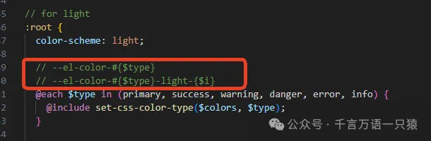
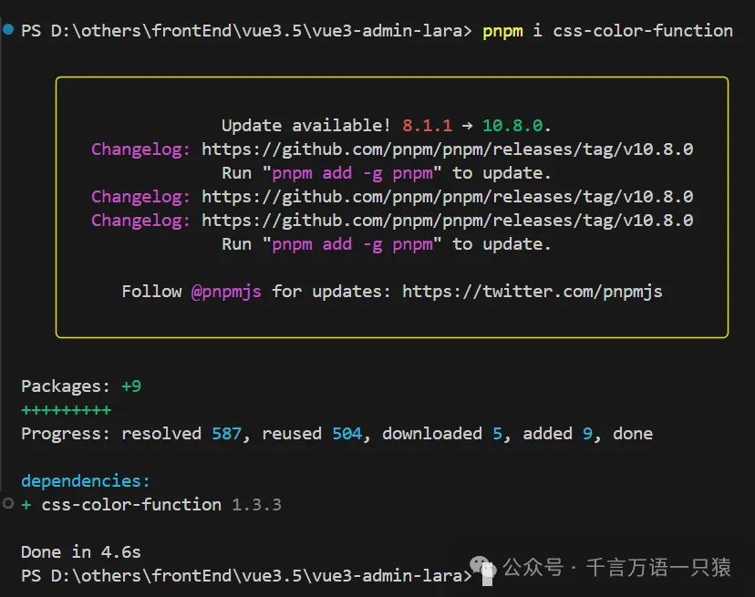
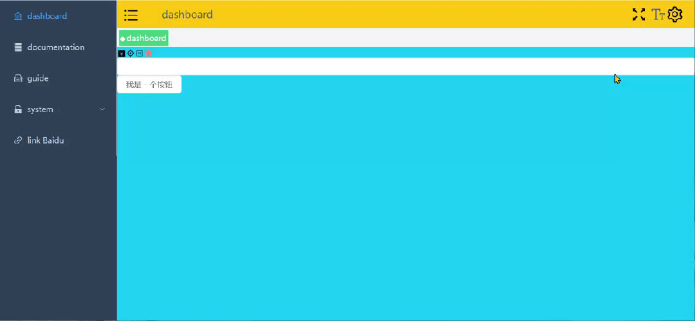
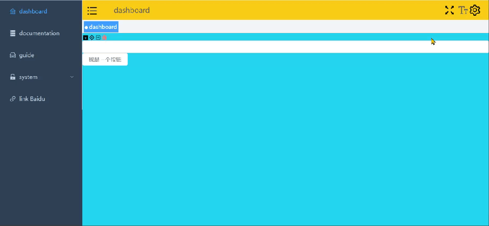

动态主题切换是针对用户体验的常见的功能之一，我们可以自己实现如暗黑模式、明亮模式的切换，也可以利用 Element Plus 默认支持的强大动态主题方案实现。这里我们探讨的是后者通过 CSS 变量设置的方案。

## **组件准备**

### **1.1 修改 Navbar 组件**

在 src/layout/components/Navbar.vue 中添加设置按钮，代码如下：

```html
//src/layout/components/Navbar.vue
<template>
  <div class="navbar" flex>
    <hamburger
      @toggleCollapse="toggleSidebar"
      :collapse="sidebar.opened"
    ></hamburger>
    <BreadCrumb></BreadCrumb>
    <div flex justify-end flex-1 items-center mr-20px>
      <screenfull mx-5px></screenfull>
      <el-tooltip content="ChangeSize" placement="bottom">
        <size-select></size-select>
      </el-tooltip>
      <svg-icon
        icon-name="ant-design:setting-outlined"
        size-2em
        @click="openShowSetting"
      ></svg-icon>
    </div>
  </div>
</template>
<style scoped lang="scss">
  .navbar {
    @apply h-[var(--navbar-height)];
  }
</style>
<script lang="ts" setup>
  import { useAppStore } from "@/stores/app";
  // 在解构的时候要考虑值是不是对象，如果非对象解构出来就 丧失响应式了
  const { toggleSidebar, sidebar } = useAppStore();
  const emit = defineEmits<{
    (event: "showSetting", isShow: boolean): void;
  }>();
  const openShowSetting = () => {
    emit("showSetting", true);
  };
</script>
```

### **1.2 封装 RightPanel 组件**

我们希望点击设置按钮后，右侧出现抽屉面板。在 src/components 下新建 RightPanel，然后新建 index.vue 文件，代码如下：

```html
//src/components/RightPanel/index.vue
<template>
  <el-drawer
    :model-value="modelValue"
    :direction="direction"
    :title="title"
    @close="handleClose"
  >
    <slot></slot>
  </el-drawer>
</template>
<script lang="ts" setup>
  import type { DrawerProps } from "element-plus";
  import type { PropType } from "vue";
  defineProps({
    modelValue: {
      type: Boolean,
      default: false,
    },
    direction: {
      type: String as PropType<DrawerProps["direction"]>,
      default: "rtl",
    },
    title: {
      type: String,
      default: "",
    },
  });
  const emit = defineEmits(["update:modelValue"]);
  const handleClose = () => {
    emit("update:modelValue", false);
  };
</script>
```

### **1.3 封装 ThemePicker 组件**

在 src/components 下新建 ThemePicker/index.vue 用来选择主题颜色，代码如下：

```html
//src/components/ThemeOicker/index.vue
<template>
  <el-color-picker v-model="theme" :predefine="predefineColors" />
</template>
<script lang="ts" setup>
  import { useSettingStore } from "@/stores/settings";
  const store = useSettingStore();
  const theme = ref(store.settings.theme);
  const predefineColors = [
    "#ff4500",
    "#ff8c00",
    "#ffd700",
    "#90ee90",
    "#00ced1",
    "#1e90ff",
    "#c71585",
  ];
  watch(theme, (newValue) => {
    store.changeSetting({ key: "theme", value: newValue });
  });
</script>
```

### **1.4 封装 Settings 组件**

在 src/layout/components 下新建 Settings/index.vue，用来引入系统配置相关的组件，代码如下：

```html
//src/layout/components/Settings/index.vue
<template>
  <div class="drawer-item">
    <span>主题色</span>
    <theme-picker></theme-picker>
  </div>
  <!--后面可以放其他配置项-->
</template>
```

### **1.5 页面引用**

修改 src/layout/index.vue，引入 RightPanel 组件，并修改 navbar 组件自定义事件，代码如下：

```html
//src/layout/index.vue
<template>
  <div class="app-wrapper">
    <div class="sidebar-container">
      <sidebar></sidebar>
    </div>
    <div class="main-container">
      <div class="header">
        <!--  上边包含收缩的导航条 -->
        <navbar @showSetting="openSetting"></navbar>
        <tags-view></tags-view>
      </div>
      <div class="app-main">
        <app-main></app-main>
      </div>
    </div>
    <right-panel v-model="setting" title="设置">
      <!-- 设置功能 -->
      <Settings></Settings>
    </right-panel>
  </div>
</template>
<script lang="ts" setup>
  const setting = ref(false);
  const openSetting = () => {
    setting.value = true;
  };
</script>
<style lang="scss" scoped>
  .app-wrapper {
    @apply flex w-full h-full;
    .sidebar-container {
      // 跨组件设置样式
      @apply bg-[var(--menu-bg)];
      :deep(.sidebar-container-menu:not(.el-menu--collapse)) {
        @apply w-[var(--sidebar-width)];
      }
    }
    .main-container {
      @apply flex flex-col flex-1 overflow-hidden;
    }
    .header {
      @apply h-84px;
      .navbar {
        @apply h-[var(--navbar-height)] bg-yellow;
      }
      .tags-view {
        @apply h-[var(--tagsview-height)] bg-blue;
      }
    }
    .app-main {
      @apply bg-cyan;
      min-height: calc(100vh - var(--tagsview-height) - var(--navbar-height));
    }
  }
</style>
```

## **主题设置方法**

### **2.1 修改 Style**

在 src/style 下，添加默认主题色，分别修改 variables.module.scss 和 variables.module.scss.d.ts，代码如下：

```scss
//variables.module.scss
$sideBarWidth: 210px;
$navBarHeight: 50px;
$tagsViewHeight: 34px;
// 导航颜色
$menuText: #bfcbd9;
// 导航激活的颜色
$menuActiveText: #409eff;
// 菜单背景色
$menuBg: #304156;
$theme: #409eff;
:export {
  menuText: $menuText;
  menuActiveText: $menuActiveText;
  menuBg: $menuBg;
  theme: $theme;
}
```

```typescript
//variables.module.scss.d.ts
interface IVaraibles {
  menuText: string;
  menuActiveText: string;
  menuBg: string;
  theme: string;
  navBarHeight: string;
  tagsViewHeight: string;
}
export const varaibles: IVaraibles;
export default varaibles;
```

### **2.2 添加 settings Store**

在 src/stores 下新建 settings.ts，代码如下：

```typescript
//src/stores/settings.ts
import varaibles from "@/style/variables.module.scss";
// 定义一个名为 "setting" 的 Vuex 存储，用于管理应用的设置
export const useSettingStore = defineStore(
  "setting",
  () => {
    // 如果选择的是同样的主题颜色，就不更改，节省
    const settings = reactive({
      theme: varaibles.theme, //当前选择的颜色
      originalTheme: "", //正在应用的颜色
    });
    type ISetting = typeof settings;
    // 定义一个方法来更改设置
    const changeSetting = <T extends keyof ISetting>({
      key,
      value,
    }: {
      key: T;
      value: ISetting[T];
    }) => {
      settings[key] = value;
    };
    return { changeSetting, settings };
  },
  {
    persist: {
      storage: sessionStorage, // 使用 sessionStorage 作为持久化存储
      pick: ["settings.theme"], // 持久化 settings 对象中的 theme 属性
    },
  }
);
```

### **2.3 安装 css-color-function**

查看 Element Plus 源码（如下图，详细代码感兴趣的可以自己去看看源码），可以发现它是用 --el-color-#{$type} 、--el-color-#{$type}-light-{$i} 来设置基础颜色的，我们只需要修改这两个变量对应的颜色，就可以更换主题了。



要生成以上两个变量的形式，我们需要借助一个库 css-color-function，使用 pnpm 安装，代码如下：

```json
pnpm i css-color-function
```



在 src/vite-env.d.ts 中添加声明，增加 ts 提示，代码如下：

```typescript
/// <reference types="vite/client" />
declare module "element-plus/dist/locale/en.mjs";
declare module "element-plus/dist/locale/zh-cn.mjs";
declare module "css-color-function" {
  export function convert(color: string): string;
}
```

### **2.4 color 公共方法**

在 src/utils 下新建 color.ts，封装生成和设置主题颜色的方法，代码如下：

```typescript
//src/utils/color.ts
// 引入 css-color-function 库，该库用于处理 CSS 颜色函数表达式
import cssFunc from "css-color-function";
// 定义一个对象 formula，用于存储颜色生成公式
// 每个属性名代表生成的颜色名称，属性值是一个 CSS 颜色函数表达式
// "xxx" 是一个占位符，后续会被实际的主色调替换
// tint 函数用于将颜色变亮，括号内的百分比表示变亮的程度
const formula: { [prop: string]: string } = {
  "primary-light-1": "color(xxx tint(10%))",
  "primary-light-2": "color(xxx tint(20%))",
  "primary-light-3": "color(xxx tint(30%))",
  "primary-light-4": "color(xxx tint(40%))",
  "primary-light-5": "color(xxx tint(50%))",
  "primary-light-6": "color(xxx tint(60%))",
  "primary-light-7": "color(xxx tint(70%))",
  "primary-light-8": "color(xxx tint(80%))",
  "primary-light-9": "color(xxx tint(90%))",
};
// 定义一个函数 generateColors，用于根据主色调生成一系列变亮的颜色
// 参数 primary 是传入的主色调，通常是一个有效的 CSS 颜色值
const generateColors = (primary: string) => {
  // 定义一个空对象 colors，用于存储生成的颜色
  const colors: Record<string, string> = {};
  // 遍历 formula 对象的每个键值对
  Object.entries(formula).forEach(([key, v]) => {
    // 将颜色公式中的占位符 "xxx" 替换为实际的主色调
    const value = v.replace(/xxx/g, primary);
    // 使用 cssFunc.convert 方法将颜色函数表达式转换为实际的 CSS 颜色值
    // 并将生成的颜色存储到 colors 对象中，键为颜色名称，值为实际颜色值
    colors[key] = cssFunc.convert(value);
  });
  // 返回生成的颜色对象
  return colors;
};
// 定义一个函数 setColors，用于将生成的颜色设置为 HTML 根元素的自定义属性
// 参数 colors 是一个对象，包含颜色名称和对应的实际颜色值
const setColors = (colors: Record<string, string>) => {
  // 获取 HTML 根元素
  const el = document.documentElement;
  // 遍历 colors 对象的每个键值对
  Object.entries(colors).forEach(([key, value]) => {
    // 使用 el.style.setProperty 方法将颜色值设置为根元素的自定义属性
    // 自定义属性的名称为 --el-color- 加上颜色名称
    el.style.setProperty(`--el-color-${key}`, value);
  });
};
// 导出 generateColors 和 setColors 函数，以便在其他模块中使用
export { generateColors, setColors };
```

### **2.5 设置主题**

在 src 下新建 hooks 文件夹，新建 useGenerateTheme.ts 文件，用于监控主题颜色变化并设置主题颜色，代码如下：

```typescript
//src/hooks/useGenerateTheme.ts
// 从 @/stores/settings 模块中导入 useSettingStore 函数，该函数用于获取设置状态的存储实例
import { useSettingStore } from "@/stores/settings";
// 从 @/utils/color 模块中导入 generateColors 和 setColors 函数
// generateColors 用于根据主色调生成一系列变亮的颜色
// setColors 用于将生成的颜色设置为 HTML 根元素的自定义属性
import { generateColors, setColors } from "@/utils/color";
// 定义一个组合式函数 useGenerateTheme，用于处理主题生成和更新逻辑
export const useGenerateTheme = () => {
  // 通过调用 useSettingStore 函数获取设置状态的存储实例
  const store = useSettingStore();
  const theme = computed(() => store.settings.theme);
  const originalTheme = computed(() => store.settings.originalTheme);
  // 使用 watchEffect 函数创建一个副作用函数，该函数会在其依赖项发生变化时自动执行
  watchEffect(() => {
    // 检查当前的主题值 theme.value 是否与原始主题值 originalTheme.value 不同
    if (theme.value !== originalTheme.value) {
      // 如果主题值发生了变化，生成新的颜色对象
      const colors = {
        // 将当前主题颜色作为主色调
        primary: theme.value,
        // 调用 generateColors 函数，根据当前主题颜色生成一系列变亮的颜色
        // 并将这些颜色合并到 colors 对象中
        ...generateColors(theme.value),
      };
      // 调用 setColors 函数，将生成的颜色对象应用到 HTML 根元素的自定义属性上
      // 从而实现主题颜色的更新
      setColors(colors);
      // 调用存储实例的 changeSetting 方法，更新存储中的原始主题值
      // 使其与当前主题值保持一致
      store.changeSetting({ key: "originalTheme", value: theme.value });
    }
  });
  // 此函数的主要目的是生成主题颜色并将其应用到 HTML 根元素上
  // 以实现主题的动态更新
};
```

### **2.6 页面引入**

在 App.vue 中引入 useGenerateTheme.ts 进行应用，代码如下：

```html
//src/App.vue
<template>
  <el-config-provider :size="store.size" :locale="locale">
    <router-view></router-view>
  </el-config-provider>
</template>
<script lang="ts" setup>
  import { useAppStore } from "./stores/app";
  import en from "element-plus/dist/locale/en.mjs";
  import zhCn from "element-plus/dist/locale/zh-cn.mjs";
  import { useGenerateTheme } from "@/hooks/useGenerateTheme";
  const language = ref("zh-cn");
  const locale = computed(() => (language.value === "zh-cn" ? zhCn : en));
  const store = useAppStore();
  useGenerateTheme(); // watch主题
</script>
```

## **组件应用**

### **3.1 Element 组件**

完成文章前面的步骤后，Element 组件都可以在选择主题后，自动变化主题颜色了。效果如下：



### **3.2 自定义组件**

自定义组件要使用主题切换，需要在组件中进行添加，示例如下：

示例 1：

修改 TagsView 组件，添加主题部分，因原代码太长，省略其他后的代码如下：

```html
<template>
  <div class="tags-view-container">
    <el-scrollbar w-full whitespace-nowrap>
      <router-link
        class="tags-view-item"
        v-for="(tag, index) in visitedViews"
        :class="{
          active: isActive(tag)
        }"
        :style="{
          backgroundColor: isActive(tag) ? theme : '',
          borderColor: isActive(tag) ? theme : ''
        }"
        :key="index"
        :to="{ path: tag.path, query: tag.query }"
      >
        <!-- 省略其他代码 -->
      </router-link>
    </el-scrollbar>
  </div>
</template>
<script lang="ts" setup>
  import { useTagsView } from "@/stores/tagsView";
  import type {
    RouteLocationNormalizedGeneric,
    RouteRecordRaw,
  } from "vue-router";
  import { join } from "path-browserify";
  import { routes } from "@/router/index"; //从应用的路由配置文件中导入了所有的路由定义
  import { useSettingStore } from "@/stores/settings";
  //...省略其他代码...
  const isActive = (tag: RouteLocationNormalizedGeneric) => {
    return tag.path === route.path;
  };
  //...省略其他代码...
  const settingsStore = useSettingStore();
  const theme = computed(() => settingsStore.settings.theme);
</script>
<style scoped>
  //...省略其他代码...
</style>
```

示例 2：

修改 Sidebar 组件，添加主题部分，完整代码如下：

```html
//src/layout/components/Sidebar/index.vue
<template>
  <div>
    <el-menu
      class="sidebar-container-menu"
      router
      :default-active="defaultActive"
      :background-color="varaibles.menuBg"
      :text-color="varaibles.menuText"
      :active-text-color="theme"
      :collapse="sidebar.opened"
    >
      <sidebar-item
        v-for="route in routes"
        :key="route.path"
        :item="route"
        :base-path="route.path"
      />
      <!-- 增加父路径，用于el-menu-item渲染的时候拼接 -->
    </el-menu>
  </div>
  <!-- :collapse="true" -->
</template>
<script lang="ts" setup>
  import { useAppStore } from "@/stores/app";
  import varaibles from "@/style/variables.module.scss";
  import { routes } from "@/router";
  import { useSettingStore } from "@/stores/settings";
  const route = useRoute();
  const { sidebar } = useAppStore();
  const defaultActive = computed(() => {
    // .....
    return route.path;
  });
  const settingsStore = useSettingStore();
  const theme = computed(() => settingsStore.settings.theme);
</script>
<style scoped></style>
```

完成后，页面效果如下：



以上，就是主题切换的全部内容。
