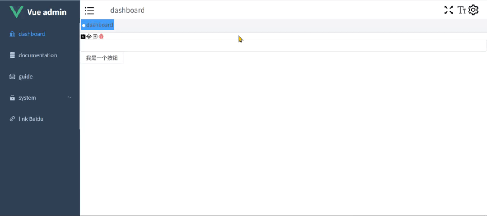

在设置面板中，除了主题颜色的选择设置，还可以添加其他全局配置选项，如 tagsView 导航栏，Logo 的显示隐藏配置等。

## **Settings 的 Pinia 配置**

在 src/stores/settings.ts 中添加要持久存储的全局配置项，这里是 tagsView 和 sidebarLogo，代码如下：

```typescript
//src/stores/settings.ts
import variables from "@/style/variables.module.scss";
// 定义一个名为 "setting" 的 Vuex 存储，用于管理应用的设置
export const useSettingStore = defineStore(
  "setting",
  () => {
    // 如果选择的是同样的主题颜色，就不更改，节省
    const settings = reactive({
      theme: variables.theme, //当前选择的颜色
      originalTheme: "", //正在应用的颜色
      tagsView: true,
      sidebarLogo: true,
    });
    type ISetting = typeof settings;
    // 定义一个方法来更改设置
    const changeSetting = <T extends keyof ISetting>({
      key,
      value,
    }: {
      key: T;
      value: ISetting[T];
    }) => {
      settings[key] = value;
    };
    return { changeSetting, settings };
  },
  {
    persist: {
      storage: sessionStorage, // 使用 sessionStorage 作为持久化存储
      pick: ["settings.theme", "settings.tagsView", "settings.sidebarLogo"], // 仅持久化 theme、tagsView、sidebarLogo 三个设置
    },
  }
);
```

## **Settings 组件**

在 src/layout/components/Settings/index.vue 中增加要添加的全局配置内容，代码如下：

```html
//src/layout/components/Settings/index.vue
<template>
  <div class="drawer-item">
    <span>主题色</span>
    <theme-picker></theme-picker>
  </div>
  <div class="drawer-item">
    <span>是否展示TagsView</span>
    <el-switch v-model="isShowTagsView"></el-switch>
  </div>
  <div class="drawer-item">
    <span>是否展示Logo</span>
    <el-switch v-model="isShowLogo"></el-switch>
  </div>
</template>
<script lang="ts" setup>
  import { useSettingStore } from "@/stores/settings";
  const settingsStore = useSettingStore();
  const sidebarLogo = computed(() => settingsStore.settings.sidebarLogo);
  const tagsView = computed(() => settingsStore.settings.tagsView);
  const isShowTagsView = computed({
    get() {
      return tagsView.value;
    },
    set(val: boolean) {
      settingsStore.changeSetting({ key: "tagsView", value: val });
    },
  });
  const isShowLogo = computed({
    get() {
      return sidebarLogo.value;
    },
    set(val: boolean) {
      settingsStore.changeSetting({ key: "sidebarLogo", value: val });
    },
  });
</script>
```

## **添加页面控制**

### **3.1 TagsView 配置**

### **3.1.1 导出样式高度**

在 src/style/variables.module.scss 中将需要参与高度计算的样式变量导出（navBarHeight、tagsViewHeight）并在 src/style/variables.module.scss.d.ts 中定义类型，代码如下：

```scss
//src/style/variables.module.scss
$sideBarWidth: 210px;
$navBarHeight: 50px;
$tagsViewHeight: 34px;
// 导航颜色
$menuText: #bfcbd9;
// 导航激活的颜色
$menuActiveText: #409eff;
// 菜单背景色
$menuBg: #304156;
$theme: #409eff;
:export {
  menuText: $menuText;
  menuActiveText: $menuActiveText;
  menuBg: $menuBg;
  theme: $theme;
  navBarHeight: $navBarHeight;
  tagsViewHeight: $tagsViewHeight;
}
```

```typescript
//src/style/variables.module.scss.d.ts
interface IVaraibles {
  menuText: string;
  menuActiveText: string;
  menuBg: string;
  theme: string;
  navBarHeight: string;
  tagsViewHeight: string;
}
export const varaibles: IVaraibles;
export default varaibles;
```

#### **3.1.2 页面修改**

在 src/layout/index.vue 中添加选项控制属性，并根据 tagsView 的显示隐藏状态，动态计算页面高度，代码如下：

```html
//src/layout/index.vue
<template>
  <div class="app-wrapper">
    <div class="sidebar-container">
      <sidebar></sidebar>
    </div>
    <div class="main-container">
      <div class="header">
        <!--  上边包含收缩的导航条 -->
        <navbar @showSetting="openSetting"></navbar>
        <tags-view v-if="isShowTagsView"></tags-view>
      </div>
      <div class="app-main">
        <app-main></app-main>
      </div>
    </div>
    <right-panel v-model="setting" title="设置">
      <!-- 设置功能 -->
      <Settings></Settings>
    </right-panel>
  </div>
</template>
<script lang="ts" setup>
  import { useSettingStore } from "@/stores/settings";
  import variables from "@/style/variables.module.scss";
  const setting = ref(false);
  const openSetting = () => {
    setting.value = true;
  };
  const settingsStore = useSettingStore();
  const isShowTagsView = computed(() => settingsStore.settings.tagsView);
  const outerHeight = computed(() => {
    return (
      (isShowTagsView.value
        ? parseInt(variables.navBarHeight) + parseInt(variables.tagsViewHeight)
        : parseInt(variables.navBarHeight)) + "px"
    );
  });
</script>
<style lang="scss" scoped>
  .app-wrapper {
    @apply flex w-full h-full;
    .app-main {
      @apply overflow-hidden pos-relative;
      min-height: calc(100vh - v-bind(outerHeight));
    }
    .sidebar-container {
      // 跨组件设置样式
      @apply bg-[var(--menu-bg)];
      :deep(.sidebar-container-menu:not(.el-menu--collapse)) {
        @apply w-[var(--sidebar-width)];
      }
    }
    .main-container {
      @apply flex flex-col flex-1 overflow-hidden;
    }
  }
</style>
```

### **3.2 Logo 配置**

#### **3.2.1 Logo 组件开发**

开发 Logo 组件，在 src/layout/components/Sidebar 下新建 logo.vue，代码如下：

```html
//src/layout/components/Sidebar/logo.vue
<template>
  <div class="sidebar-logo-container" :class="{ collapse }">
    <transition name="logo-fade">
      <router-link to="/" :key="collapse ? 'a' : 'b'" class="sidebar-logo">
        
        <h1 v-if="!collapse" class="sidebar-logo-title">Vue admin</h1>
      </router-link>
    </transition>
  </div>
</template>
<script lang="ts" setup>
  import logo from "@/assets/vue.svg";
  defineProps({
    collapse: {
      type: Boolean,
    },
  });
</script>
<style scoped lang="scss">
  .sidebar-logo {
    @apply w-full h-60px lead-60px flex items-center justify-center;
  }
  .sidebar-logo-title {
    @apply inline-block text-20px text-white mx-10px;
  }
  .logo-fade-enter-from,
  .logo-fade-leave-to {
    @apply opacity-0;
  }
  .logo-fade-enter-active {
    @apply transition-opacity duration-150;
  }
</style>
```

#### **3.2.2 页面引入**

在 src/layout/components/Sidebar/index.vue 中引入 Logo 组件，代码如下：

```html
//src/layout/components/Sidebar/index.vue
<template>
  <div>
    <logo v-if="sidebarLogo" :collapse="sidebar.opened"></logo>
    <el-menu
      class="sidebar-container-menu"
      router
      :default-active="defaultActive"
      :background-color="varaibles.menuBg"
      :text-color="varaibles.menuText"
      :active-text-color="theme"
      :collapse="sidebar.opened"
    >
      <sidebar-item
        v-for="route in routes"
        :key="route.path"
        :item="route"
        :base-path="route.path"
      />
      <!-- 增加父路径，用于el-menu-item渲染的时候拼接 -->
    </el-menu>
  </div>
  <!-- :collapse="true" -->
</template>
<script lang="ts" setup>
  import { useAppStore } from "@/stores/app";
  import varaibles from "@/style/variables.module.scss";
  import { routes } from "@/router";
  import { useSettingStore } from "@/stores/settings";
  const route = useRoute();
  const { sidebar } = useAppStore();
  const defaultActive = computed(() => {
    // .....
    return route.path;
  });
  const settingsStore = useSettingStore();
  const theme = computed(() => settingsStore.settings.theme);
  const sidebarLogo = computed(() => settingsStore.settings.sidebarLogo);
</script>
<style scoped></style>
```

完成后，npm run dev 启动，页面效果如下：



以上，就是其他全局设置项的全部内容。
