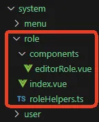
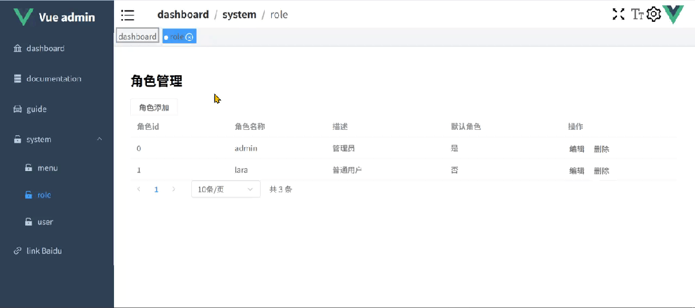

本篇主要探讨角色管理功能，其中菜单权限这里先不实现，后续在菜单管理中再进行实现。接口部分依然是使用 Apifox mock 的。

## **角色 api**

在 src/api/role.ts 中添加角色相关 api，代码如下：

```typescript
//src/api/role.ts
import service from "./config/request";
import type { ApiResponse } from "./type";
export interface IRole {
  id: number;
  name: string;
  description: string;
  is_default: number;
}
//定义state类型
export interface IRoleState {
  roles: IRole[];
  count: number;
}
export interface IRoleParams {
  pageNum: number;
  pageSize: number;
}
// 获取角色
export const getRoles = (
  params = { pageNum: 0, pageSize: 10 }
): Promise<ApiResponse<IRoleState>> => {
  return service.get("/role", {
    params,
  });
};
// 新增角色
export const addRole = (data: IRole): Promise<ApiResponse> => {
  return service.post("/role", data);
};
// 更新角色
export const updateRole = (
  id: number,
  data: Partial<IRole>
): Promise<ApiResponse> => {
  return service.put("/role/" + id, data);
};
// 删除角色
export const removeRole = (id: number): Promise<ApiResponse> => {
  return service.delete("/role/" + id);
};
```

## **角色 store**

在 src/stores/role.ts 中添加角色相关方法，代码如下：

```typescript
//src/stores/role.ts
import type { IRole, IRoleParams, IRoleState } from "@/api/role";
import {
  getRoles as getRolesApi,
  addRole as addRoleApi,
  updateRole as updateRoleApi,
  removeRole as removeRoleApi,
} from "@/api/role";
type WithRoleParmas = IRole & IRoleParams;
export const useRoleStore = defineStore("role", () => {
  //状态
  const state = reactive<IRoleState>({
    roles: [],
    count: 0,
  });
  //获取角色
  const getRoles = async (params: IRoleParams) => {
    const res = await getRolesApi(params);
    const { data } = res;
    state.roles = data.roles;
    state.count = data.count;
  };
  //添加角色
  const addRole = async (data: WithRoleParmas) => {
    const { pageNum, pageSize, ...obj } = data;
    const res = await addRoleApi(obj);
    if (res.code == 0) {
      getRoles({ pageNum, pageSize });
    }
  };
  //修改角色
  const updateRole = async (data: WithRoleParmas) => {
    const { pageNum, pageSize, ...obj } = data;
    const res = await updateRoleApi(obj.id, obj);
    if (res.code == 0) {
      getRoles({ pageNum, pageSize });
    }
  };
  //删除角色
  const removeRole = async (data: WithRoleParmas) => {
    const { pageNum, pageSize, id } = data;
    const res = await removeRoleApi(id);
    if (res.code == 0) {
      getRoles({ pageNum, pageSize });
    }
  };
  return { getRoles, addRole, updateRole, removeRole, state };
});
```

## **角色管理页面开发**

角色管理页面文件结构如下图所示：



### **3.1 角色处理函数封装**

在 src/views/system/role/roleHelpers.ts 中封装角色处理的相关操作函数（增删改查），代码如下：

```typescript
//src/views/system/role/roleHelpers.ts
// 从 @/api/role 模块中导入 IRole 类型
import type { IRole } from "@/api/role";
// 从 @/stores/role 模块中导入 useRoleStore 函数
import { useRoleStore } from "@/stores/role";
/**
 * 自定义组合式函数，用于处理角色相关的操作
 * @param pageSize - 每页显示的记录数，使用 Ref 类型
 * @param pageNum - 当前页码，使用 Ref 类型
 * @returns 包含角色操作方法和状态的对象
 */
export const useRoleHelpers = ({
  pageSize,
  pageNum,
}: {
  pageSize: Ref<number>;
  pageNum: Ref<number>;
}) => {
  // 获取当前组件实例的代理对象
  const { proxy } = getCurrentInstance()!;
  // 定义编辑类型，-1 表示初始状态，0 表示编辑，1 表示新增
  const editType = ref(-1);
  // 定义模态框的可见状态
  const visible = ref(false);
  // 定义要编辑的数据，初始值为 undefined
  const editData = ref<IRole | undefined>(undefined);
  // 获取角色状态管理仓库的实例
  const store = useRoleStore();
  // 计算面板的标题，根据编辑类型决定显示“增加角色”还是“修改角色”
  const panelTitle = computed(() =>
    editType.value == 1 ? "增加角色" : "修改角色"
  );
  /**
   * 处理编辑角色的操作
   * @param role - 要编辑的角色对象
   */
  const handleEditRole = (role: IRole) => {
    // 设置编辑类型为 0，表示编辑
    editType.value = 0;
    // 复制要编辑的角色数据
    editData.value = { ...role };
    // 显示模态框
    visible.value = true;
  };
  /**
   * 处理添加新角色的操作
   */
  const hanleAddRole = () => {
    // 设置编辑类型为 1，表示新增
    editType.value = 1;
    // 初始化要编辑的数据为空的角色对象
    editData.value = {} as IRole;
    // 显示模态框
    visible.value = true;
  };
  /**
   * 添加新角色的异步方法
   * @param data - 要添加的角色数据
   */
  const addNewRole = async (data: IRole) => {
    // 调用仓库的 addRole 方法添加角色，并传递分页信息
    await store.addRole({
      ...data,
      pageNum: pageNum.value,
      pageSize: pageSize.value,
    });
    // 显示成功提示信息
    proxy?.$message.success("角色添加成功");
    // 隐藏模态框
    visible.value = false;
  };
  /**
   * 编辑角色的异步方法
   * @param data - 要编辑的角色数据
   */
  const editRow = async (data: IRole) => {
    // 调用仓库的 updateRole 方法更新角色，并传递分页信息
    await store.updateRole({
      ...data,
      pageNum: pageNum.value,
      pageSize: pageSize.value,
    });
    // 显示成功提示信息
    proxy?.$message.success("角色编辑成功");
    // 隐藏模态框
    visible.value = false;
  };
  /**
   * 处理提交表单的异步方法，根据编辑类型调用不同的处理方法
   * @param data - 表单提交的角色数据
   */
  const handleSubmit = async (data: IRole) => {
    if (editType.value === 1) {
      // 如果是新增类型，调用 addNewRole 方法
      await addNewRole(data);
    } else {
      // 如果是编辑类型，调用 editRow 方法
      await editRow(data);
    }
  };
  /**
   * 处理删除角色的异步方法
   * @param data - 要删除的角色数据
   */
  const handleRemove = async (data: IRole) => {
    try {
      // 弹出确认对话框，确认是否删除角色
      await proxy?.$confirm("你确定删除" + data.name + "角色吗?", {
        type: "warning",
      });
      // 调用仓库的 removeRole 方法删除角色，并传递分页信息
      await store.removeRole({
        ...data,
        pageNum: pageNum.value,
        pageSize: pageSize.value,
      });
      // 显示成功提示信息
      proxy?.$message.success("角色删除成功");
    } catch {
      // 如果用户取消删除，显示取消提示信息
      proxy?.$message.info("取消删除");
    }
  };
  // 返回包含角色操作方法和状态的对象
  return {
    handleSubmit,
    handleRemove,
    handleEditRole,
    hanleAddRole,
    panelTitle,
    editType,
    visible,
    editData,
  };
};
```

### **3.2 editorRole 组件封装**

在 src/views/system/role/components/editorRole.vue 中，对角色的新增编辑页面进行封装，代码如下：

```html
//src/views/system/role/components/editorRole.vue
<template>
  <el-form:model="editData"label-width="auto"style="max-width: 600px">
    <el-form-itemlabel="角色名称">
      <el-inputv-model="editData.name" />
    </el-form-item>
    <el-form-itemlabel="描述">
      <el-inputv-model="editData.description" />
    </el-form-item>
    <el-form-itemlabel="是否是默认角色 ">
      <el-switch
        v-model="editData.is_default"
        :active-value="1"
        :inactive-value="0"
      ></el-switch>
    </el-form-item>
    <el-form-item>
      <el-buttontype="primary" @click="submitForm">提交</el-button>
      <el-button @click="handleReset">重置</el-button>
    </el-form-item>
  </el-form>
</template>
<scriptlang="ts"setup>
import type { IRole } from "@/api/role";
import type { PropType } from "vue";
import { ref, defineProps, watchEffect, defineEmits } from "vue";
// 定义 editData 响应式变量，用于存储表单数据，初始值为空对象
const editData = ref({
  name: "",
  description: "",
  is_default: 0
});
// 定义组件接收的 props
const { data, type } = defineProps({
  data: {
    // 指定 data 的类型为 IRole 对象
    type: Object as PropType<IRole>,
    // 如果未传入 data，默认返回空对象
    default: () => ({})
  },
  type: {
    // 指定 type 的类型为数字
    type: Number,
    // type 为必填项
    required: true
  }
});
// 定义默认表单数据，用于重置表单
const defaultProps = {
  name: "",
  description: "",
  is_default: 0
};
// 重置表单数据的函数，将默认数据和传入的 data 合并
const resetForm = () => {
  editData.value = { ...defaultProps, ...data };
};
// 监听 data 的变化，当 data 改变时重置表单
watchEffect(() => {
  if (data) {
    resetForm();
  }
});
// 定义自定义事件，用于向父组件发送表单数据
const emit = defineEmits(["submit"]);
// 提交表单的函数，触发 submit 事件并传递表单数据
const submitForm = () => {
  emit("submit", editData.value);
};
// 处理重置操作的函数，调用 resetForm 重置表单
const handleReset = () => {
  resetForm();
};
</script>
```

### **3.3 角色管理页面**

修改 src/views/system/role/index.vue，编写角色管理静态页面，代码如下：

```html
//src/views/system/role/index.vue
<template>
  <divp-30px>
    <h2>角色管理</h2>
    <el-button @click="hanleAddRole">角色添加</el-button>
    <el-table:data="roles"style="width: 100%">
      <el-table-columnprop="id"label="角色id"width="180" />
      <el-table-columnprop="name"label="角色名称"width="180" />
      <el-table-columnprop="description"label="描述" />
      <el-table-column
        prop="is_default"
        label=" 默认角色"
        :formatter="formatter"
      />
      <el-table-columnlabel="操作"fixed="right">
        <template #default="scope">
          <el-buttonlink @click="handleEditRole(scope.row)">编辑</el-button>
          <el-buttonlink @click="handleRemove(scope.row)">删除</el-button>
        </template>
      </el-table-column>
    </el-table>
    <el-pagination
      :page-sizes="[1, 5, 10, 20]"
      layout="prev, pager, next, sizes, total"
      :total="count"
      :page-size="pageSize"
      @size-change="handleSizeChange"
      @current-change="handleCurrentChange"
    />
    <!-- 右侧面板组件，使用 v-model 绑定 visible 控制显示隐藏，设置标题 -->
    <right-panelv-model="visible":title="panelTitle">
      <!-- 角色编辑组件，传递编辑类型和编辑数据，监听 submit 事件 -->
      <editor-role
        :type="editType"
        :data="editData"
        @submit="handleSubmit"
      ></editor-role>
    </right-panel>
  </div>
</template>
<scriptlang="ts"setup>
import type { IRole } from "@/api/role";
import { useRoleStore } from "@/stores/role";
import { useRoleHelpers } from "./roleHelpers";
import { ref, toRefs, watchEffect } from "vue";
// 获取角色状态管理仓库实例
const store = useRoleStore();
// 当前页码，初始为 0
const pageNum = ref(0);
// 每页显示的记录数，初始为 10
const pageSize = ref(10);
// 从 useRoleHelpers 组合式函数中解构出所需的方法和状态
const {
  handleSubmit,
  handleRemove,
  handleEditRole,
  hanleAddRole,
  panelTitle,
  editType,
  visible,
  editData
} = useRoleHelpers({ pageNum, pageSize });
// 将仓库状态中的 count 和 roles 转换为响应式引用
const { count, roles } = toRefs(store.state);
// 监听 pageNum 和 pageSize 的变化，当变化时重新获取角色数据
watchEffect(() => {
  store.getRoles({ pageNum: pageNum.value, pageSize: pageSize.value });
});
// 处理每页显示记录数改变的方法
const handleSizeChange = (val: number) => {
  pageSize.value = val;
};
// 处理当前页码改变的方法
const handleCurrentChange = (val: number) => {
  pageNum.value = val - 1;
};
// 格式化是否为默认角色的显示内容
const formatter = (row: IRole) => {
  return row.is_default ? "是" : "否";
};
</script>
```

npm run dev 启动项目后，页面效果如下：



以上，就是角色管理的全部内容。
