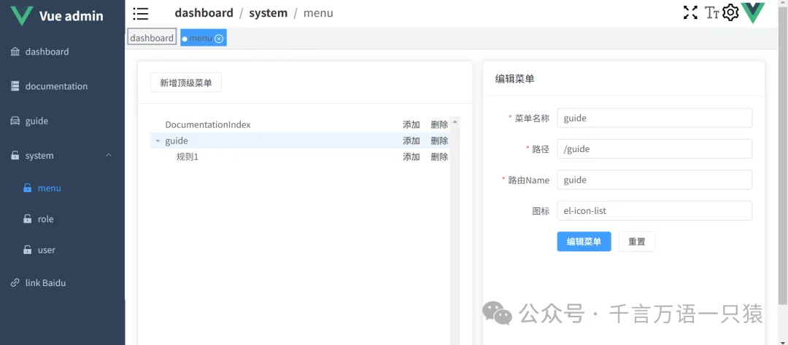
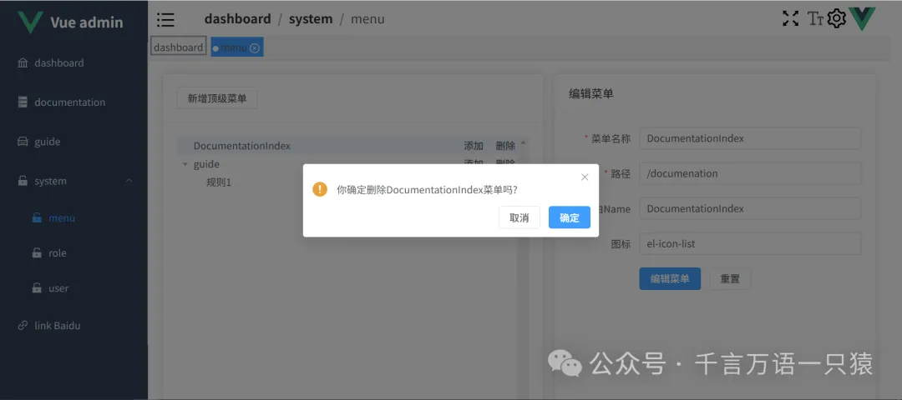

篇幅原因，本节先探讨菜单管理页面增删改查相关功能，角色菜单，菜单权限，动态菜单等内容放在后面。

## **菜单 api**

在 src/api/menu.ts 中添加菜单 api，代码如下：

```typescript
//src/api/menu.ts
import service from "./config/request";
import type { ApiResponse } from "./type";
export interface MenuData {
  id: number;
  title: string;
  path: string;
  icon: string;
  name: string;
  sort_id: number;
  parent_id: number;
}
//获取全部菜单
export const getAllMenus = (): Promise<ApiResponse<MenuData[]>> => {
  return service.get("/access/menu");
};
//删除指定菜单
export const removeMenuById = (
  id: number
): Promise<ApiResponse<MenuData[]>> => {
  return service.delete("/access/menu/" + id);
};
//新增菜单
export const addMenu = (data: MenuData): Promise<ApiResponse<MenuData>> => {
  return service.post("/access/menu", data);
};
//更新指定菜单
export const updateMenuById = (
  id: number,
  data: Partial<MenuData>
): Promise<ApiResponse<MenuData[]>> => {
  return service.put("/access/menu/" + id, data);
};
//批量更新菜单
export const updateBulkMenu = (
  data: Partial<MenuData>[]
): Promise<ApiResponse> => {
  return service.patch("/access/menu/update", { access: data });
};
```

## **菜单 Store**

在 src/store/menu.ts 中添加菜单相关方法，代码如下：

```typescript
//src/store/menu.ts
import {
  getAllMenus,
  type MenuData,
  addMenu,
  removeMenuById,
  updateMenuById,
  updateBulkMenu as updateBulkMenuApi,
} from "@/api/menu";
import { getRoleAccessByRoles } from "@/api/roleAccess";
import { generateTree, ITreeItemDataWithMenuData } from "@/utils/generateTree";
/**
 * 树形菜单项数据结构，继承自MenuData并扩展了子菜单属性
 */
export interface ITreeItemData extends MenuData {
  children?: ITreeItemData[];
}
/**
 * 菜单状态管理数据结构
 */
export interface IMenuState {
  menuList: Array<MenuData>; // 原始菜单列表数据
  menuTreeData: ITreeItemData[]; // 树形菜单数据（管理界面使用）
  authMenuList: MenuData[]; // 权限过滤后的菜单列表（侧边栏使用）
  authMenuTreeData: ITreeItemDataWithMenuData[]; // 权限过滤后的树形菜单数据（侧边栏使用）
}
/**
 * 菜单管理状态库
 * 使用Pinia实现的菜单状态管理，包含菜单的增删改查及权限控制
 */
export const useMenuStore = defineStore("menu", () => {
  // 定义响应式状态
  const state = reactive<IMenuState>({
    menuList: [],
    menuTreeData: [],
    authMenuList: [], // 侧边菜单需要的
    authMenuTreeData: [],
  });
  /**
   * 获取全部菜单列表并转换为树形结构
   * 用于管理界面展示完整菜单树
   */
  const getAllMenuList = async () => {
    const res = await getAllMenus();
    if (res.code == 0) {
      const { data } = res;
      state.menuList = data; // 获取的原始菜单列表数据
      state.menuTreeData = generateTree(data); // 将原始数据转换为树形结构
    }
  };
  /**
   * 添加新菜单
   * @param data - 新菜单数据
   * @returns 添加成功返回true，失败返回false
   */
  const appendMenu = async (data: ITreeItemData) => {
    const res = await addMenu(data);
    if (res.code == 0) {
      const node = { ...res.data };
      state.menuList.push(node); // 添加到原始列表
      state.menuTreeData = generateTree(state.menuList); // 重新生成树形结构
      return true;
    }
  };
  /**
   * 删除菜单
   * @param data - 要删除的菜单数据（需包含id）
   * @returns 删除成功返回true，失败返回false
   */
  const removeMenu = async (data: ITreeItemData) => {
    const res = await removeMenuById(data.id);
    if (res.code == 0) {
      const idx = state.menuList.findIndex((menu) => menu.id === data.id);
      state.menuList.splice(idx, 1); // 从原始列表中删除
      state.menuTreeData = generateTree(state.menuList); // 重新生成树形结构
      return true;
    }
  };
  /**
   * 批量更新菜单（主要用于更新排序）
   * 1. 更新顶级菜单的sortId为其在数组中的索引位置
   * 2. 移除菜单对象中的children属性避免干扰后端数据
   * @returns 更新成功返回true，失败返回false
   */
  const updateBulkMenu = async () => {
    // 1.更新sortId
    state.menuTreeData.forEach((menu, idx) => (menu.sort_id = idx));
    // 2.删除子节点（后端存储不需要children字段）
    const menus = state.menuTreeData.map((menu) => {
      const temp = { ...menu };
      delete temp.children;
      return temp;
    });
    // 批量更新
    const res = await updateBulkMenuApi(menus);
    if (res.code == 0) {
      return true;
    }
  };
  /**
   * 更新单个菜单
   * @param data - 要更新的菜单数据（需包含id）
   * @returns 更新成功返回true，失败返回false
   */
  const updateMenu = async (data: Partial<MenuData>) => {
    const res = await updateMenuById(Number(data.id), data);
    if (res.code === 0) {
      await getAllMenuList(); // 更新成功后重新获取完整菜单列表
      return true;
    }
  };
  /**
   * 获取管理员权限的全部菜单
   * 用于管理员用户侧边栏显示
   */
  const getAllMenuListByAdmin = async () => {
    const res = await getAllMenus();
    if (res.code == 0) {
      const { data } = res;
      state.authMenuList = data; // 侧边栏菜单列表
      state.authMenuTreeData = generateTree(data, true); // 生成带权限标识的树形菜单
    }
  };
  /**
   * 根据角色获取对应的菜单权限
   * @param roles - 角色ID数组
   */
  const getMenuListByRoles = async (roles: number[]) => {
    const res = await getRoleAccessByRoles(roles);
    if (res.code == 0) {
      const { data } = res;
      const access = data.access;
      state.authMenuList = access; // 侧边栏菜单列表（权限过滤后）
      state.authMenuTreeData = generateTree(access, true); // 生成带权限标识的树形菜单
    }
  };
  // 导出状态和方法
  return {
    getAllMenuList,
    state,
    appendMenu,
    removeMenu,
    updateBulkMenu,
    updateMenu,
    getAllMenuListByAdmin,
    getMenuListByRoles,
  };
});
```

## **封装生成 Tree 的方法**

在 src/utils/generateTree.ts 中封装生成 Tree 的方法，代码如下：

```typescript
//src/utils/generateTree.ts
import type { MenuData } from "@/api/menu";
import type { ITreeItemData } from "@/stores/menu";
/**
 * 扩展树形菜单项数据结构，添加可选的meta元数据
 * 用于侧边栏菜单的路由配置和权限控制
 */
export type ITreeItemDataWithMenuData = ITreeItemData & {
  meta?: { icon: string; title: string; [key: string]: string };
};
/**
 * 映射表类型定义，用于快速查找节点
 * 键为菜单ID，值为树形菜单项数据
 */
export type IMap = Record<number, ITreeItemDataWithMenuData>;
/**
 * 将扁平的菜单列表转换为树形结构
 * @param list - 扁平的菜单数据列表
 * @param withMeta - 是否添加meta元数据，默认为false
 * @returns 树形结构的菜单数据
 */
export const generateTree = (list: MenuData[], withMeta: boolean = false) => {
  // 第一步：构建映射表，快速查找节点
  const map = list.reduce((memo, current) => {
    // 复制当前节点数据
    const temp = { ...current };
    // 如果需要元数据，添加meta字段
    if (withMeta) {
      (temp as ITreeItemDataWithMenuData).meta = {
        title: current.title, // 菜单标题
        icon: current.icon, // 菜单图标
      };
    }
    // 将节点添加到映射表中
    memo[current.id] = temp;
    return memo;
  }, {} as IMap);
  // 第二步：构建树形结构
  const tree: ITreeItemDataWithMenuData[] = [];
  list.forEach((item) => {
    const pid = item.parent_id; // 当前节点的父ID
    const cur = map[item.id]; // 从映射表中获取当前节点
    // 如果存在父节点，则将当前节点添加到父节点的children中
    if (pid !== 0 || pid != null) {
      const parent = map[pid];
      if (parent) {
        const children = parent?.children || [];
        children.push(cur);
        parent.children = children;
        return;
      }
    }
    // 如果没有父节点或父节点不存在，则作为根节点
    tree.push(cur);
  });
  return tree;
};
```

## **菜单管理界面**

### **4.1 刷新页面 hook 函数**

在 src/hooks/useReloadPage.ts 中，封装刷新页面的钩子函数，代码如下：

```typescript
//src/hooks/useReloadPage.ts
export const useReloadPage = () => {
  const { proxy } = getCurrentInstance()!;
  const reloadPage = async ({
    title = "是否刷新",
    message = "你确定",
  } = {}) => {
    try {
      await proxy!.$confirm(title, message);
      window.location.reload();
    } catch {
      proxy?.$message.warning("已经取消了刷新");
    }
  };
  return {
    reloadPage,
  };
};
```

### **4.2 菜单管理页面**






在 src/views/system/menu/index.vue 中添加菜单管理页面，代码如下：

```html
//src/views/system/menu/index.vue
<template>
  <divclass="menu-container">
    <!-- 菜单树展示区域 -->
    <el-card>
      <template #header>
        <el-button @click="handleCreateRootMenu">新增顶级菜单</el-button>
      </template>
      <divclass="menu-tree">
        <!-- 可拖拽的树形菜单组件 -->
        <el-tree
          :data="menus"
          :props="defaultProps"
          @node-click="handleNodeClick"
          :expand-on-click-node="false"
          highlight-current
          draggable
          :allow-drop="allowDrop"
          :allow-drag="allowDrag"
          @node-drop="handleNodeDrop"
        >
          <!-- 自定义树节点内容，包含操作按钮 -->
          <template #default="{ node, data }">
            <pclass="custom-item">
              <span>{{ data.title }} </span>
              <span>
                <el-buttonlink @click="handleCreateChildMenu(data)"
                  >添加</el-button
                >
                <el-buttonlink @click="handleRemoveMenu(data)">删除</el-button>
              </span>
            </p>
          </template>
        </el-tree>
      </div>
    </el-card>
    <!-- 菜单编辑区域 -->
    <el-cardclass="edit-card">
      <template #header> 编辑菜单 </template>
      <!-- 菜单编辑组件，选中节点后显示 -->
      <editor-menu
        v-show="editData && editData.id"
        :data="editData!"
        @updateEdit="handleUpdateEdit"
      />
      <spanv-if="editData == null">从菜单列表选择一项后，进行编辑</span>
    </el-card>
    <!-- 右侧添加菜单面板 -->
    <right-panelv-model="panelVisible":title="panelTitle":size="330">
      <add-menu @submit="submitMenuForm"></add-menu>
    </right-panel>
  </div>
</template>
<scriptlang="ts"setup>
import type { MenuData } from "@/api/menu";
import { useReloadPage } from "@/hooks/useReloadPage";
import { type ITreeItemData, useMenuStore } from "@/stores/menu";
import type Node from "element-plus/es/components/tree/src/model/node";
// 处理菜单更新事件
const handleUpdateEdit = async (data: Partial<MenuData>) => {
  const r = await store.updateMenu(data);
  if (r) {
    proxy?.$message.success("菜单编辑成功");
    reloadPage(); // 刷新页面数据
  }
};
// 控制节点是否可拖拽
const allowDrag = (draggingNode: Node) => {
  // 根节点不可拖拽
  return (
    draggingNode.data.parent_id !== 0 || draggingNode.data.parent_id != null
  );
};
type DropType = "prev" | "inner" | "next";
// 控制节点拖拽放置规则
const allowDrop = (draggingNode: Node, dropNode: Node, type: DropType) => {
  // 根节点只能作为兄弟节点，不能作为子节点
  if (
    draggingNode.data.parent_id === 0 ||
    draggingNode.data.parent_id == null
  ) {
    return type !== "inner";
  }
};
// 处理节点拖拽完成事件
const handleNodeDrop = () => {
  store.updateBulkMenu(); // 更新菜单排序
};
// 页面刷新工具
const { reloadPage } = useReloadPage();
// 获取菜单状态管理
const store = useMenuStore();
// 计算属性：获取树形菜单数据
const menus = computed(() => store.state.menuTreeData);
// 初始化加载菜单数据
store.getAllMenuList();
// 树形组件配置
const defaultProps = {
  children: "children",
  label: "title"
};
// 菜单类型：0-顶级菜单 1-子菜单
const menuType = ref(0);
// 右侧面板显示控制
const panelVisible = ref(false);
// 计算属性：面板标题
const panelTitle = computed(() => {
  return menuType.value === 0 ? "添加顶级节点" : "添加子节点";
});
// 创建顶级菜单
const handleCreateRootMenu = () => {
  menuType.value = 0;
  panelVisible.value = true;
};
// 父菜单数据
const parentData = ref<ITreeItemData | null>();
// 创建子菜单
const handleCreateChildMenu = (data: ITreeItemData) => {
  menuType.value = 1;
  panelVisible.value = true;
  parentData.value = data;
};
// 重置状态
const resetStatus = () => {
  panelVisible.value = false;
  parentData.value = null;
  reloadPage();
};
// 生成菜单排序ID
const genMenuSortId = (list: ITreeItemData[]) => {
  if (list && list.length) {
    return list[list.length - 1].sort_id + 1;
  }
  return 0;
};
// 添加顶级菜单
const handleAddRootMenu = async (data: MenuData) => {
  // 设置父ID和排序ID
  data.parent_id = 0;
  data.sort_id = genMenuSortId(menus.value);
  let res = await store.appendMenu(data);
  if (res) {
    proxy?.$message.success("根菜单添加成功了");
  }
};
const { proxy } = getCurrentInstance()!;
// 生成子菜单数据
const genChild = (data: MenuData) => {
  const parent = parentData.value!;
  if (!parent.children) {
    parent.children = [];
  }
  data.sort_id = genMenuSortId(parent.children);
  data.parent_id = parent.id;
  return data;
};
// 添加子菜单
const handleChildRootMenu = async (data: MenuData) => {
  const child = genChild(data);
  let res = await store.appendMenu(child);
  if (res) {
    proxy?.$message.success("子菜单添加成功了");
  }
};
// 提交菜单表单
const submitMenuForm = async (data: MenuData) => {
  if (menuType.value === 0) {
    handleAddRootMenu({ ...data });
  } else {
    handleChildRootMenu({ ...data });
  }
  resetStatus();
};
// 删除菜单
const handleRemoveMenu = async (data: MenuData) => {
  try {
    await proxy?.$confirm("你确定删除" + data.title + "菜单吗?", {
      type: "warning"
    });
    await store.removeMenu({
      ...data
    });
    proxy?.$message.success("菜单删除成功");
    reloadPage();
  } catch {
    proxy?.$message.info("取消菜单");
  }
};
// 当前编辑的菜单数据
const editData = ref({} as MenuData);
// 处理节点点击事件
const handleNodeClick = (data: MenuData) => {
  editData.value = { ...data };
};
</script>
<stylescoped>
.menu-container {
  @apply flex p-20px; /* 容器布局和内边距 */
}
.menu-tree {
  @apply min-w-500px h-400px overflow-y-scroll; /* 菜单树区域固定高度，溢出滚动 */
}
.custom-item {
  @apply flex items-center justify-between flex-1; /* 自定义菜单项样式，两端对齐 */
}
.edit-card {
  @apply flex-1 ml-15px; /* 编辑区域自适应宽度 */
}
</style>
```

### **4.3 addMenu 组件**

在 src/views/system/menu/components/addMenu.vue 中编写菜单添加组件，代码如下：

```html
//src/views/system/menu/components/addMenu.vue
<template>
  <divclass="editor-container"p-20px>
    <el-formref="editFormRef":model="editData"label-width="80px">
      <el-form-itemlabel="菜单标题">
        <el-inputv-model="editData.title"placeholder="请输入用户名" />
      </el-form-item>
      <el-form-itemlabel="路径">
        <el-inputv-model="editData.path"placeholder="请输入邮箱" />
      </el-form-item>
      <el-form-itemlabel="图标">
        <el-inputv-model="editData.icon"placeholder="请输入邮箱" />
      </el-form-item>
      <el-form-itemlabel="路由name">
        <el-inputv-model="editData.name"placeholder="请输入邮箱" />
      </el-form-item>
      <el-form-item>
        <el-buttontype="primary" @click="submitMenuForm">提交</el-button>
      </el-form-item>
    </el-form>
  </div>
</template>
<scriptlang="ts"setup>
import type { FormInstance } from "element-plus";
const emit = defineEmits(["submit"]);
const editFormRef = ref<FormInstance | null>(null);
const editData = ref({
  title: "",
  path: "",
  icon: "",
  name: ""
});
// 提交编辑菜单
const submitMenuForm = () => {
  (editFormRef.value as FormInstance).validate((valid) => {
    if (valid) {
      emit("submit", editData.value);
      editData.value = {
        title: "",
        path: "",
        icon: "",
        name: ""
      };
    }
  });
};
</script>
```

### **4.4 editorMenu 组件**

在 src/views/system/menu/components/editorMenu.vue 中编写菜单编辑组件，代码如下：

```html
//src/views/system/menu/components/editorMenu.vue
<template>
  <divclass="editor-container">
    <el-form
      ref="editFormRef"
      :model="editData"
      :rules="menuFormRules"
      label-width="100px"
    >
      <el-form-itemlabel="菜单名称"prop="title">
        <el-inputv-model="editData.title"placeholder="请输入菜单名称" />
      </el-form-item>
      <el-form-itemlabel="路径"prop="path">
        <el-inputv-model="editData.path"placeholder="请输入路由路径" />
      </el-form-item>
      <el-form-itemlabel="路由Name"prop="name">
        <el-inputv-model="editData.name"placeholder="请输入路由名称" />
      </el-form-item>
      <el-form-itemlabel="图标"prop="icon">
        <el-inputv-model="editData.icon"placeholder="请输入icon名称" />
      </el-form-item>
      <el-form-item>
        <el-buttontype="primary" @click="submitMenuForm">编辑菜单</el-button>
        <el-button @click="submitReset">重置</el-button>
      </el-form-item>
    </el-form>
  </div>
</template>
<scriptlang="ts"setup>
import type { MenuData } from "@/api/menu";
import type { FormInstance } from "element-plus";
// 编辑的数据
const editData = ref({
  id: -1,
  title: "",
  name: "",
  path: "",
  icon: ""
});
// 验证规则
const menuFormRules = {
  title: {
    required: true,
    message: "请输入菜单名称",
    trigger: "blur"
  },
  path: {
    required: true,
    message: "请输入路由路径",
    trigger: "blur"
  },
  name: {
    required: true,
    message: "请输入路由名称",
    trigger: "blur"
  }
};
const editFormRef = ref<FormInstance | null>(null);
const loading = ref(false);
const resetFormData = (data: MenuData) => {
  editData.value = { ...editData.value, ...data };
};
const props = defineProps({
  data: {
    type: Object as PropType<MenuData>,
    required: true
  }
});
watch(
  () => props.data,
  (value) => {
    if (value) {
      resetFormData(value);
    }
  }
);
const submitReset = () => resetFormData(props.data);
const emit = defineEmits(["updateEdit"]);
const submitMenuForm = () => {
  (editFormRef.value as FormInstance).validate((valid) => {
    if (valid) {
      loading.value = true;
      emit("updateEdit", { ...editData.value });
    }
  });
};
</script>
```

以上，就是菜单管理的相关内容。
