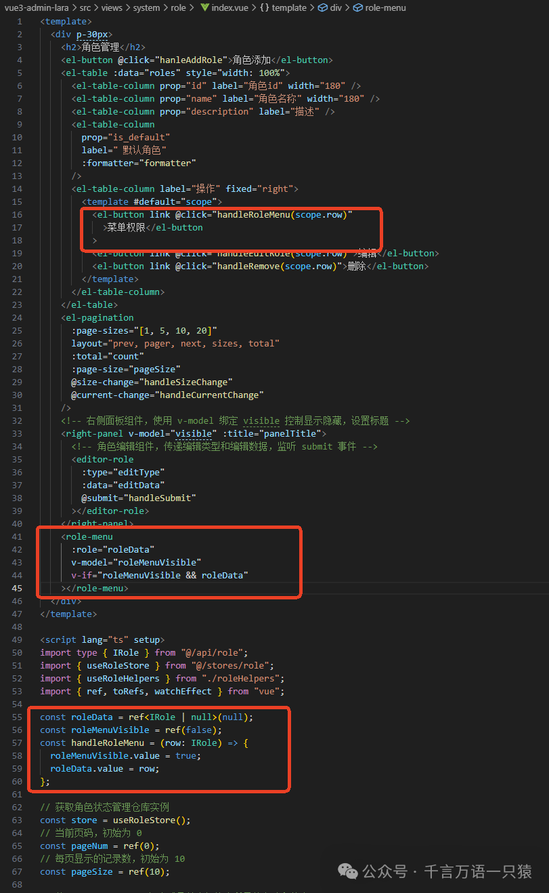
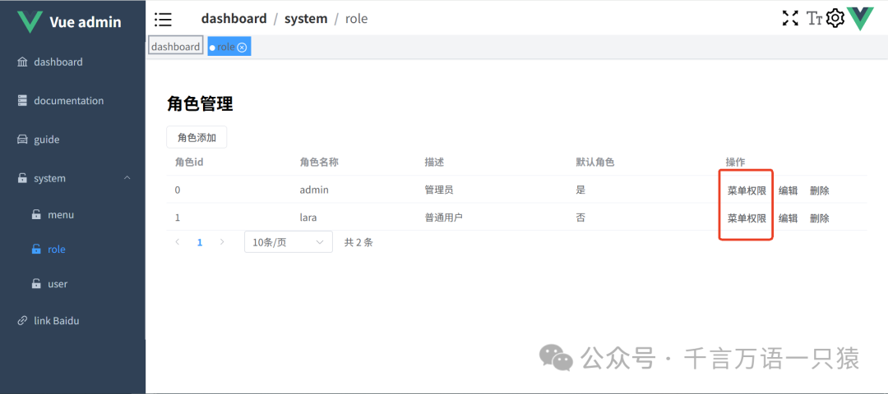

本篇聚焦于角色菜单权限分配功能的实现，围绕“给角色赋予菜单权限”这一核心场景，从接口设计、组件封装到页面集成展开完整技术方案的阐述。主要内容包括：

1. 角色权限接口开发：定义获取角色权限、分配权限等接口，规范数据交互格式；
2. 权限分配组件封装：实现基于树形结构的可视化权限配置组件，支持全选、父子节点联动控制等功能；3. 角色管理页面集成：新增“菜单权限”操作按钮，通过组件化方式关联权限分配逻辑。

## **角色权限 api**

在 src/api/roleAccess.ts 中添加角色权限相关 api，代码如下：

```typescript
//src/api/roleAccess.ts
import service from "./config/request";
import type { ApiResponse } from "./type";
export interface IRoleAccess {
  id: number;
  access_id: number;
  role_id: number;
}
export type IRoleAccessList = IRoleAccess[];
// 获取角色对应权限
export const getRoleAccess = (
  id: number
): Promise<ApiResponse<IRoleAccessList>> => {
  return service.get(`/role_access/${id}`);
};
// 给角色分配权限
export const allocRoleAccess = (
  id: number,
  data: number[]
): Promise<ApiResponse> => {
  return service.post(`/role_access/${id}`, {
    access: data,
  });
};
// 获取角色对应权限
export const getRoleAccessByRoles = (
  roles: number[]
): Promise<ApiResponse<any>> => {
  return service.post(`/role_access/role/access`, {
    roles,
  });
};
```

## **封装 RoleMenu 组件**

在 /src/views/system/role/components/roleMenu.vue 中封装角色菜单分配组件，代码如下：

```html
//src/views/system/role/components/roleMenu.vue
<template>
  <el-dialogv-model="dialogVisible">
    <!-- 权限树组件，展示菜单结构并支持勾选 -->
    <el-tree
      :data="treeData"
      show-checkbox
      :props="defaultProps"
      :default-expand-all="true"
      highlight-current
      ref="menuTree"
      node-key="id"
      :check-strictly="checkStrictly"
    ></el-tree>
    <template #footer>
      <el-buttontype="primary" @click="handleCheckAll">全部选择</el-button>
      <el-buttontype="warning" @click="handleSubmit">确认分配</el-button>
    </template>
  </el-dialog>
</template>
<scriptlang="ts"setup>
import type { IRole } from "@/api/role";
import { useMenuStore } from "@/stores/menu";
import type { PropType } from "vue";
import { ElTree } from "element-plus";
import Node from "element-plus/es/components/tree/src/model/node.mjs";
import { allocRoleAccess, getRoleAccess } from "@/api/roleAccess";
import { useReloadPage } from "@/hooks/useReloadPage";
// 是否父子节点关联（true：不关联，false：关联）
const checkStrictly = ref(false);
const { reloadPage } = useReloadPage();
const store = useMenuStore();
// 从菜单存储获取树形菜单数据
const treeData = computed(() => store.state.menuTreeData);
// 生命周期钩子：组件挂载后获取所有菜单数据
onMounted(() => {
  store.getAllMenuList();
});
// 树组件配置项，指定子节点和标签字段
const defaultProps = {
  children: "children",
  label: "title"
};
// 树组件实例类型和引用
type ElTreeInstance = InstanceType<typeofElTree>;
const menuTree = ref<ElTreeInstance | null>(null);
// 全选状态标识
const isCheckAll = ref(false);
/**
 * 全选/取消全选处理函数
 */
const handleCheckAll = () => {
  if (!isCheckAll.value) {
    // 设置所有节点为选中状态
    menuTree.value?.setCheckedNodes(treeData.value as unknown as Node[], false);
  } else {
    // 取消所有选中状态
    menuTree.value?.setCheckedNodes([], false);
  }
  isCheckAll.value = !isCheckAll.value;
};
const { proxy } = getCurrentInstance()!;
/**
 * 提交权限分配处理函数
 */
const handleSubmit = async () => {
  const tree = menuTree.value!;
  // 获取所有选中的节点ID
  const keys = tree.getCheckedKeys(false);
  // 获取半选中的节点ID（部分子节点被选中）
  const halfKeys = tree.getHalfCheckedKeys();
  const selectKeys = [...keys, ...halfKeys];
  // 调用API分配权限
  const res = await allocRoleAccess(role.id, selectKeys as number[]);
  if (res.code === 0) {
    proxy?.$message.success("权限分配成功");
    reloadPage(); // 刷新页面
  }
};
// 定义组件接收的props
const { role, modelValue } = defineProps({
  role: {
    type: Object as PropType<IRole>,
    required: true
  },
  modelValue: {
    type: Boolean,
    default: false
  }
});
// 对话框显示状态
const dialogVisible = ref(modelValue);
// 定义自定义事件
const emit = defineEmits(["update:modelValue"]);
// 监听对话框显示状态变化，触发自定义事件
watch(
  () => dialogVisible.value,
  (newValue) => {
    emit("update:modelValue", newValue);
  }
);
/**
 * 获取角色已分配的权限列表
 */
const getRoleAccessList = async () => {
  checkStrictly.value = true; // 临时解除父子节点关联，避免联动问题
  const res = await getRoleAccess(role.id);
  if (res.code === 0) {
    const access = res.data.map((item) => item.access_id);
    // 设置已选中的权限节点
    menuTree.value?.setCheckedKeys(access);
    // 异步恢复父子节点关联
    setTimeout(() => {
      checkStrictly.value = false;
    }, 0);
  }
};
// 生命周期钩子：组件挂载后获取角色权限
onMounted(() => {
  getRoleAccessList();
});
</script>
```

## **修改角色管理页面**

修改 src/views/system/role/index.vue，添加角色菜单权限，如图所示：



代码如下：

```html
//src/views/system/role/index.vue
<template>
  <divp-30px>
    <h2>角色管理</h2>
    <el-button @click="hanleAddRole">角色添加</el-button>
    <el-table:data="roles"style="width: 100%">
      <el-table-columnprop="id"label="角色id"width="180" />
      <el-table-columnprop="name"label="角色名称"width="180" />
      <el-table-columnprop="description"label="描述" />
      <el-table-column
        prop="is_default"
        label=" 默认角色"
        :formatter="formatter"
      />
      <el-table-columnlabel="操作"fixed="right">
        <template #default="scope">
          <el-buttonlink @click="handleRoleMenu(scope.row)"
            >菜单权限</el-button
          >
          <el-buttonlink @click="handleEditRole(scope.row)">编辑</el-button>
          <el-buttonlink @click="handleRemove(scope.row)">删除</el-button>
        </template>
      </el-table-column>
    </el-table>
    <el-pagination
      :page-sizes="[1, 5, 10, 20]"
      layout="prev, pager, next, sizes, total"
      :total="count"
      :page-size="pageSize"
      @size-change="handleSizeChange"
      @current-change="handleCurrentChange"
    />
    <!-- 右侧面板组件，使用 v-model 绑定 visible 控制显示隐藏，设置标题 -->
    <right-panelv-model="visible":title="panelTitle">
      <!-- 角色编辑组件，传递编辑类型和编辑数据，监听 submit 事件 -->
      <editor-role
        :type="editType"
        :data="editData"
        @submit="handleSubmit"
      ></editor-role>
    </right-panel>
    <role-menu
      :role="roleData"
      v-model="roleMenuVisible"
      v-if="roleMenuVisible && roleData"
    ></role-menu>
  </div>
</template>
<scriptlang="ts"setup>
import type { IRole } from "@/api/role";
import { useRoleStore } from "@/stores/role";
import { useRoleHelpers } from "./roleHelpers";
import { ref, toRefs, watchEffect } from "vue";
const roleData = ref<IRole | null>(null);
const roleMenuVisible = ref(false);
const handleRoleMenu = (row: IRole) => {
  roleMenuVisible.value = true;
  roleData.value = row;
};
// 获取角色状态管理仓库实例
const store = useRoleStore();
// 当前页码，初始为 0
const pageNum = ref(0);
// 每页显示的记录数，初始为 10
const pageSize = ref(10);
// 从 useRoleHelpers 组合式函数中解构出所需的方法和状态
const {
  handleSubmit,
  handleRemove,
  handleEditRole,
  hanleAddRole,
  panelTitle,
  editType,
  visible,
  editData
} = useRoleHelpers({ pageNum, pageSize });
// 将仓库状态中的 count 和 roles 转换为响应式引用
const { count, roles } = toRefs(store.state);
// 监听 pageNum 和 pageSize 的变化，当变化时重新获取角色数据
watchEffect(() => {
  store.getRoles({ pageNum: pageNum.value, pageSize: pageSize.value, flag: 0 });
});
// 处理每页显示记录数改变的方法
const handleSizeChange = (val: number) => {
  pageSize.value = val;
};
// 处理当前页码改变的方法
const handleCurrentChange = (val: number) => {
  pageNum.value = val - 1;
};
// 格式化是否为默认角色的显示内容
const formatter = (row: IRole) => {
  return row.is_default ? "是" : "否";
};
</script>
```




以上，就是角色菜单的相关内容。
