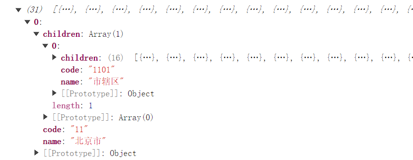
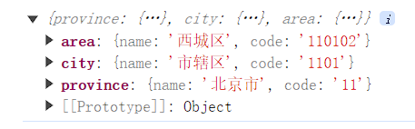

## 搭建 vite 项目并配置路由和 element-plus

搭建 vite 项目

```json
npm create vite@latest m-components -- --template vue-ts
```

安装 vue-router 和 element-plus

```json
npm install vue-router@next element-plus
```

配置路由

router/index.ts

```typescript
import { createRouter, createWebHashHistory, RouteRecordRaw } from "vue-router";
import Home from "../views/Home.vue";

const routes: RouteRecordRaw[] = [
  {
    path: "/",
    name: "home",
    component: Home,
  },
];

const router = createRouter({
  history: createWebHashHistory(),
  routes,
});

export default router;
```

main.ts

```typescript
import { createApp } from "vue";
import App from "./App.vue";
import router from "./router";
import ElementPlus from "element-plus";
import "element-plus/dist/index.css";

const app = createApp(App);
app.use(router).use(ElementPlus);
app.mount("#app");
```

App.vue

```typescript
<template>
  <router-view></router-view>
</template>

<style lang="scss">
* {
  margin: 0;
  padding: 0;
}
</style>
```

使用到 scss，需要安装

```json
npm install sass sass-loader
```

## 全局注册图标

首先，安装

```json
npm install @element-plus/icons-vue
```

main.ts

```typescript
import * as Icons from "@element-plus/icons-vue";
import { toLine } from "./utils";

const app = createApp(App);
// 全局注册图标，牺牲一点性能
// el-icon-xx
for (const i in Icons) {
  app.component(`el-icon-${toLine(i)}`, (Icons as any)[i]);
}
```

utils/index.ts

```typescript
export function toLine(value: string) {
  return value.replace(/(A-Z)g/, "-$1").toLocaleLowerCase();
}
```

Home.vue 中使用

```typescript
<template>
  <div class="home">
    <el-icon-edit></el-icon-edit>
  </div>
</template>
```

App.vue

```scss
<style lang="scss">
svg {
  width: 1em;
  height: 1em;
}
</style>
```

## 伸缩菜单-完成伸缩菜单基本功能

components/container/src/index.vue

宽度设置为 auto，并且展开状态宽度设置为 200px

```html
<template>
  <el-container>
    <el-aside width="auto">
      <el-menu
        default-active="2"
        :collapse="isCollapse"
        class="el-menu-vertical-demo"
      >
        <el-menu-item index="1">
          <el-icon-menu></el-icon-menu>
          <span>Navigator 1</span>
        </el-menu-item>
        <el-menu-item index="2">
          <el-icon-menu></el-icon-menu>
          <span>Navigator 2</span>
        </el-menu-item>
        <el-menu-item index="3">
          <el-icon-menu></el-icon-menu>
          <span>Navigator 3</span>
        </el-menu-item>
      </el-menu>
    </el-aside>
    <el-container>
      <el-header>
        <span @click="toggle">
          <el-icon-expand
            v-if="isCollapse"
            style="margin-right: 10px"
          ></el-icon-expand>
          <el-icon-fold v-else></el-icon-fold>
        </span>
      </el-header>
      <el-main>
        <router-view></router-view>
      </el-main>
    </el-container>
  </el-container>
</template>
<script lang="ts" setup>
  import { ref } from "vue";

  const isCollapse = ref(false);

  const toggle = () => {
    isCollapse.value = !isCollapse.value;
  };
</script>

<style lang="scss" scoped>
  .el-menu-vertical-demo:not(.el-menu--collapse) {
    width: 200px;
  }
</style>
```

router/index.ts

所有的路由都基于 Container 这个组件

```typescript
import { createRouter, createWebHashHistory, RouteRecordRaw } from "vue-router";
import Home from "../views/Home.vue";
import Container from "../components/container/src/index.vue";

const routes: RouteRecordRaw[] = [
  {
    path: "/",
    component: Container,
    children: [
      {
        path: "/",
        name: "home",
        component: Home,
      },
    ],
  },
];

const router = createRouter({
  history: createWebHashHistory(),
  routes,
});

export default router;
```

## 伸缩菜单-抽离头部和侧边栏组件并完善伸缩菜单

component/container/src/index.vue

```typescript
<template>
  <el-container>
    <el-aside width="auto">
      <nav-side :collapse="isCollapse"></nav-side>
    </el-aside>
    <el-container>
      <el-header>
        <nav-header v-model:collapse="isCollapse"></nav-header>
      </el-header>
  		...
    </el-container>
  </el-container>
</template>
<script lang="ts" setup>
import { ref } from "vue";
import NavHeader from "./NavHeader/index.vue";
import NavSide from "./NavSide/index.vue";

const isCollapse = ref(false);
</script>

<style lang="scss" scoped>
...
.el-header {
  display: flex;
  align-items: center;
  border-bottom: 1px solid #eee;
}
</style>

```

NavHeader/index.vue

```html
<template>
  <span @click="toggle">
    <el-icon-expand v-if="collapse" style="margin-right: 10px"></el-icon-expand>
    <el-icon-fold v-else></el-icon-fold>
  </span>
</template>

<script lang="ts" setup>
  const props = defineProps<{
    collapse: boolean;
  }>();

  const emits = defineEmits(["update:collapse"]);
  const toggle = () => {
    emits("update:collapse", !props.collapse);
  };
</script>

<style lang="scss" scoped></style>
```

NavSide/index.vue

```html
<template>
  <el-menu
    default-active="2"
    :collapse="collapse"
    class="el-menu-vertical-demo"
  >
    <el-menu-item index="1">
      <el-icon-menu></el-icon-menu>
      <span>首页</span>
    </el-menu-item>
    <el-menu-item index="2">
      <el-icon-menu></el-icon-menu>
      <span>图标选择器</span>
    </el-menu-item>
    <el-menu-item index="3">
      <el-icon-menu></el-icon-menu>
      <span>趋势标记</span>
    </el-menu-item>
  </el-menu>
</template>

<script lang="ts" setup>
  defineProps<{
    collapse: boolean;
  }>();
</script>

<style lang="scss" scoped></style>
```

## 图标选择器-巧用两次 watch 控制弹框的显示与隐藏

components/chooseIcon/src/index.vue

```html
<template>
  <el-button type="primary" @click="handleClick">
    <slot></slot>
  </el-button>
  <el-dialog v-model="dialogVisible" :title="title">123</el-dialog>
</template>

<script lang="ts" setup>
  import { ref, watch } from "vue";

  const props = defineProps<{
    title: string;
    visible: boolean;
  }>();

  const emits = defineEmits(["update:visible"]);
  const dialogVisible = ref(props.visible);

  const handleClick = () => {
    emits("update:visible", !props.visible);
  };

  // 监听visible的变化，只能监听第一次的变化
  watch(
    () => props.visible,
    (val) => {
      dialogVisible.value = val;
    }
  );

  // 监听组件内部的dialogVisible的变化
  watch(
    () => dialogVisible.value,
    (val) => {
      emits("update:visible", val);
    }
  );
</script>

<style lang="scss" scoped></style>
```

views/chooseIcon/index.vue

```html
<template>
  <m-choose-icon title="选择图标" v-model:visible="visible"
    >选择图标</m-choose-icon
  >
</template>

<script lang="ts" setup>
  import { ref } from "vue";
  import mChooseIcon from "../../components/ChooseIcon/src/index.vue";

  const visible = ref<boolean>(false);
</script>

<style lang="scss" scoped></style>
```

## 图标选择器-巧用 component 动态组件显示所有的图标

```html
<template>
  ...
  <el-dialog v-model="dialogVisible" :title="title">
    <div class="container">
      <div
        class="item"
        v-for="(item, index) in Object.keys(elIcons)"
        :key="index"
      >
        <div><component :is="`el-icon-${toLine(item)}`" /></div>
        <div>{{ item }}</div>
      </div>
    </div>
  </el-dialog>
</template>

<script lang="ts" setup>
  import { toLine } from "../../../utils";
  import * as elIcons from "@element-plus/icons-vue";
</script>

<style lang="scss" scoped>
  .container {
    display: flex;
    align-items: center;
    flex-wrap: wrap;
  }

  .item {
    width: 25%;
    display: flex;
    flex-direction: column;
    align-items: center;
    margin-bottom: 20px;
    cursor: pointer;
  }

  svg {
    width: 2em;
    height: 2em;
  }
</style>
```

## 图标选择器-利用命名空间修改 dialog 样式

style/ui.scss

```scss
.m-choose-icon-dialog-body-height {
  .el-dialog__body {
    height: 500px;
    overflow-y: scroll;
  }
}
```

App.vue 中抽取样式到 base.scss 中

```scss
* {
  margin: 0;
  padding: 0;
}

html,
body,
#app,
.el-container,
.el-menu {
  height: 100%;
}

svg {
  width: 1em;
  height: 1em;
}
```

App.vue

```html
<style lang="scss">
  @import "./style/base.scss";
  @import "./style/ui.scss";
</style>
```

components/chooseIcon/src/index.vue

```html
<div class="m-choose-icon-dialog-body-height">
  <el-dailog> ... </el-dailog>
</div>
```

## 图标选择器-通过自定义 hooks 函数实现复制功能

hooks/useCopy/index.ts

```typescript
import { ElMessage } from "element-plus";

export const useCopy = (text: string) => {
  const input = document.createElement("input");
  input.value = text;
  document.body.appendChild(input);
  input.select();
  document.execCommand("Copy");
  document.body.removeChild(input);
  ElMessage.success("复制成功");
};
```

```html
<div class="container">
  <div
    class="item"
    v-for="(item, index) in Object.keys(elIcons)"
    :key="index"
    @click="clickItem(item)"
  >
    <div><component :is="`el-icon-${toLine(item)}`" /></div>
    <div>{{ item }}</div>
  </div>
</div>

<script lang="ts" setup>
  import { useCopy } from "../../../hooks/useCopy";

  const clickItem = (item: string) => {
    const text = `<el-icon-${toLine(item)} />`;
    useCopy(text);
    dialogVisible.value = false;
  };
</script>
```

到这里，点击就可以复制生成类似`<el-icon-arrowleft />`

## 省市区选择组件-利用 github 获取到省市区数据

github 搜索省市区，找到[Administrative-divisions-of-China](https://github.com/modood/Administrative-divisions-of-China)

下载下来，找到 dist 目录下的 pca-code.json，引入到项目中

components/chooseArea/src/index.vue

```html
<template>
  <div class="choose-area">
    <el-select placeholder="请选择省份" v-model="province">
      <el-option value="1">1</el-option>
    </el-select>
    <el-select style="margin: 0 10px" placeholder="请选择城市" v-model="city">
      <el-option value="1">2</el-option>
    </el-select>
    <el-select placeholder="请选择区域" v-model="area">
      <el-option value="1">3</el-option>
    </el-select>
  </div>
</template>

<script lang="ts" setup>
  import { ref } from "vue";
  import allArea from "../lib/pca-code.json";

  console.log(allArea);
  const province = ref("");
  const city = ref("");
  const area = ref("");
</script>

<style lang="scss" scoped>
  .choose-area {
    display: flex;
  }
</style>
```



## 省市区选择组件-巧用 watch 来达到三级联动效果

components/chooseArea/src/index.vue

```html
<template>
  <div class="choose-area">
    <el-select clearable placeholder="请选择省份" v-model="province">
      <el-option
        v-for="item in areas"
        :value="item.code"
        :key="item.code"
        :label="item.name"
      ></el-option>
    </el-select>
    <el-select
      clearable
      :disabled="!province"
      style="margin: 0 10px"
      placeholder="请选择城市"
      v-model="city"
    >
      <el-option
        v-for="item in selectCity"
        :value="item.code"
        :key="item.code"
        :label="item.name"
      ></el-option>
    </el-select>
    <el-select
      clearable
      :disabled="!province || !city"
      placeholder="请选择区域"
      v-model="area"
    >
      <el-option
        v-for="item in selectArea"
        :value="item.code"
        :key="item.code"
        :label="item.name"
      ></el-option>
    </el-select>
  </div>
</template>

<script lang="ts" setup>
  import { ref, watch } from "vue";
  import allArea from "../lib/pca-code.json";

  const areas = ref(allArea);
  const province = ref<string>("");
  const city = ref<string>("");
  const area = ref<string>("");

  const selectCity = ref<any[]>([]);
  const selectArea = ref<any[]>([]);

  watch(
    () => province.value,
    (val) => {
      if (val) {
        selectCity.value = areas.value.find(
          (item) => item.code === province.value
        )!.children;
      }
      city.value = "";
      area.value = "";
    }
  );

  watch(
    () => city.value,
    (val) => {
      if (val) {
        selectArea.value = selectCity.value.find(
          (item) => item.code === city.value
        )!.children;
      }
      area.value = "";
    }
  );
</script>

<style lang="scss" scoped>
  .choose-area {
    display: flex;
  }
</style>
```

## 省市区选择组件-完善省市区联动组件并给父组件分发事件

```html
<template>
  <div class="choose-area">
    <el-select clearable placeholder="请选择省份" v-model="province">
      <el-option
        v-for="item in areas"
        :value="item.code"
        :key="item.code"
        :label="item.name"
      ></el-option>
    </el-select>
    <el-select
      clearable
      :disabled="!province"
      style="margin: 0 10px"
      placeholder="请选择城市"
      v-model="city"
    >
      <el-option
        v-for="item in selectCity"
        :value="item.code"
        :key="item.code"
        :label="item.name"
      ></el-option>
    </el-select>
    <el-select
      clearable
      :disabled="!province || !city"
      placeholder="请选择区域"
      v-model="area"
    >
      <el-option
        v-for="item in selectArea"
        :value="item.code"
        :key="item.code"
        :label="item.name"
      ></el-option>
    </el-select>
  </div>
</template>

<script lang="ts" setup>
  import { ref, watch } from "vue";
  import allArea from "../lib/pca-code.json";

  export interface AreaItem {
    name: string;
    code: string;
    children?: AreaItem[];
  }

  export interface Data {
    name: string;
    code: string;
  }

  const areas = ref(allArea);
  const province = ref<string>("");
  const city = ref<string>("");
  const area = ref<string>("");

  const selectCity = ref<AreaItem[]>([]);
  const selectArea = ref<AreaItem[]>([]);

  const emits = defineEmits(["change"]);
  watch(
    () => province.value,
    (val) => {
      if (val) {
        selectCity.value = areas.value.find(
          (item) => item.code === province.value
        )!.children;
      }
      city.value = "";
      area.value = "";
    }
  );

  watch(
    () => city.value,
    (val) => {
      if (val) {
        selectArea.value = selectCity.value.find(
          (item) => item.code === city.value
        )!.children!;
      }
      area.value = "";
    }
  );

  watch(
    () => area.value,
    (val) => {
      if (val) {
        const provinceData: Data = {
          name:
            province.value &&
            areas.value.find((item) => item.code === province.value)!.name,
          code: province.value,
        };
        const cityData: Data = {
          name:
            city.value &&
            selectCity.value.find((item) => item.code === city.value)!.name,
          code: city.value,
        };
        const areaData: Data = {
          name: val && selectArea.value.find((item) => item.code === val)!.name,
          code: val,
        };

        emits("change", {
          province: provinceData,
          city: cityData,
          area: areaData,
        });
      }
    }
  );
</script>

<style lang="scss" scoped>
  .choose-area {
    display: flex;
  }
</style>
```

views/chooseArea/index.vue

```html
<template>
  <m-choose-area @change="changeArea"></m-choose-area>
</template>

<script lang="ts" setup>
  import mChooseArea from "../../components/chooseArea/src/index.vue";

  const changeArea = (val: any) => {
    console.log(val);
  };
</script>

<style lang="scss" scoped></style>
```



## 利用 app.use 特性全局注册组件

components/chooseIcon/index.ts

```typescript
import { App } from "vue";
import chooseIcon from "./src/index.vue";

export default {
  install(app: App) {
    app.component("m-choose-icon", chooseIcon);
  },
};
```

components/chooseArea/index.ts

```typescript
import { App } from "vue";
import chooseArea from "./src/index.vue";

export default {
  install(app: App) {
    app.component("m-choose-area", chooseArea);
  },
};
```

components/index.ts

```typescript
import chooseIcon from "./chooseIcon";
import chooseArea from "./chooseArea";
import { App } from "vue";

const components = [chooseIcon, chooseArea];

export default {
  install(app: App) {
    components.map((item) => {
      app.use(item);
    });
  },
};
```

在 main.ts 中全局引入

main.ts

```typescript
import mUI from "./components";

...
app.use(router).use(ElementPlus).use(mUI);
```

当使用 app.use 的时候就会去调用组件里面的 install 方法，可以是 install 方法，或者是一个对象返回 install 属性

当然也可以按需引入

```typescript
import chooseIcon from "./components/chooseIcon";

...
app.use(router).use(ElementPlus).use(chooseIcon);
```

在使用组件的时候就不需要进行导入
