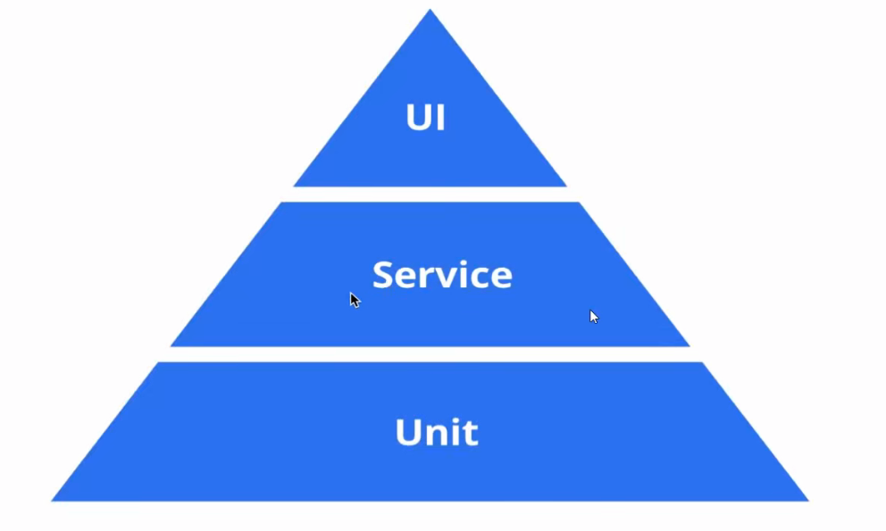
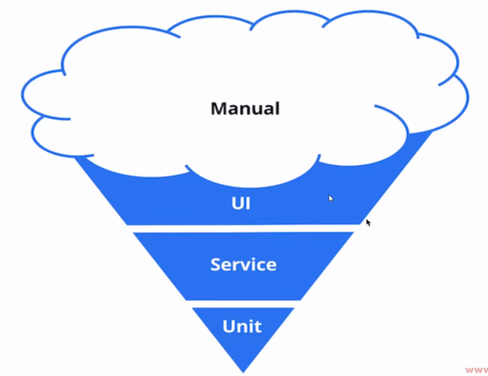
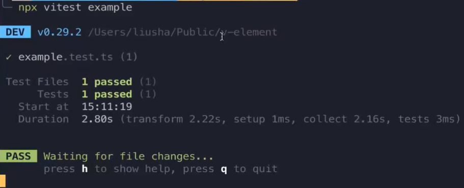

## 发现的问题

- 新建一堆不同属性的组件，肉眼观测
- 更新代码，要再次进行手动测试

## 测试在国内被严重忽视

- 没有时间
- 需求一直更改
- 不知道怎样写测试

## 测试的优点

- 自动化完成流程，保证代码的运行结果
- 更早发现 Bug
- 重构和升级更加容易和可靠

## 测试金字塔



Unit Test：单元测试，把代码拆分成独立的部分，它们之间没有相互的依赖

Service Test：把 Unit Test 结合起来

UI Test：也称为 e2e Test，模拟真实的用户场景，对整个应用进行测试



上面这个图被称为“冰淇淋图”，在国内是大部分是靠 QA 和开发手动测试

## 组件化的框架（React、Vue）非常适合写单元测试

- 组件化，独立单元，互不影响
- 属性和界面的映射，固定输入，固定输出
- 单向数据流
- 状态管理工具的 stroe 可以单独写测试

## 需要选取两种测试工具

- 通用的测试框架
- 针对对应库（React 或者 Vue）的测试库

## 通用测试框架

- Mocha
- Jest
- Vitest

## Vitest 的优点

文档地址：https://cn.vitest.dev/guide/why.html

- 基于 Vite 而生，和 Vite 完美配合，共享一个生态系统
- 兼容 Jest 语法
- HMR for tests
- ESM, TS, JSX 原生支持
- 更多:https://cn.vitest.dev/guide/features.html

## 测试框架的几大功能

- 断言
  - 内置 Chai 以及兼容 Jest expect 的 API
- Mock
  - https://cn.vitest.dev/guide/mocking.html
- 代码覆盖率
  - https://cn.vitest.dev/guide/coverage.html
  - 可以使用 c8 或者 istanbul
- Snapshot
  - 兼容 Jest

## 安装 Vitest

```json
# Vitest 需要 Vite >=v5.0.0 和 Node >=v18.0.0
npm install -D vitest
```

## 断言的写法

- https://chaijs.com
- Should
- Expect 用的比较多
- Assert

example.test.ts

```typescript
import { test, describe, vi, expect, Mocked } from "vitest";
import { testFn, request } from "./utils";
import axios from "axios";
vi.mock("axios");
const mockedAxios = axios as Mocked<typeof axios>; // 解决ts报错
// callback test
// mock
describe("functions", () => {
  test("create a mock function", () => {
    const callback = vi.fn();
    testFn(12, callback);
    expect(callback).toHaveBeenCalled(); // 监控callback是否被调用
    expect(callback).toHaveBeenCalledWith(12); //监控callback的传参
  });
  test("spy on method", () => {
    const obj = {
      getName: () => 1,
    };
    const spy = vi.spyOn(obj, "getName"); // 使用spyOn可以让obj和getName产生联系
    obj.getName();
    expect(spy).toHaveBeenCalled(); // 监控getName是被调用
    obj.getName();
    expect(spy).toHaveBeenCalledTimes(2); // 监控getName被调用的次数
  });
  test("mock third party module", async () => {
    // mockedAxios.get.mockImplementation(() => Promise.resolve({ data: 123 }))
    mockedAxios.get.mockResolvedValue({ data: 123 }); // 上面的简写
    const result = await request();
    expect(result).toBe(123);
  });
});
```

utils.ts

```typescript
import axios from "axios";

export function testFn(number: number, callback: Function) {
  if (number > 10) {
    callback(number);
  }
}

export async function request() {
  const { data } = await axios.get("fake.url");
  return data;
}
```

查看结果

```json
npx vitest example
```



## 基于 Vue 的测试工具

- vue-test-utils: https://test-utils.vuejs.org/guide/
- vue-testing-library: https://testing-library.com/docs/vue-testing-library/intro/

## Vitest 的配置文件

https://cn.vitest.dev/config/

## Stub 子组件

https://test-utils.vuejs.org/zh/guide/advanced/stubs-shallow-mount.html

具体看 Button 组件的 Button.test.ts

## Vitest.config.ts

如果想要重载 Vite.config.ts 的配置，可以单独创建一个 vitest.config.ts

```typescript
/// <reference types="vitest" />

import { defineConfig } from "vite";
import vue from "@vitejs/plugin-vue";
import vueJsx from "@vitejs/plugin-vue-jsx";
import VueMacros from "unplugin-vue-macros";

// https://vitejs.dev/config/
export default defineConfig({
  plugins: [
    VueMacros.vite({
      plugins: {
        vue: vue(),
        vueJsx: vueJsx(),
      },
    }),
  ],
  // 使用了<reference types="vitest" />这里test才会有类型提示
  test: {
    globals: true,
    environment: "jsdom",
  },
});
```
